# خواننده تلگرام

<!-- TOP_NAV START -->

<a href="https://github.com/k909b/aio-downloader/blob/main/telegram/content/archive_1.md" style="display:inline-block; padding:6px 12px; margin:0 4px; background-color:#2ea44f; color:white; text-decoration:none; border-radius:4px; font-weight:bold;">صفحه بعد</a>

<!-- TOP_NAV END -->

<!-- MSG START -->

---
📅 بروزرسانی: 1405/02/24 20:06
---

## VahidOOnLine — post 240154

  

♦️مهدی تاج، رئیس فدراسیون فوتبال اعلام کرد که هنوز هیچ ویزایی برای حضور تیم ملی در رقابت‌های جام جهانی در ایالات متحده صادر نشده است. خبرگزاری دولتی ایرنا به نقل از تاج نوشت: «فردا یا پس‌فردا نشست تعیین‌کننده‌ای با فیفا خواهیم داشت. آن‌ها باید به ما تضمین بدهند، چرا که موضوع ویزا هنوز حل نشده است».

او در ادامه افزود: «ما هنوز هیچ گزارشی از طرف مقابل درباره اینکه برای چه کسانی ویزا صادر شده، دریافت نکرده‌ایم و تا این لحظه هیچ ویزایی صادر نشده است». پیش از این انتظار می‌رفت بازیکنان برای انجام مراحل انگشت‌نگاری ویزا به آنکارا، پایتخت ترکیه، سفر کنند. تاج در این باره گفت: «بازیکنان باید برای انگشت‌نگاری به آنکارا بروند، اما ما در تلاش هستیم تا هماهنگی‌های لازم را انجام دهیم تا این کار در آنتالیا صورت گیرد و نیازی به سفر به آنکارا نباشد».
‌🇸🇦 Indypersian

🤖 @VahidOOnLine

## VahidOOnLine — post 240153

  <a href="telegram/content/VahidOOnLine_240153_1778776575.mp4" target="_blank">🎬 Download video</a>

دونالد ترامپ در گفت‌وگو با شان هنیتی گفت شی جین‌پینگ، رئیس‌جمهوری چین، متعهد شده به جمهوری اسلامی تجهیزات نظامی ارائه نکند.

ترامپ گفت: «او گفت قرار نیست تجهیزات نظامی بدهد؛ این حرف بزرگی است.»

رئیس‌جمهوری آمریکا در ادامه افزود چین همچنان بخش زیادی از نفت خود را از ایران خریداری می‌کند و مایل است این روند ادامه پیدا کند.

ترامپ همچنین گفت شی جین‌پینگ خواهان باز ماندن تنگه هرمز و جلوگیری از اختلال در عبور و مرور کشتی‌هاست.
‌🏁 🇬🇧 ManotoTV

🤖 @VahidOOnLine

## VahidOOnLine — post 240152

  

اکسیوس در گزارشی درباره ایران نوشت که مقام‌های آمریکایی انتظار ندارند دونالد ترامپ در جریان سفرش به چین اقدام چشمگیری در مورد جمهوری اسلامی انجام دهد، اما معتقدند او ممکن است بلافاصله پس از پایان این سفر تصمیم بعدی خود را اتخاذ کند.

براساس این گزارش یکی از گزینه‌های مورد بررسی ازسرگیری «پروژه آزادی» است؛ طرحی که در آن نیروی دریایی آمریکا تلاش می‌کند بن‌بست ایجاد شده در تنگه هرمز را بشکند.

به گزارش اکسیوس، گزینه دیگر آغاز کارزار جدید بمباران با تمرکز بر زیرساخت‌های ایران است.

مقام‌های اسرائیلی نیز گفته‌اند در صورت تصمیم ترامپ برای ازسرگیری جنگ، در آخر هفته جاری در وضعیت آماده‌باش کامل خواهند بود.
‌🏁 🇬🇧 IranintlTV

🤖 @VahidOOnLine

## VahidOOnLine — post 240151

♦️دونالد ترامپ، رئیس‌جمهوری آمریکا که به چین سفر کرده، روز پنجشنبه همراه با شی جین‌پینگ،‌ رئیس‌جمهوری چین برای بازدید از معبد بهشت ​​در پکن که بیش از ۵۰۰ سال قدمت دارد، وارد این معبد تاریخی شد.
او در توری اختصاصی همراه با شی در جریان جزئیاتی از این معبد قرار گرفت.
دونالد ترامپ، رئیس جمهوری ایالات متحده آمریکا شامگاه پنجشنبه ۲۴ اردیبهشت (به وقت محلی) و در جریان ضیافت شام شی جین‌پینگ، گفتگوها با رئیس‌جمهوری چین را «فوق‌العاده مثبت و سازنده» توصیف کرد.
‌🇸🇦 Indypersian

🤖 @VahidOOnLine

## VahidOOnLine — post 240150

  

دونالد ترامپ در گفت‌وگو با فاکس‌نیوز گفت رییس‌جمهور چین خواهان باز ماندن تنگه هرمز و دستیابی به توافق است و پیشنهاد داده برای تحقق آن به هر شکل ممکن کمک کند.
ترامپ افزود شی جین‌پینگ به او گفته چین هیچ‌گونه تجهیزات نظامی در اختیار جمهوری اسلامی قرار نخواهد داد.
‌🏁 🇬🇧 IranintlTV

🤖 @VahidOOnLine

## VahidOOnLine — post 240149

  <a href="telegram/content/VahidOOnLine_240149_1778776577.mp4" target="_blank">🎬 Download video</a>

♦️دونالد ترامپ، رئیس‌جمهوری آمریکا، در مصاحبه با شان هنیتی از فاکس نیوز گفت که شی جین‌پینگ، رئیس‌جمهور چین، برای همکاری در پرونده ایران و بازگشایی تنگه هرمز اعلام آمادگی کرده است. ترامپ تاکید کرد که شی تمایل دارد شاهد دستیابی به یک توافق باشد و به‌طور مشخص پیشنهاد داده است که در این زمینه هرگونه کمک لازم را ارائه دهد.

رئیس‌جمهور آمریکا با اشاره به حجم بالای خرید نفت چین از ایران، خاطرنشان کرد که پکن به‌دلیل این رابطه اقتصادی، نفوذ قابل‌توجهی دارد. به گفته ترامپ، رهبر چین بر تمایل خود برای بازگشایی تنگه هرمز تاکید کرده و گفته است: «اگر هر کمکی از دستم بربیاید، مشتاقم که انجام دهم».
‌🇸🇦 Indypersian

🤖 @VahidOOnLine

## VahidOOnLine — post 240148

  

♦️عباس عراقچی، وزیر خارجه جمهوری اسلامی روز پنجشنبه ۲۴ اردیبهشت با اشاره به تنش‌ها میان تهران و واشنگتن تاکید کرد که «آمریکا راه حل اختلاف با ایران را در جایی غیر از میدان نظامی جست‌وجو کند.»
عباس عراقچی در حاشیه دیدارهای خود با همتایانش در بریکس در واکنش به تهدیدهای مقامات آمریکایی و اسرائیلی مبنی بر از سرگیری حملات به ایران به‌محض بازگشت رئیس‌جمهوری آمریکا از چین گفت: «آن‌ها مدت‌هاست که به اشکال و شیوه‌های مختلف تهدیدهای خود را تکرار می‌کنند، اما خودشان نیز می‌دانند که از این تهدیدها و حتی از جنگی که به راه انداختند، هیچ نتیجه‌ای نگرفته‌اند و نخواهند گرفت.»
عراقچی با تاکید بر اینکه «ایران در برابر تهدیدها محکم ایستاده و سر خم نمی‌کند.» افزود: «راه‌حل در تهدید کردن نیست.»
وزیر خارجه جمهوری اسلامی در ادامه با ابراز امیدواری از تغییر نگاه مقام‌های آمریکایی به موضوعات مربوط به ایران تاکید کرد: «اگرچه امید نیست که به منطق روی آورند ولی بدانند که راه‌حل مسائل را باید در جایی غیر از میدان نظامی جست‌وجو کنند، زیرا از این مسیر به هیچ نتیجه‌ای نخواهند رسید.»
‌🇸🇦 Indypersian

🤖 @VahidOOnLine

## VahidOOnLine — post 240147

  

حمید رسایی، نماینده تهران در مجلس، نوشت جریانی «شناخته‌شده» در دولت چهاردهم که راه‌حل را «آزاد کردن و گران کردن» می‌داند، قصد دارد سهمیه بنزین هزار و ۵۰۰ تومانی و سه هزار تومانی را کاهش دهد و قیمت بنزین پنج هزار تومانی را به ۱۵ تا ۲۰ هزار تومان افزایش دهد.

او افزود همان جریان در دولت چهاردهم پیش‌تر با حذف ارز ترجیحی ۲۸ هزار و ۵۰۰ تومانی و گران کردن ارز، به گفته او، «بالاترین تورم پس از انقلاب ۵۷» را به مردم تحمیل کرده بود.

رسایی نوشت محمدباقر قالیباف با «پلمپ کردن بدون توجیه و دلیل مجلس»، راه نظارت نمایندگان بر تصمیمات دولت را بسته است. او افزود انجام تکلیف نمایندگی سخت شده، اما تلاش می‌کند مجلس را از این «مرگ تعمدی» بیرون بیاورد و جلوی این تصمیمات «عجیب» را در موقعیت «سخت و جنگی» فعلی بگیرد.
‌🏁 🇬🇧 IranintlTV

🤖 @VahidOOnLine

## VahidOOnLine — post 240146

  <a href="telegram/content/VahidOOnLine_240146_1778776580.mp4" target="_blank">🎬 Download video</a>

‌
دونالد ترامپ، رئیس‌جمهوری آمریکا، در گفت‌و‌گو با شان هنیتی، خبرنگار و مجری فاکس‌نیوز گفت شی جین‌پینگ، رئیس‌جمهوری چین، خواهان دستیابی به توافق و باز ماندن تنگه هرمز است.

ترامپ گفت: «رئیس‌جمهوری شی دوست دارد توافقی حاصل شود. او گفت اگر بتواند کمکی بکند، مایل است کمک کند.»

رئیس‌جمهوری آمریکا همچنین با اشاره به خرید نفت ایران از سوی چین افزود: «هر کسی که این مقدار نفت می‌خرد، بدیهی است نوعی رابطه دارد.»

ترامپ در ادامه گفت شی جین‌پینگ مایل است تنگه هرمز باز بماند.
‌🏁 🇬🇧 ManotoTV

🤖 @VahidOOnLine

## VahidOOnLine — post 240145

  <a href="telegram/content/VahidOOnLine_240145_1778776581.mp4" target="_blank">🎬 Download video</a>

مارکو روبیو، وزیر خارجه آمریکا، گفت دونالد ترامپ موضوع ایران را در گفت‌وگو با مقام‌های چین مطرح کرده و این موضوع «اهمیت زیادی» داشته است.

روبیو گفت طرف چینی اعلام کرده با «نظامی‌سازی تنگه هرمز» و همچنین ایجاد سیستم دریافت عوارض از کشتی‌ها در این آبراه مخالف است.

وزیر خارجه آمریکا افزود: «این موضع ما هم هست.»
‌🏁 🇬🇧 ManotoTV

🤖 @VahidOOnLine

## VahidOOnLine — post 240144

  

برد کوپر، فرمانده ستاد فرماندهی مرکزی آمریکا (سنتکام)، در جلسه کمیته نیروهای مسلح سنای آمریکا گفت در ۳۰ ماه منتهی به عملیات «خشم حماسی»، گروه‌های مورد حمایت جمهوری اسلامی بیش از ۳۵۰ بار به نیروها و دیپلمات‌های آمریکایی حمله کرده‌اند؛ به‌طور میانگین بیش از یک حمله در هر سه روز.
او افزود این حملات به کشته شدن چهار نظامی آمریکایی و زخمی شدن نزدیک به ۲۰۰ نفر انجامیده است.

فرمانده سنتکام همچنین گفت امروز حماس، حزب‌الله و حوثی‌ها از پشتیبانی و تامین تسلیحاتی جمهوری اسلامی محروم شده‌اند.
‌🏁 🇬🇧 IranintlTV

🤖 @VahidOOnLine

## VahidOOnLine — post 240143

♦️برد کوپر، فرمانده سنتکام، روز پنجشنبه ۲۴ اردیبهشت در جلسه استماع کمیته نیروهای مسلح سنا یادآوری کرد که فرماندهی مرکزی ایالات متحده (سنتکام) در پاسخ مستقیم به تهدیدهای ناشی از جمهوری اسلامی ایران تاسیس شده است. او با اشاره به ۴۷ سال خصومت تهران با آمریکا، تاکید کرد که تنها در ۳۰ ماه پیش از آغاز عملیات «حکم حماسی»، گروه‌های نیابتی ایران بیش از ۳۵۰ بار به نیروها و دیپلمات‌های آمریکایی حمله کرده‌اند.

کوپر گفت که سنتکام به دستور رئیس‌جمهور و در قالب عملیات «خشم حماسی»، در کمتر از ۴۰ روز به اهداف نظامی خود دست یافت. به گفته او، مهم‌ترین دستاورد این عملیات تضعیف توان قدرت‌نمایی ایران در خارج از مرزها بوده است؛ به‌گونه‌ای که جمهوری اسلامی دیگر قادر نیست حملاتی در ابعاد وسیع مشابه آنچه در سال ۲۰۲۴ در جریان اولین حمله مستقیم به خاک اسرائیل رخ داد، انجام دهد. فرمانده سنتکام تاکید کرد که با نابودی ۹۰ درصد از زیرساخت‌های صنایع دفاعی ایران، این کشور تا سال‌ها توان بازسازی تسلیحات خود را نخواهد داشت.
‌🇸🇦 Indypersian

🤖 @VahidOOnLine

## VahidOOnLine — post 240142

  

برد کوپر، فرمانده ستاد فرماندهی مرکزی آمریکا (سنتکام)، در جلسه کمیته نیروهای مسلح سنای آمریکا گفت در ۳۰ ماه منتهی به عملیات «خشم حماسی»، گروه‌های مورد حمایت جمهوری اسلامی بیش از ۳۵۰ بار به نیروها و دیپلمات‌های آمریکایی حمله کرده‌اند؛ به‌طور میانگین بیش از یک حمله در هر سه روز.
او افزود این حملات به کشته شدن چهار نظامی آمریکایی و زخمی شدن نزدیک به ۲۰۰ نفر انجامیده است.

فرمانده سنتکام همچنین گفت امروز حماس، حزب‌الله و حوثی‌ها از پشتیبانی و تامین تسلیحاتی جمهوری اسلامی محروم شده‌اند.
‌🏁 🇬🇧 IranintlTV

🤖 @VahidOOnLine

## VahidOOnLine — post 240141

  <a href="telegram/content/VahidOOnLine_240141_1778776583.mp4" target="_blank">🎬 Download video</a>

♦️عباس عراقچی وزیر خارجه جمهوری اسلامی روز پنجشنبه ۲۴ اردیبهشت در ادامه دیدارهای خود در حاشیه نشست وزیران خارجه گروه بریکس با سرگئی لاوروف وزیر امور خارجه روسیه دیدار کردند.
جزئیاتی در خصوص دیدار وزرای خارجه ایران و روسیه منتشر نشده است.
عراقچی و لاوروف دو هفته پیش در مسکو با یکدیگر دیدار کردند.
وزرای خارجه روسیه، مصر، برزیل، هند، آفریقای جنوبی از جمله مقام‌های ارشد دیپلماتیکی هستند که در این نشست حضور دارند.
عراقچی در حالی در اجلاس وزیران خارجه گروه بریکس شرکت می‌کند که مساله ادامه بسته بودن تنگه هرمز، به یکی از چالش‌های جدی بین‌المللی تبدیل شده است.
‌🇸🇦 Indypersian

🤖 @VahidOOnLine

## VahidOOnLine — post 240140

  

♦️فرماندهی مرکزی ایالات متحده (سنتکام) روز پنجشنبه ۲۴ اردیبهشت اعلام کرد که نیروهای دریایی این کشور تاکنون در چارچوب محاصره تنگه هرمز توسط آمریکا، ۷۰ کشتی تجاری را «تغییر مسیر» داده و چهار کشتی دیگر را «از کار انداخته‌اند».

این بیانیه پس از آن صادر شد که سپاه پاسداران انقلاب اسلامی ایران اعلام کرد طی ۲۴ ساعت گذشته به ده‌ها فروند کشتی تجاری، از جمله کشتی‌های متعلق به چین، اجازه عبور از این آبراه راهبردی را داده است.
‌🇸🇦 Indypersian

🤖 @VahidOOnLine

## VahidOOnLine — post 240139

  

وزارت خارجه هند اعلام کرد یک کشتی باری با پرچم این کشور پس از حمله‌ مشکوک پهپادی یا موشکی در روز چهارشنبه، در آب‌های عمان دچار آتش‌سوزی و غرق شده است.
طبق گزارش‌ها هر ۱۴ خدمه این شناور نجات یافتند.
دهلی‌نو هدف قرار دادن کشتیرانی تجاری و ملوانان غیرنظامی را غیرقابل قبول دانست و آن را محکوم کرد.
شرکت امنیت دریایی وانگارد اعلام کرد این شناور هندی پس از انفجاری مشکوک که احتمالا ناشی از حمله پهپادی یا موشکی بوده، در نزدیکی سواحل عمان غرق شده است.
‌🏁 🇬🇧 IranintlTV

🤖 @VahidOOnLine

## VahidOOnLine — post 240138

  <a href="telegram/content/VahidOOnLine_240138_1778776586.mp4" target="_blank">🎬 Download video</a>

وزیر نیروی جمهوری‌اسلامی نسبت به وضعیت منابع آب در تهران هشدار داده و گفته شرایط آبی پایتخت چندان مطلوب نیست.
عباس علی‌آبادی اعلام کرده توزیع نامتوازن بارش‌ها باعث شده ۱۰ استان کشور با جمعیتی بیش از ۳۵ میلیون نفر همچنان در وضعیت کمتر از نرمال قرار داشته باشند.
او با اشاره به اینکه میزان بارش‌ها نسبت به میانگین بلندمدت حدود ۴ درصد و نسبت به سال گذشته ۶۶ درصد افزایش داشته، تأکید کرده این آمار به معنی خروج از بحران نیست.
به گفته او، شش سال خشکسالی پیاپی و کاهش ذخایر آب، به‌ویژه در منابع زیرزمینی، باعث شده کسری مخازن آب سطحی و زیرزمینی همچنان یکی از چالش‌های جدی کشور باقی بماند.
‌🏁 🇬🇧 ManotoTV

🤖 @VahidOOnLine

## VahidOOnLine — post 240137

  <a href="telegram/content/VahidOOnLine_240137_1778776586.mp4" target="_blank">🎬 Download video</a>

♦️مارکو روبیو، وزیر امور خارجه ایالات متحده، روز پنجشنبه ۲۴ اردیبهشت اعلام کرد که واشنگتن و پکن بر سر «نظامی نشدن» تنگه هرمز توافق نظر دارند.

روبیو که در جریان سفر به پکن با ان‌بی‌سی نیوز گفتگو می‌کرد، تاکید کرد که چین با هرگونه سیستم دریافت عوارض توسط جمهوری اسلامی در این تنگه مخالف است. او تصریح کرد: «ما هرگز از سیستم عوارض ایرانی حمایت نخواهیم کرد و معتقد نیستیم آن‌ها حق مین‌گذاری در آب‌های بین‌المللی را داشته باشند».

به گفته دیپلمات ارشد آمریکا، چین همچنین از جلوگیری از دستیابی ایران به سلاح هسته‌ای حمایت می‌کند. با این حال، روبیو خاطرنشان کرد تفاوت اصلی در این است که ایالات متحده به‌طور عملی برای تحقق این اهداف اقدام می‌کند.
‌🇸🇦 Indypersian

🤖 @VahidOOnLine

## VahidOOnLine — post 240136

  <a href="telegram/content/VahidOOnLine_240136_1778776588.mp4" target="_blank">🎬 Download video</a>

مقامات کره جنوبی اعلام کرده‌اند که به نظر می‌رسد بعید است گروهی غیر از جمهوری‌اسلامی در حمله به یک کشتی باری کره‌ای در نزدیکی تنگه هرمز نقش داشته باشد.
این حمله در تاریخ ۴ مه به کشتی متعلق به شرکت HMM کره جنوبی انجام شد و باعث آتش‌سوزی و آسیب به بخش عقبی آن شد. کره جنوبی در حال بررسی اطلاعاتی است که آمریکا درباره این حادثه در اختیارش قرار داده است.
سئول همچنین تیم‌های کارشناسی را به دبی فرستاده تا خسارت وارد شده به کشتی را بررسی و تحقیقات فنی انجام دهند.
در حالی که جمهوری‌اسلامی هرگونه دخالت در این حمله را رد کرده، مقامات کره جنوبی می‌گویند نتیجه‌گیری نهایی پس از پایان تحقیقات اعلام خواهد شد، اما در صورت اثبات نقش تهران، اقدامات لازم انجام می‌شود.
گزارش‌ها می‌گویند آمریکا نیز بلافاصله پس از حادثه، جمهوری‌اسلامی را به دست داشتن در این حمله متهم کرده و خواستار همکاری کره جنوبی در تأمین امنیت کشتیرانی در تنگه هرمز شده بود.
‌🏁 🇬🇧 ManotoTV

🤖 @VahidOOnLine

## VahidOOnLine — post 240135

  <a href="telegram/content/VahidOOnLine_240135_1778776589.mp4" target="_blank">🎬 Download video</a>

همزمان با سفر ترامپ به چین، آکسیوس در گزارشی به اختلاف نظرهایی در تیم ترامپ در خصوص ایران پرداخته؛ برخی معتقدند جمهوری‌اسلامی از زمان به نفع خود استفاده می‌کند و منتظر تأثیر فشارهای سیاسی در آمریکا است. هم‌زمان افزایش قیمت نفت و نگرانی از تورم، کار دولت را برای مدیریت افکار عمومی سخت‌تر کرده است.
گزارش‌ها نشان می‌دهد مذاکرات اخیر با تهران به بن‌بست رسیده و گزینه‌های نظامی دوباره روی میز قرار گرفته‌اند؛ از عملیات دریایی در تنگه هرمز گرفته تا حملات به زیرساخت‌های ایران.
در عین حال، برخی مقامات آمریکایی می‌گویند فشار اقتصادی فعلی شاید بدون اقدام نظامی هم ایران را تحت فشار قرار دهد، هرچند ساختار سیاسی این کشور کمتر تحت تأثیر نارضایتی عمومی قرار می‌گیرد.
در مجموع، ترامپ تأکید دارد که جلوگیری از دسترسی جمهوری‌اسلامی به سلاح هسته‌ای اولویت اصلی اوست، حتی اگر پیامدهای اقتصادی و سیاسی داخلی به دنبال داشته باشد؛ موضوعی که حالا به دست دموکرات‌ها یک ابزار تبلیغاتی آماده داده است.
‌🏁 🇬🇧 ManotoTV

🤖 @VahidOOnLine

## WithYashar — post 11231

آیا درباره حمایت چین از ایران با رئیس جمهور چین صحبت کردید؟ ترامپ: ما در مورد این موضوع صحبت کردیم. منظورم اینه که وقتی میگید «حمایت»، آنها با ما جنگ نمی‌کنن یا چیزی شبیه این. او گفت که تجهیزات نظامی ارائه نخواهد کرد، این یک بیانیه بزرگه. اما در عین حال گفت…

## WithYashar — post 11230

Voice message

## WithYashar — post 11229

«دریادار برد کوپر»، فرمانده سنتکام: «فرماندهی مرکزی ایالات متحده (سنتکام) مستقیماً در پاسخ به تهدیدهایی که جمهوری اسلامی ایران ایجاد می‌کرد، تأسیس شد. رژیم ایران طی ۴۷ سال گذشته منطقه را دچار هراس و بی‌ثباتی کرده و دشمنی با آمریکا را به یکی از اصول اساسی…

## WithYashar — post 11228

## WithYashar — post 11227

خسته نباشی یاشار
نظرت راجب سیم‌کارت پرو چیه به مردم عادی هم دارن میدن الان

## WithYashar — post 11226

لطفا عکس از اس ام اس هایی که رژیم میده برام نفرستید ! خیلی خوشم میاد ! اگه قرار‌باشه هر روز اونا اس ام اس بدن شمام همتون اسکرین بفرستین که نمیشه ! به هیچ عنوان اسکرین ندید دیگه مخصوصا ‌جانفدا رو … مرسی اه

## WithYashar — post 11225

ترامپ: رهبر چین پیشنهاد کمک در مورد مسئله ایران را داد
او قول داد که تجهیزات نظامی به آنها منتقل نکند.
او می‌خواهد تنگه هرمز باز بماند.
@withyashar

## WithYashar — post 11224

سناتور کنگره خطاب به برد کوپر:
برجام توانایی هسته ای ایران رو محدود میکرد ولی ترامپ پاره کرد، الان وارد یه جنگ بی‌پایان شدیم، آیا ترامپ هیچ وقت به شما نگفت چرا برجام رو پاره کرد؟

کوپر فرمانده سنتکام:
خانم سناتور زمانی که این ۸ سال پیش اتفاق افتاد من یک سمت دیگه داشتم! من سیاستمدار نیستم و نمیتونم جواب این سوال رو بدم!
@withyashar

## WithYashar — post 11223

  <a href="telegram/content/WithYashar_11223_1778776589.mp4" target="_blank">🎬 Download video</a>

«دریادار برد کوپر»، فرمانده سنتکام:

«فرماندهی مرکزی ایالات متحده (سنتکام) مستقیماً در پاسخ به تهدیدهایی که جمهوری اسلامی ایران ایجاد می‌کرد، تأسیس شد.

رژیم ایران طی ۴۷ سال گذشته منطقه را دچار هراس و بی‌ثباتی کرده و دشمنی با آمریکا را به یکی از اصول اساسی حاکمیت خود تبدیل کرده است.

سابقه خصمانه و مرگبار آنها علیه ایالات متحده کاملاً مستند و ثبت‌شده است
@withyashar

## WithYashar — post 11222

آیا درباره حمایت چین از ایران با رئیس جمهور چین صحبت کردید؟

ترامپ: ما در مورد این موضوع صحبت کردیم. منظورم اینه که وقتی میگید «حمایت»، آنها با ما جنگ نمی‌کنن یا چیزی شبیه این. او گفت که تجهیزات نظامی ارائه نخواهد کرد، این یک بیانیه بزرگه. اما در عین حال گفت که آنها مقدار زیادی نفت خودشون رو از ایران میخرن و دوست دارن این کار رو ادامه بدن.
@withyashar

## WithYashar — post 11221

برد کوپر فرمانده سنتکام مدعی شد: توانمندی‌های موشکی، دریایی، پهپادی و صنعتی ایران 90 درصد تضعیف شده است. او افزود که نیروی دریایی ایران تا یک نسل دیگر نیز به سطحی که پیش از جنگ در اختیار داشت باز نخواهد گشت
@withyashar

## WithYashar — post 11220

  <a href="telegram/content/WithYashar_11220_1778776591.mp4" target="_blank">🎬 Download video</a>

ایلان ماسک و پسرش «اِکس اَش اِی-توئلو» «X Æ A-Xii» در پکن
@withyashar

## WithYashar — post 11219

فرمانده سنت‌کام: ظرف کمتر از ۴۰ روز می‌توانیم به اهدافمان در ایران دست پیدا کنیم
@withyashar

## WithYashar — post 11218

نتانیاهو، نخست‌وزیر، و گیدعون سعر، وزیر خارجه، به مقامات دستور داده‌اند تا مقدمات طرح شکایت افترا علیه نیویورک تایمز را آغاز کنند.
این شکایت به دلیل انتشار یادداشتی از نیکلاس کریستوف که شامل اتهاماتی مبنی بر سوءاستفاده جنسی از فلسطینیان در زندان‌های اسرائیل بوده،
مقاله کریستف با عنوان «سکوتی که تجاوز به فلسطینیان با آن روبرو می‌شود» روز دوشنبه ۱۱ مه در نیویورک‌تایمز منتشر شده بود.
@withyashar

## WithYashar — post 11217

  

INDOPACOM، فرماندهی نظامی آمریکا برای منطقهٔ «هندو-پاسیفیک»ایندوپکام: تفنگداران دریایی ایالات متحده، واحد یازدهم اعزامی تفنگداران دریایی، در حال انجام تیراندازی رزمی بر روی ناو جنگی یو اس اس کامستاک (LSD 45) در اقیانوس هند هستند. واحد یازدهم اعزامی دریایی، که بر روی گروه آماده آبی-خاکی باکسر(USS BOXER) مستقر شده است، یک نیروی پایدار و قابل اعتماد رزمی است که به بازدارندگی و واکنش به بحران در منطقه عملیاتی ناوگان هفتم ایالات متحده کمک می‌کند.
@withyashar
یاشار: ساده بگم ناو باکسر وسط راه مونده داره تمرین میکنه و معلوم نیست کی بیاد !

## WithYashar — post 11215

  <a href="telegram/content/WithYashar_11215_1778776593.mp4" target="_blank">🎬 Download video</a>

گوشیT1 "ترامپ موبایل" بعد از نزدیک
یه سال تأخیر بالاخره داره عرضه میشه
یه گوشی طلایی ۴۹۹ دلاری با برند ترامپه که
چیپ اسنپدراگون سری ۷، رم ۱۲ گیگ، حافظه
۵۱۲ گیگ و دوربین سه‌گانه ۵۰ مگاپیکسلی دارهبه نظر میاد در اصل یه گوشی ساخت چین باشه که فقط مونتاژ نهاییشو تو آمریکا انجام دادن
@withyashar

## WithYashar — post 11214

مارکو روبیو : ترامپ موضوع ایران رو با چین مطرح کرد و این خیلی مهم بود

طرف چینی گفت ما موافق نظامی‌کردن تنگه هرمز نیستیم
با سیستم عوارض‌گیری هم مخالفیم، و این موضع ما هم هست
@withyashar

## WithYashar — post 11213

وزیر خزانه داری آمریکا:ایران رو انقدر تحت فشار اقتصادی قرار دادیم که توی پرداخت حقوق نیروهاشم به مشکل خورده. دارن نفسای آخرشونو میکشن
@withyashar

## WithYashar — post 11212

  <a href="telegram/content/WithYashar_11212_1778776595.mp4" target="_blank">🎬 Download video</a>

وزیر دفاع اسرائیل، اسرائیل کاتز درباره ایران:

ماموریت ما کامل نشده است.ما برای احتمال اینکه ممکن است مجبور شویم دوباره اقدام کنیم - شاید حتی به زودی - آماده‌ایم. اگر اهداف تأمین نشوند، دوباره اقدام خواهیم کرد.
@withyashar

## WithYashar — post 11211

  

سلفی لی جون، بنیانگذار و مدیرعامل شیائومی با ایلان ماسک
@withyashar

## mwarmonitor — post 9095

🇦🇪بیانیه: امارات حمله تروریستی به کشتی با پرچم هند در سواحل عمان را به شدت محکوم می‌کند

🇦🇪دولت امارات متحده عربی حمله تروریستی که کشتی حامل پرچم هند را در نزدیکی سواحل سلطنت عمان هدف قرار داد، با شدیدترین تعابیر محکوم کرد.

🇦🇪وزارت امور خارجه در بیانیه‌ای تأکید کرد که این حمله تهدیدی بزرگ برای ایمنی دریانوردی جهانی و تنش‌زایی خطرناکی است که ثبات آبراه‌های حیاتی را هدف قرار می‌دهد.

🇦🇪امارات همبستگی خود را با جمهوری دوست، هند، و حمایت کامل خود را از تمامی اقداماتی که منجر به حفاظت از امنیت و سلامت کشتی‌ها و منافع این کشور می‌شود، ابراز داشت.

🇦🇪این وزارتخانه همچنین تأکید کرد که این حمله نقض آشکار قطعنامه شماره ۲۸۱۷ شورای امنیت است که بر آزادی دریانوردی و رد هدف قرار دادن کشتی‌های تجاری یا مختل کردن مسیرهای دریایی بین‌المللی تأکید دارد. وزارت خارجه خاطرنشان کرد که هدف قرار دادن دریانوردی تجاری و استفاده از تنگه هرمز به عنوان ابزاری برای فشار یا باج‌خواهی اقتصادی، اقدامی راهزنانه محسوب شده و تهدیدی مستقیم برای ثبات منطقه، ملت‌های آن و امنیت انرژی جهانی است.

@mwarmonitor

## mwarmonitor — post 9094

  

✈️📡 هواپیمای RC-135V Rivet Joint (شماره 64-14848) در حال انجام مأموریت بر فراز خلیج فارس است و در حال جمع‌آوری اطلاعات اطلاعاتی درباره ایران می‌باشد.

📝این هواپیما به‌تنهایی می‌تواند هشدار ورود به مرحله پیش از درگیری باشد؛
وقتی پروازهای روزانه و مستمر آواکس را هم به آن اضافه کنیم، نشانه‌ها دیگر قابل چشم‌پوشی نیستند.

@mwarmonitor

## mwarmonitor — post 9093

  

🇮🇷ایران ادعا می‌کند برای ایجاد آشوب بیشتر در تنگه هرمز، زیردریایی‌های کوچک خود را مستقر کرده است. نیویورک پست

@mwarmonitor

## mwarmonitor — post 9092

🔴 به گفته فرماندهی مرکزی ایالات متحده (CENTCOM)، گروه‌های حماس، حزب‌الله و حوثی‌ها از پشتیبانی تسلیحاتی ایران قطع شده‌اند.

🔸بر اساس اظهارات برد کوپر، فرمانده سنتکام، توانمندی‌های ایران به‌شدت تضعیف شده و این کشور دیگر قادر به انجام حملات گسترده و پرحجم علیه همسایگان خود نیست.

🔸او همچنین می‌گوید ایران تا یک نسل دیگر به سطح نیروی دریایی پیش از جنگ بازنخواهد گشت و توان موشکی، نیروی دریایی، پهپادها و زیرساخت صنعتی نظامی ایران همگی تا حدود ۹۰ درصد تضعیف شده‌اند.

@mwarmonitor

## mwarmonitor — post 9091

🔴«یک مقام آمریکایی گفت که ایران حدود ۷۵ درصد از موجودی پیش از جنگِ پرتابگرهای متحرک خود و حدود ۷۰ درصد از ذخایر موشکی پیش از جنگ خود را همچنان حفظ کرده است.» واشنگتن پست @mwarmonitor

## mwarmonitor — post 9090

⚠️پدیده El Niño در اقیانوس آرام حتی سریع‌تر از حد انتظار در حال شکل‌گیری است و احتمال اینکه تا پاییز یا زمستان به یک رویداد تاریخی و بسیار قوی — یک «سوپر النینو» — تبدیل شود، در حال افزایش است. CNN

@mwarmonitor

## mwarmonitor — post 9089

🔴ترامپ به فاکس گفت: رهبر چین پیشنهاد داده است که در موضوع ایران کمک کند — و همچنین وعده داده که به ایران تجهیزات نظامی منتقل نکند. او می‌خواهد تنگه هرمز باز بماند.

@mwarmonitor

## mwarmonitor — post 9088

  

🔸۵ روز پس از آنکه در نزدیکی بندر شهر جاسک هدف حمله نیروهای آمریکایی قرار گرفتند، هنوز وضعیت دو نفتکش ایرانی بحرانی است.

🔹یکی از نفتکش‌های غول‌پیکر VLCC همچنان در آتش می‌سوزد و دود غلیظی از یکی از کشتی‌ها به هوا بلند شده و قابل مشاهده است.

🔸نفتکش دوم نیز در حال نشت حجم زیادی از نفت سنگین (fuel oil) به داخل آب است.

@mwarmonitor

## mwarmonitor — post 9087

  

🔴روز هشتم است که ایران هیچ نفت خامی در جزیره خارگ بارگیری نکرده است. ذخایر نفت در خشکی اکنون تقریباً به ظرفیت کامل رسیده‌اند. به‌احتمال زیاد یکی از خطوط لوله آسیب دیده است. ایران در حال تلاش برای یافتن نوعی راه‌حل جایگزین است. هیچ نفتکش VLCC اجازه ورود پیدا نکرده است به‌دلیل محاصره آمریکا، بنابراین ایران در گزینه‌های خود محدود شده است.

@mwarmonitor

## mwarmonitor — post 9085

  

✈️🇺🇸نیروی هوایی آمریکا (USAF) 🚨 وضعیت اضطراری عمومی

⏱ساعت ۱۴:۳۹ – پرواز HITMAN 02 یک فروند Lockheed Martin F-35 Lightning II با علامت «LN» در حال بازگشت به پایگاه RAF Lakenheath است و به‌دلیل مشکل در سیستم فشار کابین (pressurisation) وضعیت اضطراری اعلام کرده است.

✈️این هواپیما کد اضطراری 7700 را روی ترانسپوندر (squawk 7700) ارسال کرده که به معنی اعلام وضعیت اضطراری عمومی در پرواز است.

🔸هواپیما با شماره بدنه 13-5067 به‌عنوان یک F-35A شناسایی شده است.

@mwarmonitor

## mwarmonitor — post 9084

  <a href="telegram/content/mwarmonitor_9084_1778776599.mp4" target="_blank">🎬 Download video</a>

🇺🇸سرمایه‌گذاری ۱.۵ تریلیون دلاری، یک پیش‌پرداخت نسلی برای دفاع ملی آمریکا است.

🔸این سرمایه‌گذاری تضمین می‌کند که ایالات متحده برای نسل‌های آینده، برتری قاطع نظامی و توان بازدارندگی بی‌رقیب خود را در برابر هر دشمنی حفظ کند.

@mwarmonitor

## mwarmonitor — post 9083

  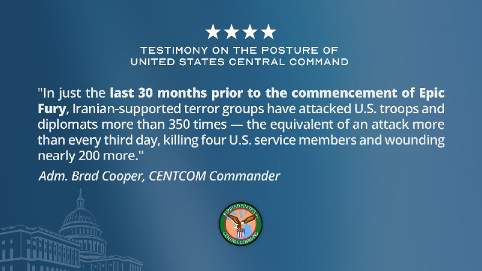

🇺🇸شهادت در مورد وضعیت فرماندهی مرکزی ایالات متحده (سنتکام) 🔸«من قویاً باور دارم که هر موفقیتی که به دست می‌آوریم با نیروهایمان آغاز می‌شود و با آن‌ها پایان می‌یابد. تنها در ۷ ماه گذشته، فرزندان دختر و پسر آمریکا که در سنتکام خدمت می‌کنند، نقش‌های کلیدی در…

## mwarmonitor — post 9082

  

🇺🇸دریادار برد کوپر، فرمانده فرماندهی مرکزی ایالات متحده (CENTCOM)، صبح امروز درباره وضعیت و آرایش عملیاتی سنتکام در کنگره شهادت خواهد داد. @mwarmonitor

## mwarmonitor — post 9081

  

🇺🇸کمک کنید تا در جریان درآمدی سپاه پاسداران انقلاب اسلامی (IRGC) اختلال ایجاد کنیم.

🔸برای ما درباره این افراد اطلاعات/نکته ارسال کنید؛ کسانی که این شرکت تولیدکننده پهپاد را مدیریت می‌کنند.

@mwarmonitor

## mwarmonitor — post 9080

  

🇺🇸یک ناو جنگی آبی - خاکی uss makin مستقر در سن‌دیگو در حال آماده‌سازی برای اعزام به خاورمیانه است، در حالی که ملوانان کالیفرنیایی برای اعزام آماده می‌شوند. نیویورک پست

@mwarmonitor

## mwarmonitor — post 9079

  

🇺🇸یک بالگرد سی‌هاوک (Sea Hawk) متعلق به اسکادران Helicopter Maritime Strike Squadron 50 بر روی عرشه پرواز ناوشکن USS Truxtun (DDG-103) فرود می‌آید؛ در حالی‌ که این شناور در حال عبور از دریای عرب است و از محاصره دریایی ایالات متحده علیه ایران پشتیبانی می‌کند.

🔸بر اساس آخرین آمار، نیروهای سنتکام تا امروز مسیر ۷۰ کشتی تجاری را تغییر داده و ۴ فروند شناور را برای اطمینان از رعایت مقررات از کار انداخته‌اند.

@mwarmonitor

## mwarmonitor — post 9078

🇺🇸وزارت بازرگانی ایالات متحده آمریکا فروش تراشه‌های هوش مصنوعی H200 شرکت انویدیا را به ۱۰ شرکت چینی، در قالب مجوزهایی که برای هر مشتری تا سقف ۷۵ هزار تراشه را اجازه می‌دهد، تأیید کرده است. با وجود این تأییدها، تاکنون هیچ محموله‌ای ارسال نشده است.

@mwarmonitor

## mwarmonitor — post 9077

  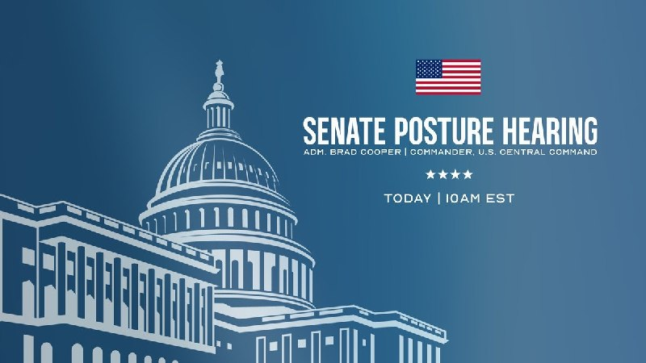

🇺🇸دریادار برد کوپر، فرمانده فرماندهی مرکزی ایالات متحده (CENTCOM)، صبح امروز درباره وضعیت و آرایش عملیاتی سنتکام در کنگره شهادت خواهد داد.

@mwarmonitor

## mwarmonitor — post 9075

🔴گزارش تری یینگست خبرنگار فاکس نیوز (Trey Yingst) از تل‌آویو

🔸تری یینگست: بله بچه‌ها، صبح بخیر. ببینید، چینی‌ها بزرگترین واردکننده نفت خام ایران در جهان هستند و احتمالاً رئیس‌جمهور ترامپ این موضوع را در طول گفتگوهای جاری خود در پکن مطرح کرده است. وقتی به اقدامات نظامی ایران در تنگه هرمز و برنامه هسته‌ای این کشور نگاه می‌کنیم، هر دو مستقیماً از طریق همین صادرات نفت تأمین مالی می‌شوند.
گزارش‌های امروز صبح نشان می‌دهد که ایران کشتی دیگری را در سواحل امارات متحده عربی توقیف کرده است. وزیر امور خارجه، مارکو روبیو، به شان هنیتی (Sean Hannity) در فاکس نیوز گفت که چینی‌ها باید نقش فعال‌تری در وادار کردن ایران به تغییر مسیر ایفا کنند.

📌صحبت‌های مارکو روبیو (وزیر امور خارجه)

🔸مارکو روبیو: از آنجایی که اقتصاد بسیاری از کشورهای جهان به دلیل این بحران در تنگه‌ها در حال فروپاشی است، آن‌ها محصولات چینی کمتری خواهند خرید و صادرات چین به شدت کاهش خواهد یافت. بنابراین، حل این موضوع به نفع خود آن‌هاست. ما امیدواریم آن‌ها را متقاعد کنیم که نقش فعال‌تری ایفا کرده و ایران را وادار کنند تا از اقداماتی که در حال حاضر در خلیج فارس انجام می‌دهد، دست بکشد.

📌صحبت‌های جی.دی. ونس (معاون رئیس‌جمهور)

🔸تری یینگست: در مورد احتمال توافق از طریق مذاکره، معاون رئیس‌جمهور، جی.دی. ونس، اشاره کرد که در هفته‌های اخیر پیشرفت‌هایی حاصل شده است، اما این سوال باقی می‌ماند که آیا این پیشرفت برای جلوگیری از شروع مجدد جنگ کافی است یا خیر.
🔴جی.دی. ونس: من می‌خواهم بتوانم در چشم مردم آمریکا نگاه کنم و با اطمینان بگویم که دیگر لازم نیست نگران دسترسی این رژیم بسیار خطرناک به خطرناک‌ترین سلاح‌های جهان باشید. این هدفی است که ما روی آن تمرکز کرده‌ایم. باز هم می‌گویم، راه‌های زیادی برای دستیابی به این هدف وجود دارد؛ رئیس‌جمهور فعلاً ما را در مسیر دیپلماتیک قرار داده است و این چیزی است که من روی آن تمرکز دارم.

🇮🇷صحبت‌های عباس عراقچی (وزیر امور خارجه ایران)

🔸تری یینگست: ایرانی‌ها در بحبوحه تنش‌های فزاینده در منطقه، همچنان به سخنرانی و تهدید ادامه می‌دهند. وزیر امور خارجه ایران گفت که این کشور هم برای دیپلماسی و هم برای جنگ آماده است.
🔹عباس عراقچی: ما همان‌طور که آماده‌ایم با تمام قوا از آزادی و خاک خود دفاع کنیم، به همان اندازه آماده‌ایم که دیپلماسی را دنبال کرده و از آن دفاع کنیم. همان‌طور که بارها اعلام کرده‌ام، هیچ راه حل نظامی برای هیچ موضوعی در رابطه با ایران وجود ندارد. ما ایرانی‌ها هرگز در برابر هیچ فشار یا تهدیدی سر خم نمی‌کنیم، اما به زبان احترام، با احترام پاسخ می‌دهیم.

🔴تری یینگست: در اینجا در اسرائیل، درگیری علیه بزرگترین نیروی نیابتی ایران، یعنی حزب‌الله در جنوب لبنان ادامه دارد. این گروه اوایل امروز پهپادهایی را به سمت مرز پرتاب کرد که منجر به زخمی شدن سه نفر در شمال اسرائیل شد. بچه‌ها؟

🔰مجری استودیو: واو، اتفاقات زیادی در آنجا در جریان است. تری، وقتی این نشست (در چین) تمام شود، همه نگاه‌ها به کارهایی خواهد بود که شما الان انجام می‌دهید. اما در حال حاضر تمرکز روی چین و چگونگی ارتباط آن با ایران است.

@mwarmonitor

## mwarmonitor — post 9074

  <a href="telegram/content/mwarmonitor_9074_1778776604.mp4" target="_blank">🎬 Download video</a>

🎬 Video

## FoxNewsTwitter — post 341740

  <a href="telegram/content/FoxNewsTwitter_341740_1778776606.mp4" target="_blank">🎬 Download video</a>

Fox News (Twitter/X)

FIRST ON FOX: Buster Murdaugh was spotted Thursday on the porch of his South Carolina home, one day after the South Carolina Supreme Court ruled that misconduct by a court official tainted his father, Alex Murdaugh’s, 2023 trial.

The ruling overturned Alex Murdaugh’s murder conviction, which had sent him to prison for life.

Despite the legal win Wednesday, Murdaugh will not be walking free - he remains behind bars serving lengthy sentences for a string of financial crimes that cemented his fall from power.

Murdaugh was sentenced to 27 years in state prison after pleading guilty to 22 financial crimes. He also got 40 years in federal prison for fraud-related charges, which he is serving at the same time. | @FoxTrueCrime @FoxUSNews

## FoxNewsTwitter — post 341739

‌Fox News (Twitter/X)

https://www.foxnews.com/politics/us-border-patrol-chief-mike-banks-abruptly-resigns-fox-news-learns

## FoxNewsTwitter — post 341738

  <a href="telegram/content/FoxNewsTwitter_341738_1778776607.mp4" target="_blank">🎬 Download video</a>

Fox News (Twitter/X)

FIRST ON FOX: Buster Murdaugh was spotted Thursday on the porch of his South Carolina home, one day after the South Carolina Supreme Court ruled that misconduct by a court official tainted his father, Alex Murdaugh’s, 2023 trial.

The ruling overturned Alex Murdaugh’s murder conviction, which had sent him to prison for life.

Despite the legal win Wednesday, Murdaugh will not be walking free - he remains behind bars serving lengthy sentences for a string of financial crimes that cemented his fall from power.

Murdaugh was sentenced to 27 years in state prison after pleading guilty to 22 financial crimes. He also got 40 years in federal prison for fraud-related charges, which he is serving at the same time.

## FoxNewsTwitter — post 341737

  <a href="telegram/content/FoxNewsTwitter_341737_1778776608.mp4" target="_blank">🎬 Download video</a>

Fox News (Twitter/X)

NEW: President Trump reveals to @seanhannity that Chinese President Xi Jinping has committed to withholding military equipment from Iran following their high-level discussions.

Trump noted that while China continues to purchase Iranian oil, Xi expressed a strong desire to see the Strait of Hormuz remain open and free of interference.

"He said he’s not going to give military equipment, that’s a big statement... But at the same time, he said you know they buy a lot of their oil there and they’d like to keep doing that. He’d like to see Hormuz straight opened."

The full interview airs tonight at 9pm ET.

## FoxNewsTwitter — post 341736

Fox News (Twitter/X)

BREAKING: US Border Patrol Chief Mike Banks abruptly resigns, Fox News has learned

## FoxNewsTwitter — post 341735

  <a href="telegram/content/FoxNewsTwitter_341735_1778776610.mp4" target="_blank">🎬 Download video</a>

Fox News (Twitter/X)

NEW: Iran has reportedly seized a ship off the coast of the UAE, ramping up tensions in the region as disputes grow over alleged attacks and a denied Netanyahu visit.

U.S. officials say talks with the Iranian regime have made some progress but remain uncertain, with Iran signaling it’s ready for either diplomacy or conflict, @TreyYingst reports.

## FoxNewsTwitter — post 341734

  

Fox News (Twitter/X)

NEW: Spencer Pratt is suddenly within single digits of L.A. Mayor Karen Bass, with new polling showing the former reality TV star and independent candidate gaining 12 points since March.

The Emerson poll has Bass at 30%, Pratt at 22%, and socialist-linked Nithya Raman at 19%

Pratt’s campaign is leaning hard into L.A.’s homelessness crisis, using sharp social media and attention-grabbing ads to turn a long-shot bid into a race people are now watching.

## FoxNewsTwitter — post 341733

  <a href="telegram/content/FoxNewsTwitter_341733_1778776612.mp4" target="_blank">🎬 Download video</a>

Fox News (Twitter/X)

BREAKING: Alex Murdaugh’s lead attorney Jim Griffin reveals his client's shock and relief following the South Carolina Supreme Court’s decision to overturn his murder convictions.

Griffin says while Murdaugh remains “skeptical” after years of courtroom losses, he's thrilled by the latest revelation.

“I can tell you he is very relieved that he has gotten the label of convicted murderer of his wife and son off of him, and we plan to keep it off of him." | @LawrenceBJones3 @foxandfriends

## FoxNewsTwitter — post 341732

  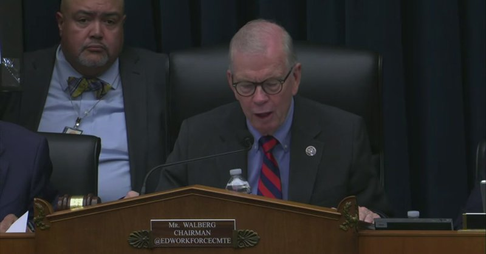

Fox News (Twitter/X)

WATCH LIVE: Linda McMahon faces House lawmakers on Trump's education agenda https://twitter.com/i/broadcasts/1AxRnawQVkgxl

## FoxNewsTwitter — post 341731

  

Fox News (Twitter/X)

WATCH LIVE: House Judiciary subcommittee holds hearing on Fairfax County's sanctuary policies https://twitter.com/i/broadcasts/1dGYljYZaLZKX

## FoxNewsTwitter — post 341730

  <a href="telegram/content/FoxNewsTwitter_341730_1778776614.mp4" target="_blank">🎬 Download video</a>

Fox News (Twitter/X)

A judge in Cook County, IL revealing that authorities have lost track of hundreds of individuals on ankle monitors currently awaiting trial - nearly 10% of the whole program.

Officials warning the current system has serious flaws, citing cases where monitored individuals ignored violations and went on to commit violent crimes, @MikeTobinFox reports. | @SandraSmithFox @AmericaNewsroom

## FoxNewsTwitter — post 341729

  

Fox News (Twitter/X)

The Army has recovered the remains of Spc. Mariyah Symone Collington, 19, the second U.S. soldier who went missing during an off-duty hike in Morocco after a military exercise.

The remains of another soldier, 1st Lt. Kendrick Lamont Key Jr., were recovered last week.

Both soldiers were reported missing May 2 after participating in African Lion exercises and are believed to have fallen from a coastal cliff, ending a challenging multinational search effort.

## FoxNewsTwitter — post 341728

‌Fox News (Twitter/X)

Read more:

## FoxNewsTwitter — post 341727

  

Fox News (Twitter/X)

A New Hampshire woman claims Planet Fitness canceled her membership and called the police after she reported seeing a man in the women's locker room.

The gym reportedly labeled her "transphobic" for raising safety concerns, highlighting the ongoing national debate over "inclusive" locker room policies.

## FoxNewsTwitter — post 341726

  <a href="telegram/content/FoxNewsTwitter_341726_1778776617.mp4" target="_blank">🎬 Download video</a>

Fox News (Twitter/X)

Among the suits and billion-dollar conversations during President Trump's high-stakes Chinese trip, one guest stood out.

Elon Musk’s son was seen wandering through a massive hall in China with his father as major CEOs gathered for high-level meetings.

## FoxNewsTwitter — post 341725

  

Fox News (Twitter/X)

Porn on taxpayer-funded tablets — that’s what some California death row inmates are reportedly watching.

Over 90,000 devices were handed out as part of a multimillion-dollar program meant to connect prisoners with family and provide educational resources. Instead, reports say they’re also being used for explicit content and sexual conversations.

## FoxNewsTwitter — post 341724

  

Fox News (Twitter/X)

RT @FNCGlobalNews: FOREIGN NETWORK HQ: A pro-China nonprofit under federal investigation just dropped $5.15 million on a Manhattan building to serve as its 'permanent home' for far-left organizing.

The People's Forum, tied to Shanghai-based Marxist mogul Neville Roy Singham's network, is now urging supporters to raise another $5 million to renovate the rundown property.

Lawmakers say the group's funding raises "significant concerns" about "foreign influence or control."

Story by @AsraNomani & @M_Dorgan

## FoxNewsTwitter — post 341720

Fox News (Twitter/X)

## pm_afshaa — post 90750

  <a href="telegram/content/pm_afshaa_90750_1778776620.webm" target="_blank">🎬 Download video</a>

🔴ترامپ: رئیس‌جمهور شی مایله که شاهد یک توافق باشه. او گفت: اگه بتونم کمکی داشته باشم، دوست دارم کمک کنم.

هر کسی که این مقدار نفت میخره، مشخصاً نوعی رابطه داره و او دوست داره تنگه هرمز رو باز ببینه.

💧 Rainbet.com the #1 Non-KYC Crypto Casino & Sportsbook @rainbetcom

😁 @Pm_Afshaa

## pm_afshaa — post 90749

🎙️آیا رئیس جمهور شی از ترامپ درخواست کرده بود که به تایوان سلاح نفروشه؟

مارکو روبیو: خوب، این موضوع در گذشته مورد بحث قرار گرفته. اساساً در بحث امروز مطرح نشد. ما میدونیم که موضع آنها در این مورد چیست.

💧 Rainbet.com the #1 Non-KYC Crypto Casino & Sportsbook @rainbetcom

😁 @Pm_Afshaa

## pm_afshaa — post 90748

  <a href="telegram/content/pm_afshaa_90748_1778776620.webm" target="_blank">🎬 Download video</a>

🔴ترامپ: چین موافقت کرد 200 هواپیمای بوئینگ خریداری کنه.

💧 Rainbet.com the #1 Non-KYC Crypto Casino & Sportsbook @rainbetcom

😁 @Pm_Afshaa

## pm_afshaa — post 90747

  <a href="telegram/content/pm_afshaa_90747_1778776621.webm" target="_blank">🎬 Download video</a>

🔴حمید رسایی، نماینده تهران:
دولت قصد داره سهمیه بنزین هزار و ۵۰۰ تومنی و ۳ هزار تومنی رو کاهش بده و قیمت بنزین پنج هزار تومانی رو به ۱۵ تا ۲۰ هزار تومان افزایش بده.

💧 Rainbet.com the #1 Non-KYC Crypto Casino & Sportsbook @rainbetcom

😁 @Pm_Afshaa

## pm_afshaa — post 90746

  <a href="telegram/content/pm_afshaa_90746_1778776621.webm" target="_blank">🎬 Download video</a>

🔴عراقچی: برای مسائل مربوط به ایران راه حل نظامی وجود نداره و ما در مقابل تهدیدات محکم می‌ایستیم و سر فرود نمیاریم.

اگر دوباره بخوان ما رو آزمایش کنند و وارد جنگ شوند، نتیجه‌ای جز شکستی که قبلا دیدن، نخواهد داشت.

💧 Rainbet.com the #1 Non-KYC Crypto Casino & Sportsbook @rainbetcom

😁 @Pm_Afshaa

## pm_afshaa — post 90745

🎙️آیا درباره حمایت چین از ایران با رئیس جمهور چین صحبت کردید؟

ترامپ: ما در مورد این موضوع صحبت کردیم. او گفت که تجهیزات نظامی ارائه نخواهد کرد، این یک بیانیه بزرگه. اما در عین حال گفت که آنها مقدار زیادی نفت خودشون رو از ایران میخرن و دوست دارن این کار رو ادامه بدن.

💧 Rainbet.com the #1 Non-KYC Crypto Casino & Sportsbook @rainbetcom

😁 @Pm_Afshaa

## pm_afshaa — post 90744

  <a href="telegram/content/pm_afshaa_90744_1778776622.webm" target="_blank">🎬 Download video</a>

🔴برد کوپر، فرمانده سنتکام:
رژیم ایران از سال 1979 در حال گسترش وحشت در سراسر خاورمیانه است.

💧 Rainbet.com the #1 Non-KYC Crypto Casino & Sportsbook @rainbetcom

😁 @Pm_Afshaa

## pm_afshaa — post 90743

  <a href="telegram/content/pm_afshaa_90743_1778776622.webm" target="_blank">🎬 Download video</a>

🔴برد کوپر، فرمانده سنتکام:
توانمندی‌های موشکی، دریایی، پهپادی و صنعتی ایران 90 درصد تضعیف شده. او افزود که نیروی دریایی ایران تا یک نسل دیگر هم به سطحی که پیش از جنگ در اختیار داشت باز نخواهد گشت.

💧 Rainbet.com the #1 Non-KYC Crypto Casino & Sportsbook @rainbetcom

😁 @Pm_Afshaa

## pm_afshaa — post 90742

  <a href="telegram/content/pm_afshaa_90742_1778776623.webm" target="_blank">🎬 Download video</a>

🔴نخعی، عضو کمیسیون انرژی مجلس:
با کمبود بنزین مواجهیم و سناریوهای مختلفی درحال بررسیه.

💧 Rainbet.com the #1 Non-KYC Crypto Casino & Sportsbook @rainbetcom

😁 @Pm_Afshaa

## pm_afshaa — post 90741

  <a href="telegram/content/pm_afshaa_90741_1778776623.webm" target="_blank">🎬 Download video</a>

🔴یسرائیل کاتز، وزیر دفاع اسرائیل:
ماموریت ما در ایران کامل نشده؛ اگر اهداف‌مان تامین نشه، دوباره اقدام می‌کنیم.

💧 Rainbet.com the #1 Non-KYC Crypto Casino & Sportsbook @rainbetcom

😁 @Pm_Afshaa

## pm_afshaa — post 90740

  <a href="telegram/content/pm_afshaa_90740_1778776624.webm" target="_blank">🎬 Download video</a>

🔴عارف، معاون اول پزشکیان: به هیچ قیمتی کنترل تنگه هرمز رو از دست نمیدیم.

💧 Rainbet.com the #1 Non-KYC Crypto Casino & Sportsbook @rainbetcom

😁 @Pm_Afshaa

## pm_afshaa — post 90739

🔴وزیر خزانه داری آمریکا:ایران رو انقدر تحت فشار اقتصادی قرار دادیم که توی پرداخت حقوق نیروهاشم به مشکل خورده. دارن نفسای آخرشونو میکشن

💧 Rainbet.com the #1 Non-KYC Crypto Casino & Sportsbook @rainbetcom

😁 @Pm_Afshaa

## pm_afshaa — post 90738

  <a href="telegram/content/pm_afshaa_90738_1778776624.webm" target="_blank">🎬 Download video</a>

🔴وزیر خزانه‌داری آمریکا: باز شدن تنگه هرمز به نفع چین خواهد بود و انتظار داریم قیمت نفت در شش ماه آینده کاهش یابد

💧 Rainbet.com the #1 Non-KYC Crypto Casino & Sportsbook @rainbetcom

😁 @Pm_Afshaa

## pm_afshaa — post 90737

  <a href="telegram/content/pm_afshaa_90737_1778776624.mp4" target="_blank">🎬 Download video</a>

ایلان ماسک هم خوب مست کرده

💧 Rainbet.com the #1 Non-KYC Crypto Casino & Sportsbook @rainbetcom

😁 @Pm_Afshaa

## pm_afshaa — post 90736

  <a href="telegram/content/pm_afshaa_90736_1778776626.webm" target="_blank">🎬 Download video</a>

🔴شی جین‌پینگ در ضیافت با ترامپ:
چین و آمریکا باید شریک باشن، نه رقیب؛ عظمت دوباره آمریکا و احیای چین میتونن همزمان پیش برن.

ترامپ هم پس از این سخنان، روابط واشینگتن و پکن رو یکی از تاثیرگذارترین روابط تاریخ بشر توصیف کرد و دیدارهای انجام‌شده با مقام‌های چینی رو مثبت و سازنده خواند.

💧 Rainbet.com the #1 Non-KYC Crypto Casino & Sportsbook @rainbetcom

😁 @Pm_Afshaa

## pm_afshaa — post 90732

ترامپ یه جور داره رفتار میکنه که انگار رئیس جمهور چین اومده آمریکا

💧 Rainbet.com the #1 Non-KYC Crypto Casino & Sportsbook @rainbetcom

😁 @Pm_Afshaa

## pm_afshaa — post 90730

  <a href="telegram/content/pm_afshaa_90730_1778776626.webm" target="_blank">🎬 Download video</a>

🔴اکسیوس: یک مشاور ترامپ اذعان کرد مشکل اینه که ایران زمان بیشتری داره و آنها روی تقویم سیاسی ما حساب باز کردن تا به سودشون تمام بشه.

💧 Rainbet.com the #1 Non-KYC Crypto Casino & Sportsbook @rainbetcom

😁 @Pm_Afshaa

## iaghapour — post 2609

کل ریپازیتوری گیت هاب علیرضا که شامل X-UI و S-UI میشد بسته شده و هنوز دلیلش مشخص نیست.

## DEJradio — post 4635

  <a href="telegram/content/DEJradio_4635_1778776627.mp4" target="_blank">🎬 Download video</a>

🔺📢 "ما گرسنه‌ایم ولی از جنگ سیر

یک شهروند از تهران با ارسال ویدیویی از حرکت اعتراضی، نوشت گرانی زندگی مردم را مختل کرده است و بسیاری به نان شب محتاج‌اند اما حکومت انگار نه انگار که مردم چطور زندگی می‌کنند.

#تورم #جنگ
@DEJradio

## DEJradio — post 4631

  <a href="telegram/content/DEJradio_4631_1778776628.webm" target="_blank">🎬 Download video</a>

🚨📢 روزنامه «وال‌استریت ژورنال» گزارش داده بود که اسرائیل یک پایگاه نظامی مخفی در بیابان عراق [نزدیم کربلا] ایجاد کرده بود تا از کارزار هوایی خود علیه جمهوری اسلامی پشتیبانی کند و در روزهای ابتدایی جنگ نیز حملاتی هوایی علیه نیروهای عراقی انجام داده بود؛ نیروهایی که نزدیک بود این پایگاه و باند فرود آن را کشف کنند.

اکنون، نزدیک به دو ماه پس از ترک این پایگاه، نیروهای ارتش عراق و عناصر حشـ.ـدالشعبی وارد محل این تأسیسات اسرائیلی شده‌اند.
تصویر یک از رسانه رسمی «کتائب حـ.ـزب‌الله» منتشر شد، اعضای این گروه را در حال بررسی یک وانت تویوتا هایلوکس نشان می‌دهد که گفته می‌شود هدف حمله نیروهای اسرائیلی قرار گرفته است. این هایلوکس متعلق به یک چوپان عراقی بود که به‌طور اتفاقی این پایگاه را کشف کرده و موفق شده بود با ارتش عراق تماس بگیرد، اما پس از آن هدف قرار گرفت و کشته شد. نیروهای کمکی عراقی از لشکر۴۱ نیز توسط یک نیروی ناشناس هدف حمله قرار گرفتند که دست‌کم یک کشته و چند زخمی برجا گذاشت.

تصویر ۲ باند فرود را نشان می‌دهد؛ باندی که گفته می‌شود هم به‌عنوان ایستگاه سوخت‌گیری و هم نقطه استقرار پیشرو برای عملیات جست‌وجو و نجات رزمی استفاده می‌شد؛ عملیاتی که در صورت سرنگونی یک هواپیمای سرنشین‌دار اسرائیلی توسط پدافند هوایی ایران انجام می‌گرفت. گزارش شده که دست‌کم هفت بالگرد در این محل قابل مشاهده بوده‌اند.

منتقدان دولت عراق می‌گویند این کشور با وجود داشتن یک ساختار امنیتی نزدیک به دو میلیون نفر شامل مرزبانان، حـ.ـشدالشعبی، پلیس و ارتش، نتوانسته بود تشخیص دهد که یک نیروی نظامی خارجی عملاً در بیابان‌های عراق یک پایگاه هوایی ساخته است. همچنین جمهوری اسلامی نیز ماه‌ها از فعالیت چنین پایگاهی بی‌خبر بود.

#جنگ #عراق #حشد_الشعبی
@DEJradio

## DEJradio — post 4630

  <a href="telegram/content/DEJradio_4630_1778776628.webm" target="_blank">🎬 Download video</a>

🔺📢 یک منبع آگاه:
حکومت برای تشییع جنازه خامنه‌ای هم‌زمان با مسابقات جام جهانی برنامه‌ریزی می‌کند

یک منبع آگاه به دژ گفت حکومت در حال برنامه‌ریزی برای تشییع جنازه علی خامنه‌ای همزمان با برگزاری مسابقات جام جهانی است.

نهادهای امنیتی و مقامات تصمیم‌گیر به این نتیجه رسیده‌اند که هم‌زمان با مسابقات فوتبال تهدیدات امنیتی از سوی آمریکا و اسرائیل کمتر خواهد بود.

شنیده شده مصلای تهران برای برگزاری این مراسم آماده می‌شود، اما قصد دارند او را در مشهد در جوار امام هشتم شیعیان دفن کنند.

#موشعلی #جام_جهانی
@DEJradio

## DEJradio — post 4629

  <a href="telegram/content/DEJradio_4629_1778776629.webm" target="_blank">🎬 Download video</a>

🔺📌 در اواسط جنگ گزارش شد مسعود پزشکیان به دنبال استعفاست اما نهادهای نظامی و امنیتی مخالف‌اند، اکنون گزارش‌های رسیده به دژ از تشدید اختلافات در سطوح عالی حکومت و افزایش فشارها علیه دولت مسعود پزشکیان حکایت دارد؛ تحولاتی که هم‌زمان با عمیق‌تر شدن بحران اقتصادی و افزایش نارضایتی‌های عمومی در ایران رخ می‌دهد.

بر اساس این گزارش‌ها، شماری از مقام‌های ارشد حکومتی از جمله نظامی‌ها با ابراز بی‌اعتمادی نسبت به سیاست‌ها و اصلاحات اقتصادی مسعود پزشکیان، دولت او را مسئول افزایش فشارهای معیشتی، تورم و نارضایتی اجتماعی می‌دانند.

منابع نزدیک به ساختار قدرت همچنین از آغاز رایزنی‌هایی با برخی وزیران و جریان‌های سیاسی برای تضعیف جایگاه رئیس‌جمهور یا بررسی سناریوی تغییر دولت خبر می‌دهند.

این تحولات در شرایطی رخ می‌دهد که اقتصاد ایران با کاهش ارزش پول ملی، گرانی گسترده کالاهای اساسی و افزایش بیکاری روبه‌روست؛ وضعیتی که موج تازه‌ای از نارضایتی‌های اجتماعی را در کشور ایجاد کرده است.

#پزشکیان #اقتصاد_ایران
@DEJradio

## DEJradio — post 4628

  <a href="telegram/content/DEJradio_4628_1778776629.mp4" target="_blank">🎬 Download video</a>

🤡
🔺 لمپن‌های مدافع جمهوری؛ موتورساز هتاک در جنوب شهر تهران

#تهران #جمهوری
@DEJradio

## DEJradio — post 4627

  <a href="telegram/content/DEJradio_4627_1778776631.webm" target="_blank">🎬 Download video</a>

🚨
⭕️ مایک والتز، سفیر ایالات متحده در سازمان ملل، ضمن اشاره به حمایت ۱۱۳ کشور از پیش‌نویس قطعنامه شورای امنیت در محکومیت اقدامات جمهوری اسلامی، تصریح کرد تهران به دلیل اقدامات غیرقانونی خود، از جمله مین‌گذاری و اعمال عوارض بر کشتیرانی در تنگه هرمز، «منزوی» شده است.

آقای والتز در شبکه اجتماعی ایکس نوشت که کشورهایی از جمله هند، ژاپن و کره جنوبی از این ابتکار حمایت کرده‌اند.

#تنگه_هرمز
@DEJradio

## mamlekate — post 103525

📝 آغاز دیدار شی و ترامپ در سایه جنگ ایران

رهبران چین و آمریکا گفت‌وگوهای رسمی خود را آغاز کردند. مسائل تجاری، تنش چین و تایوان و همچنین جنگ ایران از موضوعات محوری دیدار شی و ترامپ خواهد بود. واشنگتن به نقش فعالانه‌تر پکن در حل بحران تنگه هرمز امیدوار است.

شماری از شخصیت‌های تجاری برجسته آمریکا از جمله ایلان ماسک،‌ مدیرعامل شرکت تسلا، تیم کوک، مدیرعامل اپل و جنسن هوانگ، مدیر اجرایی انویدیا، دونالد ترامپ را در این سفر همراهی می‌کنند.

📝 ترامپ به شی: روابط آمریکا با چین «بهتر از همیشه» خواهد بود

📝 شی در دیدار با ترامپ: مسئله تایوان «مهم‌ترین» موضوع است و در صورت سوء‌مدیریت می‌تواند «وضعیتی بسیار خطرناک» ایجاد کند

@mamlekate

## VahidOnline — post 75468

  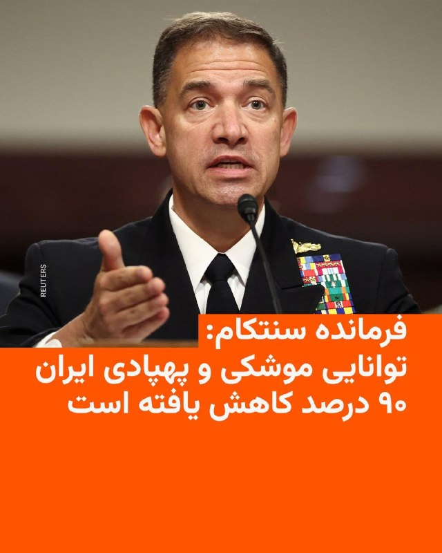

برد کوپر، فرمانده ستاد فرماندهی مرکزی ایالات متحده (سنتکام)، اعلام کرد که صنایع موشکی، پهپادی و دریایی ایران «۹۰ درصد تضعیف شده‌اند.»

او در یک جلسه استماع در سنای آمریکا گفت: «تهدید ایران به‌طور قابل‌توجهی تضعیف شده و این کشور دیگر مانند گذشته، در هیچ حوزه‌ای، قادر به تهدید شرکای منطقه‌ای یا ایالات متحده نیست. آنها به‌شدت تضعیف شده‌اند.»

کوپر اشاره کرد که نیروهای نیابتی مسلح ایران در ۳۰ ماه پیش از جنگ اخیر، بیش از ۳۵۰ حمله علیه نیروها و دیپلمات‌های آمریکایی انجام داده بودند؛ به‌طور میانگین هر سه روز یک حمله، که در نتیجه آن چهار سرباز آمریکایی کشته شدند.

برد کوپر با دفاع از جنگ اخیر تأکید کرد: «امروز حماس، حزب‌الله و حوثی‌ها همگی از تأمین تسلیحات و حمایت ایران قطع شده‌اند. این نتیجه از پیش تضمین‌شده نبود.»

او همچنین گفت نیروهای آمریکایی دیگر برای سرنگون کردن پهپادهای ایرانی از مهمات پیشرفته و گران‌قیمت استفاده نمی‌کنند.
ذخایر سامانه‌های دفاعی پرهزینه برای مقابله با پهپادهای ایرانی در طول جنگ خبرساز شده بود، اما فرمانده سنتکام اعلام کرد ارتش آمریکا اکنون از مهمات ارزان‌تر استفاده می‌کند.
@VahidHeadline

📡 @VahidOnline

## VahidOnline — post 75467

  

حمید رسایی، نماینده تهران در مجلس، نوشت جریانی «شناخته‌شده» در دولت چهاردهم که راه‌حل را «آزاد کردن و گران کردن» می‌داند، قصد دارد سهمیه بنزین هزار و ۵۰۰ تومانی و سه هزار تومانی را کاهش دهد و قیمت بنزین پنج هزار تومانی را به ۱۵ تا ۲۰ هزار تومان افزایش دهد.

او افزود همان جریان در دولت چهاردهم پیش‌تر با حذف ارز ترجیحی ۲۸ هزار و ۵۰۰ تومانی و گران کردن ارز، به گفته او، «بالاترین تورم پس از انقلاب ۵۷» را به مردم تحمیل کرده بود.

رسایی نوشت محمدباقر قالیباف با «پلمپ کردن بدون توجیه و دلیل مجلس»، راه نظارت نمایندگان بر تصمیمات دولت را بسته است. او افزود انجام تکلیف نمایندگی سخت شده، اما تلاش می‌کند مجلس را از این «مرگ تعمدی» بیرون بیاورد و جلوی این تصمیمات «عجیب» را در موقعیت «سخت و جنگی» فعلی بگیرد.
@VahidOOnLine

📡 @VahidOnline

## VahidOnline — post 75466

  

مصطفی پوردهقان، دبیر دوم کمیسیون صنایع و معادن مجلس گفته است که مصوبه شورای عالی امنیت ملی در مورد اینترنت پرو در اجرا به «قلکی برای همراه اول، ایرانسل و رایتل» تبدیل شده است.

او در مورد انتخاب محمدرضا عارف، به عنوان رئیس ستاد ویژه ساماندهی فضای مجازی گفت که «مجلس در این مورد چیزی نمی‌داند» و این حکم مسعود پزشکیان، رئیس‌جمهور را «تزئینی» خوانده است.

به گفته این نماینده مجلس این قبیل اقدامات بیشتر جنبه «روانی » دارد و قرار نیست که «اتفاق خاصی» در این مورد بیفتد.

آقای پوردهقان همچنین گفته است که بدتر از قطعی اینترنت، تعطیلی مجلس است و اکنون مجلس با بسیاری از وزرای دولت به لحاظ نظارتی هیچ ارتباط خاصی درمورد عملکردشان ندارد که یکی از همین موارد موضوع اینترنت است و هنوز یک جلسه ویژه نداریم که فردی بیاید و شرایط را توضیح دهد.
@VahidHeadline

📡 @VahidOnline

## VahidOnline — post 75465

  

یسرائیل کاتز، وزیر دفاع اسرائیل در یک سخنرانی گفت که ماموریت ارتش این کشور درباره ایران کامل نشده و برای این احتمال آماده است که شاید دوباره ناچار به اقدام شود.
یسرائیل کاتز تاکید کرد: «اگر اهداف‌مان تامین نشود، دوباره اقدام خواهیم کرد.»

پیش از این نیز ایال زمیر، رییس ستاد کل ارتش اسرائیل، گفته بود که «نبرد به پایان نرسیده و ارتش برای ازسرگیری جنگ در صورت نیاز آماده است.»
@VahidOOnLine

📡 @VahidOnline

## VahidOnline — post 75464

  

اسکات بسنت، وزیر دارایی آمریکا، در گفت‌وگویی با شبکه سی‌ان‌بی‌سی در حاشیه سفر رئیس‌جمهور آمریکا، در یک مصاحبه از پیش ضبط‌شده گفت که معتقد است چین از نفوذش بر تهران برای بازگشایی تنگه هرمز استفاده خواهد کرد.

او گفت: «فکر می‌کنم آن‌ها (چینی‌ها) هر کاری از دستشان بربیاید انجام خواهند داد.»

آقای بسنت افزود: « بازگشایی تنگه هرمز بسیار به نفع چین است. فکر می‌کنم آن‌ها پشت پرده تلاش خواهند کرد، البته اگر اصلا کسی بتواند بر تصمیم‌های رهبری ایران تاثیر بگذارد.»

به اعتقاد وزیر دارایی آمریکا، چین به‌زودی سفارش بزرگی از هواپیماهای بوئینگ را اعلام خواهد کرد و افزود دو طرف در حال گفت‌وگو درباره بهبود روابط تجاری از جمله صادرات انرژی هستند.
@VahidHeadline

📡 @VahidOnline

## VahidOnline — post 75463

  

رسانه‌های ایران می‌گویند وزیر خارجه جمهوری اسلامی در نشست بریکس در دهلی‌نو، امارات متحده عربی را به «دخالت مستقیم» در عملیات نظامی علیه کشورش متهم کرد.
این تنش یک روز پس از آن رخ داد که امارات ادعای بنیامین نتانیاهو، نخست‌وزیر اسرائیل، مبنی بر سفر به این کشور حاشیه خلیج فارس در جریان جنگ ایران را رد کرد.

خبرگزاری مهر به نقل از عراقچی نوشت: «من به خاطر حفظ وحدت، در سخنرانی‌ام در بریکس نامی از امارات نبردم. اما حقیقت این است که امارات مستقیماً در تجاوز علیه کشور من دخیل بود. وقتی حملات آغاز شد، آن‌ها حتی آن را محکوم هم نکردند.»
رسانه‌های ایرانی مشخص نکردند که نماینده امارات چه اظهاراتی در این نشست مطرح کرده بود.

بر اساس این گزارش‌ها، عراقچی همچنین گفت که «نه پایگاه‌های آمریکا و نه اتحاد با اسرائیل برای امارات امنیت به همراه نیاورده و این کشور باید در سیاست خود نسبت به ایران تجدیدنظر کند».
عراقچی پیش‌ از این نیز گفته بود: «کسانی که با اسرائیل برای ایجاد تفرقه همکاری می‌کنند، پاسخگو خواهند شد.»

رسانه‌های ایرانی همچنین درباره اینکه آیا شرکت‌کنندگان نشست وزیران خارجه بریکس در هند خواهند توانست بیانیه نهایی مشترکی صادر کنند یا نه، ابراز تردید کرده‌اند؛ زیرا اختلافات میان ایران و امارات ادامه دارد.
در همین رابطه از کاظم غریب‌آبادی، معاون وزیر خارجه ایران، نقل شده که به دلیل حضور امارات در این نشست، «مشکلات و رایزنی‌هایی» وجود داشته است.
@VahidHeadline

📡 @VahidOnline

## VahidOnline — post 75462

  

یونهاپ، خبرگزاری دولتی کره جنوبی، روز چهارشنبه ۲۴ اردیبهشت به نقل از یکی از مقام‌های امنیتی این کشور گزارش کرد که بررسی‌های سئول نشان می‌دهد که به احتمال بسیار زیاد جمهوری اسلامی ایران مسئول حمله به کشتی باری این کشور در تنگه هرمز بوده است.

سفارت جمهوری اسلامی در سئول هفته گذشته هرگونه حمله جمهوری اسلامی به کشتی باری کره جنوبی در تنگه هرمز را رد کرده بود.
@VahidOOnLine

📡 @VahidOnline

## VahidOnline — post 75461

  

مرکز عملیات تجارت دریایی بریتانیا روز پنجشنبه ۲۴ اردیبهشت اعلام کرد پس از وقوع حادثه‌ای دریایی در شمال شرقی امارات متحده عربی، «افراد غیرمجاز» کنترل یک کشتی در لنگرگاه را به دست گرفته‌اند و این کشتی اکنون به سوی آب‌های سرزمینی ایران در حرکت است.

این نهاد گفت گزارشی دربارهٔ حادثه دریایی در ۳۸ مایل دریایی (حدود ۷۰ کیلومتری) شمال شرقی بندر فجیره امارات متحده عربی دریافت کرده و پس از آن، کشتی به تصرف درآمده و مسیر آن به سوی آب‌های سرزمینی ایران تغییر داده شده است.
@VahidHeadline

📡 @VahidOnline

## VahidOnline — post 75460

  

کاخ سفید اعلام کرد که دونالد ترامپ و شی جین‌پینگ، در پکن توافق کردند که ایران هرگز نباید به سلاح هسته‌ای دست پیدا کند و تنگه هرمز باید باز بماند.

آمریکا این گفت‌وگوی دو ساعته را «خوب» توصیف کرده و می‌گوید که دو رهبر در حال تلاش برای تقویت همکاری‌های اقتصادی هستند.

در بیانیه کاخ سفید، رئیس‌جمهور شی همچنین «علاقه‌مندی خود را» برای خرید بیشتر نفت آمریکا ابراز کرد تا وابستگی چین به تنگه هرمز را کاهش دهد.

همچنین گفته شد که مدیران برخی از بزرگ‌ترین شرکت‌های آمریکایی هم در بخشی از این دیدار حضور داشتند.

آن‌ها همچنین درباره اهمیت پایان دادن به ورود مواد اولیه برای ساخت ماده مخدر فنتانیل به آمریکا هم صحبت کردند.
@VahidHeadline

📡 @VahidOnline

## VahidOnline — post 75459

  

مارکو روبیو، وزیر خارجه آمریکا، می‌گوید به نفع چین است که حکومت ایران را برای باز کردن تنگه هرمز تحت فشار بگذارد.

براساس گزارشی که فاکس‌نیوز از اظهارات روبیو در راه سفر به چین پخش کرد، او گفت: «ما این استدلال را با چینی‌ها مطرح کرده‌ایم و امیدوارم قانع‌کننده باشد. آن‌ها اواخر این هفته در سازمان ملل فرصت خواهند داشت دربارهٔ این موضوع اقدامی انجام دهند؛ زمانی که قطعنامه‌ای برای محکوم کردن اقدامات ایران در ارتباط با تنگه‌ها مطرح می‌شود.»
روبیو گفت حکومت ایران در حال ایجاد ظرفیتی بوده که بتواند با «انبوهی از موشک‌ها و پهپادها» سامانه‌های دفاعی کشورهای منطقه را از کار بیندازد و هرگونه حملهٔ احتمالی به برنامه هسته‌ای خود را با تهدید به وارد کردن خسارت گسترده به کشورهای خلیج فارس پاسخ دهد.
مارکو روبیو همچنین با اشاره به بحران تنگه هرمز، گفت این وضعیت بیش از هر کشور دیگری به زیان چین است و پکن باید ایران را برای عقب‌نشینی از اقداماتش تحت فشار بگذارد.

@VahidHeadline

📡 @VahidOnline

## VahidOnline — post 75457

نت‌بلاکس، نهاد بین‌المللی پایش اینترنت، نوشت که پس از بیش از ۱۸۰۰ ساعت قطعی اینترنت در ایران، نظامی طبقاتی توسط جمهوری اسلامی برای دسترسی ایجاد شده است.

😋
💩 همزمان مهدی طباطبایی، معاون ارتباطات و اطلاع‌رسانی دفتر مسعود پزشکیان، ادعا کرده است که اگر همه‌پرسی برگزار شود، مردم در شرایط جنگی، امنیت را به سهولت دسترسی به اینترنت ترجیح خواهند داد.
@VahidHeadline
روزنامه اعتماد گزارش داد که نخستین نشست «ستاد ویژه ساماندهی و راهبری فضای مجازی» هفته آینده به ریاست محمدرضا عارف برگزار خواهد شد.
هدف اصلی این ستاد، فراهم کردن زمینه‌های لازم برای رفع محدودیت‌های فضای مجازی است تا حداکثر تا میانه خردادماه، امکان اتصال مجدد شهروندان به اینترنت بین‌المللی فراهم شود.
عارف در این مسیر قصد دارد از ظرفیت نخبگان و اساتید برجسته ارتباطات نظیر هادی خانیکی و علی ربیعی [
🤨] استفاده کرده و میان نهادهای حاکمیتی برای بازگشت سرویس‌دهی هم‌افزایی ایجاد کند.
@VahidOOnLine

📡 @VahidOnline

## VahidOnline — post 75456

  

مهدی شفاخواه، فعال حوزه آموزش و حمایت از کودکان کار و ساکنان مناطق محروم، توسط نیروهای وزارت اطلاعات جمهوری اسلامی بازداشت شد.

این فعال حوزه کودکان عصر سه‌شنبه ۲۲ اردیبهشت ۱۴۰۵، ماموران وزارت اطلاعات بازداشت و به مکان نامعلومی منتقل شد. همچنین تمامی وسایل الکترونیکی و ارتباطی او و همسرش نیز توقیف شده است.
@VahidHeadline
هنوز از دلایل بازداشت، اتهامات انتسابی و محل دقیق نگهداری شفاخواه هیچ اطلاع دقیقی در دسترس نیست و پیگیری‌های خانواده او برای کسب اطلاع از وضعیت سلامت او بی‌نتیجه مانده است.

مهدی شفاخواه طی سال‌های اخیر به صورت داوطلبانه در مناطق محروم و حاشیه‌نشین فعالیت داشته و از طریق آموزش ورزش و مهارت‌های اجتماعی به کودکان کار و نوجوانان آسیب‌پذیر، در راستای کاهش آسیب‌های اجتماعی از جمله اعتیاد و بزهکاری تلاش می‌کرد.

او برادر رضا شفاخواه، وکیل دادگستری و فعال حقوق کودکان و زندانیان سیاسی، است.
@VahidHeadline

📡 @VahidOnline

## kianmeli1 — post 87401

‏🔴شی جین‌پینگ، رییس‌جمهوری چین، در ضیافت رسمی به افتخار ترامپ گفت که دو کشور باید شریک باشند، نه رقیب

‏شی جین‌پینگ گفت که دو شعار «نوزایی چین» و «عظمت را دوباره به آمریکا بازگردانیم» می‌توانند در کنار یکدیگر پیش بروند
https://t.me/kianmeli1

## kianmeli1 — post 87400

🔴بلومبرگ: ۴ روز است که از خارک بارگیری نفت نمی‌شود و اسکله‌های نفتی کاملاً خالی است

صادرات نفت از جزیره خارک برای نخستین بار از آغاز جنگ، چند روز متوقف شد
https://t.me/kianmeli1

## kianmeli1 — post 87399

  <a href="telegram/content/kianmeli1_87399_1778776637.mp4" target="_blank">🎬 Download video</a>

🔴ترامپ از شی دعوت کرد تا در 24 سپتامبر به آمریکا سفر کند.
https://t.me/kianmeli1

## kianmeli1 — post 87398

  <a href="telegram/content/kianmeli1_87398_1778776639.mp4" target="_blank">🎬 Download video</a>

🔴صداوسیما

از دیشب عبور ۳۰ کشتی از تنگه هرمز انجام پذیرفته است
https://t.me/kianmeli1

## kianmeli1 — post 87397

  

🔴در پی انتشار گزارش‌هایی مبنی بر بلند شدن دود از منطقه صنایع نفتی فجیره، دفتر رسانه‌ای فجیره اعلام کرد که این دود به دلیل تعمیرات مداوم یک خط لوله است.
https://t.me/kianmeli1

## kianmeli1 — post 87396

  

🔴طبق اعلام مرکز عملیات تجارت دریایی بریتانیا (UKMTO)، حادثه‌ای در ۳۸ مایلی شمال شرقی فجیره، امارات متحده عربی رخ داده است که در آن یک کشتی توقیف و به آب‌های ایران منتقل شده است. این احتمالاً توقیف دیگری از یک کشتی توسط سپاه پاسداران انقلاب اسلامی است.
https://t.me/kianmeli1

## kianmeli1 — post 87395

  

🔴کاخ سفید پس از مذاکرات دوجانبه ایالات متحده و چین در پکن، پایتخت چین، در بیانیه‌ای اعلام کرد که دو هیئت در مورد مسائلی مانند دسترسی به بازار چین، سرمایه‌گذاری چین در صنایع ایالات متحده، مواد مخدر، به ویژه فنتانیل، «جریان آزاد» تجارت از طریق تنگه هرمز و سایر مسائل کلیدی گفتگو کردند.
https://t.me/kianmeli1

## kianmeli1 — post 87394

🔴آکسیوس : یکی از گزینه‌های ترامپ پس از بازگشت از چین از سر گیری پروژه آزادی در تنگه هرمز است.گزینه دیگر ترامپ حمله به زیرساخت‌های ایران است.
https://t.me/kianmeli1

## kianmeli1 — post 87393

  <a href="telegram/content/kianmeli1_87393_1778776642.mp4" target="_blank">🎬 Download video</a>

🔴جان بولتون: مذاکره بر سر توافق هسته‌ای با ایران اتلاف اکسیژن است.

این افراد دهه‌ها پیش تصمیمی استراتژیک برای دستیابی به سلاح‌های هسته‌ای گرفتند.
در ۴۷ سال گذشته حتی یک مدرک هم وجود ندارد که نشان دهد آنها از این هدف دست کشیده‌اند
https://t.me/kianmeli1

## IranIntlTV — post 337197

  

اکسیوس در گزارشی درباره ایران نوشت که مقام‌های آمریکایی انتظار ندارند دونالد ترامپ در جریان سفرش به چین اقدام چشمگیری در مورد جمهوری اسلامی انجام دهد، اما معتقدند او ممکن است بلافاصله پس از پایان این سفر تصمیم بعدی خود را اتخاذ کند.

براساس این گزارش یکی از گزینه‌های مورد بررسی ازسرگیری «پروژه آزادی» است؛ طرحی که در آن نیروی دریایی آمریکا تلاش می‌کند بن‌بست ایجاد شده در تنگه هرمز را بشکند.

به گزارش اکسیوس، گزینه دیگر آغاز کارزار جدید بمباران با تمرکز بر زیرساخت‌های ایران است.

مقام‌های اسرائیلی نیز گفته‌اند در صورت تصمیم ترامپ برای ازسرگیری جنگ، در آخر هفته جاری در وضعیت آماده‌باش کامل خواهند بود.
https://iranintl.com/202605149706

## IranIntlTV — post 337196

  

دونالد ترامپ در گفت‌وگو با فاکس‌نیوز گفت رییس‌جمهور چین خواهان باز ماندن تنگه هرمز و دستیابی به توافق است و پیشنهاد داده برای تحقق آن به هر شکل ممکن کمک کند.
ترامپ افزود شی جین‌پینگ به او گفته چین هیچ‌گونه تجهیزات نظامی در اختیار جمهوری اسلامی قرار نخواهد داد.
https://iranintl.com/202605142029

## IranIntlTV — post 337195

  <a href="telegram/content/IranIntlTV_337195_1778776644.mp4" target="_blank">🎬 Download video</a>

شش کشور عربی شامل بحرین، کویت، عربستان سعودی، امارات، قطر و اردن در نامه‌ای فوری به سازمان ملل، جمهوری اسلامی را مسئول خسارت‌های واردشده به کشورهای منطقه دانسته و خواستار پرداخت غرامت شدند.
جزییات بیشتر با مریم رحمتی، خبرنگار ایران‌اینترنشنال
@iranintltv

## IranIntlTV — post 337194

  <a href="telegram/content/IranIntlTV_337194_1778776646.mp4" target="_blank">🎬 Download video</a>

در ادامه سفر دونالد ترامپ به چین، روسای جمهور آمریکا و چین در ضیافت شام رسمی بر گسترش همکاری‌های اقتصادی و ادامه گفت‌وگوها تاکید کردند. شی جین‌پینگ این سفر را «تاریخی» توصیف کرد و ترامپ نیز گفت دیدارهای دو طرف مثبت و سازنده بوده است.
سمیرا قرایی، خبرنگار ایران‌اینترنشنال، گزارش می‌دهد
@iranintltv

## IranIntlTV — post 337193

  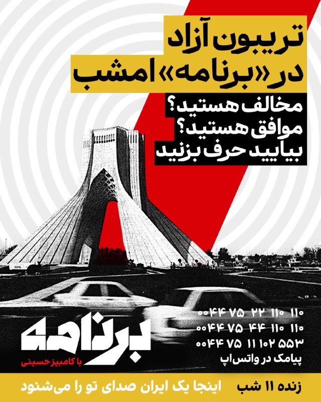

«برنامه» امشب، «تریبون آزاد» شماست.
اگر فقط یک جمله فرصت داشتید با ایران حرف بزنید، چه می‌گفتید؟
چه چیزی هنوز دلتان را گرم نگه می‌دارد؟
نگرانی‌تان چیست؟
از چه چیزی عصبانی هستید؟
حرفی دارید که در دلتان مانده و جایی برای گفتنش نبوده؟
از خودتان بگویید؛ از امیدها و ترس‌هایتان،
از رؤیایی که هنوز زنده است یا از چیزی که از دست رفته است.
تاریخ با صدای شما نوشته می‌شود.
برای شرکت در برنامه، همین حالا در واتس‌اپ پیام بدهید:
۰۰۴۴۷۵۲۲۱۱۰۱۱۰
۰۰۴۴۷۵۴۴۱۱۰۱۱۰
۰۰۴۴۷۵۱۱۱۰۲۵۵۳
«برنامه با کامبیز حسینی»
«یک ایران، صدای شما را می‌شنود»
@iranintltv

## IranIntlTV — post 337192

یک شهروند با ارسال پیامی به ایران اینترنشنال از نایاب و گران شدن داروی اعصاب و روان روایت می‌کند. صدای او برای حفظ امنیتش با هوش مصنوعی تغییر یافته است.

## IranIntlTV — post 337191

  

حمید رسایی، نماینده تهران در مجلس، نوشت جریانی «شناخته‌شده» در دولت چهاردهم که راه‌حل را «آزاد کردن و گران کردن» می‌داند، قصد دارد سهمیه بنزین هزار و ۵۰۰ تومانی و سه هزار تومانی را کاهش دهد و قیمت بنزین پنج هزار تومانی را به ۱۵ تا ۲۰ هزار تومان افزایش دهد.

او افزود همان جریان در دولت چهاردهم پیش‌تر با حذف ارز ترجیحی ۲۸ هزار و ۵۰۰ تومانی و گران کردن ارز، به گفته او، «بالاترین تورم پس از انقلاب ۵۷» را به مردم تحمیل کرده بود.

رسایی نوشت محمدباقر قالیباف با «پلمپ کردن بدون توجیه و دلیل مجلس»، راه نظارت نمایندگان بر تصمیمات دولت را بسته است. او افزود انجام تکلیف نمایندگی سخت شده، اما تلاش می‌کند مجلس را از این «مرگ تعمدی» بیرون بیاورد و جلوی این تصمیمات «عجیب» را در موقعیت «سخت و جنگی» فعلی بگیرد.
https://iranintl.com/202605146615

## IranIntlTV — post 337190

  <a href="telegram/content/IranIntlTV_337190_1778776649.mp4" target="_blank">🎬 Download video</a>

در حالی که تنها ۲۸ روز تا آغاز جام جهانی فوتبال باقی مانده، سرنوشت صدور ویزای آمریکا برای اعضای تیم فوتبال ایران همچنان نامشخص است. رییس فدراسیون فوتبال اعلام کرده هنوز هیچ ویزایی برای اعضای این تیم صادر نشده است.
گفت‌وگو با محمد تقوی، بازیکن پیشین تیم ملی و باشگاه استقلال
@iranintltv

## IranIntlTV — post 337189

  

برد کوپر، فرمانده ستاد فرماندهی مرکزی آمریکا (سنتکام)، در جلسه کمیته نیروهای مسلح سنای آمریکا گفت در ۳۰ ماه منتهی به عملیات «خشم حماسی»، گروه‌های مورد حمایت جمهوری اسلامی بیش از ۳۵۰ بار به نیروها و دیپلمات‌های آمریکایی حمله کرده‌اند؛ به‌طور میانگین بیش از یک حمله در هر سه روز.
او افزود این حملات به کشته شدن چهار نظامی آمریکایی و زخمی شدن نزدیک به ۲۰۰ نفر انجامیده است.

فرمانده سنتکام همچنین گفت امروز حماس، حزب‌الله و حوثی‌ها از پشتیبانی و تامین تسلیحاتی جمهوری اسلامی محروم شده‌اند.
https://iranintl.com/202605144789

## IranIntlTV — post 337188

  

برد کوپر، فرمانده ستاد فرماندهی مرکزی آمریکا (سنتکام)، در جلسه کمیته نیروهای مسلح سنای آمریکا گفت در ۳۰ ماه منتهی به عملیات «خشم حماسی»، گروه‌های مورد حمایت جمهوری اسلامی بیش از ۳۵۰ بار به نیروها و دیپلمات‌های آمریکایی حمله کرده‌اند؛ به‌طور میانگین بیش از یک حمله در هر سه روز.
او افزود این حملات به کشته شدن چهار نظامی آمریکایی و زخمی شدن نزدیک به ۲۰۰ نفر انجامیده است.

فرمانده سنتکام همچنین گفت امروز حماس، حزب‌الله و حوثی‌ها از پشتیبانی و تامین تسلیحاتی جمهوری اسلامی محروم شده‌اند.
https://iranintl.com/202605144789

## IranIntlTV — post 337187

  <a href="telegram/content/IranIntlTV_337187_1778776652.mp4" target="_blank">🎬 Download video</a>

جمهوری اسلامی از نخستین روزهای قدرت، اعدام را به ابزار حکم‌رانی و کنترل سیاسی تبدیل کرد؛ زبانی خشن که از پشت‌بام مدرسه رفاه آغاز شد و تا زندان‌های امروز ادامه دارد.

آرین ریسباف گزارش می‌دهد.
@iranintltv

## IranIntlTV — post 337186

  <a href="https://t.me/IranintlTV/337186" target="_blank">📎 Download file</a>

🎧نسخه صوتی اخبار نیم‌روزی | پنجشنبه ۲۴ اردیبهشت
@iranintlTV

## IranIntlTV — post 337185

  <a href="telegram/content/IranIntlTV_337185_1778776653.mp4" target="_blank">🎬 Download video</a>

وزیر دفاع اسرائیل اعلام کرد ماموریت ارتش این کشور درباره جمهوری اسلامی هنوز کامل نشده است. پیش‌تر رییس ستاد کل ارتش اسرائیل نیز گفته بود نبرد با جمهوری اسلامی پایان نیافته و ارتش اسرائیل در صورت نیاز برای ازسرگیری جنگ آمادگی کامل دارد.
بابک اسحاقی، خبرنگار ایران‌اینترنشنال، گزارش می‌دهد
@iranintltv

## IranIntlTV — post 337184

  <a href="telegram/content/IranIntlTV_337184_1778776655.mp4" target="_blank">🎬 Download video</a>

کاخ سفید اعلام کرد در جریان سفر دونالد ترامپ به پکن، روسای جمهور آمریکا و چین بر لزوم باز ماندن تنگه هرمز به‌عنوان یک آبراه بین‌المللی تاکید کرده و گفته‌اند جریان انتقال انرژی از این مسیر باید ادامه داشته باشد.
گفت‌وگو با امید معماریان، تحلیل‌گر سیاسی
@iranintltv

## IranIntlTV — post 337183

  

🔻علی تاجرنیا، رییس هیات مدیره باشگاه استقلال، درباره اختلاف نظر باشگاه‌ها در برگزاری ادامه لیگ برتر گفت: «استقلال فعلا صدرنشین لیگ برتر است و قهرمانی تیم ما به نظر فدراسیون فوتبال بستگی دارد. بعد از اعلام تصمیم ادامه رقابت‌ها پیش از جام جهانی، تابع نظرات بودیم و نخستین تیمی بودیم که خود را برای مسابقات آماده کردیم.»

🔹او ادامه داد: «وقتی بقیه تیم‌ها درخواست کردند لیگ پس از جام جهانی برگزار شود، با آنها همراهی کردیم. اگر بازی‌ها به هر دلیلی ادامه نداشته باشد، استقلال به‌عنوان صدرنشین در صدر جدول قرار دارد.»

🔹رییس هیات مدیره باشگاه استقلال درباره معرفی نمایندگان ایران به کنفدراسیون فوتبال آسیا گفت: «ما تابع مقررات هستیم. فدراسیون درخواست کرده بود اسامی با تاخیر اعلام شود که ای‌اف‌سی نپذیرفت. خیلی‌ها تلاش می‌کنند به مراجع بالاتر مراجعه کنند، اما به نظرم باید از نهادهای بین‌المللی و آسیایی تمکین کنیم. انتظار داریم این اتفاق زودتر رخ دهد، چون در برنامه‌ریزی‌ها موثر است.»

@iranintltvsport

## IranIntlTV — post 337182

  

وزارت خارجه هند اعلام کرد یک کشتی باری با پرچم این کشور پس از حمله‌ مشکوک پهپادی یا موشکی در روز چهارشنبه، در آب‌های عمان دچار آتش‌سوزی و غرق شده است.
طبق گزارش‌ها هر ۱۴ خدمه این شناور نجات یافتند.
دهلی‌نو هدف قرار دادن کشتیرانی تجاری و ملوانان غیرنظامی را غیرقابل قبول دانست و آن را محکوم کرد.
شرکت امنیت دریایی وانگارد اعلام کرد این شناور هندی پس از انفجاری مشکوک که احتمالا ناشی از حمله پهپادی یا موشکی بوده، در نزدیکی سواحل عمان غرق شده است.
https://iranintl.com/202605145500

## IranIntlTV — post 337181

سرخط خبرهای پنجشنبه ۲۴ اردیبهشت
@iranintltv

## IranIntlTV — post 337180

  

چارلز سوم، پادشاه بریتانیا، روز پنج‌شنبه از محله‌ یهودی‌نشین گولدرز گرین در لندن بازدید کرد.
ماه گذشته در این محله یک نفر با چاقو دو مرد یهودی را زخمی کرد.
طبق بیانیه کاخ باکینگهام، هدف این بازدید «تاکید دوباره بر حمایت قاطع او» از جامعه یهودی، در شرایط افزایش نگرانی‌های امنیتی پس از این حمله بوده است.
https://iranintl.com/202605145625

## IranIntlTV — post 337179

  <a href="telegram/content/IranIntlTV_337179_1778776658.mp4" target="_blank">🎬 Download video</a>

در حالی که نهادهای نظامی آمریکا از ادامه محاصره دریایی تنگه هرمز خبر می‌دهند، صداوسیمای جمهوری اسلامی به نقل از نیروی دریایی سپاه اعلام کرد در شبانه‌روز گذشته ۳۰ فروند کشتی با مجوز عبور کرده‌اند.
گفت‌وگو با علی‌حسین قاضی‌زاده، عضو تحریریه ایران‌اینترنشنال
@iranintltv

## IranIntlTV — post 337178

  

محمدصالح جوکار، رییس کمیسیون شوراهای مجلس، گفت جمهوری اسلامی از خطوط قرمز خود، به‌ویژه در حوزه دانش هسته‌ای و مواد غنی‌سازی‌شده، عقب‌نشینی نمی‌کند.
نماینده یزد در مجلس، گفت هدف توییت‌های مکرر ترامپ ایجاد شائبه تفرقه میان مسئولان جمهوری اسلامی و نبود تصمیم‌گیر واحد در ایران است. او افزود حتی اگر مذاکرات به نتیجه برسد هم نمی‌توان به آمریکا اعتماد کرد زیرا عملیات تخریبی و ترور همواره در دستور کار آن‌هاست.
https://iranintl.com/202605140299

## Shin_Persian — post 5998

Samim ✓ @PawnToPromotion Thu, 14 May 2026 10:14:23 UTC آپدیت «خیلی مهم» برای کلاینت شیر و خورشید 2026.05.14: تنظیمات بیشتر برای CDN Domain Fronting: توجه کنید سایفون خودش دامین فرانتینگ انجام میده! ولی اون روش MitM که @patterniha پیدا کرد تنظیمات و جزییات…

## Shin_Persian — post 5997

Samim ✓ @PawnToPromotion
Thu, 14 May 2026 10:14:23 UTC

آپدیت «خیلی مهم» برای کلاینت شیر و خورشید 2026.05.14:

تنظیمات بیشتر برای CDN Domain Fronting: توجه کنید سایفون خودش دامین فرانتینگ انجام میده! ولی اون روش MitM که @patterniha پیدا کرد تنظیمات و جزییات دامین فرانتینگ متفاوتی داره. در این آپدیت٬ کلاینت شیر و خورشید کاری مشابه به چیزی که @patterniha ها معرفی کرد انجام میده با این تفاوت که این روش در هسته شیر و خورشید اضافه شده پس دیگه نیازی به xray و cert وکارای دیگه نیست.

۱. آپدیت رو نصب کنید
۲. پروتکل را روی یکی از حالت های Auto یا Direct یا CDN Fronting تنظیم کنید
۳. کلاینت شیر و خورشید باید الان خودش به تنهایی وصل بشه براتون!

قابلیت تنظیمات بیشتر برای SNI و IP هم وجود داره که فعلا بهش نیازی نیست و میتونید خالی بگذارید باشه. ولی برای آینده شاید به کار بیاد.

میتونید از اینجا دانلود و نصب کنید و ممنون میشم اگه repost کنید که تعداد بیشتری ببینند:

https://github.com/shirokhorshid/shirokhorshid-android/releases/tag/v2026.05.14-8a28d0c

در تلگرام هم آپلود کردم اگر براتون راحت تر هست میتونید از اونجا آپدیت رو بگیرید:

https://t.me/+aF04HaDSxVI4ZGEx

English

"Very Important" update for the Lion and Sun client 2026.05.14:

More settings for CDN Domain Fronting: Note that Psiphon performs its own domain fronting! However, the MitM (Man-in-the-Middle) method discovered by @patterniha involves different domain fronting settings and details. In this update, the Lion and Sun client performs an action similar to what @patterniha introduced, with the difference that this method has been integrated into the Lion and Sun core, so there is no longer a need for Xray, certificates, or other manual tasks.

1. Install the update.
2. Set the protocol to one of the following modes: Auto, Direct, or CDN Fronting.
3. The Lion and Sun client should now connect for you on its own!

There are also additional configuration options for SNI (Server Name Indication) and IP, which are not currently needed and can be left blank. However, they may be useful in the future.

You can download and install it from here, and I would appreciate it if you reposted so more people can see it:

https://github.com/shirokhorshid/shirokhorshid-android/releases/tag/v2026.05.14-8a28d0c

I have also uploaded it to Telegram; if it is easier for you, you can get the update from there:

https://t.me/+aF04HaDSxVI4ZGEx

𝕏 · @shin_persian

## Shin_Persian — post 5996

  

UKMTO Operations Centre @UK_MTO
Thu, 14 May 2026 07:00:22 UTC

UKMTO WARNING 057-26

Click here to view the full warning⤵️
http://www.ukmto.org/-/media/ukmto/products/20260514-ukmto_057_26_warning_suspicious-activity.pdf?rev=67da24ed8b4f43389506d6abbb5fb841

#MaritimeSecurity #MarSec

فارسی

هشدار UKMTO 057-26

برای مشاهده متن کامل هشدار اینجا کلیک کنید⤵️
http://www.ukmto.org/-/media/ukmto/products/20260514-ukmto_057_26_warning_suspicious-activity.pdf?rev=67da24ed8b4f43389506d6abbb5fb841

#MaritimeSecurity #MarSec_

𝕏 · @shin_persian

## ManotoTV — post 105457

  <a href="telegram/content/ManotoTV_105457_1778776661.mp4" target="_blank">🎬 Download video</a>

دونالد ترامپ در گفت‌وگو با شان هنیتی گفت شی جین‌پینگ، رئیس‌جمهوری چین، متعهد شده به جمهوری اسلامی تجهیزات نظامی ارائه نکند.

ترامپ گفت: «او گفت قرار نیست تجهیزات نظامی بدهد؛ این حرف بزرگی است.»

رئیس‌جمهوری آمریکا در ادامه افزود چین همچنان بخش زیادی از نفت خود را از ایران خریداری می‌کند و مایل است این روند ادامه پیدا کند.

ترامپ همچنین گفت شی جین‌پینگ خواهان باز ماندن تنگه هرمز و جلوگیری از اختلال در عبور و مرور کشتی‌هاست.

## ManotoTV — post 105456

  <a href="telegram/content/ManotoTV_105456_1778776662.mp4" target="_blank">🎬 Download video</a>

‌
دونالد ترامپ، رئیس‌جمهوری آمریکا، در گفت‌و‌گو با شان هنیتی، خبرنگار و مجری فاکس‌نیوز گفت شی جین‌پینگ، رئیس‌جمهوری چین، خواهان دستیابی به توافق و باز ماندن تنگه هرمز است.

ترامپ گفت: «رئیس‌جمهوری شی دوست دارد توافقی حاصل شود. او گفت اگر بتواند کمکی بکند، مایل است کمک کند.»

رئیس‌جمهوری آمریکا همچنین با اشاره به خرید نفت ایران از سوی چین افزود: «هر کسی که این مقدار نفت می‌خرد، بدیهی است نوعی رابطه دارد.»

ترامپ در ادامه گفت شی جین‌پینگ مایل است تنگه هرمز باز بماند.

## ManotoTV — post 105455

  <a href="telegram/content/ManotoTV_105455_1778776663.mp4" target="_blank">🎬 Download video</a>

مارکو روبیو، وزیر خارجه آمریکا، گفت دونالد ترامپ موضوع ایران را در گفت‌وگو با مقام‌های چین مطرح کرده و این موضوع «اهمیت زیادی» داشته است.

روبیو گفت طرف چینی اعلام کرده با «نظامی‌سازی تنگه هرمز» و همچنین ایجاد سیستم دریافت عوارض از کشتی‌ها در این آبراه مخالف است.

وزیر خارجه آمریکا افزود: «این موضع ما هم هست.»

## ManotoTV — post 105454

  <a href="telegram/content/ManotoTV_105454_1778776664.mp4" target="_blank">🎬 Download video</a>

وزیر نیروی جمهوری‌اسلامی نسبت به وضعیت منابع آب در تهران هشدار داده و گفته شرایط آبی پایتخت چندان مطلوب نیست.
عباس علی‌آبادی اعلام کرده توزیع نامتوازن بارش‌ها باعث شده ۱۰ استان کشور با جمعیتی بیش از ۳۵ میلیون نفر همچنان در وضعیت کمتر از نرمال قرار داشته باشند.
او با اشاره به اینکه میزان بارش‌ها نسبت به میانگین بلندمدت حدود ۴ درصد و نسبت به سال گذشته ۶۶ درصد افزایش داشته، تأکید کرده این آمار به معنی خروج از بحران نیست.
به گفته او، شش سال خشکسالی پیاپی و کاهش ذخایر آب، به‌ویژه در منابع زیرزمینی، باعث شده کسری مخازن آب سطحی و زیرزمینی همچنان یکی از چالش‌های جدی کشور باقی بماند.

## ManotoTV — post 105453

  <a href="telegram/content/ManotoTV_105453_1778776664.mp4" target="_blank">🎬 Download video</a>

مقامات کره جنوبی اعلام کرده‌اند که به نظر می‌رسد بعید است گروهی غیر از جمهوری‌اسلامی در حمله به یک کشتی باری کره‌ای در نزدیکی تنگه هرمز نقش داشته باشد.
این حمله در تاریخ ۴ مه به کشتی متعلق به شرکت HMM کره جنوبی انجام شد و باعث آتش‌سوزی و آسیب به بخش عقبی آن شد. کره جنوبی در حال بررسی اطلاعاتی است که آمریکا درباره این حادثه در اختیارش قرار داده است.
سئول همچنین تیم‌های کارشناسی را به دبی فرستاده تا خسارت وارد شده به کشتی را بررسی و تحقیقات فنی انجام دهند.
در حالی که جمهوری‌اسلامی هرگونه دخالت در این حمله را رد کرده، مقامات کره جنوبی می‌گویند نتیجه‌گیری نهایی پس از پایان تحقیقات اعلام خواهد شد، اما در صورت اثبات نقش تهران، اقدامات لازم انجام می‌شود.
گزارش‌ها می‌گویند آمریکا نیز بلافاصله پس از حادثه، جمهوری‌اسلامی را به دست داشتن در این حمله متهم کرده و خواستار همکاری کره جنوبی در تأمین امنیت کشتیرانی در تنگه هرمز شده بود.

## ManotoTV — post 105452

  <a href="telegram/content/ManotoTV_105452_1778776665.mp4" target="_blank">🎬 Download video</a>

همزمان با سفر ترامپ به چین، آکسیوس در گزارشی به اختلاف نظرهایی در تیم ترامپ در خصوص ایران پرداخته؛ برخی معتقدند جمهوری‌اسلامی از زمان به نفع خود استفاده می‌کند و منتظر تأثیر فشارهای سیاسی در آمریکا است. هم‌زمان افزایش قیمت نفت و نگرانی از تورم، کار دولت را برای مدیریت افکار عمومی سخت‌تر کرده است.
گزارش‌ها نشان می‌دهد مذاکرات اخیر با تهران به بن‌بست رسیده و گزینه‌های نظامی دوباره روی میز قرار گرفته‌اند؛ از عملیات دریایی در تنگه هرمز گرفته تا حملات به زیرساخت‌های ایران.
در عین حال، برخی مقامات آمریکایی می‌گویند فشار اقتصادی فعلی شاید بدون اقدام نظامی هم ایران را تحت فشار قرار دهد، هرچند ساختار سیاسی این کشور کمتر تحت تأثیر نارضایتی عمومی قرار می‌گیرد.
در مجموع، ترامپ تأکید دارد که جلوگیری از دسترسی جمهوری‌اسلامی به سلاح هسته‌ای اولویت اصلی اوست، حتی اگر پیامدهای اقتصادی و سیاسی داخلی به دنبال داشته باشد؛ موضوعی که حالا به دست دموکرات‌ها یک ابزار تبلیغاتی آماده داده است.

## ManotoTV — post 105451

  <a href="telegram/content/ManotoTV_105451_1778776665.mp4" target="_blank">🎬 Download video</a>

«جمهوری اسلامی قصد جان فاطمه سپهری را کرده»

## ManotoTV — post 105450

  <a href="telegram/content/ManotoTV_105450_1778776667.mp4" target="_blank">🎬 Download video</a>

قیمت چیپس و پفک در بازار طی یک سال گذشته جهش چشمگیری داشته است.
بهای چیپس‌های ۶۰ گرمی که سال گذشته حدود ۲۵ هزار تومان بود، حالا به ۶۰ تا ۶۵ هزار تومان رسیده؛ افزایشی حدود ۱۶۰ درصدی.
قیمت چیپس‌های بزرگ‌تر نیز برای بسیاری از خریداران شوکه‌کننده شده است. هر بسته چیپس ۱۳۸ گرمی بسته به برند، بین ۱۳۰ تا ۱۴۰ هزار تومان قیمت دارد و چیپس‌های ۲۴۵ گرمی به حدود ۲۵۰ هزار تومان رسیده‌اند. برخی بسته‌های بزرگ‌تر نیز بین ۳۰۰ تا ۴۰۰ هزار تومان فروخته می‌شوند.
افزایش قیمت در بازار پفک و اسنک هم ادامه دارد. قیمت پفک ۱۱۰ گرمی از حدود ۴۵ هزار تومان به ۱۱۵ هزار تومان رسیده و اسنک‌های پنیری و طلایی حتی گران‌تر هستند. هر بسته اسنک طلایی اکنون حدود ۱۵۰ هزار تومان قیمت دارد و کرانچی ۱۰۰ گرمی نیز به حدود ۸۰ هزار تومان رسیده است.

## ManotoTV — post 105449

  <a href="telegram/content/ManotoTV_105449_1778776667.mp4" target="_blank">🎬 Download video</a>

«من صدای فاطمه سپهری هستم»

## ManotoTV — post 105448

  <a href="telegram/content/ManotoTV_105448_1778776668.mp4" target="_blank">🎬 Download video</a>

الجزیره گزارش داد نمایندگان لبنان و اسرائیل برای دور تازه‌ای از گفت‌وگوها به ساختمان وزارت خارجه آمریکا در واشنگتن رسیده‌اند.
این مذاکرات مستقیم روزهای پنج‌شنبه و جمعه برگزار می‌شود و مقام‌های دیپلماتیک لبنان، اسرائیل و همچنین مقام‌های آمریکایی در آن حضور خواهند داشت.

## ManotoTV — post 105447

  <a href="telegram/content/ManotoTV_105447_1778776669.mp4" target="_blank">🎬 Download video</a>

فیفا در یک پست اینستاگرامی اعلام کرد که شکیرا، مدونا و سوپراستارهای کی‌پاپ گروه بی‌تی‌اس اجرای نخستین نمایش بین دو نیمه فینال جام جهانی را بر عهده خواهند داشت.
فینال جام جهانی قرار است ۱۹ ژوئیه در ورزشگاه مت‌لایف در نیوجرسی برگزار شود و انتظار می‌رود علاوه بر تماشاگران حاضر در ورزشگاه، میلیون‌ها بیننده در سراسر جهان آن را تماشا کنند.
جام جهانی ۲۰۲۶ از ۱۱ ژوئن در مکزیکوسیتی آغاز می‌شود و مسابقات آن در شهرهای مختلفی در آمریکا، کانادا و مکزیک برگزار خواهد شد.

## ManotoTV — post 105446

  <a href="telegram/content/ManotoTV_105446_1778776669.mp4" target="_blank">🎬 Download video</a>

خبرگزاری حکومتی فارس وابسته به سپاه پاسداران از قول یک منبع آگاه اعلام کرد جمهوری اسلامی با عبور تعدادی از کشتی‌های چینی از تنگه هرمز، در چارچوب «پروتکل مدیریت ایرانی تنگه»، موافقت کرده است.
به گفته این منبع، پس از رایزنی‌های وزیر خارجه چین و سفیر پکن در تهران، دو کشور درباره تسهیل عبور برخی کشتی‌های چینی به توافق رسیدند و این روند از شامگاه گذشته آغاز شده است.
بر اساس این گزارش، عبور این کشتی‌ها پس از هماهنگی با مقام‌های جمهوری‌اسلامی و پذیرش ضوابط تعیین‌شده از سوی تهران انجام می‌شود.

## ManotoTV — post 105445

  <a href="telegram/content/ManotoTV_105445_1778776670.mp4" target="_blank">🎬 Download video</a>

عباس عراقچی، وزیر خارجه جمهوری اسلامی، امارات متحده عربی را به مشارکت مستقیم در حملات نظامی علیه ایران متهم کرد و خواستار بازنگری ابوظبی در روابطش با اسرائیل شد.
عراقچی این اظهارات را در نشست وزیران خارجه بریکس در دهلی‌نو مطرح کرد. او گفت: «امارات مستقیماً در تجاوز علیه کشور من دخالت داشت و اجازه داد از خاکش برای شلیک تجهیزات و تسلیحات علیه ایران استفاده شود.»
وزیر خارجه جمهوری اسلامی همچنین با اشاره به عادی‌سازی روابط امارات و اسرائیل در سال ۲۰۲۰ گفت: «ائتلاف شما با اسرائیل هم از شما محافظت نکرد و باید در سیاست خود در قبال ایران تجدیدنظر کنید.»

## ManotoTV — post 105444

  <a href="telegram/content/ManotoTV_105444_1778776670.mp4" target="_blank">🎬 Download video</a>

یک شرکت امنیت دریایی اعلام کرد شناور هندی «ام‌اس‌وی حاج‌علی» در پی حمله‌ای ناشناس در آب‌های نزدیک عمان غرق شده است.
شرکت «ونگارد» اعلام کرد این کشتی باری با ۱۴ خدمه، در نزدیکی ساحل لیما در عمان، در جنوب تنگه هرمز، پس از وقوع انفجار غرق شد.
بر اساس این گزارش، کشتی در حال انتقال دام از بربره در منطقه سومالی‌لند به شارجه امارات متحده عربی بود که «احتمالاً بر اثر حمله پهپادی یا موشکی» دچار انفجار شد.
ونگارد اعلام کرد پس از وقوع آتش‌سوزی در کشتی، خدمه مجبور به ترک شناور شدند و کشتی سپس غرق شد.
وب‌سایت رهگیری کشتی‌ها «ماریتایم ترافیک» این شناور را یک لنج چوبی ۵۴ متری معرفی کرده است. وزارت خارجه هند پیش‌تر اعلام کرده بود همه خدمه این کشتی سالم نجات یافته‌اند.

## ManotoTV — post 105443

  <a href="telegram/content/ManotoTV_105443_1778776670.mp4" target="_blank">🎬 Download video</a>

کاخ سفید اعلام کرد دونالد ترامپ و شی جین‌پینگ در دیدار خود در پکن درباره جنگ ایران، امنیت تنگه هرمز و برنامه هسته‌ای جمهوری اسلامی گفت‌وگو کرده‌اند.
بر اساس بیانیه کاخ سفید، دو طرف توافق کردند تنگه هرمز باید برای حفظ جریان آزاد انرژی باز بماند. شی جین‌پینگ همچنین مخالفت چین با نظامی‌سازی تنگه هرمز و هرگونه دریافت عوارض برای عبور کشتی‌ها را مطرح کرده است.
در این بیانیه آمده است رئیس‌جمهوری چین از تمایل پکن برای خرید بیشتر نفت آمریکا به‌منظور کاهش وابستگی به تنگه هرمز خبر داده و دو کشور نیز توافق کرده‌اند جمهوری‌اسلامی نباید به سلاح هسته‌ای دست پیدا کند.
کاخ سفید همچنین اعلام کرد دو رهبر درباره همکاری اقتصادی و مقابله با ورود مواد اولیه فنتانیل به آمریکا گفت‌وگو کرده‌اند.
در حالی که بیانیه چین تنها اشاره کوتاهی به موضوع ایران داشت، موضوع تایوان که شی جین‌پینگ آن را «مهم‌ترین مسئله» خوانده بود، در بیانیه واشینگتن مطرح نشد.

## ManotoTV — post 105442

  <a href="telegram/content/ManotoTV_105442_1778776671.mp4" target="_blank">🎬 Download video</a>

ترامپ در ضیافت شام رسمی که شی جین‌پینگ، رئیس‌جمهوری چین، در تالار بزرگ خلق پکن برگزار کرده حضور یافت.
ترامپ از شی جین‌پینگ و همسرش، پنگ لی‌یوان، برای سفر به آمریکا و حضور در کاخ سفید در ۲۴ سپتامبر دعوت کرد و گفت: «مایه افتخار من است که این دعوت را مطرح می‌کنم.»

## ManotoTV — post 105441

  <a href="telegram/content/ManotoTV_105441_1778776672.mp4" target="_blank">🎬 Download video</a>

معین، خواننده شهیر در صفحه اینستاگرام خود با انتشار متنی، شایعات مطرح شده در خصوص اجرا برای تیم فوتبال در جام جهانی را تکذیب کرد. معین در متن خود از جمله نوشته: «عشق من به مردم و سرزمینم همیشه واقعی بوده. اما صدای من زمانی معنا دارد که دل مردم آرام باشد و حال ایران خوب»
روز گذشته اظهارات مهدی تاج، رئیس فدراسیون فوتبال جمهوری‌اسلامی به شایعاتی از این دست دامن زده بود.

## ManotoTV — post 105440

  <a href="telegram/content/ManotoTV_105440_1778776673.mp4" target="_blank">🎬 Download video</a>

مهدی تاج، رئیس فدراسیون فوتبال جمهوری‌اسلامی گفته «مسئله ویزا حل نشده و هنوز هیچ روادیدی برای اعضای تیم ملی فوتبال ایران صادر نشده است.» و افزوده «منتظریم ببینیم رفتار طرف مقابل چیست.»
او از «جلسه سرنوشت‌ساز» با فیفا صحبت به میان آورده چرا که به گفته تاج فیفا «باید به ما گارانتی بدهد»

## ManotoTV — post 105439

  <a href="telegram/content/ManotoTV_105439_1778776673.mp4" target="_blank">🎬 Download video</a>

روزنامه نیویورک‌تایمز گزارش داد نهادهای اطلاعاتی آمریکا معتقدند شرکت‌های چینی درباره ارسال مخفیانه تسلیحات به جمهوری اسلامی از طریق کشورهای ثالث گفت‌وگو کرده‌اند تا منشأ این محموله‌ها پنهان بماند.
این گزارش ساعاتی پس از ورود دونالد ترامپ به پکن منتشر شد و می‌تواند فشارها بر رئیس‌جمهوری آمریکا را برای درخواست از شی جین‌پینگ به‌منظور قطع حمایت از جمهوری اسلامی افزایش دهد.
بر اساس این گزارش، مقام‌های آمریکایی بر سر این‌که آیا این انتقال‌ها بالفعل انجام شده یا نه اختلاف نظر دارند، اما گفته‌اند چنین اقداماتی بعید است بدون اطلاع مقام‌های ارشد چینی صورت گرفته باشد.
رسانه‌های آمریکایی پیش‌تر نیز گزارش داده بودند چین موشک‌های دوش‌پرتاب ضدهوایی به جمهوری اسلامی ارسال کرده است؛ تسلیحاتی که می‌توانند هواپیماها و پهپادها را هدف قرار دهند. همچنین گفته می‌شود تهران در سال ۲۰۲۴ یک ماهواره جاسوسی چینی دریافت کرده که برای شناسایی نیروهای آمریکایی در خاورمیانه از آن استفاده می‌کند.
در همین حال، گزارش‌هایی از بازسازی توان موشکی جمهوری اسلامی پس از حملات آمریکا و اسرائیل منتشر شده است. بر اساس ارزیابی سازمان سیا، بخش قابل توجهی از موشک‌های بالستیک و پرتابگرهای متحرک ایران همچنان سالم مانده‌اند.

## ManotoTV — post 105437

  <a href="telegram/content/ManotoTV_105437_1778776674.mp4" target="_blank">🎬 Download video</a>

بانک مرکزی ترکیه هدف تورم پایان سال ۲۰۲۶ را از ۱۶ به ۲۴ درصد افزایش داد و اعلام کرد پیامدهای جنگ ایران و اسرائیل و افزایش تنش‌ها در خاورمیانه، فشارهای تورمی را تشدید کرده است. رئیس بانک مرکزی ترکیه گفت افزایش بهای انرژی و اختلال در عرضه، به‌ویژه برای اقتصادهای وابسته به واردات مانند ترکیه، یک ریسک جدی محسوب می‌شود. این بانک همچنین پیش‌بینی تورم پایان ۲۰۲۷ را از ۹ به ۱۵ درصد افزایش داد. نرخ تورم ماهانه ترکیه در آوریل به بیش از ۴ درصد و تورم سالانه به حدود ۳۲ درصد رسید.

## FarsiVOA — post 217738

در گفت‌وگو با احمد وخشیته، پژوهشگر روابط بین‌الملل، به تصرف کشتی با پرچم هند در نزدیکی امارات، مواضع متناقض مقام‌های حکومت ایران در خصوص باز بودن تنگه هرمز پرداختیم و پرسیدیم آیا این اقدامات، ناشی از ضعف و انزواست یا بخشی از یک استراتژی حساب‌شده جمهوری اسلامی است؟

## FarsiVOA — post 217737

در گفت‌وگو با صالح کامرانی، کارشناس حقوق بین‌الملل، به هم‌زمانی فشار تحریم‌های آمریکا علیه چین، بحث تایوان و نقش منطقه‌ای پکن پرداختیم و پرسیدیم آیا معامله‌ای نانوشته میان واشنگتن و پکن بر سر ایران و تغییر موازنه قدرت در حال شکل‌گیری است؟

## FarsiVOA — post 217736

در گفت‌وگو با مهدی مصلحی، کارشناس بازار انرژی از لندن، به ابعاد اقتصادی سفر ترامپ به چین پرداختیم؛ از رقابت بر سر نیمه‌رساناها و انرژی تا نقش کشورهای خلیج فارس در معادله جدید گفتیم و پرسیدیم آیا این معادلات، ایران را از زنجیره‌های آینده اقتصاد جهانی کنار می‌گذارد؟

## FarsiVOA — post 217735

در گفت‌وگو با کامران متین و رضا تقی‌زاده، تحلیلگران سیاسی از بریتانیا، به همسویی تلویحی چین با راهبرد دریایی آمریکا پس از حمله به نفت‌کش چینی پرداختیم و پرسیدیم آیا جمهوری اسلامی در معادلات قدرت‌های بزرگ به «دارایی قابل حذف» تبدیل شده است؟

## FarsiVOA — post 217734

در گفت‌وگو با رضا تقی‌زاده، تحلیلگر سیاسی از بریتانیا، به همسویی تلویحی چین با راهبرد دریایی آمریکا پس از حمله به نفت‌کش چینی پرداختیم و پرسیدیم آیا جمهوری اسلامی در معادلات قدرت‌های بزرگ به «دارایی قابل حذف» تبدیل شده است؟

## FarsiVOA — post 217733

در میدان پرسیدیم: بالاخره کُردهای ایران از آمریکا سلاح گرفته‌اند یا نه؟ ماجرای سلاح‌هایی که رئیس‌جمهوری آمریکا می‌گوید کردها دریافت کرده و به مقصد نرسانده‌اند چیست؟

## FarsiVOA — post 217732

  <a href="telegram/content/FarsiVOA_217732_1778776675.mp4" target="_blank">🎬 Download video</a>

کاوه آهنگری، عضو حزب دموکرات کردستان در میدان: به عنوان شاهد عینی در اقلیم کردستان بودم و هیچ گونه سلاح آمریکایی در کمپ‌های حزب دموکرات و کوموله ندیدم

## FarsiVOA — post 217731

آیا احزاب کُرد آماده پاسخگویی درباره منابع سلاح و تجهیزات خود هستند؟ فریبا محمدی، معاون دبیرکل حزب کومله زحمتکشان کردستان می‌گوید انتظار شفاف‌سازی از احزابی که زیر حمله جمهوری اسلامی‌اند منصفانه نیست

## FarsiVOA — post 217730

🔺وزیر خزانه‌داری آمریکا: ما رژیم «شریر» ایران را زیر فشار اقتصادی قرار داده‌ایم

▪️وزیر خزانه‌داری آمریکا می‌گوید در سه روز گذشته هیچ بارگیری از ذخایر نفت در جزیره خارک ایران انجام نشده است و هیچ نفتی وارد یا خارج نشده است.

⬇️ بیشتر بخوانید:

https://ir.voanews.com/a/iran-us-china-bessent-treasury-oil-kharg-island-weapon/8149951.html/?nocach=1

## FarsiVOA — post 217729

🔺واکنش هند به حمله‌ منجر به غرق شدن کشتی این کشور در سواحل عمان: «غیرقابل قبول» است

▪️هند روز پنجشنبه ۲۴ اردیبهشت حمله‌ای را که به غرق شدن یک کشتی تحت پرچم آن کشور در آب‌های عمان منجر شد «غیرقابل قبول» خواند و اعلام کرد که در بحبوحه جنگ آمریکا و اسرائیل با رژیم ایران، باید از هدف گرفتن کشتی‌های تجاری جلوگیری شود.

⬇️ بیشتر بخوانید:

https://ir.voanews.com/a/reuters-indian-flagged-ship-sank-off-the-coast-of-oman/8149952.html/?nocach=1

## FarsiVOA — post 217728

  

⚡️شی جین‌پینگ، رئیس‌جمهور چین، در سخنرانی آغازین خود در ضیافت رسمی به افتخار دونالد ترامپ رئیس‌جمهور آمریکا، روابط دو کشور را مهم‌ترین رابطه دوجانبه جهان توصیف کرد و گفت که دو طرف باید «هرگز آن را خراب نکنند.»

او گفت‌وگوهای روز پنجشنبه خود با ترامپ درباره روابط چین و آمریکا و تحولات بین‌المللی و منطقه‌ای را «گفت‌وگوهای عمیق» توصیف کرد و افزود: «هر دوی ما معتقدیم که روابط چین و آمریکا مهم‌ترین رابطه دوجانبه در جهان است. ما باید آن را به‌درستی پیش ببریم و هرگز آن را خراب نکنیم.»

رییس‌جمهور چین ادامه داد: «هم چین و هم ایالات متحده از همکاری سود می‌برند و از تقابل زیان می‌بینند. دو کشور ما باید شریک یکدیگر باشند نه رقیب.»

او همچنین گفت: «رئیس‌جمهور ترامپ و من همچنین توافق کردیم که یک رابطه سازنده چین و آمریکا با ثبات راهبردی ایجاد کنیم تا توسعه باثبات، سالم و پایدار روابط چین و آمریکا را تقویت کرده و صلح، رفاه و پیشرفت بیشتری برای جهان به ارمغان آوریم.»

## FarsiVOA — post 217720

📸 گالری عکس | مراسم استقبال رسمی از پرزیدنت ترامپ در چین

مراسم استقبال از دونالد ترامپ، رئیس جمهوری آمریکا، با حضور شی جین‌پینگ، رئیس جمهوری چین، در سفر رسمی پرزیدنت ترامپ به پکن

## FarsiVOA — post 217719

زیردریایی هسته‌ای آلاسکا؛ پیام واشنگتن
آشکارسازی کم‌سابقه موقعیت زیردریایی هسته‌ای آمریکا در جبل‌الطارق؛ هشداری راهبردی به جمهوری اسلامی در اوج تنش‌های نظامی و بن‌بست کامل مذاکرات

## DW_Farsi — post 124707

  

🔶 کاتس: شاید مجبور شویم دوباره در ایران اقدام کنیم
 
یسرائیل کاتس، وزیر دفاع اسرائیل، روز پنج‌شنبه ۲۴ اردیبهشت (۱۴ مه) گفت کشورش برای احتمال انجام مجدد عملیات قریب‌الوقوع در ایران آمادگی دارد.
 
او تاکید کرد ایران در یک سال گذشته "ضربات بسیار سنگینی" متحمل شده است، اما ماموریت اسرائیل هنوز به پایان نرسیده و باید اهداف این کارزار محقق شود.
 
وزیر دفاع اسرائیل همچنین افزود: «ما باید اهداف این عملیات را تکمیل کنیم. همان‌طور که پیش‌تر گفته‌ام، برای این احتمال آماده‌ایم که به‌زودی مجبور شویم دوباره در ایران اقدام کنیم تا تحقق این اهداف تضمین شود.»
 
این مقام اسرائیلی پیش‌تر نیز گفته بود که کشورش از تلاش‌های دیپلماتیک واشنگتن حمایت می‌کند اما در عین حال ممکن است برای از بین بردن آنچه "تهدید وجودی" ایران می‌نامد، اقدام نظامی نیز ضروری باشد.
@dw_farsi

## DW_Farsi — post 124706

🔶 طولانی‌ترین حملات هوایی روسیه به اوکراین
 
چند روز پس از یک آتش‌بس کوتاه‌مدت ، روسیه یکی از طولانی‌ترین حملات هوایی خود در بیش از چهار سال جنگ علیه اوکراین را انجام داد. بنا بر اعلام ارتش اوکراین، روسیه دست‌کم ۶۷۵ پهپاد و ۵۶ موشک به خاک اوکراین شلیک کرده است.
 
بنا به گفته ولودیمیر زلنسکی ، رئیس‌جمهور اوکراین، در کی‌یف دست‌کم پنج نفر کشته و بیش از ۴۰ نفر زخمی شدند. در حملات جدید روسیه به پایتخت اوکراین، ساختمان‌های مسکونی، یک مدرسه، یک درمانگاه دامپزشکی و دیگر زیرساخت‌های غیرنظامی آسیب دیدند. به گفته ویتالی کلیچکو، شهردار کی‌یف جسد یک دختر ۱۲ ساله نیز از زیر آوار بیرون کشیده شد.
 
بر اساس اعلام مقامات نظامی اوکراین، در جریان این حملات شش منطقه در شهر کی‌یف و شش منطقه دیگر در اطراف آن هدف قرار گرفتند.
 
ولودیمیر زلنسکی در شبکه اجتماعی ایکس با اشاره به اظهارات اخیر ولادیمیرپوتین ، رئیس جمهور روسیه نوشت: «این‌ها قطعاً اقدامات کسانی نیست که باور دارند جنگ در حال پایان یافتن است.»
 
زلنسکی پیش‌تر نیز حملات گسترده اخیر با چندین کشته را "ترور" توصیف کرده بود.
 
او همچنین از متحدان غربی کشورش خواست واکنشی قاطع به این حمله شدید نشان دهند.
@dw_farsi

## DW_Farsi — post 124705

  

🔶 هند حمله به کشتی خود در نزدیکی عمان را "غیرقابل" قبول دانست
 
هند اعلام کرد یک کشتی با پرچم این کشور روز چهارشنبه ۲۳ اردیبهشت (۱۳ مه) در نزدیکی سواحل عمان هدف حمله قرار گرفته است، اما تمامی خدمه آن در سلامت هستند.
 
وزارت امور خارجه هند روز پنجشنبه این حمله را "غیرقابل قبول" خواند و اعلام کرد از اینکه کشتی‌های تجاری و دریانوردان غیرنظامی همچنان هدف قرار می‌گیرند، ابراز تأسف می‌کند.
 
در بیانیه وزارت خارجه هند اشاره‌ای به عامل یا عاملان این حمله نشده است.
 
این بیانیه در شرایطی صادر شده است که وزیران خارجه کشورهای عضو "بریکس" روز پنجشنبه نشست دو روزه‌ای را در دهلی نو آغاز کردند.
 
جمهوری اسلامی و امارات متحده عربی هم عضو بریکس هستند.
 
کاظم غریب‌آبادی، معاون وزیر خارجه ایران روز چهارشنبه گفت اختلاف‌نظرها در داخل بریکس بر سر جنگ ایران، مانع از دستیابی این گروه به یک موضع مشترک شده است.
 
غریب‌آبادی به خبرگزاری "پرس تراست آف ایندیا" گفته است که "یکی از کشورهای عضو" خواهان گنجاندن عباراتی برای محکوم‌کردن ایران بوده و این مسئله تلاش‌ها برای رسیدن به اجماع در داخل این ائتلاف را پیچیده ساخته است.
@dw_farsi

## DW_Farsi — post 124704

  

🔶 اسرائیل در آستانه مذاکرات با لبنان مواضع حزب‌الله را بمباران کرد
 
ارتش اسرائیل اعلام کرد روز پنج‌شنبه ۲۴ اردیبهشت (۱۴ مه) حملاتی را علیه مواضع حزب‌الله در مناطق مختلف جنوب لبنان آغاز کرده است. طبق داده‌های ارتش اسرائیل، این حملات چند ساعت پیش از آغاز مذاکرات دوجانبه میان لبنان و اسرائیل در واشنگتن با میانجی‌گری آمریکا انجام شد.
 
در مذاکرات واشنگتن، حزب‌الله لبنان حضور ندارد و در این گفت‌وگوها شرکت نمی‌کند.
 
ارتش اسرائیل حملات علیه "سایت‌های زیرساختی تروریستی حزب‌الله" در چندین منطقه در جنوب لبنان را پس از صدور هشدار تخلیه برای شماری از روستاهای منطقه انجام داده است. 
 
هم زمان رسانه‌های اسرائیلی گزارش دادند، حزب‌الله با پرتاب یک پهپاد انفجاری از لبنان به سمت خاک اسرائیل، به غیرنظامیان حمله کرده و در نتیجه آن دو نفر به‌شدت زخمی شده‌اند.
 
مقام‌های اسرائیلی این اقدام حزب‌الله را "نقض آشکار آتش‌بس" دانستند و گفتند که هدف آن، غیرنظامیان اسرائیلی بوده است.
@dw_farsi

## DW_Farsi — post 124703

  

🔶 اموال ۴۸ شهروند ایرانی در استان همدان مصادره و توقیف شد
 
۴۸ شهروند در استان همدان بر اساس حکم قضایی با توقیف و مصادره اموال مواجه شدند. مقام‌های قضایی این افراد را به "همکاری با دشمن و ارتباط با اسرائیل" متهم کرده‌اند.
 
۴۲ نفر از این افراد در خارج از کشور و ۶ نفر در ایران سکونت دارند.
 
در این گزارش، به هویت این شهروندان و جزئیات روند دادرسی به پرونده آنان اشاره‌ای نشده است.
 
طبق گزارش خبرگزاری فارس اموال توقیف‌شده قرار است برای بازسازی مناطق آسیب‌دیده از جنگ هزینه شود. مقامات قضایی و رسانه‌های داخلی درباره هویت "متهمان" و جزئیات روند رسیدگی قضایی هیچ اطلاعاتی ارائه نکرده‌اند.
 
توقیف و مصادره اموال شهروندان و بویژه ایرانیان مقیم خارج بعد از حملات نظامی آمریکا و اسرائیل به جمهوری اسلامی افزایش پیدا کرد.
 
مقامات هم‌زمان با این اقدام سامانه‌ای به نام "سهام" را برای شناسایی و توقیف سریع دارایی‌های شهروندان راه‌اندازی کردند.
@dw_farsi

## DW_Farsi — post 124702

  

🔶 عراقچی: امارات مستقیما در اقدام تجاوزکارانه علیه جمهوری اسلامی دخیل بود
 
عباس عراقچی، وزیر امورخارجه جمهوری اسلامی که برای اجلاس بریکس به هند سفر کرده است، در نشست وزیران خارجه در روز پنج‌شنبه ۱۴ مه به شدت به امارات متحده عربی حمله کرد.
 
عراقچی خطاب به وزیر امارات گفت: «ائتلاف شما با اسرائیلی‌ها نیز از شما محافظت نکرد. در سیاست خود در قبال ایران بازنگری کنید.»
 
عراقچی گفت: «من در سخنرانی‌ خود نام امارات متحده عربی را ذکر نکردم، به خاطر حفظ وحدت و ترجیح دادم به آن اشاره نکنم. اما در واقع باید بگویم که امارات مستقیماً در اقدام تجاوزکارانه علیه کشور من دخیل بود. زمانی که این تجاوز آغاز شد، آنها حتی از محکوم کردن آن خودداری کردند.»
 
جمهوری اسلامی در زمان جنگ  صدها موشک و پهپاد به سوی امارات متحده شلیک کرد.
 
در روز گذشته دفتر نخست‌وزیر اسرائیل اعلام کرد بنیامین نتانیاهو در جریان جنگ ایران به‌طور محرمانه به امارات سفر کرده است.
 
دفتر نتانیاهو گفت این سفر به "یک دستاورد تاریخی" در روابط دو طرف منجر شده است.
 
وزارت امور خارجه امارات با این حال در بیانیه‌ای این موضوع را تکذیب کرد.
 
@dw_farsi

## DW_Farsi — post 124701

  

🔶 آنگلا مرکل خواستار مدارای بیشتر آلمانی‌ها و سیاستمداران با دولت مرتس شد
 
آنگلا مرکل، صدراعظم پیشین آلمان، از شهروندان این کشور خواست عملکرد دولت ائتلافی را منصفانه‌تر ارزیابی کنند. این در حالی است که نارضایتی عمومی از عملکرد دولت به‌طور گسترده افزایش یافته است.
 
میزان محبوبیت دولت ائتلافی آلمان از زمان آغاز به کار آن، کمی بیش از یک سال پیش، به‌طور مداوم کاهش یافته است. در برخی نظرسنجی‌های تازه بیش از ۸۰ درصد پاسخ‌دهندگان از عملکرد دولت ابراز نارضایتی کرده‌اند.
 
مرکل که از سال ۲۰۰۵ تا ۲۰۲۱ صدراعظم آلمان بود، نخواست درباره سیاست‌های دولت ائتلافی اتحاد دموکرات مسیحی و حزب سوسیال‌دموکرات به‌طور جزئی اظهار نظر کند. اما تأکید کرد: «برای این دولت آرزوی موفقیت دارم.»
 
او در گفت‌وگو با مجله خبری "فوکوس" افزود: «هر شهروندی باید با خویشتنداری و تعادل، که همیشه از واژه‌های مورد علاقه من هستند، تلاش کند آنچه را که دولت تاکنون انجام داده، ارج نهد. این‌طور نیست که هیچ اتفاقی نیفتاده باشد.»
 
مرکل همچنین خواستار تحمل بیشتر در برابر بحث‌ها و اختلاف‌نظرهای درون دولت شد.
 
@dw_farsi

## DW_Farsi — post 124700

  

🔶 برگزاری دور سوم مذاکرات میان اسرائیل و لبنان در واشنگتن
 
نمایندگان اسرائیل و لبنان روز پنج‌شنبه ۲۴ اردیبهشت (۱۴ مه) بار دیگر "در تلاش برای رسیدن به یک راه‌حل صلح‌آمیز" در واشنگتن دیدار می‌کنند. این سومین دور گفت‌وگوها از زمان اعلام آتش‌بس است که حدود یک ماه پیش میان  اسرائیل و لبنان برقرار شده است.
 
دونالد ترامپ، رئیس‌جمهور ایالات متحده در آخرین دور مذاکرات در ۲۳ آوریل شخصا از مذاکره‌کنندگان در کاخ سفید استقبال کرده بود.
 
اسرائیل و لبنان به‌طور رسمی هیچ‌گونه روابط دیپلماتیکی با یکدیگر ندارند و از سال ۱۹۴۸ در "وضعیت جنگی" قرار دارند.
 
با وجود آتش‌بسی که از ۱۷ آوریل برقرار شده، اسرائیل و شبه‌نظامیان حزب‌اللهِ مورد حمایت ایران در لبنان همچنان به حملات متقابل خود ادامه داده‌اند.
 
حزب‌الله با مذاکرات لبنان و اسرائیل که بدون حضور و مشارکت این گروه برگزار می‌شود، مخالفت کرده است.
 
جنگ ایران تنش‌ها را بیش از پیش تشدید کرده است.
 
لبنان در اوایل ماه مارس به جنگ ایران کشیده شد. در آن زمان، حزب‌الله لبنان در واکنش به کشته‌شدن علی خامنه‌ای، رهبر جمهوری اسلامی موشک‌هایی به سمت اسرائیل شلیک کرد.
   
@dw_farsi

## DW_Farsi — post 124699

🎥 حمله مرگبار ایران به یک کشتی باری در تنگه هرمز؛ روایت ملوانی که جان به‌در برد
 
یک ملوان تایلندی که سه تن از همکارانش را در حمله مرگبار ایران به کشتی باری "Mayuree Naree" در تنگه هرمز (اسفند ۱۴۰۴) از دست داد، در گفت‌وگو با دویچه وله از این واقعه و پیامدهای آن می‌گوید.
@dw_farsi

## DW_Farsi — post 124698

  

🔶 تشدید سرکوب بهائیان؛ الگوی همیشگی حکومت در ناآرامی‌های سیاسی
 
🔻 گزارشی از الینا فرهادی
 
در حالی که جمهوری اسلامی ایران در ماه‌های اخیر با خیلی از بحران‌های داخلی، تنش‌های منطقه‌ای و فشارهای امنیتی روبه‌رو بوده، جامعه بهائیان ایران بار دیگر با موج تازه‌ای از سرکوب مواجه شده است؛ موجی که این‌بار تنها به بازداشت و احکام قضایی محدود نمانده و با یورش به منازل، مصادره اموال، تبلیغات سازمان‌یافته و طرح اتهام‌های امنیتی علیه شهروندان بهائی همراه شده است.
 
در روزهای گذشته، گزارش‌های منتشرشده از سوی نهادهای حقوق بشری، از افزایش فشارها بر بهائیان در شهرهایی چون شیراز، ساری، کرمان و مشهد خبر داده‌اند.
 
وب‌سایت حقوق بشری "هه‌نگاو" گزارش داده نیروهای امنیتی در روزهای اخیر به خانه فرامرز و پریوش ندافیان، زوج بهائی ساکن شیراز، یورش برده و پس از چند ساعت تفتیش، تلفن‌های همراه، کتاب‌ها، وسایل شخصی و حتی طلا و جواهرات خانواده را ضبط کرده‌اند. یک روز پیش از آن نیز مأموران امنیتی به خانه افسانه جذابی، شهروند بهائی در شیراز حمله کرده و با طرح اتهام "همکاری با اسرائیل"، بخشی ازاموال شخصی  او را مصادره کرده‌اند.
 @dw_farsi

## DW_Farsi — post 124688

📸 آشنایی با ریما حسین؛ رکورددار داوری فوتبال زنان آلمان

وقتی درباره فوتبال حرف می‌زنیم، معمولا همه نگاه‌ها به بازیکنان دوخته می‌شود. اما بعضی شخصیت‌ها بدون آنکه گل بزنند، تاریخ‌ساز می‌شوند.

ریما حسین این آخر هفته پس از بیش از ۲۰ سال فعالیت حرفه‌ای، برای آخرین بار در بوندس‌لیگای زنان سوت خواهد زد؛ در حالی‌که با ۱۵۶ قضاوت، رکورددار داوری در فوتبال زنان آلمان است.

اما نکته‌ای که داستان او را خاص‌تر می‌کند، فقط رکوردهایش نیست. ریما حسین پیش از ورود به داوری بین‌المللی، دکتر داروساز بود و هم‌زمان مسیر دشوار داوری حرفه‌ای را نیز طی کرد.

@dw_farsi

## Persian_Trend_Official — post 14152

  

💎 تراست vpn رو چندین بار معرفی کردم
و بازخوردتون خیلی خوب بود

✅ همین الان بهشون پیام بدین و سرورتون رو دریافت کنین تا با سرعت بالا و بدون لگ ویدئوهای اینستاگرام و یوتیوب رو ببینین.

🔻 بهشون گفتم قیمتاشونم یه کاهش قیمت بدن

به ایدی زیر پیام بدین 👇

@trusstvpnn_admin
@trusstvpnn_admin
@trusstvpnn_admin

## Persian_Trend_Official — post 14151

  

💢شبکه CNN: ادعاهای ترامپ درباره توان نظامی ایران با گزارش‌های اطلاعاتی مغایر است

🔹دولت ترامپ در حالی بر طبل نابودی کامل توان نظامی ایران می‌کوبد که گزارش‌های نهادهای اطلاعاتی تصویری متفاوت از واقعیت‌های میدان نبرد ارائه می‌دهند.

🔹ارزیابی‌های اطلاعاتی سی‌ان‌ان و نیویورک تایمز نشان می‌دهد که ایران بخش قابل‌توجهی از توان پهپادی و موشک‌های ساحلی خود را حفظ کرده است.
🔹در جلسات استماع سنا، مقامات ارشد نظامی از جمله کین (رئیس ستاد مشترک) و هگست (وزیر جنگ) از تأیید یا تکذیب آمارهای ترامپ (مانند نابودی ۸۰ درصد توان موشکی ایران) خودداری کرده و این جزئیات را «محرمانه» خواندند.
🔹تحلیل‌گران معتقدند اظهارات ترامپ درباره جنگ ایران بخشی از یک الگوی بزرگتر از بزرگ‌نمایی و تحریف حقایق برای پیشبرد اهداف سیاسی ست.

🫆:Tony

📌 @persian_trend_official
پرشین ترند | متفاوت‌ترین کانال نظامی

## Persian_Trend_Official — post 14150

  <a href="telegram/content/Persian_Trend_Official_14150_1778776681.webm" target="_blank">🎬 Download video</a>

💢حمید رسایی، نماینده تهران در مجلس،

▪️جریانی «شناخته‌شده» در دولت چهاردهم که راه‌حل را «آزاد کردن و گران کردن» می‌داند، قصد دارد سهمیه بنزین هزار و ۵۰۰ تومانی و سه هزار تومانی را کاهش دهد و قیمت بنزین پنج هزار تومانی را به ۱۵ تا ۲۰ هزار تومان افزایش دهد.

💢او افزود همان جریان در دولت چهاردهم پیش‌تر با حذف ارز ترجیحی ۲۸ هزار و ۵۰۰ تومانی و گران کردن ارز، به گفته او، «بالاترین تورم پس از انقلاب ۵۷» را به مردم تحمیل کرده بود.

💢رسایی نوشت محمدباقر قالیباف با «پلمپ کردن بدون توجیه و دلیل مجلس»، راه نظارت نمایندگان بر تصمیمات دولت را بسته است. او افزود انجام تکلیف نمایندگی سخت شده، اما تلاش می‌کند مجلس را از این «مرگ تعمدی» بیرون بیاورد و جلوی این تصمیمات «عجیب» را در موقعیت «سخت و جنگی» فعلی بگیرد.

🫆:Tony

📌 @persian_trend_official
پرشین ترند | متفاوت‌ترین کانال نظامی

## Persian_Trend_Official — post 14149

  <a href="telegram/content/Persian_Trend_Official_14149_1778776681.mp4" target="_blank">🎬 Download video</a>

🔴مارکو روبیو:

💢نیروهای مسلح اوکراین در حال حاضر قوی‌ترین و قدرتمندترین نیروهای مسلح در سراسر اروپا هستند.

🫆:Tony

📌 @persian_trend_official
پرشین ترند | متفاوت‌ترین کانال نظامی

## Persian_Trend_Official — post 14148

  <a href="telegram/content/Persian_Trend_Official_14148_1778776682.mp4" target="_blank">🎬 Download video</a>

🔴 چین درخواست ترامپ برای عدم خرید نفت از ایران را رد کرد

🔹مجری فاکس‌ نیوز:
آیا در مورد حمایت چین از ایران با شی جین‌پینگ صحبت کردید؟

🔹ترامپ:
«ما در مورد آن صحبت کردیم. منظورم این است که وقتی می‌گویید «حمایت از ایران»، آنها با ما جنگ یا چیزی شبیه به این نمی‌کنند. او گفت که قرار نیست تجهیزات نظامی به ایران بدهد. این حرف بزرگی است. اما او در عین حال گفت که آنها مقدار زیادی از نفت خود را از ایران می‌خرند و دوست دارند به این کار ادامه دهند!»

🫆:Tony

📌 @persian_trend_official
پرشین ترند | متفاوت‌ترین کانال نظامی

## Persian_Trend_Official — post 14147

  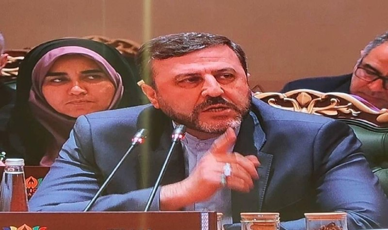

ٖغریب‌آبادی در بریکس: امارات متجاوز است نه ایران؛۱۳۰ هزار هدف غیرنظامی مورد حمله با مشارکت امارات /مستندات را به شورای امنیت ارسال کرده‌ایم

غریب‌آبادی در پاسخ به ادعای وزیر مشاور امارات مبنی بر متجاوز بودن ایران، گفت:

🔹امارات خود متجاوز است، نه ایران. زیرا امارات نقش قابل توجهی در حمایت و تسهیل تجاوز نظامی علیه ایران ایفا کرده است.

🔹استناد به قطعنامه ۱۹۷۴ مجمع عمومی سازمان ملل؛ هر کشوری که به متجاوزین تسهیلات و خدمات دهد، اقدامش برابر با تجاوز است، نه صرفا کمک به متجاوز.

🔹ایران به تمامی پایگاه‌های آمریکا و تأسیسات مرتبط با آمریکا در امارات حمله کرد. این اقدام مطابق با منشور ملل متحد و در چارچوب حق دفاع مشروع بود. ایران پیش از حمله، به امارات هشدار داده بود که در صورت کمک به متجاوز، تأسیساتشان هدف قرار می‌گیرد.

🔹در جریان تجاوز با مشارکت امارات، ۱۳۰ هزار هدف غیرنظامی مورد حمله قرار گرفت و بیش از ۴ هزار غیرنظامی به شهادت رسیدند.

🫆:Tony

📌 @persian_trend_official
پرشین ترند | متفاوت‌ترین کانال نظامی

## Persian_Trend_Official — post 14146

  

🔴 روسیه یکی از سنگین‌ترین حملات خود را علیه اوکراین انجام داد 💢گزارش‌ها حاکی است روسیه طی ۲۴ ساعت گذشته یکی از بزرگ‌ترین حملات هوایی خود از آغاز جنگ را علیه اوکراین انجام داده است. 💢بر اساس اطلاعات منتشرشده: ▪️ بیش از ۱۴۰۰ پهپاد در این حمله استفاده شده…

## Persian_Trend_Official — post 14143

🔴 مشاهده سامانه پدافندی چینی در دست سرباز اوکراینی

💢تصاویری منتشر شده که یک سرباز اوکراینی را در حال استفاده از سامانه پدافند هوایی دوش‌پرتاب «اف‌ان-۱۶» ساخت چین نشان می‌دهد.

▪️ «اف‌ان-۱۶» یک موشک دوش‌پرتاب کوتاه‌برد ضداهداف هوایی است

▪️ این سامانه برای مقابله با:

بالگردها
پهپادها
و هواگردهای کم‌ارتفاع طراحی شده است.

نحوه رسیدن این سامانه چینی به نیروهای اوکراینی مشخص نیست و تاکنون توضیح رسمی درباره آن منتشر نشده است.

🫆:Tony

📌 @persian_trend_official
پرشین ترند | متفاوت‌ترین کانال نظامی

## Persian_Trend_Official — post 14142

  <a href="telegram/content/Persian_Trend_Official_14142_1778776685.mp4" target="_blank">🎬 Download video</a>

💢فرمانده سنتکام، برد کوپر:

💢کار ما آماده بودن است و ما آماده‌ایم
مذاکرات حساس ادامه دارد

🫆:Tony

📌 @persian_trend_official
پرشین ترند | متفاوت‌ترین کانال نظامی

## Persian_Trend_Official — post 14141

  

🔴 روسیه زیردریایی‌های هسته‌ای «بوری» را با تور ضدپهپاد پوشاند

💢تصاویر ماهواره‌ای جدید نشان می‌دهد روسیه دو زیردریایی هسته‌ای کلاس «بوری» را در پایگاه کامچاتکا در اقیانوس آرام به‌طور کامل با تورهای ضدپهپادی پوشانده است.

🔹بر اساس گزارش‌ها:

▪️ این پایگاه حدود ۷۴۰۰ کیلومتر با اوکراین فاصله دارد

▪️ برای نخستین‌بار کل بدنه زیردریایی‌ها، نه فقط اسکله یا برجک آن‌ها، زیر پوشش تور قرار گرفته است

▪️ این اقدام احتمالاً با هدف مقابله با تهدید پهپادها انجام شده است

🔹زیردریایی‌های کلاس «بوری» بخشی از مهم‌ترین توان هسته‌ای دریایی روسیه محسوب می‌شوند و هرکدام توان حمل:

▪️ ۱۶ موشک بالستیک قاره‌پیما با چندین کلاهک هسته‌ای مستقل را دارند.

💢این اقدام نشان می‌دهد نگرانی روسیه از تهدید پهپادها اکنون حتی به پایگاه‌های راهبردی هسته‌ای در دوردست‌ترین مناطق این کشور نیز رسیده است.

🫆:Tony

📌 @persian_trend_official
پرشین ترند | متفاوت‌ترین کانال نظامی

## Persian_Trend_Official — post 14140

🔴 شی جین‌پینگ: روابط چین و آمریکا مهم‌ترین رابطه دوجانبه جهان است

💢رئیس‌جمهور چین اعلام کرد روابط پکن و واشینگتن مهم‌ترین رابطه دوجانبه در جهان محسوب می‌شود و دو کشور باید از تقابل پرهیز کنند.

🔹شی جین‌پینگ پس از دیدار با دونالد ترامپ گفت:

▪️ چین و آمریکا بیشترین منفعت را از همکاری مشترک می‌برند

▪️ دو کشور در صورت تقابل، متحمل خسارت خواهند شد

▪️ پکن و واشینگتن باید شریک باشند، نه رقیب

🔹او همچنین افزود:

▪️ در دیدار با ترامپ درباره روابط دوجانبه و تحولات منطقه‌ای و جهانی گفت‌وگوهای عمیقی انجام شده است

▪️ دو طرف بر ایجاد روابطی «سازنده و با ثبات راهبردی» توافق کرده‌اند

▪️ هدف از این رویکرد، کمک به صلح، ثبات و توسعه پایدار در جهان عنوان شده است

🫆:Tony

📌 @persian_trend_official
پرشین ترند | متفاوت‌ترین کانال نظامی

## Persian_Trend_Official — post 14139

  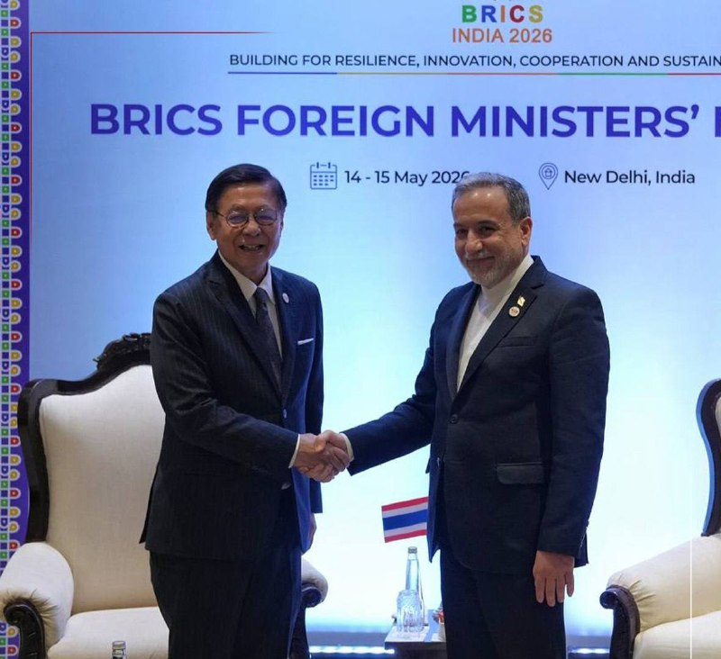

🔴 طوفان مرگبار در هند؛ دست‌کم ۸۹ کشته 💢تصاویر منتشرشده از ایالت اوتار پرادش هند، شدت طوفان و بادهای سهمگین در این منطقه را نشان می‌دهد 💢 خبرگزاری رویترز گزارش داده طوفان شدید در ایالت اوتار پرادش هند دست‌کم ۸۹ تا ۱۰۴ کشته برجا گذاشته است. ▪️ در ویدئوهای…

## Persian_Trend_Official — post 14137

  <a href="telegram/content/Persian_Trend_Official_14137_1778776687.mp4" target="_blank">🎬 Download video</a>

🔴 طوفان مرگبار در هند؛ دست‌کم ۸۹ کشته

💢تصاویر منتشرشده از ایالت اوتار پرادش هند، شدت طوفان و بادهای سهمگین در این منطقه را نشان می‌دهد

💢 خبرگزاری رویترز گزارش داده طوفان شدید در ایالت اوتار پرادش هند دست‌کم ۸۹ تا ۱۰۴ کشته برجا گذاشته است.

▪️ در ویدئوهای منتشرشده از شهر بریلی، لحظه بلند شدن یک مرد توسط شدت باد دیده می‌شود

️▪️طبق گزارش‌ها، آن مرد همراه با سقف فلزی توسط باد به هوا پرتاب شد اما زنده مانده و دچار شکستگی دست و پا شده است.

🫆:Tony

📌 @persian_trend_official
پرشین ترند | متفاوت‌ترین کانال نظامی

## Persian_Trend_Official — post 14136

  <a href="telegram/content/Persian_Trend_Official_14136_1778776688.webm" target="_blank">🎬 Download video</a>

🔴 چین تولید جنگنده پنهانکار «جی-۲۰» را با کارخانه تمام‌خودکار افزایش داد

💢گزارش‌ها حاکی است چین به‌صورت بی‌سروصدا بهره‌وری تولید پیشرفته‌ترین جنگنده پنهانکار خود را بیش از دو برابر کرده است.

🔹بر اساس گزارش «ساوت چاینا مورنینگ پست»:

▪️ یکی از کارخانه‌های چنگدو به یک «کارخانه تاریک» تمام‌خودکار تبدیل شده است

▪️ در این مجموعه، ماشین‌ها و خودروهای خودران مبتنی بر هوش مصنوعی تقریباً به‌صورت ۲۴ ساعته فعالیت می‌کنند

▪️ به‌دلیل خودکار بودن فرایندها، نیاز چندانی به روشنایی و نیروی انسانی وجود ندارد

💢این کارخانه اکنون قطعات ساختاری جنگنده پنهانکار «جی-۲۰» ملقب به «اژدهای قدرتمند» را تولید می‌کند؛ جنگنده‌ای که از آن به‌عنوان رقیب چینی «اف-۲۲» آمریکا یاد می‌شود.

🔹بر اساس این گزارش:

▪️ استفاده گسترده از اتوماسیون باعث کاهش هزینه تولید شده است

▪️ وابستگی به نیروی انسانی شبانه‌روزی کاهش یافته

▪️ تولید انبوه جنگنده «جی-۲۰» از سال ۲۰۲۰ آغاز شده است

🫆:Tony

📌 @persian_trend_official
پرشین ترند | متفاوت‌ترین کانال نظامی

## Persian_Trend_Official — post 14135

  

اکانت کاخ سفید در شبکه ایکس:
تاریخ در حرکت است.

☆Phantom☆

📌 @persian_trend_official
پرشین ترند | متفاوت‌ترین کانال نظامی

## Persian_Trend_Official — post 14134

خدارو شکر دیگه کم کم هر ننه قمری فاز کوسه برداشته و میخواد به حساب دیگران رسیدگی کنه! جناب کریم شیره ای، شما اگر خیلی حساب و کتاب سرت میشه برو پول بساطت رو با ساقی محل حساب کن .

## Persian_Trend_Official — post 14131

  <a href="telegram/content/Persian_Trend_Official_14131_1778776689.webm" target="_blank">🎬 Download video</a>

کانال هذیان گو اخبار سوریه، با محتوایی سمی و تخیلی ۶۰۰ میلیون از وزارت نفت به اسم تبلیغات !!! هزینه میگیره !

ادعای خط انرژی در مورد دریافتی ۶۰۰ میلیون تومانی مالک کانال ارزشی، قلم به مزد و دروغ پرداز اخبار سوریه از پتروشیمی آریا

در این کشور برای هر نوع چریدن و هدر دادن بیت المال پول کافی وجود دارد اما برای خرج های اصلی مملکت یا ساخت ارتشی توانمند دچار کسری بودجه ایم!

https://farsnews.ir/Khate_energy/1778660394098111565/%D8%A7%D8%B2-%D8%A7%D8%AE%D8%A8%D8%A7%D8%B1-%D8%B3%D9%88%D8%B1%DB%8C%D9%87-%D8%AA%D8%A7-%D9%88%D8%B2%D8%A7%D8%B1%D8%AA-%D9%86%D9%81%D8%AA-%D9%88-%D9%BE%D8%AA%D8%B1%D9%88%D8%B4%DB%8C%D9%85%DB%8C-%D8%A2%D8%B1%DB%8C%D8%A7%D8%B3%D8%A7%D8%B3%D9%88%D9%84-%DA%86%D8%B1%D8%A7-%D8%A8%D9%87-%D8%AE%D8%B7-%D8%A7%D9%86%D8%B1%DA%98%DB%8C-%D8%AD%D9%85%D9%84%D9%87-%D9%85%DB%8C-%DA%A9%D9%86%D9%86%D8%AF

📌 @persian_trend_official
پرشین ترند | متفاوت‌ترین کانال نظامی

## RadioFarda — post 157187

  <a href="https://t.me/radiofarda/157187" target="_blank">📎 Download file</a>

📻بشنوید: ایستگاه ۱۹ با رادیوفردا، ۲۴ اردیبهشت ۱۴۰۵

@RadioFarda

## RadioFarda — post 157186

  <a href="https://t.me/radiofarda/157186" target="_blank">📎 Download file</a>

🔸در این کافه فردا به بحران صنعت گردشگری در دوران آتش‌بس، ازدواج جان‌فداها در میدان امام حسین تهران، حواشی مسابقات یوروویژن در اروپا، صحبت‌های عجیب یک نماینده مجلس در مورد بمب‌های «لازمان» و فرافکنی سخنگوی دولت در رابطه با اینترنت پرو می‌پردازیم.

🔸 برای تماس با ما می‌توانید به شناسه کافه فردا در تلگرام صوت و متن بفرستید.

📻 کافه فردا

## RadioFarda — post 157185

🔸دونالد ترامپ، رئیس‌جمهور آمریکا، روز پنجشنبه و بعد از دیدار با همتای چینی خود در پکن گفت که شی جین‌پینگ پیشنهاد داده است برای توافق با ایران و تضمین عبور و مرور کشتی‌ها از تنگه هرمز کمک کند و وعده داد تجهیزات نظامی به ایران ارسال نکند. 🔸او در گفت‌وگویی اختصاصی…

## RadioFarda — post 157184

  

🔸دونالد ترامپ، رئیس‌جمهور آمریکا، روز پنجشنبه و بعد از دیدار با همتای چینی خود در پکن گفت که شی جین‌پینگ پیشنهاد داده است برای توافق با ایران و تضمین عبور و مرور کشتی‌ها از تنگه هرمز کمک کند و وعده داد تجهیزات نظامی به ایران ارسال نکند.

🔸او در گفت‌وگویی اختصاصی با شان هنیتی، مجری شبکه فاکس‌نیوز، گفت: «رئیس‌جمهور شی مایل است توافقی حاصل شود. او واقعاً دوست دارد توافقی انجام شود. و گفت: “اگر بتوانم به هر شکلی کمک کنم، خوشحال می‌شوم کمک کنم.”»

@RadioFarda

## RadioFarda — post 157183

🔸برد کوپر، فرمانده ستاد فرماندهی مرکزی ایالات متحده (سنتکام)، اعلام کرد که صنایع موشکی، پهپادی و دریایی ایران «۹۰ درصد تضعیف شده‌اند.» 🔸او در یک جلسه استماع در سنای آمریکا گفت: «تهدید ایران به‌طور قابل‌توجهی تضعیف شده و این کشور دیگر مانند گذشته، در هیچ حوزه‌ای،…

## RadioFarda — post 157182

  

🔸برد کوپر، فرمانده ستاد فرماندهی مرکزی ایالات متحده (سنتکام)، اعلام کرد که صنایع موشکی، پهپادی و دریایی ایران «۹۰ درصد تضعیف شده‌اند.»

🔸او در یک جلسه استماع در سنای آمریکا گفت: «تهدید ایران به‌طور قابل‌توجهی تضعیف شده و این کشور دیگر مانند گذشته، در هیچ حوزه‌ای، قادر به تهدید شرکای منطقه‌ای یا ایالات متحده نیست. آنها به‌شدت تضعیف شده‌اند.»

🔸کوپر اشاره کرد که نیروهای نیابتی مسلح ایران در ۳۰ ماه پیش از جنگ اخیر، بیش از ۳۵۰ حمله علیه نیروها و دیپلمات‌های آمریکایی انجام داده بودند؛ به‌طور میانگین هر سه روز یک حمله، که در نتیجه آن چهار سرباز آمریکایی کشته شدند.

🔸این جنگ روز نهم اسفند سال گذشته با حملات آمریکا و اسرائیل به ایران آغاز شد و طی آن علی خامنه‌ای و شماری از فرماندهان و مقام‌های ارشد جمهوری اسلامی کشته شدند. ایران نیز در مقابل حملات موشکی به اسرائیل و شماری از کشورهای خاورمیانه انجام داد و تنگه هرمز را مسدود کرد.

@RadioFarda

## RadioFarda — post 157181

  

🔸رئیس فدراسیون فوتبال ایران می‌گوید هنوز برای هیچیک از اعضای تیم ملی برای شرکت در جام جهانی ۲۰۲۶ ویزا صادر نشده است.

🔸خبرگزاری جمهوری اسلامی، ایرنا، به نقل از مهدی تاج نوشته است: «فردا یا پس‌فردا جلسه‌ای سرنوشت‌ساز با فیفا خواهیم داشت. آن‌ها باید به ما تضمین بدهند، زیرا هنوز مسئله ویزا حل نشده.»

🔸او افزود: «روایتی از سوی طرف مقابل مبنی بر اینکه به چه کسانی ویزا داده‌اند، دریافت نکرده‌ایم. هنوز هیچ ویزایی نیامده است.»

🔸رئیس فدراسیون فوتبال ایران که در روزهای اخیر شرط‌هایی برای حضور در جام جهانی از جمله لزوم صدور ویزا برای کل اعضای تیم و کادر فنی اعلام کرده بود، همچنین گفت: «ما در حال آماده‌سازی برای جام جهانی هستیم، اما منتظر رفتار طرف مقابل هستیم.»

🔸کاروان تیم ملی فوتبال روز چهارشنبه به ترکیه رفت تا بعد از یک اردوی چند روزه عازم آمریکا به عنوان میزبان مسابقات تیم ایران شود.

🔸رئیس فیفا پیش‌تر چند بار گفته است که ایران قطعا در جام جهانی شرکت خواهد کرد. دونالد ترامپ، رئیس‌جمهور ایالات متحده، نیز اعلام کرده که مشکلی با حضور ایران ندارد.

@RadioFarda

## RadioFarda — post 157180

  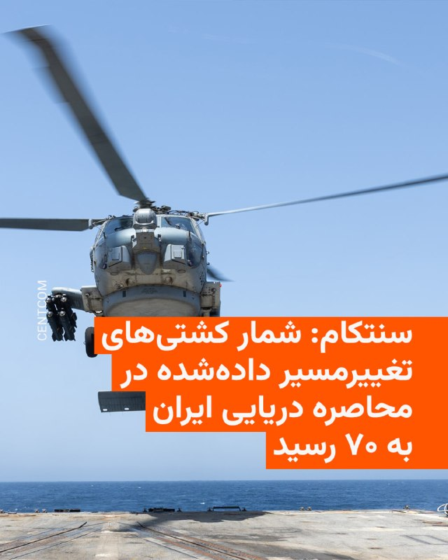

🔸ستاد فرماندهی مرکزی ایالات متحده، سنتکام، روز پنجشنبه ۲۴ اردیبهشت با انتشار تصویری از عملیات ناو آمریکایی «یو‌اس‌اس تراکستون» در دریای عرب اعلام کرد که نیروهای این فرماندهی تاکنون ۷۰ کشتی تجاری را در چارچوب محاصره دریایی ایران وادار به تغییر مسیر کرده‌اند.

🔸سنتکام همچنین اعلام کرد چهار شناور نیز برای اجرای محاصره «از کار انداخته» شده‌اند.

🔸سنتکام پیش‌تر گفته بود در چارچوب این عملیات، به ۱۵ کشتی حامل کمک‌های بشردوستانه اجازه عبور داده شده و نیروهای آمریکایی برای وادار کردن برخی کشتی‌ها به تغییر مسیر، از تماس رادیویی و شلیک تیر هشدار نیز استفاده کرده‌اند.

🔸آمریکا پس از بی‌نتیجه ماندن مذاکرات مستقیم با ایران، محاصره دریایی بنادر جمهوری اسلامی را آغاز کرد؛ در حالی که ایران از ابتدای جنگ تنگه هرمز را مسدود کرده است.

@RadioFarda

## RadioFarda — post 157179

  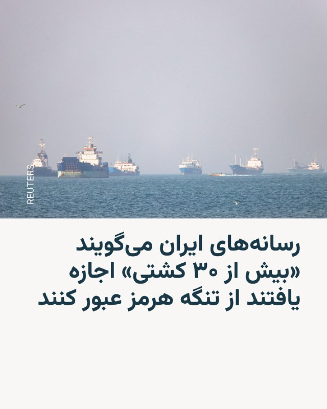

🔸رسانه‌های حکومتی ایران روز چهارشنبه گفتند نیروهای نظامی جمهوری اسلامی از شامگاه گذشته به گروهی از کشتی‌های چینی اجازه عبور از تنگه هرمز را داده‌اند.

🔸ساعتی بعد صداوسیمای جمهوری اسلامی اعلام کرد «بیش از ۳۰ کشتی» اجازه عبور از این آبراه را یافته‌اند، اما مشخص نکرد که آیا همه آنها چینی بوده‌اند یا نه.

🔸خبرگزاری‌های فارس و تسنیم، هردو نزدیک به سپاه پاسداران، به نقل از منابع آگاه خبر دادند که «با تصمیم جمهوری اسلامی» امکان عبور تعدادی از کشتی‌های چینی از تنگه هرمز «با رعایت پروتکل مدیریت ایرانی تنگه» فراهم شده است.

🔸این اتفاق همزمان با حضور دونالد ترامپ، رئیس‌جمهور آمریکا، در چین رخ داده است. کاخ سفید گفته واشینگتن و پکن توافق کردند که تنگه هرمز باید برای حفظ جریان آزاد انرژی باز بماند و رئیس‌جمهور چین مخالفت چین با «نظامی‌سازی» این آبراه و هرگونه تلاش برای دریافت عوارض برای استفاده از آن را اعلام کرده است.

🔸ایران از زمان آغاز حملات آمریکا و اسرائیل در نهم اسفند سال گذشته، تنگه هرمز را مسدود کرده و آمریکا نیز بعد از آتش‌بس دست به محاصره دریایی ایران زده است.

@RadioFarda

## RadioFarda — post 157178

🔸امید برزگری، مربی سازمان امداد و نجات هلال احمر، در یک گفت‌وگوی تصویری با خبر آن‌لاین دربارۀ سگ‌های امداد و نجات گفت «این سگ‌ها پست نیستند؛ فرشته‌اند، فرشتۀ نجات».

🔸آقای برزگری که به همراه همکارش و دو سگ نجات خود در این گفت‌وگو شرکت کرده بود این جمله را در پاسخ به گزارشی از صداوسیمای جمهوری اسلامی گفت که از مردم پرسیده بود «چه کسی از سگ‌های هلال احمر پست‌تر است».

🔸جمعیت هلال احمر ایران روز سه‌شنبه ۲۵ فروردین اعلام کرد که سگ‌های زنده‌یاب این سازمان، از ابتدای جنگ اخیر، در ۷۹۲ عملیات جستجو و نجات شرکت کردند که از این تعداد، در ۷۱۱ عملیات موفق به زنده‌یابی و جستجوی پیکر کشته‌شدگان شدند.

🔸سگ‌های تجسس هلال احمر در جنگ ۱۲ روزه اسرائیل و ایران هم نقش مهمی ایفا کردند و شماری از سگ‌های زنده‌یاب هلال احمر زخمی و دست کم دو قلاده از آن‌ها در جریان عملیات کشته شدند.

🔸استفاده از سگ‌ها در مواقع جنگ و حوادث غیرمترقبه در ایران در حالی است که داشتن این حیوان خانگی از سوی مقامات جمهوری اسلامی نماد «فرهنگ غربی» توصیف و همواره منع می‌شود.
@RadioFarda

## RadioFarda — post 157177

🔸رسانه‌های ایران می‌گویند وزیر خارجه جمهوری اسلامی در نشست بریکس در دهلی‌نو، امارات متحده عربی را به «دخالت مستقیم» در عملیات نظامی علیه کشورش متهم کرد. 🔸این تنش یک روز پس از آن رخ داد که امارات ادعای بنیامین نتانیاهو، نخست‌وزیر اسرائیل، مبنی بر سفر به این…

## RadioFarda — post 157176

  

🔸رسانه‌های ایران می‌گویند وزیر خارجه جمهوری اسلامی در نشست بریکس در دهلی‌نو، امارات متحده عربی را به «دخالت مستقیم» در عملیات نظامی علیه کشورش متهم کرد.

🔸این تنش یک روز پس از آن رخ داد که امارات ادعای بنیامین نتانیاهو، نخست‌وزیر اسرائیل، مبنی بر سفر به این کشور حاشیه خلیج فارس در جریان جنگ ایران را رد کرد.

🔸خبرگزاری مهر به نقل از عراقچی نوشت: «من به خاطر حفظ وحدت، در سخنرانی‌ام در بریکس نامی از امارات نبردم. اما حقیقت این است که امارات مستقیماً در تجاوز علیه کشور من دخیل بود. وقتی حملات آغاز شد، آن‌ها حتی آن را محکوم هم نکردند.»

🔸رسانه‌های ایرانی مشخص نکردند که نماینده امارات چه اظهاراتی در این نشست مطرح کرده بود.

🔸بر اساس این گزارش‌ها، عراقچی همچنین گفت که «نه پایگاه‌های آمریکا و نه اتحاد با اسرائیل برای امارات امنیت به همراه نیاورده و این کشور باید در سیاست خود نسبت به ایران تجدیدنظر کند».

@RadioFarda

## RadioFarda — post 157175

  

🔸مرکز عملیات تجارت دریایی بریتانیا روز پنجشنبه ۲۴ اردیبهشت اعلام کرد پس از وقوع حادثه‌ای دریایی در شمال شرقی امارات متحده عربی، «افراد غیرمجاز» کنترل یک کشتی در لنگرگاه را به دست گرفته‌اند و این کشتی اکنون به سوی آب‌های سرزمینی ایران در حرکت است.

🔸این نهاد گفت گزارشی دربارهٔ حادثه دریایی در ۳۸ مایل دریایی (حدود ۷۰ کیلومتری) شمال شرقی بندر فجیره امارات متحده عربی دریافت کرده و پس از آن، کشتی به تصرف درآمده و مسیر آن به سوی آب‌های سرزمینی ایران تغییر داده شده است.

🔸از مشخصات این کشتی و هویت افرادی که کنترل آن را در دست گرفته‌اند، هنوز اطلاعاتی منتشر نشده است.
@RadioFarda

## RadioFarda — post 157173

  

🔸وزارت خارجه هند حمله به یک کشتی با پرچم این کشور را که می‌گوید روز چهارشنبه ۲۳ اردیبهشت در نزدیکی سواحل عمان رخ داده است، «غیرقابل قبول» خواند.

🔸وزارت خارجه هند در بیانیه‌ای افزود که هدف قرار دادن کشتی‌های تجاری و دریانوردان غیرنظامی باید متوقف شود و از مقام‌های عمان برای نجات خدمه تشکر کرد.

🔸شرکت امنیت دریایی «ونگارد» نام این کشتی را «ام‌اس‌وی حاج علی» اعلام کرده و گفته است که این لنج چوبی ۵۴ متری در نزدیکی سواحل لیما در عمان، در جنوب تنگه هرمز، پس از وقوع انفجار غرق شده است.

🔸بر اساس این گزارش، کشتی در حال انتقال دام از بندر بربره در سومالی‌لند به شارجه در امارات متحده عربی بوده که احتمالاً هدف حمله پهپادی یا موشکی قرار گرفته است.

🔸حکومت ایران از نهم اسفند پارسال و شروع جنگ آمریکا و اسرائیل با ایران عملاً تنگه هرمز را مسدود کرده و آمریکا نیز با وجود آتش‌بس شکننده‌ای که از ۱۹ فروردین برقرار شده، محاصره دریایی بنادر ایران را ادامه داده است.

@RadioFarda

## RadioFarda — post 157172

  <a href="https://t.me/radiofarda/157172" target="_blank">📎 Download file</a>

📻بشنوید: ساعت ۱۴ با رادیوفردا، ۲۴ اردیبهشت ۱۴۰۵‌

@Radiofarda

## RadioFarda — post 157171

لِگو، هیپ‌هاپ و هوش مصنوعی؛ ایران چگونه بر افکار عمومی غرب اثر می‌گذارد

🔸جنگ ایران درس‌های تازه‌ای دربارهٔ نحوهٔ استفاده از هوش مصنوعی به‌عنوان ابزاری در جنگ‌های مدرن و حکمرانی دولتی آشکار کرده است. حکومت ایران به‌طور فزاینده‌ای تبلیغات تولیدشده با هوش مصنوعی، عملیات سایبری، جنگ روانی و کارزارهای نفوذ را در قالب یک اکوسیستم دیجیتال پیچیده برای مخاطبان داخلی و خارجی در هم آمیخته است.

🔸از ویدئوهای وایرال‌شده به سبک لگو و قطعات هیپ‌هاپ ساخته‌شده با هوش مصنوعی گرفته تا عملیات پنهانی در شبکه‌های اجتماعی و تصاویر جعلی میدان جنگ، تاکتیک‌های حکومت ایران برای نفوذ بیشتر به‌سرعت در حال تحول است و بیش از پیش مخاطبان غربی را هدف قرار می‌دهد.

🔸رادیو اروپای آزاد/رادیو آزادی برای بررسی چگونگی استفادهٔ جمهوری اسلامی از هوش مصنوعی در تبلیغات و جنگ اطلاعاتی، با مکس لِسِر، تحلیلگر ارشد تهدیدهای نوظهور در مرکز نوآوری سایبری و فناوری بنیاد دفاع از دموکراسی‌ها، گفت‌وگو کرده است.

🔸 گزارش کامل را در وب‌سایت رادیو فردا می‌توانید بخوانید.

@RadioFarda

## RadioFarda — post 157170

  

🔸گزارش‌ها از ایران حاکی از بازداشت مهدی شفاخواه، فعال اجتماعی و مربی داوطلب کودکان کار، توسط وزارت اطلاعات است.

🔸شماری از رسانه‌های حقوق بشری از جمله وب‌سایت هه‌نگاو نوشته‌اند که آقای شفاخواه «در پی یورش نیروهای وزارت اطلاعات جمهوری اسلامی ایران به منزل شخصی‌اش بازداشت و به مکان نامعلومی منتقل شد».

🔸بازداشت او عصر روز سه‌شنبه ۲۲ اردیبهشت صورت گرفته و مأموران وزارت اطلاعات، ضمن بازداشت این فعال اجتماعی اقدام به تفتیش منزل و ضبط لوازم شخصی او نیز کرده‌اند.

🔸هنوز از دلایل بازداشت، اتهامات انتسابی و محل دقیق نگهداری شفاخواه هیچ اطلاع دقیقی در دسترس نیست و پیگیری‌های خانواده او برای کسب اطلاع از وضعیت سلامت او بی‌نتیجه مانده است.

🔸مهدی شفاخواه طی سال‌های اخیر به صورت داوطلبانه در مناطق محروم و حاشیه‌نشین فعالیت داشته و از طریق آموزش ورزش و مهارت‌های اجتماعی به کودکان کار و نوجوانان آسیب‌پذیر، در راستای کاهش آسیب‌های اجتماعی از جمله اعتیاد و بزهکاری تلاش می‌کرد.

🔸او برادر رضا شفاخواه، وکیل دادگستری و فعال حقوق کودکان و زندانیان سیاسی، است.

@RadioFarda

## RadioFarda — post 157169

  <a href="https://t.me/radiofarda/157169" target="_blank">📎 Download file</a>

🔸اپیزود ۵۲ پادکست لایه هفتم | گزارش تهدیدهای امنیت سایبری در نیمه دوم ۱۴۰۴

🔸در این اپیزود از بدافزارهای اندرویدی که برای رصد فعالیت‌های آنلاین در گوشی کاربران پنهان می‌شوند صحبت می‌کنیم، همین‌طور از شکل‌های تازه جعل هویت، داکسینگ (یا همان افشای اطلاعات شخصی) و حتی مواردی که حمله سایبری می‌توانسته مقدمه‌ای برای ربایش فیزیکی افراد باشد.

🔸همچنین با حضور داوود سجادی و امیر رشیدی، گزارش جدید تهدیدهای امنیت سایبری ایران در نیمه دوم سال پرالتهاب ۱۴۰۴ را بررسی می‌کنیم. همچنین در ادامه، اصول و راهکارهای عملی برای مقابله با این تهدیدات و محافظت از خود را مرور می‌کنیم.

🔸فردا پادکست 🎧

## RadioFarda — post 157168

  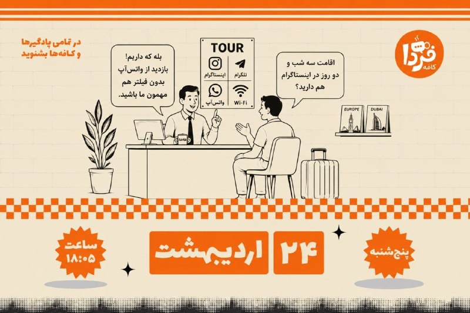

📷 Photo

## RadioFarda — post 157167

  

🔸 کاخ سفید اعلام کرد دونالد ترامپ، رئیس‌جمهور آمریکا، و شی جین‌پینگ، رئیس‌جمهور چین، در دیدار خود درباره گسترش همکاری‌های اقتصادی، باز ماندن تنگه هرمز و جلوگیری از دستیابی ایران به سلاح هسته‌ای گفت‌وگو و توافق کردند.

🔸 کاخ سفید روز پنجشنبه ۲۴ اردیبهشت در بیانیه‌ای اعلام کرد که دو طرف دربارهٔ افزایش دسترسی شرکت‌های آمریکایی به بازار چین و افزایش سرمایه‌گذاری چین در صنایع آمریکا گفت‌وگو کردند و شماری از مدیران بزرگ‌ترین شرکت‌های آمریکایی نیز در بخشی از این دیدار حضور داشتند.

🔸 کاخ سفید افزود دو کشور همچنین توافق کردند که تنگه هرمز باید برای حفظ جریان آزاد انرژی باز بماند.

🔸 بر اساس این بیانیه، شی جین‌پینگ مخالفت چین با «نظامی‌سازی» تنگه هرمز و هرگونه تلاش برای دریافت عوارض برای استفاده از آن را اعلام کرد و نسبت به خرید بیشتر نفت آمریکا برای کاهش وابستگی چین به این مسیر در آینده ابراز علاقه‌مندی کرد.

🔸 کاخ سفید همچنین اعلام کرد که آمریکا و چین توافق دارند ایران «هرگز» نباید به سلاح هسته‌ای دست یابد.

@RadioFarda

## IranianMinds — post 20138

  

🔴اکانت اسرائیل به فارسی:

۳۰۰۰ سال پیش، حضرت داوود اورشلیم را به پایتختی خود برگزید.
۵۹ سال پیش با آزادی بخش شرقی شهر، پایتخت یهودیان زیر پرچم اسرائیل دوباره یکپارچه گشت.
این شهر قلب تپنده یهودیان و بخشی جدانشدنی از اسرائیل است.

روز اورشلیم خجسته باد.

@IranianMinds

## IranianMinds — post 20137

  <a href="telegram/content/IranianMinds_20137_1778776697.mp4" target="_blank">🎬 Download video</a>

ترامپ:

شی مایل است شاهد انجام یک معامله باشد. او گفت: «اگر بتوانم کمکی داشته باشم، دوست دارم کمک کنم.»

هر کسی که این مقدار نفت می‌خرد، دوست دارد تنگه هرمز را باز ببیند.

@IranianMinds

## IranianMinds — post 20136

🔴سنتکام:

امارات، بحرین، عربستان، کویت، اردن و اسرائیل در عملیات آمریکا شرکت کردند.

@IranianMinds

## IranianMinds — post 20135

🔴حمید رسایی:

دولت می‌خواهد قیمت بنزین را تا ۲۰ هزار تومان افزایش بدهد.

@IranianMinds

## IranianMinds — post 20134

🔴ترامپ به فاکس‌نیوز:

رهبر چین پیشنهاد داده است که در موضوع ایران کمک کند و همچنین وعده داده که به ایران تجهیزات نظامی منتقل نکند. او می‌خواهد که تنگه هرمز باز بماند.

@IranianMinds

## IranianMinds — post 20133

  <a href="telegram/content/IranianMinds_20133_1778776699.mp4" target="_blank">🎬 Download video</a>

🔴 فرمانده سنتکام، دریاسالار برد کوپر:

مذاکرات با ریسک بالا ادامه دارد.
وظیفه ما این است که آماده باشیم و هستیم.

@IranianMinds

## IranianMinds — post 20132

🔴 شرکت هواپیمایی ایتالیایی ITA Airways بازگشت پروازهای خود به اسرائیل را تا اول جولای به تعویق انداخت

@IranianMinds

## IranianMinds — post 20131

🔴 فرمانده سنتکام :

ما هر لحظه آماده حرکت علیه ایران هستیم

@IranianMinds

## IranianMinds — post 20130

🔴 وزیر خزانه‌داری آمریکا:
طی سه روز گذشته هیچ بارگیری در تاسیسات نفتی ایران انجام نشده است.

@IranianMinds

## IranianMinds — post 20129

  

😤دنبال یه سایت شرط بندی بین المللی بودی که به ایرانیا خدمات بده؟!
⛔

👍دربی بت همون انتخاب  100%

💎ویژگی های سایت جهانی Derby Bet:

⬅️امکان شارژ امن با کارت بانکی

⬅️واریز اول دوبل شارژ می شوید(بونوس۱۰۰٪)

⬅️پر اپشن ترین سایت فعال در ایران

⬅️تسویه حساب کمتر از 5 دقیقه

⬅️برگشت بخشی از باخت به صورت هفتگی

🚨کد هدیه ثبت نام:GG007

⚠️برای دانلود اپلکیشن کلیک کنید
👉
ge24

🔔کانال دربی بت :

🪙https://t.me/+aCbq7yy8QY80NzQ0

## IranianMinds — post 20128

  

🔴کاخ سفید:

هر دو کشور ( چین و آمریکا ) توافق کردند که ایران هرگز نمی‌تواند سلاح هسته‌ای داشته باشد.

@IranianMinds

## IranianMinds — post 20127

  

لامین یامال بازیکن چپول بارسلونا که تو‌ جشن قهرمانی بارسا پرچم فلسطینو گرفته دستش @IranianMinds

## IranianMinds — post 20126

ShirOKhorshid-2026.05.14.apk

## IranianMinds — post 20125

ShirOKhorshid-2026.05.14.apk

## IranianMinds — post 20124

  <a href="https://t.me/IranianMinds/20124" target="_blank">📎 Download file</a>

آموزش اتصال به اینترنت بین الملل:

🔺 مهم: اگر این نسخه رو نصب کنید دیگه دردسر ستاپ کردن MITM و... ندارید!
این نسخه حدودا یک ساعت پیش توسط برنامه‌نویس شیر و خورشید آپدیت شد و به راحتی می‌تونید طبق این آموزش بهش وصل بشید:
1- وارد اپلیکیشن شیر و خورشید(آخرین نسخه که امروز منتشر شده) می‌شید
2- وارد بخش Options میشید از نوار بالا
3- روی More Options کلیک میکنید
4- گزینه‌ی Connection Protocol رو قرار میدید روی CDN Fronting
5- میرید و عادی کانکت میشید و به راحتی وصل میشه.

@IranianMinds

## IranianMinds — post 20123

  

🔴پست کاخ سفید در ایکس:
تاریخ در حرکت است.

@IranianMinds

## IranianMinds — post 20122

  

🔴 ببین کی داره اینو میگه…

دو روز ۱۸ و ۱۹ دی ۱۴۰۴، ۲۳۶ کودک رو کشتید.
۵۵۵ بچه رو هم بازداشت کردید.

آها یادم نبود کودکان غزه و فلسطین مال شماس.

@IranianMinds

## IranianMinds — post 20121

  

⚠️اوتباند موجود⚠️

🔋حداقل خرید 30GB

♾حداکثر محدودیتی نداره

50GB ➡️ 180

100GB ➡️140

200GB ➡️120

+500GB ➡️100

🧬 500 گیگ به بالا امکان تسویه روزانه نیز فراهم می باشد

⬅️دارای لود بالانس و اپتایم 99/9% بدون قعطی
⬅️تست موجود می باشد

جهت خرید و استعلام قیمت🟡

@xan_vpnn

کانال:

https://t.me/+qNjExGEJztE2OGI0

## IranianMinds — post 20120

  

🔴بنر حامیان حکومت در تجمع دیشب تهران:
سید مجید نقطه‌زن، امتحانا نزدیکه، یه جایی‌رو زود بزن.

@IranianMinds

## IranianMinds — post 20119

  

ایلان ماسک به همراه پسرش در نشست پکن شرکت کرد.

@IranianMinds

## BBCPersian — post 281038

  

‌🔻دریاسالار برد کوپر، فرمانده سنتکام، طی یک جلسه استماع در مورد جنگ با ایران در سنای آمریکا گفت که توانایی ایران برای تهدید همسایگان خود و منافع ایالات متحده در منطقه به طور چشمگیری کاهش یافته است.

او گفت عملیات نظامی ما زیرساخت صنعتی توانمندی‌های موشکی، دریایی و ساخت پهپاد ایران را تا ۹۰ درصد تضعیف کرده و بازسازی نیروی دریایی این کشور دستکم یک نسل به طول می‌انجامد.

آقای کوپر در جلسه کمیته سنا گفت: «تهدید ایران به طور قابل توجهی کاهش یافته است و آنها دیگر به روش‌هایی که پیش از این قادر بودند، در همه حوزه‌ها، شرکای منطقه‌ای یا ایالات متحده را تهدید نمی‌کنند. آنها به طور قابل ملاحظه‌ای تضعیف شده‌اند.»

او در عین حال گفت ایران به خاطر وسعت و قابلیت‌هایش همچنان یک تهدید باقی مانده است.

📷Reuters
https://bbc.in/4dGZanU

@BBCPersian

## BBCPersian — post 281037

  <a href="telegram/content/BBCPersian_281037_1778776705.mp4" target="_blank">🎬 Download video</a>

🔻کارشناسان می‌گویند در پی جنگ با ایران و درگیری و مشغول شدن نیروهای دریایی با آن، دزدی دریایی در آبهای سومالی دوباره در حال افزایش است.

دزدان دریایی سومالی دست‌کم سه کشتی بزرگ تجاری را برای اخاذی و باج‌گیری ربوده‌اند. از جمله نفتکش آنر۲۵ که کاپیتانش اشاری سامادیکون اهل اندونزی است.

همسر کاپیتان می‌گوید که او به دزدان دریایی گفته که مسلمان است و از آنها خواسته به خاطر هم‌کیشی به او و خدمه‌اش رحم کنند.

@BBCPersian

## BBCPersian — post 281036

  

‌🔻مصطفی پوردهقان، دبیر دوم کمیسیون صنایع و معادن مجلس گفته است که مصوبه شورای عالی امنیت ملی در مورد اینترنت پرو در اجرا به «قلکی برای همراه اول، ایرانسل و رایتل» تبدیل شده است.

او در مورد انتخاب محمدرضا عارف، به عنوان رئیس ستاد ویژه ساماندهی فضای مجازی گفت که «مجلس در این مورد چیزی نمی‌داند» و این حکم مسعود پزشکیان، رئیس‌جمهور را «تزئينی» خوانده است.

به گفته این نماینده مجلس این قبیل اقدامات بیشتر جنبه «روانی » دارد و قرار نیست که «اتفاق خاصی» در این مورد بیفتد.

آقای پوردهقان همچنین گفته است که بدتر از قطعی اینترنت، تعطیلی مجلس است و اکنون مجلس با بسیاری از وزرای دولت به لحاظ نظارتی هیچ ارتباط خاصی درمورد عملکردشان ندارد که یکی از همین موارد موضوع اینترنت است و هنوز یک جلسه ویژه نداریم که فردی بیاید و شرایط را توضیح دهد.

بیش از ۷۰ روز است که دسترسی به اینترنت جهانی در ایران قطع شده است.

پس از اعتراضات دی ۱۴۰۴ و سپس جنگ آمریکا و اسرائیل با ایران، دسترسی به اینترنت جهانی به طور کامل قطع شد.

لینک خبر کامل:

📷NurPhoto via Getty Images
https://bbc.in/492rMp0

@BBCPersian

## BBCPersian — post 281035

  <a href="telegram/content/BBCPersian_281035_1778776707.mp4" target="_blank">🎬 Download video</a>

🔻‌‌‌دونالد ترامپ با هیئتی از مقامات سیاسی و تجاری از جمله چندین نفر از مدیران ارشد شرکت‌های بزرگ، مانند ایلان ماسک، موسس تسلا و اسپیس‌اکس، تیم کوک، مدیرعامل اپل و جنسن هوانگ، مدیر اجرایی انویدیا به چین سفر کرده است.

دونالد ترامپ و شی جین‌پینگ، رئیس‌جمهور چین حدود دو ساعت با هم مذاکره کردند که دو برابر مدت زمانی بود که در ابتدا برای آن برنامه‌ریزی شده بود. آقای ترامپ در پاسخ به خبرنگاران این گفتگوها را «عالی» توصیف کرد.

اما حضور مارکو روبیو، وزیر امور خارجه آمریکا حتی پیش از ورودش به چین هم خبرساز شده بود. آقای روبیو از سال ۲۰۲۰ تحت دو تحریم دولت چین است، چون در دورانی که سناتور ایالت فلوریدا بود مواضعی سرسختانه درباره هنگ‌کنگ، اقلیت مسلمان اویغور و حقوق بشر در چین داشت.

اما پکن از زمان انتصاب او به وزارت خارجه آمریکا راهکاری برای دور زدن تحریم‌های خود به کار می‌بندد. آنها بخش نخست نام خانوادگی روبیو را در زبان چینی با حرف «لو» می‌نویسند تا تحریم‌ها را اجرا نکنند و لغو هم نکرده باشند.

https://bbc.in/4wyYEzS
@BBCPersian

## BBCPersian — post 281034

🔻دولت اسرائیل از نیویورک‌تایمز به خاطر مقاله‌اش شکایت می‌کند

🔻دفتر نخست‌وزیری اسرائیل روز پنج‌شنبه با صدور بیانیه‌ای اعلام کرد که این کشور علیه روزنامه نیویورک تایمز به دلیل انتشار یادداشتی از نیکلاس کریستوف که شامل اتهاماتی مبنی بر سوءاستفاده جنسی جدی از فلسطینیان در زندان‌های اسرائیل بود، اقدام قانونی خواهد کرد.

مقاله کریستف با عنوان «سکوتی که تجاوز به فلسطینیان با آن روبرو می‌شود» روز دوشنبه ۱۱ مه در نیویورک‌تایمز منتشر شده است.

دفتر نخست‌وزیری اسرائیل که این اتهام را «یکی از زشت‌ترین و تحریف‌شده‌ترین دروغ‌هایی که تاکنون علیه دولت اسرائیل منتشر شده» خوانده و گفته که بنیامین نتانیاهو، نخست‌وزیر، و گیدعون سعر، وزیر خارجه، به مقامات دستور داده‌اند تا مقدمات طرح شکایت افترا علیه این نشریه را آغاز کنند.

روزنامه نیویورک‌تایمز روز چهارشنبه با انتشار بیانیه‌ای ضمن دفاع از انتشار این مطلب، اعلام کرده بود که روایت ۱۴ زن و مردی که در این مطلب مورد اشاره قرار گرفته‌اند راستی‌آزمایی و با روایت شاهدان دیگر مقایسه شده است.

https://bbc.in/49yqhit
@BBCPersian

## BBCPersian — post 281033

  <a href="telegram/content/BBCPersian_281033_1778776709.mp4" target="_blank">🎬 Download video</a>

🔻سرخط خبرهای روز پنجشنبه ۲۴ اردیبهشت ماه ۱۴۰۵

@BBCPersian

## BBCPersian — post 281032

🔻وزیر بهداشت بریتانیا در اعتراض به رهبری استارمر استعفا داد

🔻وس استریتینگ، وزیر بهداشت بریتانیا با انتشار استعفانامه خود در شبکه ایکس، نوشت که «اعتماد به رهبری» کی‌یر استارمر، نخست‌وزیر بریتانیا را «از دست داده‌» و ادامه حضورش در دولت را «غیراخلاقی و برخلاف اصول» می‌داند.

او در بخشی از نامه، از کی‌یر استارمر بابت «شجاعت و دولتمردی» در عرصه بین‌المللی تمجید کرد و نوشت که نخست‌وزیر بریتانیا توانسته کشورش را «از جنگ با ایران دور نگه دارد.»

او همچنین می‌گوید که جنگ‌ها در اروپا و خاورمیانه، مشکلات داخلی بریتانیا را دشوارتر کرده‌اند.

آقای استریتینگ پس از نتایج فاجعه‌بار حزب کارگر در انتخابات شوراهای محلی هفته گذشته، تصمیم به استعفا گرفت.

از متن نامه استعفای او مشخص نیست که آیا از حمایت کافی برای به چالش کشیدن مستقیم کی‌یر استارمر برخوردار است و قصد دارد او را از رهبری کنار بزند یا نه.

https://bbc.in/42uHsOd
@BBCPersian

## BBCPersian — post 281031

🔻گزارش‌ها از تسهیل عبور کشتی‌های چینی از تنگه هرمز

🔻بر اساس گزارش‌ها، ایران از شب گذشته به کشتی‌های چینی بیشتری اجازه عبور از تنگه هرمز را داده است.

خبرگزاری فارس به نقل از یک منبع آگاه گزارش داده است که این اقدام به دنبال درخواست‌های وزیر امور خارجه چین و سفیر پکن در ایران انجام شده است.

خبرگزاری فارس نوشته طی روزهای گذشته دست‌کم شش نفتکش و کشتی فله‌بر با مالکیت یا بهره‌برداری عملیاتی چین از تنگه هرمز عبور کرده‌اند.

بی‌بی‌سی وریفای هم تایید کرده که دستکم یک ابرنفتکش چین روز گذشته از تنگه هرمز عبور کرده است.

ابرنفتکش با پرچم چین به نام «یوان هوا هو» بر اساس سیگنال موقعیت‌یابش، اوایل ماه مارس در بصره عراق پهلو گرفته و محموله نفت بارگیری کرده است.

این کشتی در ساعات اولیه بامداد چهارشنبه (۲۳ اردیبهشت) از تنگه هرمز عبور کرده و موقعیت خود را تنها به مدت حدود ۹۰ دقیقه در آب‌های ایران و در نزدیکی جزیره لارک نشان داده است.

به گزارش بی‌بی‌سی وریفای، این کشتی بیش از ۱۲ ساعت بعد، زمانی که در حال حرکت در وسط دریای عمان و شرق شهر صحار عمان بود، دوباره شروع به پخش موقعیت خود کرد.

مقصد اعلام‌شده این کشتی، بندر ژوشان چین است و طبق اطلاعات موجود در دسترس عموم، قرار است اوایل ژوئن (اواسط خرداد) به آنجا برسد.

مقام‌های چین هنوز این خبر را تایید نکرده‌اند.

ایران در طول جنگ آمریکا و اسرائیل، اعلام کرد که تنها «کشتی‌های بی‌طرف»، می‌توانند از این تنگه عبور کنند و گفته می‌شود که بسیاری از این کشتی‌ها از جمله متعلق به چین است.

https://bbc.in/4uNikya
@BBCPersian

## BBCPersian — post 281030

  

🔻اسکات بسنت، وزیر دارایی آمریکا، در گفت‌وگویی با شبکه سی‌ان‌بی‌سی در حاشیه سفر رئیس‌جمهور آمریکا، در یک مصاحبه از پیش ضبط‌شده گفت که معتقد است چین از نفوذش بر تهران برای بازگشایی تنگه هرمز استفاده خواهد کرد.

او گفت: «فکر می‌کنم آن‌ها (چینی‌ها) هر کاری از دستشان بربیاید انجام خواهند داد.»

آقای بسنت افزود: « بازگشایی تنگه هرمز بسیار به نفع چین است. فکر می‌کنم آن‌ها پشت پرده تلاش خواهند کرد، البته اگر اصلا کسی بتواند بر تصمیم‌های رهبری ایران تاثیر بگذارد.»

به اعتقاد وزیر دارایی آمریکا، چین به‌زودی سفارش بزرگی از هواپیماهای بوئینگ را اعلام خواهد کرد و افزود دو طرف در حال گفت‌وگو درباره بهبود روابط تجاری از جمله صادرات انرژی هستند.

📷Reuters
@BBCPersian

## BBCPersian — post 281029

  <a href="telegram/content/BBCPersian_281029_1778776711.mp4" target="_blank">🎬 Download video</a>

🔻حضور هیئت ایرانی در اجلاس بریکس به‌طور کامل در سایه جنگ آمریکا و اسرائیل با ایران و تنش‌های منطقه‌ای است.
عباس عراقچی، وزیر خارجه ایران در سخنرانی در صحن اجلاس از ناکارآمدی اقدامات نظامی علیه این کشور گفت و پس از سخنرانی در کانال تلگرامش به‌‌صراحت امارات متحده عربی را به دخالت مستقیم در حمله به ایران متهم کرد.

عباس عراقچی، همچنین از کشورهای عضو اجلاس وزرای خارجه بریکس خواست تا «نقض حقوق بین‌الملل از سوی آمریکا و اسرائیل» را محکوم کنند و وزیر خارجه هند هم تردد آزاد در تنگه هرمز را برای اقتصاد جهان «حیاتی» خواند.
رسانه‌های ایران گمانه‌زنی کرده‌اند که امارات «مانع از صدور بیانیه پایانی شود.»

آقای عراقچی همچنین گفت: «تنگه هرمز اکنون بیش از هر چیز از تجاوز آمریکا و محاصره‌ای که بر آن تحمیل کرده، آسیب می‌بیند. از نظر ما، تنگه هرمز برای تمامی کشتی‌های تجاری باز است، اما آن‌ها باید با نیروهای دریایی ما همکاری کنند.»

📷Shutterstock
@BBCPersian

## BBCPersian — post 281028

چین؛ بازیگردان پشت‌پرده ایران؟
🖋️آنتونی زوکر و لورا بیکر، بی‌بی‌سی

🔻دیدار عباس عراقچی، وزیر خارجه ایران، از پکن در هفته گذشته ظاهرا با هدف نشان دادن میزان نفوذ و اثرگذاری چین در خاورمیانه انجام شد.

ایالات متحده با دقت این موضوع را زیر نظر داشت.

مارکو روبیو، وزیر خارجه آمریکا گفت: «امیدوارم چینی‌ها به او آن چه را که باید گفته شود، بگویند و آن این است که کاری که شما در تنگه انجام می‌دهید باعث شده در سطح جهانی منزوی شوید. شما در این ماجرا طرف بد هستید.»

علی واین، مشاور ارشد تحقیات و حمایت در امور روابط آمریکا و چین در گروه بین‌المللی بحران، می‌گوید: « فکر می‌کنم اگر بخواهیم ایران را به شکلی پایدار و بلندمدت به میز مذاکره برگردانیم، ایالات متحده این را می‌پذیرد که چین قرار است نقشی در این میان داشته باشد.»

به نظر می‌رسد که دونالد ترامپ هم به نوبه خود نسبت به روابط نزدیک چین با تهران، بی‌تفاوت است. در حالی که آمریکا اخیرا یک پالایشگاه مستقر در چین را به دلیل انتقال نفت ایران تحریم کرد، آقای ترامپ هفته گذشته هرگونه حمایت چین از ایران در جریان این درگیری را کم‌اهمیت جلوه داد.

https://bbc.in/4d7TQd4
@BBCPersian

## BBCPersian — post 281027

  <a href="telegram/content/BBCPersian_281027_1778776712.mp4" target="_blank">🎬 Download video</a>

🎶 بُرشی از اجرای «خالی»، تک‌آهنگی از پیمان سلیمی که با تنظیمی تازه، همراه با گروه آلوفونز در استودیوی بی‌بی‌سی اجرا شده است.

او در گفت‌وگویی در حاشیه این اجرا از درس‌هایی که از کار گروهی گرفته، مخاطرات خودمحوری، اهمیت شنیدن حرف‌های دیگران و پیچیدگی‌های روابط عاطفی می‌گوید.

پیمان سلیمی، خواننده، آهنگساز و نوازنده ایرانی-ایتالیایی، فعالیت موسیقایی خود را با نواختن کیبورد آغاز کرد و در نوجوانی به سراغ گیتار رفت. او تحصیلات خود را در رشته موسیقی کلاسیک در دانشکده هنرهای زیبا ادامه داد و سپس برای ادامه تحصیل به فلورانس ایتالیا مهاجرت کرد.

پیمان سال‌ها به‌عنوان نوازنده و آهنگساز فعالیت داشت و نخستین آثارش را در نوجوانی با مضامین عاشقانه خلق کرد. ورود حرفه‌ای‌اش به خوانندگی پس از مهاجرت به فلورانس و همکاری با جمعی از نوازندگان ایتالیایی شکل گرفت.

گفت‌وگو و اجرای او را در «رنگآهنگ» این هفته پنجشنبه از تلویزیون و یوتیوب بی‌بی‌سی فارسی ببینید.

@BBCPersian

## BBCPersian — post 281026

🔻وزارت خارجه هند انفجار و غرق شدن یک کشتی باری این کشور در سواحل عمان را «غیرقابل قبول» خواند

🔻وزارت خارجه هند حمله به یک کشتی با پرچم این کشور را در نزدیکی سواحل عمان «غیرقابل قبول» توصیف کرد. سازمان‌های نظارت دریایی گزارش دادند که این کشتی باری دیروز هدف قرار گرفته و غرق شده است.

دهلی جزئیات بیشتری درباره این حمله ارائه نکرد، اما اعلام کرد که همه خدمه کشتی سالم هستند و از مقامات عمان برای نجات جان خدمه کشتی قدردانی کرد.

در بیانیه وزارت خارجه هند که روز پنجشنبه ۲۴ اردیبهشت ماه منتشر شده، آمده است: «حمله به یک کشتی با پرچم هند در سواحل عمان در روز گذشته غیرقابل قبول است و ما از این که کشتی‌های تجاری و ملوانان غیرنظامی همچنان هدف قرار می‌گیرند بسیار متاسفیم.»

شرکت امنیت دریایی «وانگارد» نام این کشتی را شناور باری حاج علی اعلام کرد که با ۱۴ خدمه در نزدیکی سواحل عمان در جنوب تنگه هرمز روزچهارشنبه پس از وقوع انفجار در نزدیکی آن غرق شد.

شرکت وانگارد می‌گوید که این کشتی در حال حمل دام زنده از بربره در منطقه سومالی لند به بندر شارجه در امارات متحده عربی بوده که در اثر «انفجاری مشکوک که احتمالا ناشی از حمله پهپادی یا موشکی» بوده،‌ آتش گرفته است.

وبسایت رهگیری ترافیک کشتی‌ها،‌ این کشتی را یک لنچ چوبی به طول ۵۴ متر معرفی کرده است.

عباس عراقچی در سخنرانی خود در دهلی به این حمله اشاره‌ای نکرد، اما تاکید کرد که تنگه هرمز «برای همه کشتی‌های تجاری که با نیروی دریایی ایران همکاری کنند،‌ باز است.»

https://bbc.in/4tDRd7V
@BBCPersian

## BBCPersian — post 281025

  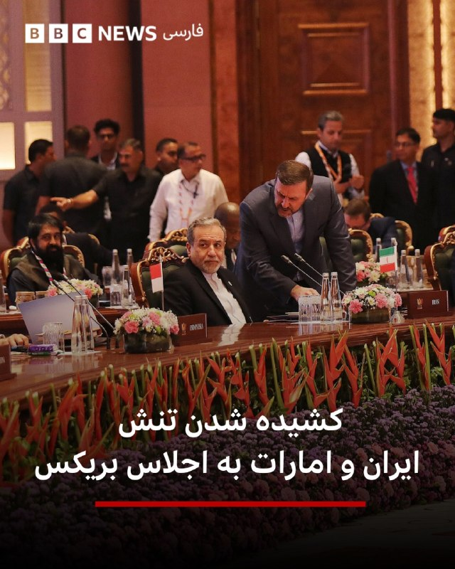

🔻درگیری بین ایران و امارات به نشست عمومی نخستین روز اجلاس وزرای خارجه بریکس هم کشیده شد، جایی که عباس عراقچی، وزیر خارجه ایران بدون ذکر نام امارات گفت: «ائتلاف شما با اسرائیلی‌ها نیز از شما محافظت نکرد. در سیاست خود در قبال ایران بازنگری کنید.»

او ساعاتی پس از سخنرانی در نشست بریکس در کانال تلگرام خود نوشت: «من در سخنرانی‌ خود نام امارات متحده عربی را ذکر نکردم، به خاطر حفظ وحدت و ترجیح دادم به آن اشاره نکنم. اما در واقع باید بگویم که امارات مستقیماً در اقدام تجاوزکارانه علیه کشور من دخیل بود. زمانی که این تجاوز آغاز شد، آنها حتی از محکوم کردن آن خودداری کردند. آنها اجازه دادند از سرزمین‌شان برای شلیک توپخانه و تجهیزات علیه ما استفاده شود.»

جنگ ایران، اجماع نظر بر سر بیانیه مشترک را برای این گروه دشوارتر کرده است، به ویژه به خاطر عضویت ایران و امارات متحده عربی که در جنگ اخیر در دو سوی مقابل قرار دارند.

متن کامل خبر در لینک زیر:
https://bbc.in/3RnsqY1
📷EPA

@BBCPersian

## BBCPersian — post 281024

🔻لبنان در مذاکرات واشنگتن در پی اجرای آتش‌بس از سوی اسرائیل است

🔻یک مقام ارشد لبنانی اعلام کرد که کشورش در مذاکرات رو در رو با اسرائیل که قرار است امروز در واشنگتن برگزار شود، خواستار اجرای آتش‌بس از سوی اسرائیل خواهد شد.

این مقام لبنانی گفت که هیئت لبنانی به دنبال «آتش‌بسی است که اسرائیل آن را اجرا کند.»

این مذاکرات، سومین دیدار میان نمایندگان لبنان و اسرائیل از زمان ازسرگیری درگیری‌ها میان حزب‌الله و اسرائیل در بیش از دو ماه گذشته است. بیروت با وجود مخالفت شدید حزب‌الله در این مذاکرات شرکت می‌کند.

درگیری‌ها میان حزب‌الله و اسرائیل، با وجود آتش‌بس اعلام‌شده با میانجی‌گری آمریکا در ماه گذشته، همچنان ادامه دارد.

وزارت بهداشت لبنان اعلام کرد که حملات اسرائیل در روز گذشته ۲۲ کشته، از جمله هشت کودک، برجای گذاشته است.

ارتش اسرائیل هم گفته است که امروز موج تازه‌ای از حملات را علیه مواضع حزب‌الله در جنوب لبنان انجام داده است. حزب‌الله هم می‌گوید که دیروز ۱۷ حمله علیه نیروهای اسرائیلی در جنوب انجام داده است.

آمریکا در حالی میانجی‌گری میان لبنان و اسرائیل را دنبال می‌کند که هم‌زمان تلاش‌های دیپلماتیک برای پایان دادن به تنش‌های گسترده‌تر میان آمریکا و ایران نیز ادامه دارد.

https://bbc.in/4uOASy5
@BBCPersian

## BBCPersian — post 281023

  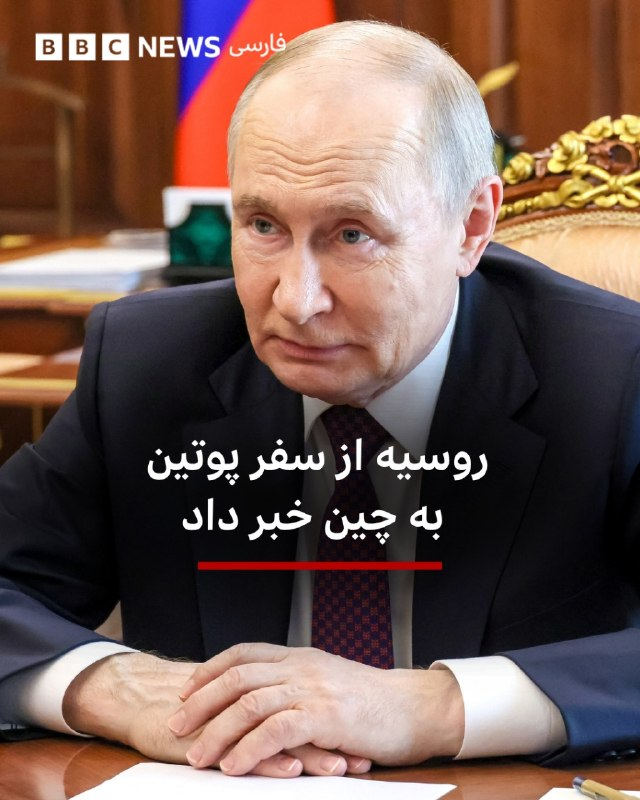

‌🔻به گزارش شبکه خبری آرتی، کرملین اعلام کرد که ولادیمیر پوتین، رئیس‌جمهور روسیه، به‌زودی به چین سفر خواهد کرد.

این خبر در حالی اعلام شده است که دونالد ترامپ،‌ رئیس جمهور آمریکا در حال دیدار از چین است.

هنوز تاریخی برای سفر آقای پوتین اعلام نشده، اما دیمیتری پسکوف، سخنگوی کرملین، گفته است که تمام مقدمات این سفر تکمیل شده است.

آخرین سفر آقای پوتین به چین در سپتامبر ۲۰۲۵ بود، زمانی که او در رژه بزرگ نظامی پکن و یک نشست سران شرکت کرد.

رسانه‌های روسی پیش‌تر گزارش داده بودند که این سفر ممکن است حتی در هفته آینده انجام شود.

📷 Reuters
https://bbc.in/43byntG

@BBCPersian

## BBCPersian — post 281022

🔻عراقچی: امارات در حملات به ایران «شریک فعال» بوده است

🔻عباس عراقچی، وزیر خارجه ایران که برای شرکت در نشست وزرای خارجه بریکس در دهلی به سر می‌برد، می‌گوید که در سخنرانی خود در بریکس نام امارات متحده عربی را ذکر نکرده است، اما امارات متحده عربی را «شریک فعال» آمریکا و اسرائیل در حمله به ایران توصیف کرد و گفت که این کشور مستقیما در جنگ آمریکا و اسرائیل با ایران «دخیل» بوده است.

او ساعاتی پس از ایراد سخنرانی خود در نشست بریکس در کانال تلگرام خود نوشت: «من در سخنرانی‌ خود نام امارات متحده عربی را ذکر نکردم، به خاطر حفظ وحدت و ترجیح دادم به آن اشاره نکنم. اما در واقع باید بگویم که امارات مستقیماً در اقدام تجاوزکارانه علیه کشور من دخیل بود. زمانی که این تجاوز آغاز شد، آنها حتی از محکوم کردن آن خودداری کردند. آنها اجازه دادند از سرزمین‌شان برای شلیک توپخانه و تجهیزات علیه ما استفاده شود.»

او به خبر روز گذشته درباره سفر بنیامین نتانیاهو در زمان جنگ به امارات و ابوظبی اشاره کرد. رسانه‌های بین‌المللی این خبر را به نقل از دفتر نخست وزیر اسرائیل منتشر کردند اما وزارت خارجه امارات در بیانیه‌ای رسمی آن را تکذیب کرد.

آقای عراقچی در تلگرامش نوشت: «همین دیروز فاش شد که نتانیاهو در زمان جنگ به امارات و ابوظبی سفر کرده بود. همچنین آشکار شد که آنها در این حملات مشارکت داشته‌اند و شاید حتی مستقیماً علیه ما اقدام کرده باشند. بنابراین امارات شریک فعال این تجاوز است و هیچ تردیدی در این باره وجود ندارد.»

خبرگزاری فرانسه گزارش داد که آقای عراقچی، امارات را متهم کرد که مانع موضعگیری واحد از سوی کشورهای بریکس در محکوم کردن جنگ آمریکا و اسرائیل با ایران شده است.

به نظر می‌رسد اختلاف‌نظرها درباره جنگ ایران، تلاش‌ها برای صدور بیانیه مشترک در نشست دهلی را سخت کرده است.

در بیانیه وزارت خارجه امارات که روز چهارشنبه منتشر شد،‌ آماده بود: «امارات متحده عربی گزارش‌های منتشرشده درباره سفر نخست‌وزير اسرائيل يا استقبال از يک هيات نظامی اسرائيلی را تکذيب می‌کند.»

https://bbc.in/4daHQrk
@BBCPersian

## BBCPersian — post 281021

📽بالاخره کار حکومت‌های ایران و آمریکا به جنگ رو در رو و موشک و بمب و کشتار کشید. بعدش هم به مذاکره رو در رو . دستکم تا این لحظه. ولی دیپلماسی مردمی که نه در جنگ دخالتی دارند و نه در صلح چی هست؟ آنها می‌توانند کاری بکنند؟

🔹روزگاری آقای نادری که از آن نادره‌های دوران هست ، برای حل این بست بوجود آمده بین این طرف‌های جنگ، یک دیپلماسی خیلی خلاق را پیشنهاد کرد.

🔹با دیپلماسی شکست ناپذیر آقای نادری آشنا بشید.

📺برنامه این هفته آپارات
«دیپلماسی شکست ناپذیر آقای نادری»

🎬کار مشترک بهتاش صناعی ها و مریم مقدم

🔹ساعات پخش
جمعه ۹:۰۰ شب
شنبه ۶:۳۰ صبح
شنبه ۱۱:۰۰ صبح
دو‌شنبه۲:۰۰ بامداد
سه‌شنبه ۱۱:۰۰ صبح
تکرار جمعه ۱۱:۰۰ صبح

🔻از برنامه آپارات همیشه فیلم متفاوت ببینید.
@BBCPersian

## BBCPersian — post 281020

  

‌🔻کاخ سفید اعلام کرد که دونالد ترامپ و شی جین‌پینگ، در پکن توافق کردند که ایران هرگز نباید به سلاح هسته‌ای دست پیدا کند و تنگه هرمز باید باز بماند.

آمریکا این گفت‌وگوی دو ساعته را «خوب» توصیف کرده و می‌گوید که دو رهبر در حال تلاش برای تقویت همکاری‌های اقتصادی هستند.

در بیانیه کاخ سفید، رئیس‌جمهور شی همچنین «علاقه‌مندی خود را» برای خرید بیشتر نفت آمریکا ابراز کرد تا وابستگی چین به تنگه هرمز را کاهش دهد.

همچنین گفته شد که مدیران برخی از بزرگ‌ترین شرکت‌های آمریکایی هم در بخشی از این دیدار حضور داشتند.

آن‌ها همچنین درباره اهمیت پایان دادن به ورود مواد اولیه برای ساخت ماده مخدر فنتانیل به آمریکا هم صحبت کردند.

https://bbc.in/4uHk6Rf
📷Reuters

@BBCPersian

## Dirty_Kids — post 389453

  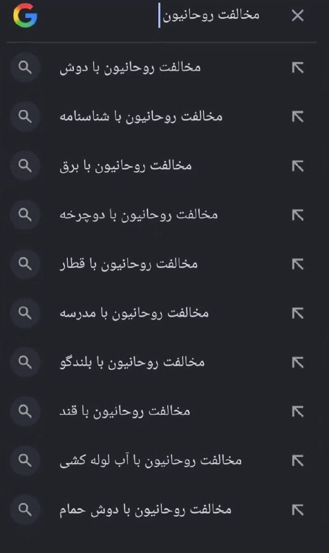

گیر چه عقب مونده‌هایی افتادیم

ننگ ۵۰۰ ساله روحانیت رو از تاریخ ایران پاک باید کنیم

@Dirty_Kids 👻

## Dirty_Kids — post 389452

  <a href="telegram/content/Dirty_Kids_389452_1778776716.mp4" target="_blank">🎬 Download video</a>

هنوز رد خونت روشه ...
#پرهام_آقامحمدی

@Dirty_Kids 👻

## Dirty_Kids — post 389451

  

🌪وقتی اینترنت طوفانیه... کافیه بادبان ها رو بکشی تا

⚫️با بالاترین کیفیت ممکن
⚡️ 

⚫️100 هزار تومان شارژ هدیه 
🎁

⚫️پایین ترین قیمت گیگی 250
🌐 

⚫️و ارائه پورسانت %10 در ازای هر معرفی
💼

بتونی یه اتصال پایدار با پشتیبانی 24 ساعته داشته باشی
🚀

بادبان راهتو باز می‌کنه
⛵️

G24

🛡@BadBan_VPN | کانال 

🤖@BadBan_VPNBot | ربات 

📞@BadBan_VPNSupport | پشتیبانی

## Dirty_Kids — post 389450

  <a href="telegram/content/Dirty_Kids_389450_1778776718.mp4" target="_blank">🎬 Download video</a>

وضعیت دیشبِ خیابون فرشته تهران:

طهران الان قسمت بندی شده
یه گوشه حی‌در حی‌در میکنن عرزشیا هپی بشن، یه گوشه پروپاگاندا، یجا برای بچه پولدارا و...

@Dirty_Kids 👻

## Dirty_Kids — post 389449

  

‏از روزی که ‎#رضاشاه_کبیر سر از خاک بیرون آورد جمهوری اسهالی روی خوش ندید.

@Dirty_Kids 👻

## Dirty_Kids — post 389448

ShirOKhorshid-2026.05.14.apk

## Dirty_Kids — post 389447

  <a href="telegram/content/Dirty_Kids_389447_1778776719.mp4" target="_blank">🎬 Download video</a>

مراد؛ ویروس هانتا 😂🤌⁩⁩

@Dirty_Kids 👻

## Dirty_Kids — post 389446

  <a href="https://t.me/Dirty_Kids/389446" target="_blank">📎 Download file</a>

دقایقی قبل این اپلیکیشن بنام "شیر و خورشید" که نسخه تغییر یافته سایفون هستش تو تلگرام درحال وایرال شدنه و میگن خیلی خوب کار میکنه.

مهم: اگر این نسخه رو نصب کنید دیگه دردسر ستاپ کردن MITM و... ندارید!
این نسخه حدودا یک ساعت پیش توسط برنامه‌نویس شیر و خورشید آپدیت شد و به راحتی می‌تونید طبق این آموزش بهش وصل بشید:
1- وارد اپلیکیشن شیر و خورشید(آخرین نسخه که امروز منتشر شده) می‌شید
2- وارد بخش Options میشید از نوار بالا
3- روی More Options کلیک میکنید
4- گزینه‌ی Connection Protocol رو قرار میدید روی CDN Fronting
5- میرید و عادی کانکت میشید و به راحتی وصل میشه.

+ من تست نکردم ولی دیدم میگن جوابه

@Dirty_Kids 👻

## Dirty_Kids — post 389445

  <a href="telegram/content/Dirty_Kids_389445_1778776720.webm" target="_blank">🎬 Download video</a>

🎶 موزیک - کتلت تنگسیری

@Dirty_Kids 👻

## Dirty_Kids — post 389444

  <a href="telegram/content/Dirty_Kids_389444_1778776721.mp4" target="_blank">🎬 Download video</a>

موزیک ویدیو کتلت تنگسیری

ارزش دانلود بالا، انرژی‌بخش و شاد

حجمش رو تا جایی‌که میشد آوردم پایین
موزیک خالیشم براتون پایین گذاشتم که حجمش خیلی کمتره

@Dirty_Kids 👻

## Dirty_Kids — post 389443

  <a href="telegram/content/Dirty_Kids_389443_1778776721.mp4" target="_blank">🎬 Download video</a>

جو خونه مکرون
بعد از قضیه گلشیفته

@Dirty_Kids 👻

## Dirty_Kids — post 389442

  <a href="telegram/content/Dirty_Kids_389442_1778776722.mp4" target="_blank">🎬 Download video</a>

مصاحبه‌ی بسیار مهمی از عموی خوبم اسکات بسنت وزیر خزانه‌داری آمریکا با شبکه‌ی CNBC که گزارش مختصری از وضعیت روافض هزارپدر می‌ده:

«چیزی که ما شاهدش هستیم اینه که تأسیسات بارگیری نفت روافض که اصلی‌ترین تأسیسات بارگیری نفت‌شونه، مجموعه‌ایه به نام جزیره خارک.

ما رصد کردیم و دیدیم که در سه روز گذشته هیچ بارگیری نفتی صورت نگرفته. ما معتقدیم که مخازن ذخیره‌ی نفت رژیم قحبه‌زاده پر شده.

هیچ کشتی‌ای‌ از اونجا خارج نمی‌شه و هیچ کشتی‌‌ای وارد نمی‌شه، بنابراین رژیم پدرخراب رافضی نمی‌تونه نفتش رو روی آب [در تانکرها] ذخیره کنه.
بنابراین رژیم هزارپدر شروع به متوقف کردن تولید نفت خواهد کرد.
ما از طریق تصاویر ماهواره‌ای می‌بینیم که این اتفاق در حال رخ دادنه.

اما مهم‌تر از همه‌ی این حرف‌ها اینه که این یک رژیم شیطانی مادرهزارتختخوابیه.
روافض جنایتکار تا اینجای سال جاری ۳۰ یا ۴۰ هزار نفر رو کشتن و اعدام کردن ‌ که خیلی از این معترضان مسالمت‌جو بودن‌. پس، با چنین رژیم مادرخر...



@Dirty_Kids 👻

## Dirty_Kids — post 389441

  <a href="telegram/content/Dirty_Kids_389441_1778776724.mp4" target="_blank">🎬 Download video</a>

شی جین‌پینگ، رئیس‌جمهور چین در دیدار با ترامپ رئیس‌جمهور آمريکا:

دو کشور ما باید شریک باشند، نه رقیب. مردم چین و ایالات متحده هر دو ملت‌های بزرگی هستند. تحقق احیای بزرگی ملت چین و عظمت دوباره آمریکا می‌تواند همزمان پیش برود. ما می‌توانیم به موفقیت یکدیگر کمک کنیم و رفاه کل جهان را ارتقا دهیم.

@Dirty_Kids 👻

## Dirty_Kids — post 389437

ترامپ تو چین یه جور داره رفتار میکنه که انگار اون میزبانه:

@Dirty_Kids 👻

## Dirty_Kids — post 389436

  <a href="telegram/content/Dirty_Kids_389436_1778776725.mp4" target="_blank">🎬 Download video</a>

این چه سمی بود دیدم 😂🔞

@Dirty_Kids 👻

## Dirty_Kids — post 389435

  

دقیقا وقتی فکر می‌کنی جمهوری اسلامی تپه نریده باقی نذاشته، همون لحظه یه تپه جدید می‌سازه و میره سرش میرینه.
فقط مونده بود برن از امارات کشتی بدزدن فرار کنن، که اونم گویا حاصل شد.

@Dirty_Kids 👻

## Dirty_Kids — post 389434

  <a href="https://t.me/Dirty_Kids/389434" target="_blank">📎 Download file</a>

✅ اپلیکیشن اندروید سایت جهانی دربی بت

💰اولین سایت جهانی با امکان شارژ و برداشت ریالی(کارت به کارت)

🔗 برای ورود فیلترشکن روی کشور مناسب قرار دهید مانند فنلاند و المان و....

😀Telegram Channel
👇
https://t.me/+bcynkEgSW2dlYTc0

## Hranews — post 112944

مهدی شفاخواه، فعال حوزه آموزش و حمایت از کودکان کار بازداشت شد

❗️
❗️
❗️
❗️
❗️– مهدی شفاخواه، ، فعال حوزه آموزش و حمایت از کودکان کار و ساکنان مناطق محروم، روز سه‌شنبه ۲۲ اردیبهشت‌ماه، توسط نیروهای نیروهای امنیتی بازداشت و به مکان نامعلومی منتقل شد.

#مهدی_شفاخواه
ادامه مطلب

↘️
@hranews_bot تماس ✉️ - @Hranews کانال هرانا 🆑

## Hranews — post 112943

  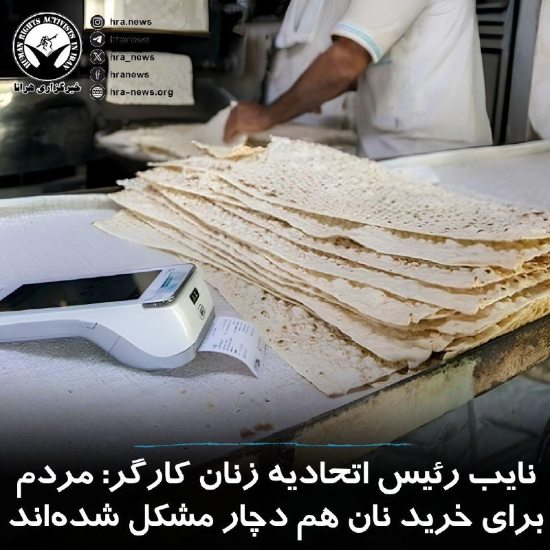

فاطمه وحدت، نایب‌رئیس اتحادیه زنان کارگر سراسر کشور، با اشاره به تشدید فشارهای اقتصادی بر اقشار آسیب‌پذیر گفت نشانه‌های گسترش #فقر در جامعه کاملاً مشهود است و در برخی مناطق، مردم حتی برای خرید #نان با مشکل مواجه‌اند. او تأکید کرد این نشانه‌ها در ظاهر کوچک به نظر می‌رسند، اما در صورت بی‌توجهی می‌توانند به بحران‌های جدی اجتماعی تبدیل شوند.

وحدت در ادامه با بیان اینکه زنان کارگر به‌ویژه سرپرستان خانوار در شرایط بحرانی بیش از دیگران در معرض اخراج قرار دارند، افزود این روند در بسیاری از استان‌ها مشاهده می‌شود و پیامدهای آن تنها به از دست رفتن شغل محدود نمی‌ماند، بلکه امنیت روانی و معیشت خانواده‌ها را نیز تحت تأثیر قرار می‌دهد. به گفته او، نبود سازوکار حمایتی مشخص برای زنان کارگر و ضعف نظارت بر وضعیت اشتغال، می‌تواند شکاف‌های اجتماعی را عمیق‌تر کند.

↘️
@hranews_bot تماس ✉️ - @Hranews کانال هرانا 🆑

## Hranews — post 112942

  

همزمان با افزایش چشمگیر قیمت #دارو در ماه‌های اخیر، شماری از داروخانه‌ها و مراکز درمانی همکاری خود با بیمه‌های درمانی را متوقف کرده‌اند یا برخی داروهای دارای پوشش بیمه بالا را عرضه نمی‌کنند. خبرگزاری فارس با انتشار گزارشی در این رابطه نوشته است که قیمت برخی داروها طی سه تا چهار ماه گذشته تا سه برابر افزایش یافته است. در مقابل، شرکت‌های بیمه‌ای نیز مطالبات داروخانه‌ها را با تاخیر چندماهه پرداخت می‌کنند؛ موضوعی که به گفته داروخانه‌داران، فروش دارو با نرخ بیمه‌ای را از نظر اقتصادی دشوار کرده است.

برخی بیماران برای تهیه داروهای حیاتی از جمله انسولین، داروهای قلب و فشار خون، ناچار به پرداخت هزینه‌های چندمیلیونی شده‌اند. بهمن صبور، عضو هیئت‌مدیره انجمن داروسازان ایران، با اشاره به پرداخت نقدی هزینه دارو توسط داروخانه‌ها و تاخیر طولانی بیمه‌ها در بازپرداخت مطالبات، این روند را برای مراکز درمانی زیان‌بار توصیف کرده است.

↘️
@hranews_bot تماس ✉️ - @Hranews کانال هرانا 🆑

## manototv — post 105457

  <a href="telegram/content/manototv_105457_1778776728.mp4" target="_blank">🎬 Download video</a>

دونالد ترامپ در گفت‌وگو با شان هنیتی گفت شی جین‌پینگ، رئیس‌جمهوری چین، متعهد شده به جمهوری اسلامی تجهیزات نظامی ارائه نکند.

ترامپ گفت: «او گفت قرار نیست تجهیزات نظامی بدهد؛ این حرف بزرگی است.»

رئیس‌جمهوری آمریکا در ادامه افزود چین همچنان بخش زیادی از نفت خود را از ایران خریداری می‌کند و مایل است این روند ادامه پیدا کند.

ترامپ همچنین گفت شی جین‌پینگ خواهان باز ماندن تنگه هرمز و جلوگیری از اختلال در عبور و مرور کشتی‌هاست.

## manototv — post 105456

  <a href="telegram/content/manototv_105456_1778776729.mp4" target="_blank">🎬 Download video</a>

‌
دونالد ترامپ، رئیس‌جمهوری آمریکا، در گفت‌و‌گو با شان هنیتی، خبرنگار و مجری فاکس‌نیوز گفت شی جین‌پینگ، رئیس‌جمهوری چین، خواهان دستیابی به توافق و باز ماندن تنگه هرمز است.

ترامپ گفت: «رئیس‌جمهوری شی دوست دارد توافقی حاصل شود. او گفت اگر بتواند کمکی بکند، مایل است کمک کند.»

رئیس‌جمهوری آمریکا همچنین با اشاره به خرید نفت ایران از سوی چین افزود: «هر کسی که این مقدار نفت می‌خرد، بدیهی است نوعی رابطه دارد.»

ترامپ در ادامه گفت شی جین‌پینگ مایل است تنگه هرمز باز بماند.

## manototv — post 105455

  <a href="telegram/content/manototv_105455_1778776730.mp4" target="_blank">🎬 Download video</a>

مارکو روبیو، وزیر خارجه آمریکا، گفت دونالد ترامپ موضوع ایران را در گفت‌وگو با مقام‌های چین مطرح کرده و این موضوع «اهمیت زیادی» داشته است.

روبیو گفت طرف چینی اعلام کرده با «نظامی‌سازی تنگه هرمز» و همچنین ایجاد سیستم دریافت عوارض از کشتی‌ها در این آبراه مخالف است.

وزیر خارجه آمریکا افزود: «این موضع ما هم هست.»

## manototv — post 105454

  <a href="telegram/content/manototv_105454_1778776731.mp4" target="_blank">🎬 Download video</a>

وزیر نیروی جمهوری‌اسلامی نسبت به وضعیت منابع آب در تهران هشدار داده و گفته شرایط آبی پایتخت چندان مطلوب نیست.
عباس علی‌آبادی اعلام کرده توزیع نامتوازن بارش‌ها باعث شده ۱۰ استان کشور با جمعیتی بیش از ۳۵ میلیون نفر همچنان در وضعیت کمتر از نرمال قرار داشته باشند.
او با اشاره به اینکه میزان بارش‌ها نسبت به میانگین بلندمدت حدود ۴ درصد و نسبت به سال گذشته ۶۶ درصد افزایش داشته، تأکید کرده این آمار به معنی خروج از بحران نیست.
به گفته او، شش سال خشکسالی پیاپی و کاهش ذخایر آب، به‌ویژه در منابع زیرزمینی، باعث شده کسری مخازن آب سطحی و زیرزمینی همچنان یکی از چالش‌های جدی کشور باقی بماند.

## manototv — post 105453

  <a href="telegram/content/manototv_105453_1778776731.mp4" target="_blank">🎬 Download video</a>

مقامات کره جنوبی اعلام کرده‌اند که به نظر می‌رسد بعید است گروهی غیر از جمهوری‌اسلامی در حمله به یک کشتی باری کره‌ای در نزدیکی تنگه هرمز نقش داشته باشد.
این حمله در تاریخ ۴ مه به کشتی متعلق به شرکت HMM کره جنوبی انجام شد و باعث آتش‌سوزی و آسیب به بخش عقبی آن شد. کره جنوبی در حال بررسی اطلاعاتی است که آمریکا درباره این حادثه در اختیارش قرار داده است.
سئول همچنین تیم‌های کارشناسی را به دبی فرستاده تا خسارت وارد شده به کشتی را بررسی و تحقیقات فنی انجام دهند.
در حالی که جمهوری‌اسلامی هرگونه دخالت در این حمله را رد کرده، مقامات کره جنوبی می‌گویند نتیجه‌گیری نهایی پس از پایان تحقیقات اعلام خواهد شد، اما در صورت اثبات نقش تهران، اقدامات لازم انجام می‌شود.
گزارش‌ها می‌گویند آمریکا نیز بلافاصله پس از حادثه، جمهوری‌اسلامی را به دست داشتن در این حمله متهم کرده و خواستار همکاری کره جنوبی در تأمین امنیت کشتیرانی در تنگه هرمز شده بود.

## manototv — post 105452

  <a href="telegram/content/manototv_105452_1778776732.mp4" target="_blank">🎬 Download video</a>

همزمان با سفر ترامپ به چین، آکسیوس در گزارشی به اختلاف نظرهایی در تیم ترامپ در خصوص ایران پرداخته؛ برخی معتقدند جمهوری‌اسلامی از زمان به نفع خود استفاده می‌کند و منتظر تأثیر فشارهای سیاسی در آمریکا است. هم‌زمان افزایش قیمت نفت و نگرانی از تورم، کار دولت را برای مدیریت افکار عمومی سخت‌تر کرده است.
گزارش‌ها نشان می‌دهد مذاکرات اخیر با تهران به بن‌بست رسیده و گزینه‌های نظامی دوباره روی میز قرار گرفته‌اند؛ از عملیات دریایی در تنگه هرمز گرفته تا حملات به زیرساخت‌های ایران.
در عین حال، برخی مقامات آمریکایی می‌گویند فشار اقتصادی فعلی شاید بدون اقدام نظامی هم ایران را تحت فشار قرار دهد، هرچند ساختار سیاسی این کشور کمتر تحت تأثیر نارضایتی عمومی قرار می‌گیرد.
در مجموع، ترامپ تأکید دارد که جلوگیری از دسترسی جمهوری‌اسلامی به سلاح هسته‌ای اولویت اصلی اوست، حتی اگر پیامدهای اقتصادی و سیاسی داخلی به دنبال داشته باشد؛ موضوعی که حالا به دست دموکرات‌ها یک ابزار تبلیغاتی آماده داده است.

## manototv — post 105451

  <a href="telegram/content/manototv_105451_1778776732.mp4" target="_blank">🎬 Download video</a>

«جمهوری اسلامی قصد جان فاطمه سپهری را کرده»

## manototv — post 105450

  <a href="telegram/content/manototv_105450_1778776734.mp4" target="_blank">🎬 Download video</a>

قیمت چیپس و پفک در بازار طی یک سال گذشته جهش چشمگیری داشته است.
بهای چیپس‌های ۶۰ گرمی که سال گذشته حدود ۲۵ هزار تومان بود، حالا به ۶۰ تا ۶۵ هزار تومان رسیده؛ افزایشی حدود ۱۶۰ درصدی.
قیمت چیپس‌های بزرگ‌تر نیز برای بسیاری از خریداران شوکه‌کننده شده است. هر بسته چیپس ۱۳۸ گرمی بسته به برند، بین ۱۳۰ تا ۱۴۰ هزار تومان قیمت دارد و چیپس‌های ۲۴۵ گرمی به حدود ۲۵۰ هزار تومان رسیده‌اند. برخی بسته‌های بزرگ‌تر نیز بین ۳۰۰ تا ۴۰۰ هزار تومان فروخته می‌شوند.
افزایش قیمت در بازار پفک و اسنک هم ادامه دارد. قیمت پفک ۱۱۰ گرمی از حدود ۴۵ هزار تومان به ۱۱۵ هزار تومان رسیده و اسنک‌های پنیری و طلایی حتی گران‌تر هستند. هر بسته اسنک طلایی اکنون حدود ۱۵۰ هزار تومان قیمت دارد و کرانچی ۱۰۰ گرمی نیز به حدود ۸۰ هزار تومان رسیده است.

## manototv — post 105449

  <a href="telegram/content/manototv_105449_1778776734.mp4" target="_blank">🎬 Download video</a>

«من صدای فاطمه سپهری هستم»

## manototv — post 105448

  <a href="telegram/content/manototv_105448_1778776735.mp4" target="_blank">🎬 Download video</a>

الجزیره گزارش داد نمایندگان لبنان و اسرائیل برای دور تازه‌ای از گفت‌وگوها به ساختمان وزارت خارجه آمریکا در واشنگتن رسیده‌اند.
این مذاکرات مستقیم روزهای پنج‌شنبه و جمعه برگزار می‌شود و مقام‌های دیپلماتیک لبنان، اسرائیل و همچنین مقام‌های آمریکایی در آن حضور خواهند داشت.

## manototv — post 105447

  <a href="telegram/content/manototv_105447_1778776736.mp4" target="_blank">🎬 Download video</a>

فیفا در یک پست اینستاگرامی اعلام کرد که شکیرا، مدونا و سوپراستارهای کی‌پاپ گروه بی‌تی‌اس اجرای نخستین نمایش بین دو نیمه فینال جام جهانی را بر عهده خواهند داشت.
فینال جام جهانی قرار است ۱۹ ژوئیه در ورزشگاه مت‌لایف در نیوجرسی برگزار شود و انتظار می‌رود علاوه بر تماشاگران حاضر در ورزشگاه، میلیون‌ها بیننده در سراسر جهان آن را تماشا کنند.
جام جهانی ۲۰۲۶ از ۱۱ ژوئن در مکزیکوسیتی آغاز می‌شود و مسابقات آن در شهرهای مختلفی در آمریکا، کانادا و مکزیک برگزار خواهد شد.

## manototv — post 105446

  <a href="telegram/content/manototv_105446_1778776736.mp4" target="_blank">🎬 Download video</a>

خبرگزاری حکومتی فارس وابسته به سپاه پاسداران از قول یک منبع آگاه اعلام کرد جمهوری اسلامی با عبور تعدادی از کشتی‌های چینی از تنگه هرمز، در چارچوب «پروتکل مدیریت ایرانی تنگه»، موافقت کرده است.
به گفته این منبع، پس از رایزنی‌های وزیر خارجه چین و سفیر پکن در تهران، دو کشور درباره تسهیل عبور برخی کشتی‌های چینی به توافق رسیدند و این روند از شامگاه گذشته آغاز شده است.
بر اساس این گزارش، عبور این کشتی‌ها پس از هماهنگی با مقام‌های جمهوری‌اسلامی و پذیرش ضوابط تعیین‌شده از سوی تهران انجام می‌شود.

## manototv — post 105445

  <a href="telegram/content/manototv_105445_1778776737.mp4" target="_blank">🎬 Download video</a>

عباس عراقچی، وزیر خارجه جمهوری اسلامی، امارات متحده عربی را به مشارکت مستقیم در حملات نظامی علیه ایران متهم کرد و خواستار بازنگری ابوظبی در روابطش با اسرائیل شد.
عراقچی این اظهارات را در نشست وزیران خارجه بریکس در دهلی‌نو مطرح کرد. او گفت: «امارات مستقیماً در تجاوز علیه کشور من دخالت داشت و اجازه داد از خاکش برای شلیک تجهیزات و تسلیحات علیه ایران استفاده شود.»
وزیر خارجه جمهوری اسلامی همچنین با اشاره به عادی‌سازی روابط امارات و اسرائیل در سال ۲۰۲۰ گفت: «ائتلاف شما با اسرائیل هم از شما محافظت نکرد و باید در سیاست خود در قبال ایران تجدیدنظر کنید.»

## manototv — post 105444

  <a href="telegram/content/manototv_105444_1778776737.mp4" target="_blank">🎬 Download video</a>

یک شرکت امنیت دریایی اعلام کرد شناور هندی «ام‌اس‌وی حاج‌علی» در پی حمله‌ای ناشناس در آب‌های نزدیک عمان غرق شده است.
شرکت «ونگارد» اعلام کرد این کشتی باری با ۱۴ خدمه، در نزدیکی ساحل لیما در عمان، در جنوب تنگه هرمز، پس از وقوع انفجار غرق شد.
بر اساس این گزارش، کشتی در حال انتقال دام از بربره در منطقه سومالی‌لند به شارجه امارات متحده عربی بود که «احتمالاً بر اثر حمله پهپادی یا موشکی» دچار انفجار شد.
ونگارد اعلام کرد پس از وقوع آتش‌سوزی در کشتی، خدمه مجبور به ترک شناور شدند و کشتی سپس غرق شد.
وب‌سایت رهگیری کشتی‌ها «ماریتایم ترافیک» این شناور را یک لنج چوبی ۵۴ متری معرفی کرده است. وزارت خارجه هند پیش‌تر اعلام کرده بود همه خدمه این کشتی سالم نجات یافته‌اند.

## manototv — post 105443

  <a href="telegram/content/manototv_105443_1778776738.mp4" target="_blank">🎬 Download video</a>

کاخ سفید اعلام کرد دونالد ترامپ و شی جین‌پینگ در دیدار خود در پکن درباره جنگ ایران، امنیت تنگه هرمز و برنامه هسته‌ای جمهوری اسلامی گفت‌وگو کرده‌اند.
بر اساس بیانیه کاخ سفید، دو طرف توافق کردند تنگه هرمز باید برای حفظ جریان آزاد انرژی باز بماند. شی جین‌پینگ همچنین مخالفت چین با نظامی‌سازی تنگه هرمز و هرگونه دریافت عوارض برای عبور کشتی‌ها را مطرح کرده است.
در این بیانیه آمده است رئیس‌جمهوری چین از تمایل پکن برای خرید بیشتر نفت آمریکا به‌منظور کاهش وابستگی به تنگه هرمز خبر داده و دو کشور نیز توافق کرده‌اند جمهوری‌اسلامی نباید به سلاح هسته‌ای دست پیدا کند.
کاخ سفید همچنین اعلام کرد دو رهبر درباره همکاری اقتصادی و مقابله با ورود مواد اولیه فنتانیل به آمریکا گفت‌وگو کرده‌اند.
در حالی که بیانیه چین تنها اشاره کوتاهی به موضوع ایران داشت، موضوع تایوان که شی جین‌پینگ آن را «مهم‌ترین مسئله» خوانده بود، در بیانیه واشینگتن مطرح نشد.

## manototv — post 105442

  <a href="telegram/content/manototv_105442_1778776738.mp4" target="_blank">🎬 Download video</a>

ترامپ در ضیافت شام رسمی که شی جین‌پینگ، رئیس‌جمهوری چین، در تالار بزرگ خلق پکن برگزار کرده حضور یافت.
ترامپ از شی جین‌پینگ و همسرش، پنگ لی‌یوان، برای سفر به آمریکا و حضور در کاخ سفید در ۲۴ سپتامبر دعوت کرد و گفت: «مایه افتخار من است که این دعوت را مطرح می‌کنم.»

## manototv — post 105441

  <a href="telegram/content/manototv_105441_1778776739.mp4" target="_blank">🎬 Download video</a>

معین، خواننده شهیر در صفحه اینستاگرام خود با انتشار متنی، شایعات مطرح شده در خصوص اجرا برای تیم فوتبال در جام جهانی را تکذیب کرد. معین در متن خود از جمله نوشته: «عشق من به مردم و سرزمینم همیشه واقعی بوده. اما صدای من زمانی معنا دارد که دل مردم آرام باشد و حال ایران خوب»
روز گذشته اظهارات مهدی تاج، رئیس فدراسیون فوتبال جمهوری‌اسلامی به شایعاتی از این دست دامن زده بود.

## manototv — post 105440

  <a href="telegram/content/manototv_105440_1778776740.mp4" target="_blank">🎬 Download video</a>

مهدی تاج، رئیس فدراسیون فوتبال جمهوری‌اسلامی گفته «مسئله ویزا حل نشده و هنوز هیچ روادیدی برای اعضای تیم ملی فوتبال ایران صادر نشده است.» و افزوده «منتظریم ببینیم رفتار طرف مقابل چیست.»
او از «جلسه سرنوشت‌ساز» با فیفا صحبت به میان آورده چرا که به گفته تاج فیفا «باید به ما گارانتی بدهد»

## manototv — post 105439

  <a href="telegram/content/manototv_105439_1778776740.mp4" target="_blank">🎬 Download video</a>

روزنامه نیویورک‌تایمز گزارش داد نهادهای اطلاعاتی آمریکا معتقدند شرکت‌های چینی درباره ارسال مخفیانه تسلیحات به جمهوری اسلامی از طریق کشورهای ثالث گفت‌وگو کرده‌اند تا منشأ این محموله‌ها پنهان بماند.
این گزارش ساعاتی پس از ورود دونالد ترامپ به پکن منتشر شد و می‌تواند فشارها بر رئیس‌جمهوری آمریکا را برای درخواست از شی جین‌پینگ به‌منظور قطع حمایت از جمهوری اسلامی افزایش دهد.
بر اساس این گزارش، مقام‌های آمریکایی بر سر این‌که آیا این انتقال‌ها بالفعل انجام شده یا نه اختلاف نظر دارند، اما گفته‌اند چنین اقداماتی بعید است بدون اطلاع مقام‌های ارشد چینی صورت گرفته باشد.
رسانه‌های آمریکایی پیش‌تر نیز گزارش داده بودند چین موشک‌های دوش‌پرتاب ضدهوایی به جمهوری اسلامی ارسال کرده است؛ تسلیحاتی که می‌توانند هواپیماها و پهپادها را هدف قرار دهند. همچنین گفته می‌شود تهران در سال ۲۰۲۴ یک ماهواره جاسوسی چینی دریافت کرده که برای شناسایی نیروهای آمریکایی در خاورمیانه از آن استفاده می‌کند.
در همین حال، گزارش‌هایی از بازسازی توان موشکی جمهوری اسلامی پس از حملات آمریکا و اسرائیل منتشر شده است. بر اساس ارزیابی سازمان سیا، بخش قابل توجهی از موشک‌های بالستیک و پرتابگرهای متحرک ایران همچنان سالم مانده‌اند.

## manototv — post 105437

  <a href="telegram/content/manototv_105437_1778776741.mp4" target="_blank">🎬 Download video</a>

بانک مرکزی ترکیه هدف تورم پایان سال ۲۰۲۶ را از ۱۶ به ۲۴ درصد افزایش داد و اعلام کرد پیامدهای جنگ ایران و اسرائیل و افزایش تنش‌ها در خاورمیانه، فشارهای تورمی را تشدید کرده است. رئیس بانک مرکزی ترکیه گفت افزایش بهای انرژی و اختلال در عرضه، به‌ویژه برای اقتصادهای وابسته به واردات مانند ترکیه، یک ریسک جدی محسوب می‌شود. این بانک همچنین پیش‌بینی تورم پایان ۲۰۲۷ را از ۹ به ۱۵ درصد افزایش داد. نرخ تورم ماهانه ترکیه در آوریل به بیش از ۴ درصد و تورم سالانه به حدود ۳۲ درصد رسید.

## alonews — post 119978

  <a href="telegram/content/alonews_119978_1778776742.webm" target="_blank">🎬 Download video</a>

👈وزیر دفاع بریتانیا : بعد از این‌که روسیه حملات سنگینی به اوکراین کرده

🔴قراره ارسال سامانه‌های پدافند هوایی به کی‌یف رو سریع‌تر انجام بدیم

✅ @AloNews خبر جنگ

## alonews — post 119977

  <a href="telegram/content/alonews_119977_1778776742.webm" target="_blank">🎬 Download video</a>

👈ایالات متحده موفق شد اورانیوم بسیار غنی شده را از رآکتور هسته ای برای اهداف تحقیقاتی در ونزوئلا خارج کند

✅ @AloNews خبر جنگ

## alonews — post 119976

  <a href="telegram/content/alonews_119976_1778776742.webm" target="_blank">🎬 Download video</a>

👈شبکه MS NOW: شرکت‌های خصوصی چینی در حال بررسی فروش موشک‌های ضدهوایی به ایران هستند

✅ @AloNews خبر جنگ

## alonews — post 119975

  <a href="telegram/content/alonews_119975_1778776742.webm" target="_blank">🎬 Download video</a>

👈رونگ هوان»، فعال رسانه‌ای و تحلیلگر سیاسی چینی، تأکید کرد که پکن مناسب‌ترین و توانمندترین طرف برای ایفای نقش میانجیگری فعال بین واشنگتن و تهران است

🔴 او اشاره کرد که بهبود روابط چین و آمریکا در ماه‌های اخیر، افق‌های جدیدی را برای ترغیب دو طرف به بازگشت به میز مذاکرات مستقیم گشوده است.

🔴 این تحلیلگر سیاسی توضیح داد که منطقه در وضعیت تنش‌آفرینی متقابلی به سر می‌برد که نیازمند ابتکاری از سوی چین است تا نردبان کاهش تنش را فراهم آورد که آبروی هر دو طرف حفظ شود و به وضعیت بی‌ثباتی که به ضرر منافع همگان است، پایان دهد.

✅ @AloNews خبر جنگ

## alonews — post 119974

  <a href="telegram/content/alonews_119974_1778776742.webm" target="_blank">🎬 Download video</a>

👈برد کوپر: ما درگیر اقدامات خصمانه علیه ایران نیستیم، بلکه آتش بس داریم

✅ @AloNews خبر جنگ

## alonews — post 119973

  <a href="telegram/content/alonews_119973_1778776742.webm" target="_blank">🎬 Download video</a>

👈وزیر جنگ پیت هگستث: با وجود آنچه ممکن است در رسانه‌ها بشنوید، آمریکا در حال افول نیست. ما همچنان قوی‌ترین قدرت نظامی روی زمین هستیم، اما این قدرت نیاز به تجدید دارد.

🔴با تهدیدات جهانی که به طور مداوم در حال تحول هستند، زمان آن رسیده است که سرمایه‌گذاری ۱.۵ تریلیون دلاری، یک پیش‌پرداخت نسلی، انجام شود.

🔴این سرمایه‌گذاری تضمین می‌کند که ایالات متحده برای نسل‌های آینده قدرت غالب و بازدارندگی بی‌نظیر در برابر هر دشمنی را حفظ کند

✅ @AloNews خبر جنگ

## alonews — post 119972

  <a href="telegram/content/alonews_119972_1778776743.webm" target="_blank">🎬 Download video</a>

👈ایلان ماسک درباره مذاکرات آمریکا و چین : من حس خوبی نسبت به این مذاکرات دارم. فکر می‌کنم نتیجه خوبی حاصل شود

✅ @AloNews خبر جنگ

## alonews — post 119971

  <a href="telegram/content/alonews_119971_1778776743.webm" target="_blank">🎬 Download video</a>

👈ترامپ : چین موافقت کرده ۲۰۰ هواپیمای بوئینگ خریداری کنه

✅ @AloNews خبر جنگ

## alonews — post 119970

  <a href="telegram/content/alonews_119970_1778776743.webm" target="_blank">🎬 Download video</a>

👈برونو رودریگز وزیر امور خارجه کوبا در شبکه ایکس اعلام کرد که آماده است پیشنهاد کمک ۱۰۰ میلیون دلاری ایالات متحده را بررسی کند

✅ @AloNews خبر جنگ

## alonews — post 119969

  <a href="telegram/content/alonews_119969_1778776743.webm" target="_blank">🎬 Download video</a>

👈دولت کوبا اعلام کرده است که جزیره رسماً بدون سوخت است و انتظار دارد سیستم انرژی در روزهای آینده فروپاشی کند

✅ @AloNews خبر جنگ

## alonews — post 119968

  <a href="telegram/content/alonews_119968_1778776743.webm" target="_blank">🎬 Download video</a>

👈مجلس نمایندگان عراق با اکثریت مطلق آرا، فؤاد حسین را به عنوان وزیر خارجه در دولت جدید تأیید کرد.

✅ @AloNews خبر جنگ

## alonews — post 119967

  <a href="telegram/content/alonews_119967_1778776743.mp4" target="_blank">🎬 Download video</a>

👈ان‌بی‌سی: آیا رئیس‌جمهور شی از رئیس‌جمهور ترامپ خواسته است که به تایوان سلاح نفروشد؟

🔴مارکو روبیو: خب، این موضوع قبلاً مورد بحث قرار گرفته است. این موضوع در بحث امروز به طور عمده مطرح نشد. ما قبلاً موضع آن‌ها را در این باره می‌دانیم

✅ @AloNews خبر جنگ

## alonews — post 119966

  <a href="telegram/content/alonews_119966_1778776745.webm" target="_blank">🎬 Download video</a>

👈عراقچی: امارات در حملات به ایران شریک فعال بوده است

🔴 ایران در برابر تهدیدها محکم ایستاده و سر خم نمی‌کند. آن‌ها این مسئله را دیده و تجربه کرده‌اند

🔴 در عین حال، کسانی که با زبان احترام با ایران سخن بگویند، با همان زبان پاسخ خواهند گرفت

✅ @AloNews خبر جنگ

## alonews — post 119965

  <a href="telegram/content/alonews_119965_1778776745.webm" target="_blank">🎬 Download video</a>

👈سنتکام: امارات، بحرین، عربستان، کویت، اردن و اسرائیل در عملیات آمریکا شرکت کردند

✅ @AloNews خبر جنگ

## alonews — post 119964

  <a href="telegram/content/alonews_119964_1778776745.webm" target="_blank">🎬 Download video</a>

👈ترامپ : هر کشوری که این مقدار نفت بخرد، بدیهی است که نوعی رابطه دارد، اما او دوست دارد تنگه هرمز باز بماند. 
✅ @AloNews خبر جنگ

## alonews — post 119963

  <a href="telegram/content/alonews_119963_1778776745.webm" target="_blank">🎬 Download video</a>

👈سناتور کنگره خطاب به برد کوپر:
شما میدونستید ایران تنگه هرمز رو میبنده؟

🔴برد کوپر: همه احتمالات در نظر گرفته شده بود

✅ @AloNews خبر جنگ

## alonews — post 119962

  <a href="telegram/content/alonews_119962_1778776746.webm" target="_blank">🎬 Download video</a>

👈میدل ایست نیوز : پارلمان عراق به برنامه دولت علی الزیدی رای داد

✅ @AloNews خبر جنگ

## alonews — post 119961

  <a href="telegram/content/alonews_119961_1778776746.webm" target="_blank">🎬 Download video</a>

👈ترامپ : رئیس‌جمهور شی علاقه‌منده که درباره ایران به توافق برسه، اون گفت : اگه بتونم کمکی بکنم، حاضرم کمک کنم 
✅ @AloNews خبر جنگ

## alonews — post 119960

  <a href="telegram/content/alonews_119960_1778776746.webm" target="_blank">🎬 Download video</a>

👈هانیتی از فاکس: آیا درباره حمایت چین از ایران با شی صحبت کردید؟ 
🔴 ترامپ: او گفت که تجهیزات نظامی نخواهد داد. این یک بیانیه بزرگ است. 
🔴 اما در عین حال، گفت که آنها مقدار زیادی نفت از آنجا می‌خرند و دوست دارند این کار را ادامه دهند. 
✅ @AloNews خبر جنگ

## alonews — post 119959

  <a href="telegram/content/alonews_119959_1778776746.webm" target="_blank">🎬 Download video</a>

👈مارکو روبیو: نیروهای مسلح اوکراین در حال حاضر قوی ترین و قدرتمندترین نیروهای مسلح در تمام اروپا هستند.

✅ @AloNews خبر جنگ

---
📅 بروزرسانی: 1405/02/24 12:58
---

## VahidOOnLine — post 240076

  

♦️ارتش اسرائیل روز پنجشنبه ۲۴ اردیبهشت اعلام کرد پس از سقوط یک پهپاد انفجاری حزب‌الله در نزدیکی مرز اسرائیل و لبنان، سه غیرنظامی اسرائیلی زخمی و به بیمارستان منتقل شدند.

این خبر در حالی اعلام می‌شود که آتش‌بس میان اسرائیل و حزب‌الله که سه هفته گذشته اعلام شد، عملا اجرا نمی‌شود.
‌🇸🇦 Indypersian

🤖 @VahidOOnLine

## VahidOOnLine — post 240075

  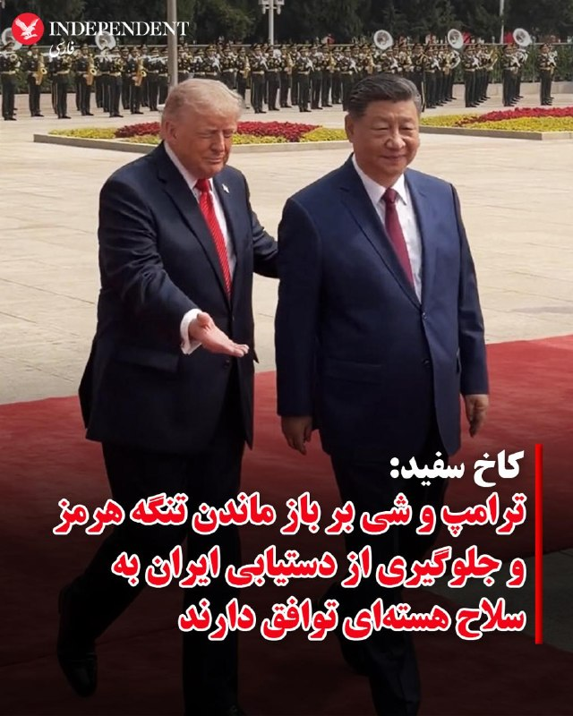

♦️کاخ سفید، روز پنجشنبه ۲۴ اردیبهشت ماه، با انتشار بیانیه‌ای درباره دیدار دونالد ترامپ و شی جین‌پینگ اعلام کرد دو طرف درباره جنگ ایران، امنیت تنگه هرمز و گسترش همکاری‌های اقتصادی میان آمریکا و چین گفتگو کردند.
بر اساس بیانیه کاخ سفید، دو طرف درباره راه‌های تقویت همکاری اقتصادی میان دو کشور، از جمله گسترش دسترسی شرکت‌های آمریکایی به بازار چین و افزایش سرمایه‌گذاری چین در صنایع آمریکا گفتگو کردند. تعدادی از مدیران بزرگ‌ترین شرکت‌های آمریکایی نیز در بخشی از این نشست حضور داشتند.
کاخ سفید همچنین اعلام کرد واشنگتن و پکن توافق دارند که تنگه هرمز باید برای تضمین جریان آزاد انرژی باز بماند.
در این بیانیه آمده است شی جین‌پینگ مخالفت چین با «نظامی‌سازی تنگه هرمز» و هرگونه تلاش برای دریافت عوارض از کشتی‌ها را اعلام کرده و همچنین نسبت به خرید بیشتر نفت آمریکا برای کاهش وابستگی چین به تنگه هرمز در آینده ابراز علاقه کرده است.
در بیانیه کاخ سفید آمده است آمریکا و چین توافق دارند که «ایران هرگز نباید به سلاح هسته‌ای دست پیدا کند.»
برخلاف روایت منتشرشده از سوی پکن، در بیانیه کاخ سفید اشاره‌ای به موضوع تایوان نشده است.
‌🇸🇦 Indypersian

🤖 @VahidOOnLine

## VahidOOnLine — post 240074

  

⭕️نتانیاهو: سرطانم درمان شده و در بهترین وضعیت سلامتی هستم

♦️بنیامین نتانیاهو، نخست‌وزیر اسرائیل، در جلسه دادگاه رسیدگی به پرونده‌های مرتبط با افترا در تل‌آویو گفت وضعیت جسمی‌اش «خوب، حتی عالی» است و تاکید کرد که در «بالاترین سطح سلامت» قرار دارد.

او این اظهارات را در جریان رسیدگی به شکایت افترا علیه دو روزنامه‌نگار و یک فعال سیاسی مطرح کرد؛ افرادی که مدعی شده بودند نتانیاهو در سال ۲۰۲۴ به بیماری‌های جدی مبتلا بوده است.

نتانیاهو گفت هرگز به سرطان لوزالمعده مبتلا نبوده و اگر چنین ادعایی درست بود، «تا حالا مرده بود». او توضیح داد که در دسامبر ۲۰۲۴ به‌دلیل بزرگی پروستات تحت عمل جراحی قرار گرفت و در اواخر سال ۲۰۲۵ ابتلا به سرطان پروستات در او تشخیص داده شد.
به گفته نتانیاهو، او در ژانویه و فوریه ۲۰۲۶ پنج جلسه پرتودرمانی انجام داد و این درمان‌ها سرطان را به‌طور کامل از بین برده‌اند. این نخستین بار است که او جدول زمانی دقیق ابتلا و درمان سرطان خود را علنی می‌کند.

با این حال، رسانه‌های عبری‌زبان نوشته‌اند این روایت تا حدی با اظهارات پزشک معالج او، پروفسور آرون پوپوتزر، تفاوت دارد؛ پزشکی که در پایان آوریل گفته بود پرتودرمانی نتانیاهو حدود دو ماه و نیم پیش آغاز شده بود، یعنی حدود هفته دوم فوریه.
نتانیاهو همچنین گفت دستگاه ضربان‌ساز قلبی که در سال ۲۰۲۳ برای او کار گذاشته شد، تاکنون هرگز فعال نشده است. او تاکید کرد وضعیت جسمی‌اش رو به بهبود بوده و بنا بر همه شاخص‌ها، نه در حد متوسط یا خوب، بلکه در «۱۰ درصد بالای مقیاس سلامت» قرار دارد.
‌🇸🇦 Indypersian

🤖 @VahidOOnLine

## VahidOOnLine — post 240073

  <a href="telegram/content/VahidOOnLine_240073_1778750911.mp4" target="_blank">🎬 Download video</a>

رسانه‌های داخلی ایران گزارش دادند زمین‌لرزه‌ای به بزرگی ۵ ریشتر منطقه بردسیر در استان کرمان را لرزاند.
بر اساس این گزارش‌ها، کانون زلزله در عمق ۸ کیلومتری زمین و در نزدیکی روستای کمال‌آباد از توابع شهرستان بردسیر بوده است. هلال‌احمر اعلام کرد دو تیم ارزیاب برای بررسی وضعیت به منطقه اعزام شده‌اند.
‌🏁 🇬🇧 ManotoTV

🤖 @VahidOOnLine

## VahidOOnLine — post 240072

  

♦️ساعت ۱۱:۱۷ دقیقه روز پنجشنبه ۲۴ اردیبهشت ماه، زمین لرزه‌ای به بزرگی پنج و در عمق هشت کیلومتری زمین، شهرستان بردسیر در کرمان را لرزاند.
به گفته رسانه‌های رسمی ایران، هنوز از خسارات احتمالی این زلزله گزارشی منتشر نشده است.
‌🇸🇦 Indypersian

🤖 @VahidOOnLine

## VahidOOnLine — post 240071

  <a href="telegram/content/VahidOOnLine_240071_1778750912.mp4" target="_blank">🎬 Download video</a>

گروه ناظر اینترنتی نت‌بلاکس اعلام کرد قطعی اینترنت در ایران امروز وارد هفتادوششمین روز خود شده و از مرز ۱۸۰۰ ساعت گذشته است.
نت‌بلاکس می‌گوید این محدودیت‌ها بر پایه دسترسی گزینشی و طبقاتی اعمال شده؛ به‌طوری که گروه‌های خاص به اینترنت دسترسی دارند، اما بخش بزرگی از شهروندان همچنان با محدودیت و اختلال گسترده مواجه‌اند
‌🏁 🇬🇧 ManotoTV

🤖 @VahidOOnLine

## VahidOOnLine — post 240070

  

منوچهر متکی، نماینده مجلس و وزیر خارجه پیشین جمهوری اسلامی، گفت برخی از پهپادهایی که به ایران حمله کردند متعلق به امارات متحده عربی بوده است. او تاکید کرد که «حجت بر تمام کشورهای منطقه تمام شده است.»

متکی گفت: «برخی از پهپادهایی که به ایران زده می‌شد پهپادهای امارات متحده عربی بود و قابل کتمان نیست. این اطلاعات نزد ما است.»

متکی با اشاره به روابط جمهوری اسلامی با کشورهای منطقه گفت: «یک مسئله‌ای داریم که در ۴۷ سال گذشته تحت تاثیر دیگران، کشورهای منطقه روابط صادقانه و خوبی با ما نداشتند. اما ما حسن همسایگی را رعایت کردیم.»
‌🏁 🇬🇧 IranintlTV

🤖 @VahidOOnLine

## VahidOOnLine — post 240069

  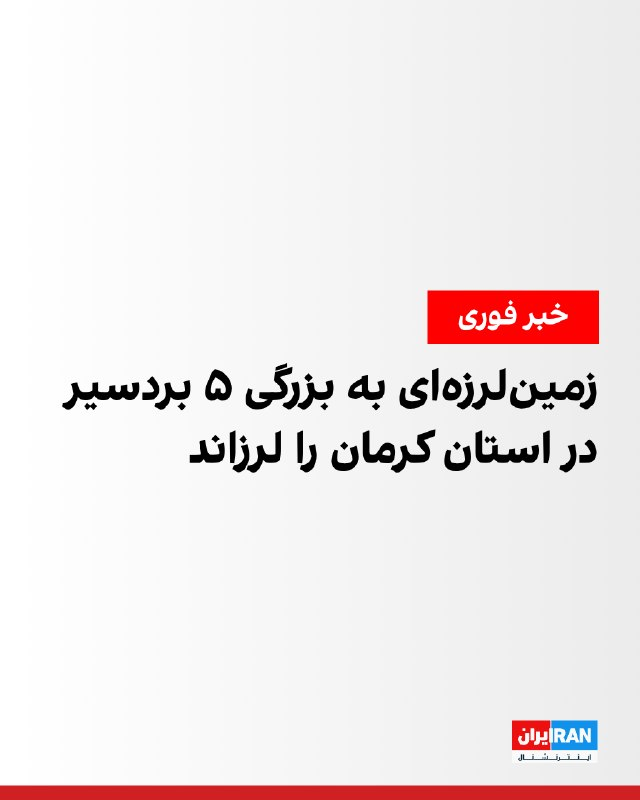

زمین‌لرزه‌ای به بزرگی ۵ منطقه بردسیر در استان کرمان را لرزاند. این زمین‌لرزه در عمق ۸ کیلومتری زمین رخ داد. جزییات بیشتری درباره خسارات احتمالی یا تلفات این زمین‌لرزه منتشر نشده است.
‌🏁 🇬🇧 IranintlTV

🤖 @VahidOOnLine

## VahidOOnLine — post 240068

  <a href="telegram/content/VahidOOnLine_240068_1778750914.mp4" target="_blank">🎬 Download video</a>

سازمان دریانوردی تجاری بریتانیا اعلام کرد یک کشتی در سواحل امارات و در نزدیکی تنگه هرمز دچار حادثه شده است.
بر اساس این گزارش، افرادی «غیرمجاز» کنترل این کشتی را در دست گرفته‌اند و شناور اکنون به‌سمت آب‌های سرزمینی ایران در حرکت است. این نهاد دریایی بریتانیا اعلام کرد کشتی در فاصله ۳۸ مایلی سواحل فجیره قرار داشته است.
‌🏁 🇬🇧 ManotoTV

🤖 @VahidOOnLine

## VahidOOnLine — post 240067

  <a href="telegram/content/VahidOOnLine_240067_1778750915.mp4" target="_blank">🎬 Download video</a>

⭕️عراقچی: تنگه هرمز برای همه کشتی‌های تجاری باز است اما باید با نیروی دریایی ما همکاری کنند

♦️عباس عراقچی، وزیر امور خارجه جمهوری اسلامی روز پنجشنبه ۲۴ اردیبهشت در حاشیه نشست وزرای خارجه کشورهای عضو بریکس گفت: «جمهوری اسلامی ایران هیچ مانعی در تنگه هرمز ایجاد نکرده و این گذرگاه دریایی همچنان برای کشتی‌های تجاری باز است.»

عراقچی حمله و محاصره دریایی آمریکا را عامل بروز مشکل در تنگه هرمز توصیف کرد و گفت: «تنگه هرمز برای همه کشتی‌های تجاری باز است و کشتی‌های تجاری باید برای عبور از تنگه با نیروهای دریایی جمهوری اسلامی ایران همکاری کنند.»

تنگه هرمز یکی از مهم‌ترین مسیرهای انتقال انرژی جهان به شمار می‌رود و تنش‌های اخیر میان آمریکا و اسرائیل با جمهوری اسلامی ایران، نگرانی‌ها درباره امنیت کشتیرانی و صادرات انرژی را افزایش داده است.
‌🇸🇦 Indypersian

🤖 @VahidOOnLine

## VahidOOnLine — post 240066

  

♦️سانائه تاکایچی، نخست‌ وزیر ژاپن پنجشنبه ۲۴ اردیبهشت با انتشار بیانیه‌ای اعلام کرد یک کشتی ژاپنی که در خلیج فارس متوقف شده بود، با موفقیت از تنگه هرمز عبور کرده و اکنون در مسیر بازگشت به ژاپن است.

به گفته تاکایچی، چهار خدمه ژاپنی در این کشتی حضور دارند.
تاکایچی با اشاره به عبور یک کشتی دیگر مرتبط با ژاپن در نهم اردیبهشت ماه، عبور اخیر را «تحولی مثبت» به‌ویژه از منظر حفاظت از شهروندان ژاپنی توصیف کرد.

نخست‌وزیر ژاپن یادآور شد، برای عبور این کشتی با مسعود پزشکیان «رایزنی مستقیم» داشته و وزیر خارجه و سفارت این کشور در تهران نیز هماهنگی‌های دیپلماتیک انجام داده‌اند.

به گفته او، با خروج این کشتی، تعداد کشتی‌های مرتبط با ژاپن که همچنان در خلیج فارس باقی مانده‌اند به ۳۹ عدد رسیده است و در یکی از آن‌ها سه خدمه ژاپنی حضور دارند.

تاکایچی در این پیام با یادآوری «فشار شدید» بر خدمه کشتی‌ها و نگرانی خانواده‌های آنان، از کارکنان دریایی و شرکت‌های کشتیرانی قدردانی کرد.

او تاکید کرد دولت ژاپن به تلاش‌های دیپلماتیک برای عبور هرچه سریع‌تر همه کشتی‌ها، از جمله کشتی‌های مرتبط با ژاپن، از تنگه هرمز ادامه خواهد داد.
‌🇸🇦 Indypersian

🤖 @VahidOOnLine

## VahidOOnLine — post 240065

  

عباس عراقچی، وزیر خارجه جمهوری اسلامی، گفت زمان آن رسیده است که «رفتار سلطه‌گرانه آمریکا به زباله‌دان تاریخ سپرده شود». او تاکید کرد هیچ‌گونه راه‌حل نظامی برای موضوعات مربوط به ایران وجود ندارد.

عراقچی گفت: «زمان آن رسیده که رفتار سلطه‌گرانه آمریکا را به زباله‌دان تاریخ بسپاریم.» او افزود: «هیچ‌گونه راه‌حل نظامی برای هر موضوعی که به ایران مربوط باشد، وجود ندارد. ما هرگز در برابر هیچ فشار یا تهدیدی سر خم نمی‌کنیم.»

وزیر خارجه جمهوری اسلامی همچنین اظهار داشت: «هرچند نیروهای مسلح ما آماده‌اند پاسخی کوبنده و ویرانگر به متجاوزان خارجی بدهند، اما مردم ما صلح‌طلب بوده و خواهان جنگ نیستند.»

او در ادامه از کشورهای عضو بریکس و دیگر اعضای جامعه بین‌المللی خواست آنچه را نقض حقوق بین‌الملل از سوی ایالات متحده و اسرائیل خواند، به‌صراحت محکوم کنند.
‌🏁 🇬🇧 IranintlTV

🤖 @VahidOOnLine

## VahidOOnLine — post 240064

  <a href="telegram/content/VahidOOnLine_240064_1778750918.mp4" target="_blank">🎬 Download video</a>

پلیس بریتانیا اعلام کرد دومین فرد در چارچوب تحقیقات ضدتروریسم درباره آتش‌سوزی در یک کنیسه در شرق لندن متهم شده است.
براساس اعلام پلیس، یک مرد ۳۱ ساله در ارتباط با این حمله بازداشت و تفهیم اتهام شده و تحقیقات درباره انگیزه و جزئیات حادثه ادامه دارد.
‌🏁 🇬🇧 ManotoTV

🤖 @VahidOOnLine

## VahidOOnLine — post 240063

  

طبق اطلاعات رسیده به ایران‌اینترنشنال، پرهام محرابی، نوجوان ۱۸ ساله اهل مشهد، شامگاه ۱۸ دی‌ماه ۱۴۰۴ در جریان اعتراضات بلوار هفت‌تیر، کنار پل هفت‌تیر ، در حالی‌که در کنار پدرش حضور داشت، با شلیک مستقیم ماموران سرکوبگر کشته شد. پدر او که لحظه اصابت گلوله را از نزدیک دیده بود، پیکر بی‌جان فرزندش را در آغوش گرفت و صدها متر حمل کرد تا به خودرویشان برسد و سپس او را به خانه منتقل کرد.

بر اساس اطلاعات رسیده به ایران‌اینترنشنال، پدر پرهام آن شب همراه فرزندش در محل اعتراضات حضور داشت و از فاصله‌ای نزدیک شاهد تیر خوردن او بود. او پس از اصابت گلوله، پیکر فرزندش را در آغوش گرفت و مسافتی طولانی حمل کرد تا به خودرو برسد و سپس مستقیما او را به خانه منتقل کرد. خانواده روز بعد برای دفن پیکر اقدام کردند اما به گفته منابع آگاه، ماموران امنیتی از پدر او تعهد کتبی گرفتند که اعلام کند فرزندش توسط «اغتشاشگران» کشته شده است و تهدید کردند در غیر این صورت اجازه دفن صادر نخواهد شد.

به گفته خانواده و اطرافیان، پرهام نوجوانی آرام، مهربان و محبوب بود و رابطه نزدیکی با پدر و مادرش داشت. خانواده‌اش می‌گویند.
‌🏁 🇬🇧 IranintlTV

🤖 @VahidOOnLine

## VahidOOnLine — post 240062

  

عباس عراقچی گفت جمهوری اسلامی هیچ مانعی در تنگه هرمز ایجاد نکرده و این آمریکا است که محاصره ایجاد کرده است.

او گفت: «ما هیچ مانعی در تنگه هرمز ایجاد نکرده‌ایم، این آمریکاست که محاصره ایجاد کرده است.»

عراقچی همچنین تاکید کرد: «تنگه هرمز برای تمامی کشتی‌های تجاری باز است، اما آنها باید با نیروهای دریایی ما همکاری کنند.»
‌🏁 🇬🇧 IranintlTV

🤖 @VahidOOnLine

## VahidOOnLine — post 240061

  

♦️عباس عراقچی، وزیر امور خارجه جمهوری اسلامی روز پنجشنبه ۲۴ اردیبهشت از «کشورهای عضو بریکس و همه اعضای مسئول جامعه بین‌المللی» خواست تا حمله آمریکا و اسرائیل به ایران را محکوم کنند.

عراقچی که برای شرکت در اجلاس وزاری امور خارجه بریکس به هند سفر کرده است، گفت جامعه جهانی باید «اقدامات عملی برای متوقف کردن جنگ» علیه جمهوری اسلامی را ایران را در دستور کار قرار دهد.

این سخنان در حالی بیان می‌شود که دونالد ترامپ، رئیس جمهوری ایالات متحده سه روز پیش گفته بود «آتش‌بس به دستگاه تنفس مصنوعی» وصل است و پیش از سفر به چین هشدار داده بود که جمهوری اسلامی ایران یا توافق با آمریکا را می‌پذیرد یا کاملا نابود خواهد شد.
‌🇸🇦 Indypersian

🤖 @VahidOOnLine

## VahidOOnLine — post 240060

  

♦️سازمان عملیات تجارت دریایی بریتانیا صبح پنجشنبه ۲۴ اردیبهشت گزارش کرد افراد «غیرمجاز» یک کشتی را در ۳۸ مایلی بندر فجیره تصرف کردند و در حال حاضر در حال انتقال آن به سوی آب‌های سرزمینی ایران هستند.
براساس این گزارش کشتی ربوده شده لنگر انداخته و متوقف بوده است.

هنوز مقام‌های جمهوری اسلامی و امارات متحده عربی واکنشی به این خبر نشان نداده‌اند.
‌🇸🇦 Indypersian

🤖 @VahidOOnLine

## VahidOOnLine — post 240059

  

مرکز عملیات تجارت دریایی بریتانیا اعلام کرد گزارشی از یک حادثه دریایی در فاصله ۳۸ مایل دریایی در شمال‌شرق فجیره، امارات متحده عربی، دریافت کرده است. این نهاد اعلام کرد این کشتی در حالی که در لنگرگاه قرار داشته، به دست افراد غیرمجاز تصرف شده و اکنون به سوی آب‌های سرزمینی ایران در حرکت است.
‌🏁 🇬🇧 IranintlTV

🤖 @VahidOOnLine

## VahidOOnLine — post 240058

  

وزارت دفاع اسرائیل اعلام کرد با یکی از شرکت‌های زیرمجموعه شرکت دفاعی البیت قراردادی برای توسعه «قابلیت برد افزوده» جنگنده اف-۳۵آی امضا کرده است. ارزش این قرارداد ۳۴ میلیون دلار اعلام شده است.

بر اساس اعلام این وزارتخانه، این قرارداد با شرکت سایکلون منعقد شده و شامل «توسعه و یکپارچه‌سازی مخازن سوخت خارجی» بر پایه طرحی است که پیش‌تر برای جنگنده اف-۱۶ طراحی شده بود.

وزارت دفاع اسرائیل اعلام کرد این قابلیت جدید قرار است برد عملیاتی هواپیما را افزایش دهد، وابستگی به سوخت‌گیری هوایی را کاهش دهد و انعطاف‌پذیری عملیاتی در ماموریت‌های برد بلند را تقویت کند.
‌🏁 🇬🇧 IranintlTV

🤖 @VahidOOnLine

## VahidOOnLine — post 240057

  <a href="telegram/content/VahidOOnLine_240057_1778750922.mp4" target="_blank">🎬 Download video</a>

همزمان با آغاز نشست وزیران خارجه کشورهای عضو بریکس در دهلی‌نو، عباس عراقچی، وزیر خارجه ایران، از اعضای این گروه و «همه کشورهای مسئول جامعه جهانی» خواست حملات آمریکا و اسرائیل علیه ایران را به‌صراحت محکوم کنند.
خبرگزاری رویترز گزارش داد جنگ ایران و اسرائیل بر نشست دو روزه بریکس در هند سایه انداخته و اختلاف‌ها میان اعضا، رسیدن به موضعی مشترک و صدور بیانیه نهایی را دشوار کرده است. ایران از هند، رئیس دوره‌ای بریکس، خواسته از این نشست برای ایجاد اجماع علیه واشینگتن و تل‌آویو استفاده کند
‌🏁 🇬🇧 ManotoTV

🤖 @VahidOOnLine

## WithYashar — post 11191

  <a href="telegram/content/WithYashar_11191_1778750923.mp4" target="_blank">🎬 Download video</a>

ترامپ بعد از ۵۰ سال، اولین رئیس‌ جمهوری شد که به معبد آسمان چین رفت
@withyashar

## WithYashar — post 11190

کاخ سفید : ترامپ و شی توافق کردن که تنگه هرمز باید باز بمونه
@withyashar

## WithYashar — post 11189

  <a href="telegram/content/WithYashar_11189_1778750925.mp4" target="_blank">🎬 Download video</a>

فاکس نیوز با حیرت : داداش بزرگه نگات میکنه ، لبخند بزنید شما با دوربین ها رصد میشوید
خبرنگار فاکس‌نیوز گزارش داد که خودروی آن‌ها در چین تنها دو دقیقه در محدوده «توقف ممنوع» پکن ایستاد و بلافاصله پیامک جریمه ۴۰ دلاری برای راننده صادر شد. به گفته او، در این کشور دوربین‌های نظارتی همه‌جا فعال هستند و تخلفات رانندگی در لحظه ثبت و اعمال می‌شود.
@withyashar

## WithYashar — post 11188

هند: حمله به یک کشتی ما در نزدیکی
سواحل عمان غیرقابل قبول است

یک کشتی هندی توسط افراد ناشناس دزدیده شده و به سمت ایران اسکورت میشود
@withyashar

## WithYashar — post 11187

بر اساس داده ها , شرکت تتر مبلغ 344 میلیون دلار USDT مرتبط با بانک مرکزی ایران رو فریز کرده و دلیلش هم بخاطر دور زدن تحریم‌ها بوده که شرکت آرکهام کیف پول‌های مرتبط رو شناسایی کرده
@withyashar

## WithYashar — post 11186

تسنیم: کیفرخواست زیباکلام و مدیرمسئول خبرگزاری آنا صادر شد ممنوعیت زیباکلام از انجام هرگونه فعالیت رسانه‌ای به مدت سه ماه صادر شده
@withyashar

## WithYashar — post 11185

  

دقایقی پیش زمین‌لرزه‌ای بسیار شدید ۵ ریشتری در عمق ۸ کیلومتری بردسیر کرمان را لرزاند
@withyashar

## WithYashar — post 11184

نتانیاهو در دادگاه حظور پیدا کرد و گفت: «فیک نیوزها گفتند من به بیماری لاعلاجی مبتلا هستم - این یک صنعت دروغگویی تمام‌عیار است»
@withyashar

## WithYashar — post 11183

تاج : در جریان آهنگی که معین برای تیم ملی در جام جهنی ۲۰۲۶ می خواند هستیم @withyashar

## WithYashar — post 11182

اتاق جنگ با شما : زمین لرزه خیلی شدید کرمان یک دقیقه پیش
@withyashar

## WithYashar — post 11181

  <a href="telegram/content/WithYashar_11181_1778750927.mp4" target="_blank">🎬 Download video</a>

تصویربرداری عجیب یا اسکن ۳۶۰ ایلان ماسک از موقعیت با گوشی خودش
@withyashar

## WithYashar — post 11180

  <a href="telegram/content/WithYashar_11180_1778750929.mp4" target="_blank">🎬 Download video</a>

صحنه ای زیبا در چین که کودکان به ترامپ و شی خوشامد میگویند
@withyashar

## WithYashar — post 11179

  <a href="telegram/content/WithYashar_11179_1778750931.mp4" target="_blank">🎬 Download video</a>

خبرنگار: آقای رئیس‌جمهور، مذاکرات چطور بود؟

ترامپ : عالی بود. چین زیباست.

خبرنگار: دربارهٔ تایوان هم صحبت کردید؟

ترامپ: (پاسخی نداد)
@withyashar

## mwarmonitor — post 9065

🇬🇧وزیر دفاع بریتانیا ؛ حملات پهپادی شوکه‌کننده روسیه به اوکراین طی ۲۴ ساعت گذشته.

🔸من دستور داده‌ام که تحویل سامانه‌های پدافند هوایی و مقابله با پهپاد از سوی بریتانیا با حداکثر سرعت ممکن تسریع شود.

🔸ما در برابر تجاوز ولادیمیر پوتین در کنار اوکراین ایستاده‌ایم.
افکار و همدردی ما با خانواده‌های اوکراینی است.

@mwarmonitor

## mwarmonitor — post 9064

🟥شرکتUKMTO گزارشی از یک حادثه در ۳۸ مایل دریایی (38NM) شمال شرقی فجیره، امارات متحده عربی دریافت کرده است.
🔸افسر امنیتی شرکت (CSO) گزارش داده است که کشتی در زمان لنگر انداختن توسط افراد غیرمجاز تصرف شده و اکنون به سمت آب‌های سرزمینی ایران در حرکت است.

@mwarmonitor

## mwarmonitor — post 9063

🔴 پس از دیدار دونالد ترامپ و شی جین‌پینگ، یک مقام کاخ سفید اعلام کرد که چین و ایالات متحده آمریکا توافق دارند که ایران هرگز نباید به سلاح هسته‌ای دست یابد و تنگه هرمز باید باز بماند. i24 news

@mwarmonitor

## mwarmonitor — post 9062

  <a href="telegram/content/mwarmonitor_9062_1778750933.mp4" target="_blank">🎬 Download video</a>

🇨🇳🇺🇸دونالد ترامپ و شی جین‌پینگ در حال بازدید از «معبد آسمان» در پکن هستند.
🔸خبرنگار: آقای رئیس‌جمهور، گفتگوها چطور بود؟
🔹دونالد ترامپ: عالی بود. جای فوق‌العاده‌ایه. چین زیباست.
مترجم (به چینی): پرزیدنت ترامپ می‌گن که گفتگوها خیلی خوب بوده.
🔸خبرنگار: آقای رئیس‌جمهور، آیا درباره تایوان صحبتی کردید؟
(ترامپ و شی جین‌پینگ بدون پاسخ به سوال، در حال ژست گرفتن برای عکس هستند)
مقام چینی: متشکرم. ممنون. خیلی ممنون.
خبرنگار (دوباره): آقای رئیس‌جمهور، آیا در مورد تایوان صحبت کردید؟
مقام چینی: ممنون از مطبوعات. متشکرم. ممنون.

@mwarmonitor

## mwarmonitor — post 9061

⚽️خبر فوتبالی از نیویورک تایمز:

🎙شکیرا، مدونا و گروه BTS اجرای نخستین نمایش بین دو نیمه را در فینال جام جهانی فوتبال بر عهده خواهند داشت.

@mwarmonitor

## mwarmonitor — post 9060

🇺🇸🇨🇳مراسم رسمی استقبال از دونالد ترامپ با حضور شی جین‌پینگ در چین برگزار شد

💠در این مراسم، رئیس‌جمهور چین با برگزاری تشریفات کامل دیپلماتیک از رئیس‌جمهور آمریکا استقبال کرد؛ رویدادی که در چارچوب سفر رسمی ترامپ به پکن و با هدف بررسی روابط دوجانبه، همکاری‌های اقتصادی و تحولات راهبردی بین دو کشور انجام خواهد گرفت.

@mwarmonitor

## FoxNewsTwitter — post 341701

  

Fox News (Twitter/X)

NEW: President Trump and President Xi Jinping tour the Temple of Heaven after their meeting at the Great Hall of the People in Beijing.

## FoxNewsTwitter — post 341700

  <a href="telegram/content/FoxNewsTwitter_341700_1778750935.mp4" target="_blank">🎬 Download video</a>

Fox News (Twitter/X)

NOW: President Trump and President Xi visit Temple of Heaven after having "great" talks.

"China is beautiful."

## FoxNewsTwitter — post 341699

Fox News (Twitter/X)

WATCH LIVE: President Trump and Chinese President Xi Jinping visit Temple of Heaven https://twitter.com/i/broadcasts/1nxnRYlNzoLxO

## FoxNewsTwitter — post 341698

  <a href="telegram/content/FoxNewsTwitter_341698_1778750937.mp4" target="_blank">🎬 Download video</a>

Fox News (Twitter/X)

NOW: President Trump calls Chinese President Xi Jinping a "great leader."

"Sometimes people don't like me saying it, but I say it anyway, because it's true — I always say the truth."

## FoxNewsTwitter — post 341697

  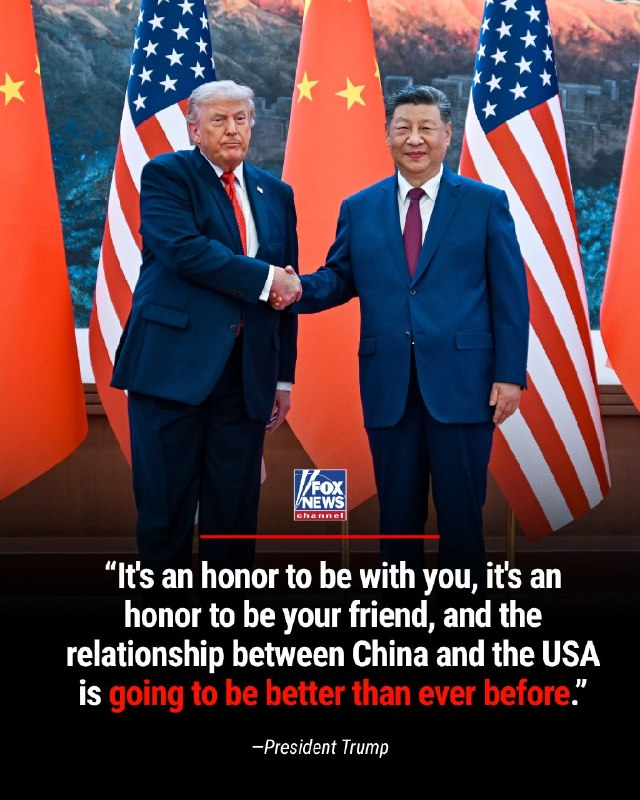

Fox News (Twitter/X)

NOW: President Trump expressed high hopes for U.S.-China relations at the Great Hall of the People, telling President Xi Jinping it is an honor to be his friend and predicting the partnership will be stronger than ever before.

## FoxNewsTwitter — post 341696

  <a href="telegram/content/FoxNewsTwitter_341696_1778750939.mp4" target="_blank">🎬 Download video</a>

Fox News (Twitter/X)

NOW: President Trump says "it's an honor" after meeting Chinese President Xi Jinping.

"It's an honor to be with you, it's an honor to be your friend, and the relationship between China and the USA is going to be better than ever before."

## FoxNewsTwitter — post 341695

  <a href="telegram/content/FoxNewsTwitter_341695_1778750940.mp4" target="_blank">🎬 Download video</a>

Fox News (Twitter/X)

NOW: President Trump thanks Chinese President Xi Jinping for welcoming him to Beijing, saying he was particularly impressed with the crowd of cheering children during the welcome ceremony.

## FoxNewsTwitter — post 341694

  <a href="telegram/content/FoxNewsTwitter_341694_1778750942.mp4" target="_blank">🎬 Download video</a>

Fox News (Twitter/X)

NOW: President Trump watches a ceremony with Chinese President Xi Jinping after arriving at the Great Hall of People in Beijing.

## FoxNewsTwitter — post 341693

  <a href="telegram/content/FoxNewsTwitter_341693_1778750943.mp4" target="_blank">🎬 Download video</a>

Fox News (Twitter/X)

BREAKING: President Trump receives a warm welcome at the Great Hall of People in Beijing for his meeting with President Xi Jinping.

## FoxNewsTwitter — post 341692

  <a href="telegram/content/FoxNewsTwitter_341692_1778750945.mp4" target="_blank">🎬 Download video</a>

Fox News (Twitter/X)

BREAKING: Chinese President Xi Jinping shakes hands with Secretary Rubio, Secretary Bessent and more in China as he walks with President Trump.

## FoxNewsTwitter — post 341691

  <a href="telegram/content/FoxNewsTwitter_341691_1778750948.mp4" target="_blank">🎬 Download video</a>

Fox News (Twitter/X)

BREAKING: President Trump meets Chinese President Xi Jinping at the Great Hall of People in Beijing.

## FoxNewsTwitter — post 341690

  <a href="telegram/content/FoxNewsTwitter_341690_1778750950.mp4" target="_blank">🎬 Download video</a>

Fox News (Twitter/X)

BREAKING: Chinese President Xi Jinping walks out for his meeting with President Trump.

## FoxNewsTwitter — post 341689

  <a href="telegram/content/FoxNewsTwitter_341689_1778750952.mp4" target="_blank">🎬 Download video</a>

Fox News (Twitter/X)

"There is no economy in Cuba."

Secretary Rubio says he doesn't believe the economic trajectory of Cuba can change under the current government.

## FoxNewsTwitter — post 341688

  <a href="telegram/content/FoxNewsTwitter_341688_1778750954.mp4" target="_blank">🎬 Download video</a>

Fox News (Twitter/X)

NEW: Secretary Rubio says stepping behind the White House press secretary podium wasn't "too bad," but he's not sure if he'd have fun if he had to do it every week.

"Karoline is irreplaceable....We can't wait until Karoline gets back." |@seanhannity

## FoxNewsTwitter — post 341687

  

Fox News (Twitter/X)

WATCH LIVE: President Trump and President Xi Jinping meet for bilateral talks https://twitter.com/i/broadcasts/1nJOLEBAamlxR

## FoxNewsTwitter — post 341686

  <a href="telegram/content/FoxNewsTwitter_341686_1778750956.mp4" target="_blank">🎬 Download video</a>

Fox News (Twitter/X)

.@seanhannity: "What is your read on President Xi?"

SECRETARY RUBIO: "China has a plan...they believe they will be the world's most powerful country."

"We're not trying to constrain China, but their rise cannot come at our expense."

## FoxNewsTwitter — post 341685

  <a href="telegram/content/FoxNewsTwitter_341685_1778750958.mp4" target="_blank">🎬 Download video</a>

Fox News (Twitter/X)

SENATOR MURRAY: "Do you seriously believe there's abortion in the water, like some of the far-right activists are suggesting?"

EPA ADMIN ZELDIN: "You just said abortion in the water?"

MURRAY: "That's what some far-right activists are saying. That they have an audience, in the EPA, on that absurd issue."

ZELDIN: "I have not had a conversation with anyone at the agency as far as abortions in water."

"I don't even know what you're talking about."

## FoxNewsTwitter — post 341684

  

Fox News (Twitter/X)

WATCH LIVE: 38th annual candlelight vigil for fallen officers in Washington, DC https://twitter.com/i/broadcasts/1NGaraWVDYVJj

## pm_afshaa — post 90715

🔴کاخ سفید: روسای جمهور آمریکا و چین درباره تقویت همکاری اقتصادی گفت‌وگو کردن

💧 Rainbet.com the #1 Non-KYC Crypto Casino & Sportsbook @rainbetcom

😁 @Pm_Afshaa

## pm_afshaa — post 90714

🔴سازمان تجارت دریایی بریتانیا اعلام کرد: قایق های تندرو سپاه یک کشتی را که خارج از تنگه هرمز لنگر انداخته بود را تهدید به هدف قرار دادن و سپس توقیف کردند و اکنون در حال بردن آن به سوی بنادر ایران هستن

💧 Rainbet.com the #1 Non-KYC Crypto Casino & Sportsbook @rainbetcom

😁 @Pm_Afshaa

## pm_afshaa — post 90713

🔴کاخ سفید : ترامپ و شی توافق کردن که تنگه هرمز باید باز بمونه

💧 Rainbet.com the #1 Non-KYC Crypto Casino & Sportsbook @rainbetcom

😁 @Pm_Afshaa

## pm_afshaa — post 90712

🔴رویترز: آمریکا و چین توافق کردن هیچ کشوری نباید عوارض از تنگه هرمز بگیره

💧 Rainbet.com the #1 Non-KYC Crypto Casino & Sportsbook @rainbetcom

😁 @Pm_Afshaa

## pm_afshaa — post 90711

🔴روبیو: واشنگتن به پکن روشن کرد که هرگونه حمایت از ایران به روابط دوجانبه آسیب می رساند

💧 Rainbet.com the #1 Non-KYC Crypto Casino & Sportsbook @rainbetcom

😁 @Pm_Afshaa

## pm_afshaa — post 90710

  <a href="telegram/content/pm_afshaa_90710_1778750960.webm" target="_blank">🎬 Download video</a>

🔴روبیو، وزیر خارجه آمریکا:

چین کلی کشتی تو خلیج فارس داره که گیر افتادن و آخر هفته هم یه کشتی باری چینی آسیب دید، فکر نمیکنم ایران عمدی زده باشه، ولی خب به هر حال اتفاق افتاده و الان همین باعث شده کشتی‌های چینی نتونن راحت رفت‌وآمد کنن؛ این وضعیت داره حسابی منطقه رو بی‌ثبات میکنه، مخصوصاً آسیا که بخش زیادی از انرژی‌شون از همین مسیر رد میشه. به نفع خود چینه که این قضیه جمع بشه.

ما هم امیدواریم پکن بیشتر وارد ماجرا بشه و ایران رو قانع کنه از کارهایی که الان داره تو خلیج فارس انجام میده عقب‌نشینی کنه.

💧 Rainbet.com the #1 Non-KYC Crypto Casino & Sportsbook @rainbetcom

😁 @Pm_Afshaa

## iaghapour — post 2608

🔻سوپراپلیکیشن ایتا اعلام کرد امکان ارسال فایل تا حجم ۲۰ مگابایت مجدداً برای همه کاربران فراهم شده است!

کاش تلگرام بیاد از شما یاد بگیره :)

🆔 @iaghapour

## DEJradio — post 4626

  <a href="telegram/content/DEJradio_4626_1778750961.webm" target="_blank">🎬 Download video</a>

🚨
⭕️ کشتی دزدی سـ.ـپاه پاسداران در تنگه هرمز

نیروهای سـ.ـپاه یک کشتی تجاری را از آب‌های امارات دزدیدند و به آب‌های ایران آوردند.

این کشتی تجاری که نزدیک آب‌های الفجیره امارات لنگر انداخته بود، بامداد ۲۴ اردیبهشت، توسط شبه‌نظامیان نقاب‌پوش دزدیده و به آب‌های سرزمینی جمهوری اسلامی هدایت شد.

سازمان دریانوردی تجاری بریتانیا اعلام کرد یک کشتی در سواحل امارات و در نزدیکی تنگه هرمز دچار حادثه شده است.

بر اساس این گزارش، افرادی «غیرمجاز» کنترل این کشتی را در دست گرفته‌اند و شناور اکنون به‌سمت آب‌های سرزمینی ایران در حرکت است.

برخی منابع نیز گزارش دادند که یکی از کشتی‌ها بعد از اصابت یک پرتابه دچار انفجار شد.

#تنگه_هرمز #IRGCterrorists
@DEJradio

## DEJradio — post 4625

  <a href="telegram/content/DEJradio_4625_1778750961.mp4" target="_blank">🎬 Download video</a>

🚨
🔸 مشاهدات و گزارش‌های میدانی نشان می‌دهد نیروهای مسلح جمهوری اسلامی برای مقابله با عملیات زمینی احتمالی آمریکا و اسرائیل در خاک ایران، به‌ویژه در اطراف تهران و اصفهان، آماده می‌شوند.

#جنگ #حملات_هدفمند #عملیات_زمینی
@DEJradio

## DEJradio — post 4624

  <a href="telegram/content/DEJradio_4624_1778750964.webm" target="_blank">🎬 Download video</a>

🔺📌 دیدگاه؛
چین دیوار حايل تأمین مالی نیروهای مسلح و سازمان سرکوب جمهوری اسلامی

دونالد ترامپ و شی جین‌پینگ روسای جمهوری آمریکا و چین، در پکن دیدار کردند. مراسم استقبال با بالاترین سطح تشریفات همراه بود و ترامپ گفت که فوق‌العاده بود و کمتر چنین استقبالی دیده‌ام. در این سفر شماری از مدیران ارشد شرکت‌های بزرگ آمریکایی، از جمله NVIDIA، Tesla، Apple، Meta، Boeing و JPMorgan Chase، ترامپ را همراهی می‌کنند.

آمریکا امیدوار است چین به عنوان اصلی‌ترین خریدار نفت ایران، فشار به جمهوری اسلامی را افزایش دهد تا تنگه هرمز را باز کند اما فرای این آمریکا می‌خواهد که چین حمایت از جمهوری اسلامی را متوقف کند.
در جریان درگیری‌های خلیج فارس، یک کشتی چینی آسیب دید. طی جنگ ۴۰ روزه و پس از آن نیروهای مسلح جمهوری اسلامی به عربستان سعودی و امارات دو شریک اقتصادی چین در خاورمیانه موشک و پهپاد پرتاب کردند.
بخشی از فشارهای آمریکا به جمهوری اسلامی از کانال شورای امنیت است. اگر قطعنامه‌های آمریکا علیه جمهوری اسلامی توسط چین و روسیه وتو نشود، برنده این میدان آمریکا خواهد بود اما یک تحلیل محرمانه اطلاعاتی ایالات متحده توضیح می‌دهد که چگونه چین از جنگ ایران برای به حداکثر رساندن برتری خود نسبت به آمریکا در حوزه‌های نظامی، اقتصادی، دیپلماتیک و سایر زمینه‌ها بهره‌برداری می‌کند.

چین بزرگترین خریدار نفت ایران است، به طور متوسط روزانه حدود ۱.۳۸ میلیون بشکه نفت خریداری می‌کند که بیش از ۸۰ درصد صادرات دریایی ایران را تشکیل می‌دهد، و همچنین یک شریک تجاری و زیرساختی مهم است.
قطع حمایت چین از رژیم ایران، تأمین مالی نیروهای مسلح جمهوری اسلامی و سازمان سرکوب را مختل می‌کند، زیرا بخش عمده‌ای از پول حاصل از فروش نفت سرازیر پایدار نگه داشتن ساختار نظامی و امنیتی جمهوری اسلامی می‌شود.
ده‌ها شرکت واسطه نفت ایران را به چین منتقل می‌کنند و پول آن را از کانال‌های مختلف صرف تامین مالی سـ.ـپاه و نیابتی‌ها می‌کنند. چین همچنین تامین کننده تجهیزات و قطعات موشک و پهپاد و تجهیزات جاسوسی است.

#چین #ترامپ
@DEJradio

## DEJradio — post 4623

  <a href="telegram/content/DEJradio_4623_1778750964.mp4" target="_blank">🎬 Download video</a>

🛩️
🔥 در واکنش به حملات جمهوری اسلامی به تاسیسات نفتی امارات، نیروی هوایی این کشور تأسیسات نفتی جزیره لاوان را هدف قرار داد. در اثر این حمله مخازن و لوله‌ها آسیب دید و نفت به دریا نشت کرد. اکنون سواحل جزیره مارو (شیدور) در استان هرمزگان آلوده به نفت شده است.

این جزیره کوچک غیرمسکونی زیستگاه انواع پرندگان و خزندگان است. اما نفت سراسر سواحل این جزایر را پوشانده و فاجعه زیست‌محیطی شدیدی را دقیقا در فصل لانه‌گزینی و تخم‌گذاری لاک‌پشت‌های پوزه عقابی و پرندگان مهاجر ایجاد کرده است.

#امارات #جزیره_لاوان
@DEJradio

## DEJradio — post 4622

  <a href="telegram/content/DEJradio_4622_1778750966.mp4" target="_blank">🎬 Download video</a>

🚨
🔸 خبر ۲۱
چهارشنبه ۲۳ اردیبهشت ۱۴۰۵

#خبر۲۱
@DEJradio

## mamlekate — post 103524

📝 جی‌دی‌ ونس در مورد در مذاکرات با جمهوری اسلامی: فکر می‌کنم پیشرفت‌هایی حاصل شده است

جی‌دی ونس، معاون رئیس‌جمهوری آمریکا، روز چهارشنبه در گفت‌وگو با خبرنگاران گفت که در مذاکرات با جمهوری اسلامی پیشرفت‌هایی حاصل شده است.

@mamlekate

## mamlekate — post 103523

📝 دولت اسرائیل: نتانیاهو در جریان عملیات «غرش شیران» در سفری محرمانه با رئیس امارات دیدار کرد

دفتر نخست‌وزیر اسرائیل روز چهارشنبه ۲۳ اردیبهشت با انتشار پیامی در ایکس اعلام کرد: «بنیامین نتانیاهو، نخست‌وزیر اسرائیل، در بحبوحه عملیات شیر غران، مخفیانه از امارات متحده عربی بازدید کرد و در آن‌جا با شیخ محمد بن زاید، رئیس امارات، دیدار کرد.»

📝 امارات «گزارش‌ها درباره سفر نخست‌وزیر اسرائیل» را تکذیب کرد

وزارت امور خارجه امارات در بیانیه‌ای «گزارش‌های منتشرشده درباره سفر ادعایی بنیامین نتانیاهو، نخست‌وزیر اسرائیل، به امارات یا پذیرش هرگونه هیئت نظامی اسرائیلی در این کشور را» تکذیب کرد.

📝 نماینده آمریکا استقرار «گنبد آهنین» در امارات را تأیید کرد

@mamlekate

## VahidOnline — post 75455

  <a href="telegram/content/VahidOnline_75455_1778750969.mp4" target="_blank">🎬 Download video</a>

خبرگزاری مهر پرچم حزب‌الله را در ویدیوی مربوط به بدرقه فوتبالیست‌ها سانسور کرد.
FattahiFarzad
اعضای تیم فوتبال چهارشنبه‌شب ۲۳ اردیبهشت‌ماه در میدان انقلاب تهران برای حضور در جام جهانی ۲۰۲۶ بدرقه شدند؛ رقابت‌هایی که خرداد و تیر ۱۴۰۵ به میزبانی مشترک آمریکا، مکزیک و کانادا برگزار خواهد شد.
@VahidOOnLine

📡 @VahidOnline

## IranIntlTV — post 337135

  <a href="telegram/content/IranIntlTV_337135_1778750969.mp4" target="_blank">🎬 Download video</a>

دفتر نخست‌وزیری اسرائیل چهارشنبه گزارش داد بنیامین نتانیاهو، نخست‌وزیر اسرائیل، در جریان عملیات «غرش شیران» به‌صورت محرمانه به امارات سفر کرده است. به گفته مقام‌های اسرائیلی، این سفر به گشایشی تاریخی در روابط دو طرف منجر شده است. وزارت خارجه امارات گزارش‌ها درباره این سفر را تکذیب کرده است.

ارزیابی محمدجواد اکبرین، عضو تحریریه ایران‌اینترنشنال
@iranintltv

## IranIntlTV — post 337134

  <a href="telegram/content/IranIntlTV_337134_1778750971.mp4" target="_blank">🎬 Download video</a>

سازمان عملیات تجارت دریایی بریتانیا اعلام کرد یک کشتی که در ۷۰ کیلومتری شمال شرقی بندر فجیره لنگر انداخته بود، توقیف شده و اکنون به سمت آب‌های ایران در حرکت است.
جزییات بیشتر با مرتضی کاظمیان، عضو تحریریه ایران‌اینترنشنال
@iranintltv

## IranIntlTV — post 337133

  <a href="telegram/content/IranIntlTV_337133_1778750973.mp4" target="_blank">🎬 Download video</a>

شی جین‌پینگ، رهبر چین، در دیدار با دونالد ترامپ، رییس‌جمهوری ایالات متحده، گفت همواره باور داشته که «چین و آمریکا منافع مشترک بیشتری نسبت به اختلافاتشان دارند». او همچنین بر اهمیت ثبات روابط پکن و واشینگتن برای دو کشور و جهان تاکید کرد.
@iranintltv

## IranIntlTV — post 337132

  <a href="telegram/content/IranIntlTV_337132_1778750974.mp4" target="_blank">🎬 Download video</a>

مراسم بدرقه تیم فوتبال ایران برای حضور در جام جهانی ۲۰۲۶، در حضور حامیان حکومت برگزار و همزمان از پیراهن جدید این تیم رونمایی شد.
گفت‌وگو با مزدک میرزایی، عضو تحریریه ایران‌اینترنشنال
@iranintltv

## IranIntlTV — post 337131

  

منوچهر متکی، نماینده مجلس و وزیر خارجه پیشین جمهوری اسلامی، گفت برخی از پهپادهایی که به ایران حمله کردند متعلق به امارات متحده عربی بوده است. او تاکید کرد که «حجت بر تمام کشورهای منطقه تمام شده است.»

متکی گفت: «برخی از پهپادهایی که به ایران زده می‌شد پهپادهای امارات متحده عربی بود و قابل کتمان نیست. این اطلاعات نزد ما است.»

متکی با اشاره به روابط جمهوری اسلامی با کشورهای منطقه گفت: «یک مسئله‌ای داریم که در ۴۷ سال گذشته تحت تاثیر دیگران، کشورهای منطقه روابط صادقانه و خوبی با ما نداشتند. اما ما حسن همسایگی را رعایت کردیم.»
https://iranintl.com/202605141340

## IranIntlTV — post 337130

  

زمین‌لرزه‌ای به بزرگی ۵ منطقه بردسیر در استان کرمان را لرزاند. این زمین‌لرزه در عمق ۸ کیلومتری زمین رخ داد. جزییات بیشتری درباره خسارات احتمالی یا تلفات این زمین‌لرزه منتشر نشده است.
https://iranintl.com/202605149083

## IranIntlTV — post 337129

  

🔻امیرمهدی علوی، سخنگوی فدراسیون فوتبال، درباره آخرین وضعیت صدور ویزا برای کاروان اعزامی ایران به جام‌جهانی گفت: «کارهای اداری ویزا را در امارات انجام دادیم و حالا منتظر پاسخ هستیم. با این حال، در صورت صادر نشدن ویزا برای برخی بازیکنان، اعضای کادر فنی گزینه‌های مختلفی دارند و بازیکنان جایگزین پیش‌بینی شده‌اند.»

🔹او همچنین به جلسه رییس فدراسیون فوتبال با مقامات فیفا اشاره کرد و گفت: «در ۴۸ ساعت آینده جلسه رییس فدراسیون با مقامات فیفا در ترکیه برگزار می‌شود و درباره ۱۰ مورد از خواسته‌های ما صحبت خواهیم کرد که نخستین مورد آن، بحث صدور ویزا است.»

🔹در فاصله کمتر از یک ماه تا آغاز جام‌جهانی، تیم ایران همچنان درگیر دریافت ویزای آمریکا است و این موضوع به بحرانی برای کادر فنی تبدیل شده است. احتمال دارد برای برخی اعضای کاروان ایران به دلیل سوابق فعالیت یا ارتباط با سپاه پاسداران، ویزا صادر نشود.
@iranintltvsport

## IranIntlTV — post 337128

  <a href="telegram/content/IranIntlTV_337128_1778750978.mp4" target="_blank">🎬 Download video</a>

وضعیت بحرانی دارو، به‌ویژه گرانی و کمبود داروهای خاص در ایران، تشدید شده است. ایلنا، خبرگزاری کار ایران، گزارش داد کمبود برخی داروهای سرطان و افزایش شدید قیمت آن‌ها، روند درمان بیماران مبتلا به سرطان را با مشکلات جدی روبه‌رو کرده است.

گفت‌وگو با بابک خطی، پزشک و متخصص کودکان
@iranintltv

## IranIntlTV — post 337127

  <a href="telegram/content/IranIntlTV_337127_1778750980.mp4" target="_blank">🎬 Download video</a>

شی جین‌پینگ، رهبر چین، پنج‌شنبه پس از نشست کلیدی خود با دونالد ترامپ، رییس‌جمهوری آمریکا، از «بازتعریف» روابط دوجانبه سخن گفت. او افزود دو طرف توافق کرده‌اند ایجاد یک رابطه سازنده و از نظر راهبردی باثبات، جهت‌گیری روابط دوجانبه را در سه سال آینده و فراتر از آن مشخص خواهد کرد. منابع رسمی دولت چین همچنین اعلام کردند شی و ترامپ «در مورد خا‌ورمیانه هم تبادل نظر کرده‌اند».

توماج طاهباز، خبرنگار ایران‌اینترنشنال، گزارش می‌دهد
@iranintltv

## IranIntlTV — post 337126

  

عباس عراقچی، وزیر خارجه جمهوری اسلامی، گفت زمان آن رسیده است که «رفتار سلطه‌گرانه آمریکا به زباله‌دان تاریخ سپرده شود». او تاکید کرد هیچ‌گونه راه‌حل نظامی برای موضوعات مربوط به ایران وجود ندارد.

عراقچی گفت: «زمان آن رسیده که رفتار سلطه‌گرانه آمریکا را به زباله‌دان تاریخ بسپاریم.» او افزود: «هیچ‌گونه راه‌حل نظامی برای هر موضوعی که به ایران مربوط باشد، وجود ندارد. ما هرگز در برابر هیچ فشار یا تهدیدی سر خم نمی‌کنیم.»

وزیر خارجه جمهوری اسلامی همچنین اظهار داشت: «هرچند نیروهای مسلح ما آماده‌اند پاسخی کوبنده و ویرانگر به متجاوزان خارجی بدهند، اما مردم ما صلح‌طلب بوده و خواهان جنگ نیستند.»

او در ادامه از کشورهای عضو بریکس و دیگر اعضای جامعه بین‌المللی خواست آنچه را نقض حقوق بین‌الملل از سوی ایالات متحده و اسرائیل خواند، به‌صراحت محکوم کنند.
https://iranintl.com/202605149950

## IranIntlTV — post 337125

  

طبق اطلاعات رسیده به ایران‌اینترنشنال، پرهام محرابی، نوجوان ۱۸ ساله اهل مشهد، شامگاه ۱۸ دی‌ماه ۱۴۰۴ در جریان اعتراضات بلوار هفت‌تیر، کنار پل هفت‌تیر ، در حالی‌که در کنار پدرش حضور داشت، با شلیک مستقیم ماموران سرکوبگر کشته شد. پدر او که لحظه اصابت گلوله را از نزدیک دیده بود، پیکر بی‌جان فرزندش را در آغوش گرفت و صدها متر حمل کرد تا به خودرویشان برسد و سپس او را به خانه منتقل کرد.

بر اساس اطلاعات رسیده به ایران‌اینترنشنال، پدر پرهام آن شب همراه فرزندش در محل اعتراضات حضور داشت و از فاصله‌ای نزدیک شاهد تیر خوردن او بود. او پس از اصابت گلوله، پیکر فرزندش را در آغوش گرفت و مسافتی طولانی حمل کرد تا به خودرو برسد و سپس مستقیما او را به خانه منتقل کرد. خانواده روز بعد برای دفن پیکر اقدام کردند اما به گفته منابع آگاه، ماموران امنیتی از پدر او تعهد کتبی گرفتند که اعلام کند فرزندش توسط «اغتشاشگران» کشته شده است و تهدید کردند در غیر این صورت اجازه دفن صادر نخواهد شد.

به گفته خانواده و اطرافیان، پرهام نوجوانی آرام، مهربان و محبوب بود و رابطه نزدیکی با پدر و مادرش داشت. خانواده‌اش می‌گویند.
https://iranintl.com/202605140

## IranIntlTV — post 337124

  

عباس عراقچی گفت جمهوری اسلامی هیچ مانعی در تنگه هرمز ایجاد نکرده و این آمریکا است که محاصره ایجاد کرده است.

او گفت: «ما هیچ مانعی در تنگه هرمز ایجاد نکرده‌ایم، این آمریکاست که محاصره ایجاد کرده است.»

عراقچی همچنین تاکید کرد: «تنگه هرمز برای تمامی کشتی‌های تجاری باز است، اما آنها باید با نیروهای دریایی ما همکاری کنند.»
https://iranintl.com/202605149350

## IranIntlTV — post 337123

  

مرکز عملیات تجارت دریایی بریتانیا اعلام کرد گزارشی از یک حادثه دریایی در فاصله ۳۸ مایل دریایی در شمال‌شرق فجیره، امارات متحده عربی، دریافت کرده است. این نهاد اعلام کرد این کشتی در حالی که در لنگرگاه قرار داشته، به دست افراد غیرمجاز تصرف شده و اکنون به سوی آب‌های سرزمینی ایران در حرکت است.
https://iranintl.com/202605141129

## IranIntlTV — post 337122

  

وزارت دفاع اسرائیل اعلام کرد با یکی از شرکت‌های زیرمجموعه شرکت دفاعی البیت قراردادی برای توسعه «قابلیت برد افزوده» جنگنده اف-۳۵آی امضا کرده است. ارزش این قرارداد ۳۴ میلیون دلار اعلام شده است.

بر اساس اعلام این وزارتخانه، این قرارداد با شرکت سایکلون منعقد شده و شامل «توسعه و یکپارچه‌سازی مخازن سوخت خارجی» بر پایه طرحی است که پیش‌تر برای جنگنده اف-۱۶ طراحی شده بود.

وزارت دفاع اسرائیل اعلام کرد این قابلیت جدید قرار است برد عملیاتی هواپیما را افزایش دهد، وابستگی به سوخت‌گیری هوایی را کاهش دهد و انعطاف‌پذیری عملیاتی در ماموریت‌های برد بلند را تقویت کند.
https://iranintl.com/202605141756

## IranIntlTV — post 337121

  

🔻معین، خواننده سرشناس موسیقی پاپ، با انتشار پستی در صفحه رسمی خود در اینستاگرام، اظهارات مهدی تاج، رییس فدراسیون فوتبال، درباره خواندن ترانه برای تیم ملی را تکذیب کرد.

🔹معین در این رابطه نوشت: «اخیرا خبرهایی درباره اجرای من برای تیم فوتبال در جام جهانی منتشر شده که صحت ندارد.»

🔹او همچنین با تاکید بر همبستگی با مردم اضافه کرد: «عشق من به مردم و سرزمینم همیشه واقعی بوده، اما صدای من زمانی معنا دارد که دل مردم آرام باشد و حال ایران خوب باشد.»

🔹این واکنش در حالی مطرح شد که در مراسم بدرقه تیم ملی در شامگاه چهارشنبه ۲۳ اردیبهشت، مهدی تاج تایید کرد که معین در حال آماده‌سازی قطعه‌ای برای تیم ملی است. او در این مراسم گفت: «ما دخالتی در ترانه معین نکرده‌ایم، اما در جریان آن هستیم.»
@iranintltvsport

## IranIntlTV — post 337120

  

حسین نوری همدانی، مرجع تقلید حامی حکومت، با صدور فتوایی پرداخت وجوهات شرعی مقلدان علی خامنه‌ای به مجتبی خامنه‌ای را مجاز اعلام کرد و او را «فقیهی جامع‌الشرایط» خواند.

او در این فتوا نوشت: «با توجه به اینکه وجوهات شرعی در نهایت در مسیر اعتلای حوزه‌های علمیه و اداره امور طلاب مصرف می‌گردد، و با عنایت به شناخت موجود نسبت به او به عنوان فقیهی جامع‌الشرایط، ان‌شاء‌الله پرداخت وجوهات شرعی مقلدین رهبر شهید به معظم‌له موجب برائت ذمه خواهد بود.»
https://iranintl.com/202605149707

## IranIntlTV — post 337118

  <a href="telegram/content/IranIntlTV_337118_1778750986.mp4" target="_blank">🎬 Download video</a>

وزارت خارجه امارات گزارش‌ها درباره سفر بنیامین نتانیاهو به این کشور را تکذیب کرد. چهارشنبه دفتر نخست‌وزیری اسرائیل اعلام کرده بود نتانیاهو در جریان عملیات «غرش شیران» به‌صورت محرمانه به امارات سفر کرده و با محمد بن زاید آل نهیان، رییس امارات، دیدار داشته است.

گفت‌وگو با منشه امیر، کارشناس امور خاورمیانه
@iranintltv

## IranIntlTV — post 337117

  <a href="telegram/content/IranIntlTV_337117_1778750987.mp4" target="_blank">🎬 Download video</a>

امید معماریان، تحلیل‌گر سیاسی، درباره دیدار دونالد ترامپ و شی جین‌پینگ گفت: «ممکن است چین برای کمک به حل مساله جنگ ایران، بخواهد در حوزه‌های دیگر از آمریکا امتیاز بگیرد.»
@iranintltv

## IranIntlTV — post 337116

  <a href="telegram/content/IranIntlTV_337116_1778750989.mp4" target="_blank">🎬 Download video</a>

جاویدنامان انقلاب ملی ایرانیان
«سینا کاظمی» جوان ۲۲ ساله، ۱۸ دی‌ماه در منطقه تهرانپارس تهران با شلیک مستقیم نیروهای سرکوب خامنه‌ای کشته شد. نامش در حافظه‌ این سرزمین می‌ماند و یادش چراغ راه آزادی‌خواهان است.
@iranintltv

## IranIntlTV — post 337115

  

رسانه‌های دولتی چین گزارش دادند دونالد ترامپ و شی جین‌پینگ در جریان گفت‌وگوهای خود در پکن درباره «وضعیت خاورمیانه» و جنگ اوکراین تبادل نظر کردند.

خبرگزاری دولتی شین‌هوا اعلام کرد دو رهبر درباره مسائل مهم بین‌المللی و منطقه‌ای، از جمله وضعیت خاورمیانه، دیدگاه‌های خود را مطرح کردند. موضوع جنگ اوکراین نیز در این گفت‌وگوها بررسی شد.

این دیدار در حالی برگزار شد که گمانه‌زنی‌هایی درباره تلاش احتمالی ترامپ برای جلب همکاری چین در موضوع جنگ آمریکا و اسرائیل علیه جمهوری اسلامی مطرح است.
https://iranintl.com/202605147700

## ManotoTV — post 105434

  <a href="telegram/content/ManotoTV_105434_1778750991.mp4" target="_blank">🎬 Download video</a>

رسانه‌های داخلی ایران گزارش دادند زمین‌لرزه‌ای به بزرگی ۵ ریشتر منطقه بردسیر در استان کرمان را لرزاند.
بر اساس این گزارش‌ها، کانون زلزله در عمق ۸ کیلومتری زمین و در نزدیکی روستای کمال‌آباد از توابع شهرستان بردسیر بوده است. هلال‌احمر اعلام کرد دو تیم ارزیاب برای بررسی وضعیت به منطقه اعزام شده‌اند.

## ManotoTV — post 105433

  <a href="telegram/content/ManotoTV_105433_1778750992.mp4" target="_blank">🎬 Download video</a>

گروه ناظر اینترنتی نت‌بلاکس اعلام کرد قطعی اینترنت در ایران امروز وارد هفتادوششمین روز خود شده و از مرز ۱۸۰۰ ساعت گذشته است.
نت‌بلاکس می‌گوید این محدودیت‌ها بر پایه دسترسی گزینشی و طبقاتی اعمال شده؛ به‌طوری که گروه‌های خاص به اینترنت دسترسی دارند، اما بخش بزرگی از شهروندان همچنان با محدودیت و اختلال گسترده مواجه‌اند

## ManotoTV — post 105432

  <a href="telegram/content/ManotoTV_105432_1778750992.mp4" target="_blank">🎬 Download video</a>

سازمان دریانوردی تجاری بریتانیا اعلام کرد یک کشتی در سواحل امارات و در نزدیکی تنگه هرمز دچار حادثه شده است.
بر اساس این گزارش، افرادی «غیرمجاز» کنترل این کشتی را در دست گرفته‌اند و شناور اکنون به‌سمت آب‌های سرزمینی ایران در حرکت است. این نهاد دریایی بریتانیا اعلام کرد کشتی در فاصله ۳۸ مایلی سواحل فجیره قرار داشته است.

## ManotoTV — post 105431

  <a href="telegram/content/ManotoTV_105431_1778750993.mp4" target="_blank">🎬 Download video</a>

پلیس بریتانیا اعلام کرد دومین فرد در چارچوب تحقیقات ضدتروریسم درباره آتش‌سوزی در یک کنیسه در شرق لندن متهم شده است.
براساس اعلام پلیس، یک مرد ۳۱ ساله در ارتباط با این حمله بازداشت و تفهیم اتهام شده و تحقیقات درباره انگیزه و جزئیات حادثه ادامه دارد.

## ManotoTV — post 105430

  <a href="telegram/content/ManotoTV_105430_1778750993.mp4" target="_blank">🎬 Download video</a>

همزمان با آغاز نشست وزیران خارجه کشورهای عضو بریکس در دهلی‌نو، عباس عراقچی، وزیر خارجه ایران، از اعضای این گروه و «همه کشورهای مسئول جامعه جهانی» خواست حملات آمریکا و اسرائیل علیه ایران را به‌صراحت محکوم کنند.
خبرگزاری رویترز گزارش داد جنگ ایران و اسرائیل بر نشست دو روزه بریکس در هند سایه انداخته و اختلاف‌ها میان اعضا، رسیدن به موضعی مشترک و صدور بیانیه نهایی را دشوار کرده است. ایران از هند، رئیس دوره‌ای بریکس، خواسته از این نشست برای ایجاد اجماع علیه واشینگتن و تل‌آویو استفاده کند

## ManotoTV — post 105428

  <a href="telegram/content/ManotoTV_105428_1778750994.mp4" target="_blank">🎬 Download video</a>

رسانه‌های وابسته به قوه قضاییه جمهوری اسلامی گزارش دادند با دستور مقام قضایی در استان همدان، اموال ۴۷ نفر که به «جاسوسی» و «همکاری با رژیم اسرائیل» متهم شده‌اند، توقیف شده است.
براساس این گزارش‌ها، این افراد در کشورهای مختلف از جمله بریتانیا، آلمان، آمریکا، ترکیه، عراق و سوئیس اقامت دارند و مقام‌های قضایی جمهوری اسلامی اعلام کرده‌اند پرونده آن‌ها در حال بررسی است. به گفته رسانه میزان، اموال توقیف‌شده قرار است برای «بازسازی اماکن آسیب‌دیده از جنگ» هزینه شود.

## ManotoTV — post 105427

  <a href="telegram/content/ManotoTV_105427_1778750995.mp4" target="_blank">🎬 Download video</a>

دونالد ترامپ، رئیس‌جمهوری آمریکا، در دیدار با شی جین‌پینگ در پکن، این نشست را «بسیار مهم» توصیف کرد و گفت توجه گسترده‌ای در آمریکا و جهان به این دیدار وجود دارد.
ترامپ با اشاره به اهمیت این مذاکرات گفت برخی این نشست را «بزرگ‌ترین دیدار تاریخ» می‌دانند و تاکید کرد مردم آمریکا تقریبا درباره موضوع دیگری صحبت نمی‌کنند. او همچنین حضور در کنار شی جین‌پینگ را «باعث افتخار» دانست و ابراز امیدواری کرد روابط میان آمریکا و چین «بهتر از هر زمان دیگری» شود.

## ManotoTV — post 105426

  <a href="telegram/content/ManotoTV_105426_1778750996.mp4" target="_blank">🎬 Download video</a>

دونالد ترامپ و شی جین‌پینگ، روسای جمهوری آمریکا و چین، در پکن دیدار کردند؛ دیداری که با مراسمی گسترده و تشریفات پرزرق‌وبرق همراه بود و صبح پنج‌شنبه با حضور هیات‌های بلندپایه دو کشور برگزار شد.
ترامپ در سخنان آغازین خود این دیدار را «باعث افتخار» توصیف کرد و گفت:
«رئیس‌جمهوری شی، بسیار سپاسگزارم. چنین استقبالی کمتر دیده‌ام. بیش از همه تحت تأثیر کودکان قرار گرفتم؛ شاد و فوق‌العاده بودند. ارتش چین قدرتمند بود، اما آن کودکان چیزهای زیادی را نمایندگی می‌کنند.»

## ManotoTV — post 105425

  <a href="telegram/content/ManotoTV_105425_1778750997.mp4" target="_blank">🎬 Download video</a>

دونالد ترامپ، رئیس‌جمهوری آمریکا، صبح پنج‌شنبه در جریان سفر خود به پکن همراه با شی جین‌پینگ، رئیس‌جمهوری چین، در مراسم رسمی استقبال و رژه نیروهای نظامی این کشور شرکت کرد.
این مراسم در مقابل ساختمان «تالار بزرگ خلق» برگزار شد و دو رهبر ضمن بازدید از یگان‌های نظامی، شاهد اجرای مراسم سان و رژه نیروهای ارتش چین بودند.

## FarsiVOA — post 217706

  

سازمان عملیات تجارت دریایی بریتانیا از تصرف یک کشتی در دریای عمان خبر داد. بر اساس این گزارش یک کشتی لنگر انداخته در ۳۸ مایل دریایی شمال شرق بندر فجیره امارات توسط افراد غیرمجاز تصرف شده و اکنون به سمت آب‌های سرزمینی ایران در حرکت است.
@FarsiVOA

## FarsiVOA — post 217705

🔺تلاش اسرائیل برای افزایش بردِ جنگنده‌ها بدون نیاز به سوخت‌رسانی

▪️وزارت دفاع اسرائیل اعلام کرد که قراردادی را با یکی از زیرمجموعه‌های شرکت دفاعی البیت برای توسعه «قابلیت بردِ افزایش‌یافته» جنگنده اف-۳۵آی امضا کرده است.

▪️این قرارداد شامل «توسعه و یکپارچه‌سازی مخازن سوخت خارجی» بر اساس طرحی است که شرکت سایکلون پیش‌تر برای جنگنده اف-۱۶ توسعه داده است.

▪️وزارت دفاع اسرائیل در بیانیه‌ای نوشت که این قابلیت جدید انتظار می‌رود «برد عملیاتی هواپیما را افزایش دهد، وابستگی به سوخت‌رسانی هوایی را کاهش دهد و انعطاف‌پذیری عملیاتی را در مأموریت‌های دوربرد تقویت کند.»

▪️اسرائیل اکنون ۴۸ فروند اف‌-۳۵آی در اختیار دارد؛ در حالی که سفارش اولیه این کشور ۵۰ فروند بود.

⬇️ بیشتر بخوانید:
https://ir.voanews.com/a/8149918.html

## FarsiVOA — post 217704

  

مؤسسه اقتصاد انرژی و تحلیل مالی می‌گوید آمریکا در سه ماهه ابتدایی امسال سهمی ۲۹ درصدی در تأمین گاز مایع اتحادیه اروپا داشته و در مجموع طی پنج سال گذشته، صادرات ال‌ان‌جی آمریکا به این اتحادیه چهار برابر شده است.

انتظار می‌رود آمریکا در سال جاری جایگاه نروژ به عنوان بزرگترین تأمین‌کننده کل گاز اروپا (گاز طبیعی و مایع) را بگیرد.

این گزارش می‌افزاید با توجه به تحریم‌های روسیه و هدف قرار گرفتن بخشی از تأسیسات گاز مایع قطر توسط جمهوری اسلامی، احتمالاً سهم آمریکا در واردات ال‌ان‌جی اتحادیه اروپا تا سال ۲۰۲۸ به حدود ۸۰ درصد برسد. هم‌اکنون سهم آمریکا در واردات ال‌ان‌جی آلمان، کرواسی و بریتانیا بالای ۸۰ درصد است.
@FarsiVOA

## FarsiVOA — post 217703

🔺سئول: بعید است کسی جز حکومت ایران پشت حمله به کشتی کره جنوبی باشد

▪️یک مقام ارشد کره جنوبی اعلام کرد احتمال این‌که نهادی غیر از حکومت ایران مسئول حمله به یک کشتی باری کره‌جنوبی در نزدیکی تنگه هرمز بوده باشد، پایین است.

▪️این مقام ارشد روز پنج‌شنبه ۲۴ اردیبهشت به خبرنگاران گفت که کره‌جنوبی در حال بررسی اطلاعاتی است که آمریکا درباره حمله ۴ مه علیه کشتی «نامو» متعلق به شرکت کشتیرانی کره‌جنوبی اچ‌ام‌ام به اشتراک گذاشته است.

▪️در جریان این حمله کشتی دچار آتش‌سوزی شد و خسارتی به بخش پایینی بدنه کشتی وارد آمد.

▪️جمهوری اسلامی پیش‌تر مسئولیت این حمله را که شامل برخوردی شدید به بدنه کشتی بود، رد کرده است.

⬇️ بیشتر بخوانید:
https://ir.voanews.com/a/8149917.html

## FarsiVOA — post 217702

  

در اقدامی در سرکوب شهروندان منتقد و نقض حقوق مدنی ایرانیان، دستگاه قضایی جمهوری اسلامی از توقیف اموال ۴۷ شهروند در استان همدان با ادعای «خیانت به وطن» و «همکاری با دشمن» خبر داد.

دادگستری استان همدان، روز ۱۶ اردیبهشت، تعداد این شهروندان را ۴۰ نفر عنوان کرده بود و به نظر می‌رسد در همین مدت کوتاه، اموال هفت شهروند دیگر نیز توقیف شده است.

دستگاه قضایی جمهوری اسلامی اعلام کرد که ۴۱ نفر از این شهروندان هم‌اکنون ساکن خارج کشور هستند.

روز چهارشنبه ۲۳ اردیبهشت، نیز رئیس کل دادگستری هرمزگان از توقیف اموال ۲۴ نفر از ایرانیان خارج از کشور خبر داده بود. اقدامی که رئیس قوه قضائیه از آن دفاع کرده و مدعی است دستگاه قضایی مأمور شده تا اموال «همکاران و همراهان دشمن» را شناسایی، توقیف و مصادره کند.
@FarsiVOA

## FarsiVOA — post 217701

🔺جمهوری اسلامی محمد عباسی یکی دیگر از معترضان دی ماه را اعدام کرده است

▪️جمهوری اسلامی محمد عباسی، از بازدشت‌شدگان اعتراضات دی ماه ۱۴۰۴ را که به قتل یکی از عوامل حکومت در ملارد متهم شده بود، اعدام کرد.

▪️دستگاه قضایی مدعی است که شاهین دهقانی، از نیروهای انتظامی ۱۷ دی ماه ۱۴۰۴ و در شهرستان ملارد کشته شده، و این قتل را به محمد عباسی و دخترش منتسب می‌کند، اما تصاویر پخش شده در دادگاه دخالت محمد و فاطمه عباسی، را اثبات نمی‌کند.

▪️فاطمه عباسی، در همین پرونده به ۲۵ سال زندان محکوم شده است.

▪️جمهوری اسلامی از آغاز جنگ با آمریکا و اسرائیل، دستکم ۳۳ تن را به بهانه حضور در اعتراضات، عضویت در گروه‌های مخالف یا «همکاری با دشمن»، اعدام کرده است.

⬇️ بیشتر بخوانید:
https://ir.voanews.com/a/8149915.html

## FarsiVOA — post 217699

  

شی جین‌پینگ، رئیس‌جمهور چین، در جریان گفت‌وگو با دونالد ترامپ، رئیس‌جمهور آمریکا گفت که روابط اقتصادی بین دو کشور «ماهیتی دوجانبه، سودمند و برد-برد» دارد.

به گزارش خبرگزاری دولتی چین، شینهوا، شی پنجشنبه گفت: «دیروز، تیم‌های اقتصادی و تجاری ما نتایجی به‌طور کلی متوازن و مثبت تولید کردند. این خبر خوبی برای مردم دو کشور و جهان است.»

رئیس‌جمهور چین افزود که واقعیت‌ها بارها نشان داده‌اند در جنگ‌های تجاری هیچ برنده‌ای وجود ندارد و از هر دو طرف خواست تا به‌طور مشترک شتاب مثبتی را که با تلاش فراوان ایجاد کرده‌اند حفظ کنند.

او گفت: «در مواردی که اختلافات و اصطکاک‌ها وجود دارد، مشورت برابر تنها انتخاب درست است.»

همچنین بر اساس ویدیویی که از ابتدای مذاکرات منتشر شد، شی گفت: «همواره بر این باور بوده‌ام که منافع مشترک میان چین و ایالات متحده بر اختلافات ما می‌چربد؛ موفقیت هر کشور فرصتی برای کشور دیگر است و یک رابطه پایدار چین و آمریکا برای جهان یک موهبت است. همکاری به سود هر دو طرف است، در حالی که تقابل به هر دو طرف آسیب می‌زند.»
@FarsiVOA

## FarsiVOA — post 217698

  

🔺اوپک از افت تولید نفت ایران برای دومین ماه متوالی خبر داد

▪️سازمان کشورهای صادرکننده نفت، اوپک، از افت تولید نفت ایران برای دومین ماه متوالی خبر داد.

▪️تولید روزانه نفت ایران در ماه آوریل نسبت به ماه مارس حدود ۲۱۲ هزار بشکه و نسبت به ماه فوریه، قبل از جنگ، حدود ۳۸۷ هزار بشکه کاهش داشته است. ایران در ماه گذشته روزانه ۲ میلیون و ۸۵۴ هزار بشکه تولید نفت داشته است.

▪️با توجه به پر شدن مخازن ذخیره نفت ایران به خاطر محاصره دریایی آمریکا، انتظار می‌رود شتاب افت تولید نفت ایران در ماه جاری افزایش یابد.

▪️مصرف داخلی نفت خام ایران حدود ۱.۷ میلیون بشکه است و در صورت ناتوانی جمهوری اسلامی در صادرات نفت، تولید نفت خام به همین سطح کاهش خواهد یافت.

⬇️ بیشتر بخوانید:
https://ir.voanews.com/a/8149916.html

## FarsiVOA — post 217697

🔺ترامپ به شی: روابط آمریکا با چین «بهتر از همیشه» خواهد بود

▪️دونالد ترامپ، رئیس‌جمهور ایالات متحده، روز پنج‌شنبه ۲۴ اردیبهشت در پکن و پشت میز گفت‌وگو با همتای چینی خود، شی جین‌پینگ، اعلام کرد که روابط کشورش با چین «بهتر از همیشه» خواهد بود.

▪️ترامپ روز چهارشنبه برای سفری سه‌روزه وارد پایتخت چین شد. این نخستین سفر او به چین از سال ۲۰۱۷ تاکنون است.

▪️این سفر در ابتدا برای اواخر ماه مارس برنامه‌ریزی شده بود، اما به دلیل جنگ آمریکا و اسرائیل علیه جمهوری اسلامی به تعویق افتاد.

▪️هدف نشست شی و ترامپ دستیابی به توافق‌هایی درباره محصولات کشاورزی و هواپیماها، و همچنین حفظ آتش‌بس شکننده در جنگ تجاری میان دو اقتصاد بزرگ جهان است.

⬇️ بیشتر بخوانید:
https://ir.voanews.com/a/8149914.html

## FarsiVOA — post 217696

  <a href="telegram/content/FarsiVOA_217696_1778751001.mp4" target="_blank">🎬 Download video</a>

⚡️گزارش فرهاد فلاحی از چین؛ واشنگتن از پکن در ارتباط با جمهوری اسلامی چه می‌خواهد؟
@FarsiVOA

## FarsiVOA — post 217695

⚡️مردم درباره سفر پرزيدنت ترامپ به چین چه می‌گویند؟
@FarsiVOA

## FarsiVOA — post 217694

⚡️گفت‌وگو با مسعود کاظم‌زاده و ابراهیم روشندل درباره انتظارات از سفر رئيس جمهوری آمریکا به چین
@FarsiVOA

## FarsiVOA — post 217693

⚡️راهبرد چین در خلیج فارس؛ انرژی حرف اول را می‌زند
@FarsiVOA

## FarsiVOA — post 217692

  <a href="telegram/content/FarsiVOA_217692_1778751002.mp4" target="_blank">🎬 Download video</a>

⚡️چه توقعات اقتصادی می‌توان از سفر دونالد ترامپ به چین داشت؟ گفت‌وگو با نادر حبیبی
@FarsiVOA

## FarsiVOA — post 217691

  <a href="telegram/content/FarsiVOA_217691_1778751003.mp4" target="_blank">🎬 Download video</a>

⚡️گزارش خبرنگار اعزامی صدای آمریکا از سفر رئیس جمهوری آمریکا به چین
@FarsiVOA

## FarsiVOA — post 217690

  <a href="telegram/content/FarsiVOA_217690_1778751004.mp4" target="_blank">🎬 Download video</a>

⚡️سخنان آغازین دونالد ترامپ، رئیس جمهوری آمریکا در دیدار با رئیس جمهوری چین پس از مراسم استقبال رسمی
@FarsiVOA

## FarsiVOA — post 217689

⚡️آیا چین اراده و قدرت این را دارد که جمهوری اسلامی را وادار کند از ناامن‌سازی تنگه هرمز دست بر دارد؟
@FarsiVOA

## FarsiVOA — post 217688

⚡️چه انتظاری از سفر پرزیدنت ترامپ به چین می‌‌توان داشت؟ گفت‌وگو با شهیر شهیدثالث و شکریا برادوست
@FarsiVOA

## FarsiVOA — post 217687

  <a href="telegram/content/FarsiVOA_217687_1778751005.mp4" target="_blank">🎬 Download video</a>

⚡️ادامه خاموشی اینترنت و اعدام‌ها درایران؛ واکنش کاربران
@FarsiVOA

## FarsiVOA — post 217686

⚡️مراسم استقبال رسمی از دونالد ترامپ رئیس جمهوری آمریکا، در چین
@FarsiVOA

## DW_Farsi — post 124676

🔶 عربستان ناوگان عظیم کامیون‌ها را جایگزین تنگه هرمز کرده است

پس از حمله آمریکا و اسرائیل به ایران، مدیرعامل شرکت بزرگ دولتی "معادن" در عربستان به سرعت وارد عمل شد. این شرکت که دفتر مرکزی آن در ریاض است، عمدتا در معادن خود طلا، بوکسیت، مس، مواد معدنی صنعتی و فسفات استخراج می‌کند. عربستان به‌طور معمول، این مواد خام را از طریق بنادر خلیج فارس صادر کرده و از راه تنگه هرمز  به سراسر جهان منتقل می‌کند. اما در شرایط کنونی این مسیر از آغاز جنگ ایران،تا کنون مسدود شده است.

بر اساس گزارشی از روزنامه وال‌استریت ژورنال، شرکت "معادن" تنها ظرف دو هفته توانسته انتقال کود شیمیایی را از سراسر عربستان به سواحل دریای سرخ سازماندهی کند. برای این کار هزاران کامیون به‌کار گرفته شده‌اند که از آن زمان تقریباً به‌صورت شبانه‌روزی در حال فعالیت هستند.

این روزنامه به نقل از مدیرعامل شرکت می‌نویسد: «تعداد کامیون‌ها نخست از ۶۰۰ به ۱۶۰۰ رسید و بعد بالغ بر ۲۰۰۰ کامیون شد. اما حالا ۳۵۰۰ کامیون بین خلیج فارس و دریای سرخ در رفت‌وآمد هستند.» هدف این است که عقب‌ماندگی صادرات عربستان تا پایان ماه مه جبران شود.

@dw_farsi

## DW_Farsi — post 124675

  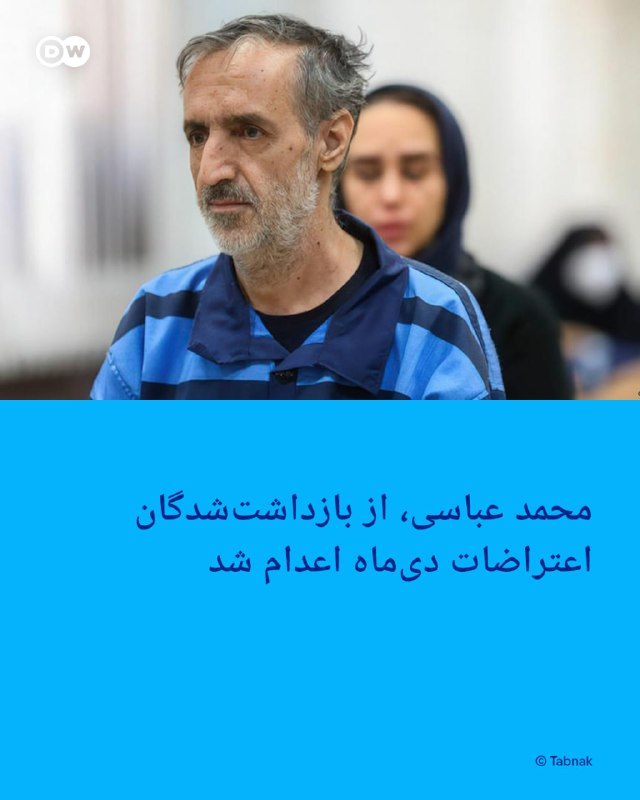

🔶 محمد عباسی، از بازداشت‌شدگان اعتراضات دی‌ماه، اعدام شد

به گزارش خبرگزاری میزان، وابسته قوه قضائیه جمهوری اسلامی، حکم اعدام محمد عباسی که از بازداشت‌شدگان اعتراضات دی ماه ۱۴۰۴ بود، به اجرا در آمد.
قوه قضائیه او را به "قتل" یک نظامی در جریان اعتراضات متهم کرده و از اعمال "قصاص" سخن گفته است. طبق اعلام این نهاد، اجرای حکم اعدام محمد عباسی با تایید نهایی دیوان عالی جمهوری اسلامی و به تقاضای اولیاء دم انجام شده است.

دیوان عالی همچنین حکم ۲۵ سال حبس فاطمه عباسی، دختر محمد عباسی را که در بند زنان زندان اوین در حبس به سر می‌برد، تایید کرد.

محمد عباسی اواخر دی ماه سال گذشته به اتهام "مشارکت در کشتن" یک مأمور حکومتی در ملارد بازداشت و از سوی دادگاه انقلاب به ریاست ابوالقاسم صلواتی به اعدام محکوم شده بود. این حکم هفتم اردیبهشت ماه سال جاری در شعبه ۳۹ دیوان عالی کشور تأیید شد.

هرانا، ارگان خبری مجموعه فعالان حقوق بشر ایران به نقل از یک منبع آگاه نزدیک به خانواده این زندانی سیاسی گزارش داد: «مسئولان زندان قزلحصار کرج از خانواده محمد عباسی خواستند که برای ملاقات با وی به زندان مراجعه کنند. اما پس از حضور خانواده در زندان، این امکان از نزدیکان او سلب شد. پس از خروج خانواده عباسی از زندان، آنها در تماسی تلفنی از اجرای حکم اعدام محمد عباسی مطلع شدند.»

به نوشته هرانا ابهامات و شبهات متعددی درباره روند رسیدگی و محتوای پرونده محمد عباسی و دخترش فاطمه وجود داشته، اما وکلای مستقل به دلیل محرومیت از دسترسی به پرونده امکان بررسی و پیگیری موثر آن را نداشته‌اند.

@dw_farsi

## DW_Farsi — post 124674

🔶 آغاز دیدار شی و ترامپ در سایه جنگ ایران

دیدار رسمی دونالد ترامپ، رئیس جمهور آمریکا و شی جین‌پینگ، همتای چینی او پنجشنبه ۱۴ مه (۲۴ اردیبهشت) آغاز شد. به گزارش رسانه‌های خبری شروع ملاقات و گفت‌وگوی رهبران ایالات متحده و چین دیدار با سخنان متقابل دوستانه همراه بود.

ترامپ پس از استقبال و تشریفات رسمی، رئیس جمهور چین را مورد ستایش قرار داد. شی نیز ابراز اطمینان کرد که نقاط مشترک پکن و واشنگتن بیشتر از موارد اختلاف بین دو کشور است. او تأکید کرد که موفقیت هر یک از دو کشور در عین حال فرصتی برای دیگری است.

چین و آمریکا که بزرگ‌ترین قدرت‌های اقتصادی جهان محسوب می‌شوند، در نزاعی تجاری به سر می‌برند.

ترامپ که در سال گذشته میلادی چین را به وضع تعرفه‌های تجاری سنگین تهدید کرده بود، در آغاز گفت‌وگوهای خود با شی در پکن از "آینده مشترک درخشان" دو کشور سخن گفت.

او همتای چینی را خود را "شخصیتی فوق‌العاده" خواند و خطاب به شی افزود: «گاهی خوششان نمی‌آید که من چنین چیزی بگویم، اما با وجود این، این نکته را بیان می‌کنم چون عین حقیقت است: دوستی با شما افتخار است.»

@dw_farsi

## DW_Farsi — post 124673

  

🔶 امارات متحده خبر سفر نتانیاهو به این کشور را تکذیب کرد

وزارت امور خارجه امارات متحده عربی اخبار و گزارش‌های مربوط به سفر بنیامین نتانیاهو به این کشور در حین جنگ آمریکا و اسرائیل با جمهوری اسلامی را تکذیب کرد.

در بیانیه این وزارتخانه در این رابطه منتشر شد، آماده است: «امارات متحده عربی گزارش‌های منتشرشده درباره سفر نخست‌وزير اسرائيل يا استقبال از يک هيات نظامی اسرائيلی را تکذيب می‌کند.»

این وزارتخانه تأکید کرده که روابط امارات و اسرائیل "علنی و بر پایه پیمان ابراهیم" است و از این رو تمامی سفرها و دیدارهای رسمی به شکل شفاف اعلام شده و انجام می‌گیرند".

دفتر بنیامین نتانیاهو چهارشنبه ۱۳ مه (۲۳ اردیبهشت) اعلام کرده بود، نخست وزیر اسرائیل در جریان جنگ ایران به‌طور محرمانه به امارات سفر کرده و با محمد بن زاید، رئیس امارات، دیدار داشته است. به گفته دفتر نتانیاهو این سفر به "یک دستاورد تاریخی" در روابط دو طرف منجر شده است.

پیش از آن وال استریت ژورنال در گزارشی نوشته بود دیوید بارنیا، رئیس موساد، نیز دست‌کم دو بار در ماه‌های مارس و آوریل به امارات سفر کرد تا درباره روند جنگ با ایران و هماهنگی‌های امنیتی با مقام‌های این کشور گفت‌وگو کند.

@dw_farsi

## DW_Farsi — post 124672

  

🔶 ابراز امیدواری روبیو به فشار بیشتر پکن بر تهران

مارکو روبیو اعلام کرد ایالات متحده به پشتیبانی بیشتر چین در راه یافتن راه‌حلی برای تنگه هرمز امیدوار است. وزیر خارجه آمریکا تصریح کرد: «ما امیدواریم چین را متقاعد کنیم که نقشی فعالانه‌تر برای متقاعد کردن ایران بازی کند تا تهران از آنچه در حال حاضر در خلیج فارس انجام می‌دهد و در تلاش برای انجام آن است، فاصله بگیرد.»

روبیو که دونالد ترامپ را در سفر به چین همراهی می‌کند، این اظهارات را در گفت‌وگو با شبکه فاکس نیوز که در هواپیمای "ایرفورس وان" انجام شد، ابراز کرد.

وزیر خارجه ایالات متحده در این گفت‌وگو تأکید کرد که رفع وضعیت کنونی حاکم در تنگه هرمز به دلایل مختلف به نفع چین است. با این حال از آنجایی که کشتی‌های چینی نیز در آب‌های خلیج فارس گرفتار شده‌اند. او افزود، اقتصاد چین بر محور صادرات فعالیت می‌کند و از فشارهای اقتصادی ناشی از بحران تنگه هرمز رنج می‌برد، زیرا کشورهای دیگر بر اثر این بحران کالاهای کمتری از چین خریداری می‌کنند.

اظهارات روبیو در تضاد با سخنان ترامپ قرار دارد. رئیس جمهور آمریکا در آغاز سفرش به پکن در پاسخ به این پرسش که آیا همتای چینی او، شی می‌تواند در جنگ ایران یاری‌دهنده باشد، گفت بود: «گمان می‌کنم، ما در مورد ایران به هیچ کمکی نیاز نداریم.»

@dw_farsi

## Persian_Trend_Official — post 14112

  <a href="telegram/content/Persian_Trend_Official_14112_1778751008.mp4" target="_blank">🎬 Download video</a>

🔴 عراقچی: این آمریکا است که تنگه هرمز را بسته، نه ایران

💢عباس عراقچی، وزیر خارجه جمهوری اسلامی ، اعلام کرد تهران تنگه هرمز را نبسته و این آمریکا است که با اقدامات خود محاصره ایجاد کرده است.

💢او گفت:

▪️ از نگاه جمهوری اسلامی ، تنگه هرمز برای تمامی کشتی‌های تجاری باز است

▪️ کشتی‌ها باید با نیروهای دریایی حمهوری اسلامی همکاری و هماهنگی داشته باشند

▪️ جمهوری اسلامی هیچ مانعی در مسیر عبور کشتی‌ها ایجاد نکرده است

▪️ آنچه اکنون در منطقه رخ می‌دهد، ناشی از محاصره و اقدامات آمریکا است

🫆:Tony

📌 @persian_trend_official
پرشین ترند | متفاوت‌ترین کانال نظامی

## Persian_Trend_Official — post 14111

  <a href="telegram/content/Persian_Trend_Official_14111_1778751010.mp4" target="_blank">🎬 Download video</a>

🔴ویدیویی از انفجار شناور کلاس سلیمانی نیرو دریایی سپاه در جنگ اخیر

🫆:Tony

📌 @persian_trend_official
پرشین ترند | متفاوت‌ترین کانال نظامی

## Persian_Trend_Official — post 14110

  <a href="telegram/content/Persian_Trend_Official_14110_1778751011.webm" target="_blank">🎬 Download video</a>

‼️🏦 یک مقام کاخ سفید:

✅ رئیس جمهور ترامپ و همتای چینی او بر سر لزوم باز نگه داشتن تنگه هرمز توافق کردند.
✅ ترامپ و همتای چینی‌اش توافق کردند که ایران نمی‌تواند سلاح هسته‌ای داشته باشد.

📝 Nick

📌 @persian_trend_official
پرشین ترند | متفاوت‌ترین کانال نظامی

## Persian_Trend_Official — post 14109

  <a href="telegram/content/Persian_Trend_Official_14109_1778751012.webm" target="_blank">🎬 Download video</a>

⭕️ سوپراپلیکیشن ایتا اعلام کرد امکان ارسال فایل تا حجم ۲۰ مگابایت مجدداً برای همه کاربران فراهم شده است!

کاش تلگرام بیاد از شما یاد بگیره 🤯

📝 Nick

📌 @persian_trend_official
پرشین ترند | متفاوت‌ترین کانال نظامی

## Persian_Trend_Official — post 14108

  <a href="telegram/content/Persian_Trend_Official_14108_1778751012.webm" target="_blank">🎬 Download video</a>

💢زلزله ای در کرمان رخ داده است 🫆:Tony 📌 @persian_trend_official پرشین ترند | متفاوت‌ترین کانال نظامی

## Persian_Trend_Official — post 14107

💢زلزله ای در کرمان رخ داده است

🫆:Tony

📌 @persian_trend_official
پرشین ترند | متفاوت‌ترین کانال نظامی

## Persian_Trend_Official — post 14106

  

🔴 روسیه یکی از سنگین‌ترین حملات خود را علیه اوکراین انجام داد

💢گزارش‌ها حاکی است روسیه طی ۲۴ ساعت گذشته یکی از بزرگ‌ترین حملات هوایی خود از آغاز جنگ را علیه اوکراین انجام داده است.

💢بر اساس اطلاعات منتشرشده:

▪️ بیش از ۱۴۰۰ پهپاد در این حمله استفاده شده است
▪️ همچنین بیش از ۵۰ موشک به‌سمت اهداف مختلف شلیک شده‌اند
▪️ موج نخست حملات مناطق غربی اوکراین را هدف قرار داد
▪️ سپس حملات به سمت کی‌یف گسترش یافت

🫆:Tony

📌 @persian_trend_official
پرشین ترند | متفاوت‌ترین کانال نظامی

## Persian_Trend_Official — post 14105

  <a href="telegram/content/Persian_Trend_Official_14105_1778751013.mp4" target="_blank">🎬 Download video</a>

⭕️ اتوبوس تیم ملی فوتبال رو با شعار مرگ بر آمریکا بدرقه کردن تا بره آمریکا...

پ.ن: چی بگم والا...

📝 Nick

📌 @persian_trend_official
پرشین ترند | متفاوت‌ترین کانال نظامی

## Persian_Trend_Official — post 14104

  

🔴 گزارش‌ها از توقیف یک شناور در نزدیکی فجیره توسط ایران

💢برخی گزارش‌ها حاکی است یک فروند شناور در فاصله حدود ۳۸ مایل دریایی از بندر فجیره امارات توسط نیروهای ایرانی توقیف شده و در حال حرکت به‌سمت آب‌های سرزمینی ایران است.

🫆:Tony

📌 @persian_trend_official
پرشین ترند | متفاوت‌ترین کانال نظامی

## Persian_Trend_Official — post 14103

⭕️ وزیر آموزش‌ و پرورش:

امتحانات نهایی ۲ هفته بعد از عادی شدن شرایط و پایان جنگ برگزار خواهند شد. ضمن اینکه در استان‌ها تصمیم‌گیری دربارۀ نحوۀ برگزاری امتحانات برعهدۀ استانداران خواهد بود.

پ.ن: دانش آموزان عزیز دعا کنید ماجرا مثل صدام عراق نشه که امتحانات‌تون یه 11 سالی‌ طول خواهد کشید. 🗿😂

📝 Nick

📌 @persian_trend_official
پرشین ترند | متفاوت‌ترین کانال نظامی

## Persian_Trend_Official — post 14102

گزارش صداوسیما از احسان افرشته و روایت عجیب از جاسوسی ! 📌 @persian_trend_official پرشین ترند | متفاوت‌ترین کانال نظامی

## Persian_Trend_Official — post 14101

  <a href="telegram/content/Persian_Trend_Official_14101_1778751015.mp4" target="_blank">🎬 Download video</a>

گزارش صداوسیما از احسان افرشته و روایت عجیب از جاسوسی !

📌 @persian_trend_official
پرشین ترند | متفاوت‌ترین کانال نظامی

## Persian_Trend_Official — post 14099

⭕️ وضعیت از 57 تا امروز... 🗿

(نسخه کم حجم توی کامنت ها)
📝 Nick

📌 @persian_trend_official
پرشین ترند | متفاوت‌ترین کانال نظامی

## Persian_Trend_Official — post 14098

  <a href="telegram/content/Persian_Trend_Official_14098_1778751017.webm" target="_blank">🎬 Download video</a>

⭕️ وزیر انرژی و معادن کوبا اعلام کرد که کشور به طور کامل از دیزل و نفت کوره خالی شده و تولید برق به صورت کامل متوقف شده است، در حالی که ایالات متحده جزیره را محاصره کرده است.

بسیاری از محله‌ها در پایتخت کوبا در حال حاضر با خاموشی‌هایی مواجه هستند که ۲۰ تا ۲۲ ساعت در روز طول می‌کشد.

📝 Nick

📌 @persian_trend_official
پرشین ترند | متفاوت‌ترین کانال نظامی

## Persian_Trend_Official — post 14093

  <a href="telegram/content/Persian_Trend_Official_14093_1778751018.webm" target="_blank">🎬 Download video</a>

باز مانده از رزمایش ضد هلی برن «قائد شهید» سپاه حضرت محمد رسول اللّه (ص) تهران بزرگ !!!

درسته جنگ زمینی تخصص شماست، فقط متخصصین عزیز پوتین نداشتید ؟

📌 @persian_trend_official
پرشین ترند | متفاوت‌ترین کانال نظامی

## Persian_Trend_Official — post 14092

کانال رسمی پرشین ترند pinned a voice message

## RadioFarda — post 157163

زیان بیشتر زنان در ایران از قطعی اینترنت؛ چون «بازار کار موازی» در حال فروپاشی است

🔸جمهوری اسلامی آخرین دور جدید قطع اینترنت را در ۹ اسفند ۱۴۰۴، همزمان با حملات آمریکا و اسرائیل به ایران، اعمال کرد.

🔸اگرچه واشینگتن و تهران در ۱۹ فروردین به آتش‌بسی شکننده دست یافتند، اما دسترسی به اینترنت هنوز برقرار نشده و شهروندان بیش از دو ماه است در تاریکی دیجیتال به سر می‌برند. تنها کسانی که توان پرداخت هزینه ابزارهای گران ضد فیلترینگ را دارند، همراه با افرادی که دسترسی مورد تأیید حکومت دارند، می‌توانند آنلاین شوند.

🔸زهرا بهروزآذر، معاون رئیس‌جمهور در امور زنان و خانواده، در ماه فروردین گفته بود که قطع اینترنت مشاغل «غیررسمی» زنان را به‌شدت محدود کرده است.

🔸او افزود که حدود یک‌سوم درخواست‌های بیمه بیکاری ثبت‌شده طی ۴۰ روز گذشته متعلق به زنان بوده است.

🔸مقام‌های جمهوری اسلامی می‌گویند نرخ مشارکت اقتصادی زنان در ایران ۱۸ درصد است. اما بسیاری از زنان کسب‌وکارهای کوچک آنلاین راه‌اندازی کرده یا در آن‌ها مشغول به کار بودند.

🔸بسیاری از آن‌ها درآمد خود را از دست داده‌اند، از جمله زنانی که کسب‌وکار اینترنتی داشتند یا در فروش آنلاین کار می‌کردند.

🔸 گزارش کامل را در وب‌سایت رادیو فردا می‌توانید بخوانید.

@RadioFarda

@RadioFarda

## RadioFarda — post 157162

شی جین‌پینگ در نشست با ترامپ: همکاری ما به نفع هر دو طرف و تقابل ما به ضرر هر دو است

🔸شی جین‌پینگ، رئیس جمهور چین، دیدار خود با دونالد ترامپ را با تأکید بر همکاری و مشارکت آغاز کرد: «وقتی ما همکاری می‌کنیم، هر دو طرف منتفع می‌شوند، و وقتی روبه‌روی هم قرار می‌گیریم، هر دو طرف ضرر می‌کنند.»

🔸این سرآغاز دیداری دو ساعته بود که شی با دونالد ترامپ صبح روز پنج‌شنبه، ۲۴ اردیبهشت، به وقت محلی در «تالار بزرگ خلق» در پایتخت چین داشت.

🔸شی جین‌پینگ همچنین تأکید کرد که اکنون مسئله مهم این است که آیا چین و آمریکا می‌توانند «پیشگام پارادایم جدیدی از مناسبات کشورهای بزرگ» باشند یا خیر.

🔸در پاسخ به سخنان رئیس‌جمهور چین، رئیس‌جمهور آمریکا نیز گفت: «شما رهبر بزرگی هستید، گاهی بعضی‌ها خوش‌شان نمی‌آید من این را بگویم، ولی من حرفم را می‌زنم.»

🔸گزارش کامل را در وب‌سایت رادیو فردا می‌توانید بخوانید.

@RadioFarda

## RadioFarda — post 157161

🔸انتشار تصاویری از رژه پادشاهی‌خواهان که لباس‌هایی با آرم ساواک به تن داشتند، در شهر رگنسبورگ آلمان با واکنش‌های زیادی همراه شده است.

🔸این افراد خود را «گروه مردمی ساواک» معرفی می‌کنند و خواهان «شناسایی عوامل جمهوری اسلامی و اپوزیسیون‌های جعلی و نفوذی» هستند.

🔸این اقدام با واکنش‌های زیادی در شبکه‌های اجتماعی همراه شده است. برخی کاربران آن را « سفید‌سازی» و «بازگشت به نمادهای سرکوب» و برخی خواستار «برخورد قانونی دولت آلمان» با این گونه اقدامات شده‌اند.

🔸برخی کاربران نیز این گونه اقدامات را مشابه عملکرد جمهوری اسلامی دانسته‌اند.

🔸ساواک، سازمان اطلاعات و امنیت کشور در ایران بود که طی چند دهه مسئولیت شناسایی، بازداشت، شکنجه و سرکوب مخالفان سیاسی حکومت پهلوی را بر عهد داشت.

@RadioFarda

## RadioFarda — post 157160

  

🔸 نخست‌وزیر ژاپن از عبور موفقیت‌آمیز یک نفتکش این کشور حامل نفت خام روز پنجشنبه ۲۴ اردیبهشت از تنگه هرمز عبور کرده و در راه ژاپن است.

🔸 سانائه تاکایچی با اعلام این خبر در شبکه ایکس نوشت پس از عبور یک کشتی متعلق به ژاپن در نهم اردیبهشت از تنگه هرمز، عبور کشتی دوم به‌عنوان یک تحول مثبت ارزیابی می‌شود.

🔸 میاتا توموهیده، مدیرعامل شرکت انیوس، بزرگ‌ترین گروه پالایشی ژاپن که این نفتکش هم زیرمجموعهٔ آن است، گفت این نفتکش با موفقیت از تنگه هرمز عبور کرده و انتظار می‌رود اواخر ماه مه یا اوایل ژوئن به ژاپن برسد.

🔸 بر اساس داده‌های شرکت «کلپر»، این کشتی حامل ۱.۲ میلیون بشکه نفت خام کویت و ۷۰۰ هزار بشکه نفت امارات است.

🔸 ژاپن پیش از آغاز جنگ حدود ۹۵ درصد نفت خود را از کشورهای حوزه خلیج فارس وارد می‌کرد.

🔸 وزارت خارجهٔ ژاپن اعلام کرده دولت این کشور برای عبور ایمن کشتی‌ها مستقیماً با حکومت ایران در تماس بوده است. به‌گفتهٔ این وزارتخانه، هنوز ۳۹ کشتی مرتبط با ژاپن در خلیج فارس باقی مانده‌اند.

@RadioFarda

## RadioFarda — post 157159

🔸 رئیس‌جمهور آمریکا با همتای چینی خود شی ژین‌پینگ صبح روز پنج‌شنبه ۲۳ اردیبهشت در پایتخت چین دیدار رسمی کرد.

🔸 دونالد ترامپ به‌عنوان نخستین رئیس‌جمهور ایالات متحده که در نزدیک به یک دهۀ اخیر به پکن سفر کرده، امیدوار است در این سفر به موفقیت‌های تجاری رسیده و «آتش‌بس شکنندۀ تجاری» میان دو ابرقدرت را، حفظ کند.

🔸 مدیران ارشد تجاری و فناوری که رئیس‌جمهور آمریکا را در این سفر همراهی می‌کنند، امیدوارند بتوانند برخی موانع تجاری میان دو کشور را برطرف کنند؛ از جمله مدیر عامل شرکت انویدیا که برای دریافت مجوز فروش تراشه‌های قدرتمند هوش مصنوعی خود موسوم به اچ ۲۰۰، دردسر زیادی کشیده است.

@RadioFarda

## RadioFarda — post 157158

  

🔸مارکو روبیو، وزیر خارجه آمریکا، می‌گوید به نفع چین است که حکومت ایران را برای باز کردن تنگه هرمز تحت فشار بگذارد.

🔸براساس گزارشی که فاکس‌نیوز از اظهارات روبیو در راه سفر به چین پخش کرد، او گفت: «ما این استدلال را با چینی‌ها مطرح کرده‌ایم و امیدوارم قانع‌کننده باشد. آن‌ها اواخر این هفته در سازمان ملل فرصت خواهند داشت دربارهٔ این موضوع اقدامی انجام دهند؛ زمانی که قطعنامه‌ای برای محکوم کردن اقدامات ایران در ارتباط با تنگه‌ها مطرح می‌شود.»

🔸روبیو گفت حکومت ایران در حال ایجاد ظرفیتی بوده که بتواند با «انبوهی از موشک‌ها و پهپادها» سامانه‌های دفاعی کشورهای منطقه را از کار بیندازد و هرگونه حملهٔ احتمالی به برنامه هسته‌ای خود را با تهدید به وارد کردن خسارت گسترده به کشورهای خلیج فارس پاسخ دهد.

🔸مارکو روبیو همچنین با اشاره به بحران تنگه هرمز، گفت این وضعیت بیش از هر کشور دیگری به زیان چین است و پکن باید ایران را برای عقب‌نشینی از اقداماتش تحت فشار بگذارد.

@RadioFarda

## RadioFarda — post 157156

  

🔸وزارت خارجه امارات متحده عربی در بیانیه‌ای ادعای دفتر بنیامین نتانیاهو، نخست‌وزیر اسرائیل، مبنی بر سفر او به امارات در جریان جنگ ایران را تکذیب کرد.

🔸دفتر نخست‌وزیر اسرائیل پیش‌تر اعلام کرده بود که نتانیاهو در جریان جنگ با ایران به امارات سفر کرده و با شیخ محمد بن زاید، رئیس این کشور و حاکم ابوظبی دیدار داشته است.

🔸در بیانیه وزارت خارجه امارات که چهارشنبه ۲۴ اردیبهشت منتشر شده، آمده که روابط این کشور با اسرائیل «علنی» است و «بر پایه توافقات غیرشفاف یا غیررسمی بنا نشده است.»

🔸در این بیانیه تأکید شده: «هرگونه ادعا درباره سفرهای اعلام‌نشده یا توافقات پنهانی، مگر آنکه به‌طور رسمی توسط مقام‌های ذی‌ربط امارات اعلام شود، کاملاً بی‌اساس است.»

🔸دفتر نتانیاهو گفته بود که این دیدار به یک «پیشرفت تاریخی» در روابط میان دو کشور منجر شده است.

🔸با این حال یک منبع آگاه از این دیدار به رویترز گفت که نتانیاهو و شیخ محمد، ششم فروردین در شهر العین، واحه‌ای در نزدیکی مرز عمان، «دیدار کرده‌اند و ملاقات آنها چندین ساعت به طول انجامیده است».

@RadioFarda

## RadioFarda — post 157155

  <a href="https://t.me/radiofarda/157155" target="_blank">📎 Download file</a>

📻بشنوید: سرخط خبرها با رادیوفردا، ۲۴ اردیبهشت ۱۴۰۵‌

@RadioFarda

## IranianMinds — post 20113

  <a href="telegram/content/IranianMinds_20113_1778751020.mp4" target="_blank">🎬 Download video</a>

🔴 جان بولتون:

مذاکره برای توافق هسته ‌ای با ایران، هدر دادن وقته.

این ‌ها دهه ‌ها پیش تصمیم راهبردی ‌شان را برای رسیدن به سلاح هسته‌ای گرفته‌اند.

در این ۴۷ سال اخیر حتی یک مدرک هم وجود نداشته که نشان بدهد از این هدف ساخت سلاح هسته ای عقب کشیده‌ اند.

@IranianMinds

## IranianMinds — post 20112

  <a href="telegram/content/IranianMinds_20112_1778751022.mp4" target="_blank">🎬 Download video</a>

🔴 نتانیاهو:

همون ‌طور که یه متفکری یه بار فکر کنم تو روسیه بود بهم گفت اسرائیل یه ابرقدرت کوچیکه، ولی بازم ابرقدرته.

ما قراره به یه ابرقدرت بزرگ و جهانی تبدیل بشیم.

@IranianMinds

## IranianMinds — post 20111

🔴 مهدی تاج رئیس فدراسیون فوتبال : معین قراره برای تیم ملی یه آهنگ بخونه ! @IranianMinds

## IranianMinds — post 20110

  

🔴 سازمان تجارت دریایی بریتانیا گزارش داد که یک حادثه در فاصله ۳۸ مایل دریایی شمال‌شرق فجیره در امارات رخ داده است.

گزارش‌ها حاکی است که یک کشتی لنگر گرفته توسط افراد غیرمجاز مورد بازدید قرار گرفته و اکنون به سمت آب‌های سرزمینی ایران در حرکت است.

@IranianMinds

## IranianMinds — post 20109

  

😤دنبال یه سایت شرط بندی بین المللی بودی که به ایرانیا خدمات بده؟!
⛔

👍دربی بت همون انتخاب  100%

💎ویژگی های سایت جهانی Derby Bet:

⬅️امکان شارژ امن با کارت بانکی

⬅️واریز اول دوبل شارژ می شوید(بونوس۱۰۰٪)

⬅️پر اپشن ترین سایت فعال در ایران

⬅️تسویه حساب کمتر از 5 دقیقه

⬅️برگشت بخشی از باخت به صورت هفتگی

🚨کد هدیه ثبت نام:GG007

⚠️برای دانلود اپلکیشن کلیک کنید
👉
re24

🔔کانال دربی بت :

🪙https://t.me/+aCbq7yy8QY80NzQ0

## IranianMinds — post 20107

  

ترامپ و رئیس جمهور‌ چین در معبد بهشت پکن

@IranianMinds

## IranianMinds — post 20105

  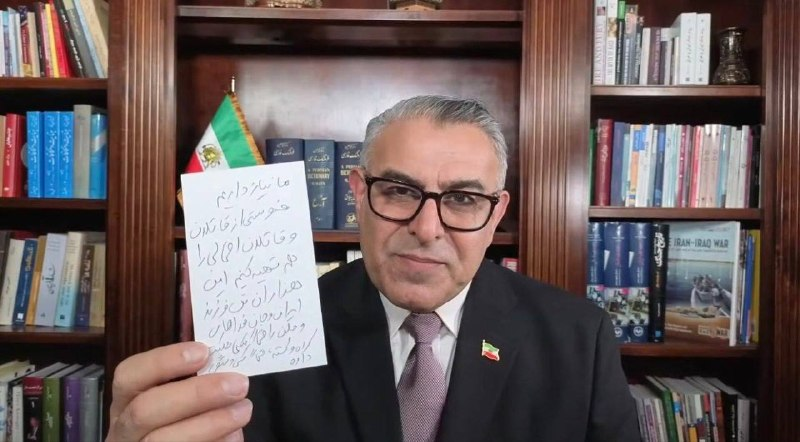

🔴 مراد ویسی :

قصد دارم لیستی از قاتلان مردم ایران در دی ماه تهیه کنم و هر شب اسم هاشون رو‌ در لایو بخونم.

@IranianMinds

## IranianMinds — post 20104

🔴 الجزیره :

مذاکرات و صحبتای ترامپ و رئیس جمهور چین در تالار پکن پایان یافت

@IranianMinds

## IranianMinds — post 20103

  <a href="telegram/content/IranianMinds_20103_1778751027.mp4" target="_blank">🎬 Download video</a>

🔴 ترامپ به رئیس‌ جمهور چین:

افتخار دارم که در کنار شما هستم. افتخار دارم که دوست شما هستم و روابط بین چین و ایالات متحده بهتر از همیشه خواهد شد.

@IranianMinds

## IranianMinds — post 20102

  <a href="telegram/content/IranianMinds_20102_1778751028.mp4" target="_blank">🎬 Download video</a>

🔴 ترامپ به رئیس‌ جمهور چین:

شما یک رهبر بزرگ هستید. به همه می‌گویم که شما یک رهبر بزرگ هستید. گاهی مردم از گفتن این حرف توسط من خوششان نمی‌آید، اما با این حال می‌گویم چون حقیقت است.

من فقط حقیقت را می‌گویم.

@IranianMinds

## IranianMinds — post 20101

  <a href="telegram/content/IranianMinds_20101_1778751029.mp4" target="_blank">🎬 Download video</a>

🔴 رئیس ‌جمهور چین به ترامپ:

همیشه معتقد بودم که دو کشور ما منافع مشترک بیشتری نسبت به اختلافات داریم.

موفقیت یکی، فرصتی برای دیگری است و یک رابطه دوجانبه باثبات برای جهان مفید است.

چین و ایالات متحده هر دو از همکاری بهره می‌برند و از مواجهه ضرر می‌کنند. ما باید شریک باشیم، نه رقیب.

باید به یکدیگر کمک کنیم تا موفق شویم، با هم رونق پیدا کنیم و راه درست برای تعامل کشورهای بزرگ در عصر جدید را بیابیم.

@IranianMinds

## IranianMinds — post 20100

  <a href="telegram/content/IranianMinds_20100_1778751031.mp4" target="_blank">🎬 Download video</a>

🔴 رئیس ‌جمهور چین به ترامپ:

در حال حاضر، تحولی که در یک قرن گذشته دیده نشده در سراسر جهان شتاب گرفته و وضعیت بین‌المللی سیال و پرآشوب است.

جهان به یک چهارراه جدید رسیده است.

@IranianMinds

## IranianMinds — post 20099

  <a href="telegram/content/IranianMinds_20099_1778751033.mp4" target="_blank">🎬 Download video</a>

🔴 رئیس ‌جمهور چین به ترامپ:

آیا می‌توانیم، به نفع رفاه مردم هر دو کشور و آینده بشریت، آینده‌ای روشن‌تر برای روابط دوجانبه‌مان بسازیم؟

@IranianMinds

## IranianMinds — post 20098

  <a href="telegram/content/IranianMinds_20098_1778751034.mp4" target="_blank">🎬 Download video</a>

🔴 رئیس ‌جمهور چین به ترامپ:

تمام جهان در حال تماشای دیدار ماست

@IranianMindsi

## IranianMinds — post 20097

🔴 مارکو روبیو:

واشنگتن به پکن روشن کرد که هرگونه حمایت از ایران به روابط دوجانبه آسیب می رساند

@IranianMinds

## IranianMinds — post 20096

  <a href="telegram/content/IranianMinds_20096_1778751036.mp4" target="_blank">🎬 Download video</a>

🔴 لحظه ی دیدار ترامپ و رئیس جمهور‌ چین

@IranianMinds

## BBCPersian — post 281019

🔻مرکز تجارت دریایی بریتانیا: یک کشتی در نزدیکی امارات تصرف شده و به سمت ایران در حرکت است

یک کشتی در نزدیکی سواحل امارات متحده عربی و حوالی تنگه هرمز «به تصرف افراد ناشناس درآمده و اکنون در حال حرکت به سمت آب‌های سرزمینی ایران است.»

مرکز تجارت دریایی بریتانیا روز پنج‌شنبه با اعلام این خبر گفت که این کشتی در فاصله حدود ۷۰ کیلومتری شمال‌شرقی فجیره به «تصرف افراد ناشناس درآمده است.»

تنگه هرمز، به عنوان حیاتی‌ترین گذرگاه انرژی جهان، یک محور مهم اختلافات ایران و آمریکاست.

پس از جنگ آمریکا و اسرائیل علیه ایران، تهرن این تنگه را مسدود کرد و آمریکا هم از ۱۳ آوریل (۲۴ فروردین) یک محاصره دریایی را بر تمام بنادر و سواحل جنوبی ایران اجرا کرده است، به‌طوری که هیچ کشتی اجازه حرکت از مبدا و به مقصد بنادر ایرانی را ندارد.

حدود ۲۰ درصد از نفت و گاز طبیعی مایع جهان از این آبراه حیاتی منتقل می‌شود که مسدود شدن آن باعث افزایش شدید قیمت‌ها در سطح جهان شده است.
https://bbc.in/4fkRCIA
@BBCPersian

## BBCPersian — post 281018

  

عباس عراقچی، وزیر خارجه ایران برای شرکت در نشست وزیران امور خارجه بریکس به هند سفر کرده است. جنگ ایران و بحران سوخت مرتبط با آن، بر گفت‌وگوهای این نشست دو روزه سایه انداخته است.

هند میزبان این نشست نسبت به «نوسان قابل توجه» در وضعیت بین‌المللی هشدار داد و گفت درگیری‌ها باعث بی‌ثباتی اقتصادی و ناامنی انرژی شده‌اند.

سوبرامانیام جایشانکار، وزیر امور خارجه هند، در سخنرانی افتتاحیه خود گفت: «ما در زمانی با نوسان قابل توجه در روابط بین‌الملل گرد هم آمده‌ایم.»

آقای جایشانکار افزود: «درگیری‌های جاری، نااطمینانی‌های اقتصادی و چالش‌ها در تجارت، فناوری و اقلیم، در حال شکل دادن به چشم‌انداز جهانی هستند.»

او گفت: «انتظار فزاینده‌ای، به‌ویژه از سوی اقتصادهای نوظهور و کشورهای در حال توسعه، وجود دارد که بریکس نقش سازنده و تثبیت‌کننده‌ای ایفا کند.»

بریکس نام گروهی به رهبری برخی از کشورهایی است که اقتصادی نوظهور در جهان دارند. برزیل، روسیه، هند، چین و آفریقای جنوبی اعضای اصلی بریکس هستند. نام بریکس از حروف اول نام کشورهای عضو به زبان انگلیسی گرفته شده است.

📷EPA/Shutterstock
https://bbc.in/4fkRCIA
@BBCPersian

## BBCPersian — post 281009

‌
دختر کیم جونگ‌اون بیشتر از همیشه با لباس‌هایی از برندهای لوکس طراحان غربی در عکس‌ها ظاهر می‌شود، برندهایی که در کره شمالی به دلیل «ضدسوسیالیستی» بودن ممنوع‌اند.

اما لباس‌های کیم جو ئه، از لباس‌های چرمی و مدل موی «خروسی» گرفته تا حتی پیراهن با آستین توری، بیش از آنکه نشانه سرکشی نوجوانانه باشد، نشان می‌دهد او برای جانشینی مقام رهبر عالی کره شمالی آماده می‌شود.

او برای نخستین بار در ۹ سالگی، در نوامبر ۲۰۲۲، در حالی که کنار پدرش در برابر یک موشک بالستیک قاره‌پیمای عظیم قدم می‌زد، به شکل رسمی دیده شد. اما همان زمان هم با موهای بسته از پشت، شلوار مشکی و کاپشن سفید پفی، ظاهری حساب‌شده داشت.

از آن زمان، مدل موی او هرچه بیشتر آراسته و شیک شده و پوشش او نیز به‌تدریج ظریف‌تر، مجلل‌تر و پخته‌تر جلوه می‌کند.

اکنون گزارش‌ها حاکی است که برخی می‌خواهند از سبک شیک و آراسته جو آئه الگوبرداری کنند.

مطلب را از لینک ⬇️ در سایت بی‌بی‌سی فارسی بخوانید.
https://bbc.in/3Pfgjf9

📸GettyImages/ News1/ Reuters/ EPA/Shutterstock/ LightRocket via Getty Images/ AFP via Getty Images

@BBCPersian

## BBCPersian — post 281007

‌ یونهاپ،‌ خبرگزاری رسمی کره‌جنوبی، روز پنج‌شنبه به نقل از یک مقام ارشد در سئول گزارش داد احتمال این که طرفی غیر از ایران مسئول حمله به یک کشتی باری کره‌جنوبی در نزدیکی تنگه هرمز باشد، کم است. در این گزارش به نقل از یک مقام ارشد کره‌جنوبی آمده است که این…

## BBCPersian — post 281006

  

‌
یونهاپ،‌ خبرگزاری رسمی کره‌جنوبی، روز پنج‌شنبه به نقل از یک مقام ارشد در سئول گزارش داد احتمال این که طرفی غیر از ایران مسئول حمله به یک کشتی باری کره‌جنوبی در نزدیکی تنگه هرمز باشد، کم است.

در این گزارش به نقل از یک مقام ارشد کره‌جنوبی آمده است که این کشور در حال بررسی اطلاعاتی است که آمریکا درباره حمله چهارم مه (۱۴ اردیبهشت) به کشتی «نامو» متعلق به شرکت کشتیرانی «اچ‌ام‌ام» کره‌جنوبی در اختیارش گذاشته است. این حمله باعث آتش‌سوزی و آسیب به بخشی از بدنه کشتی شد.

این مقام ارشد وزارت خارجه کره‌جنوبی به خبرنگاران گفت:«وقتی تحقیقات را کامل کنیم و شواهد را ارائه دهیم، اطمینان دارم طرف ایرانی واکنشی مناسب نشان خواهد داد.»

وزارت خارجه کره‌جنوبی تاکنون اظهارات این مقام را تأیید نکرده است.

📷South Korean Foreign Ministry/Reuters
@BBCPersian
⬇️

## BBCPersian — post 281005

🔻یک کمیسیون تحقیق اسرائیلی: حماس در حملات هفت اکتبر از خشونت جنسی به عنوان «سلاح» استفاده کرد

یک کمیسیون مستقل اسرائیلی جزئیات تکان‌دهنده‌ای از خشونت جنسی «سیستماتیک و گسترده» توسط حماس و سایر گروه‌های مسلح فلسطینی در جریان حملات ۷ اکتبر ۲۰۲۳ و علیه گروگان‌ها منتشر کرده است.

گزارش ۳۰۰ صفحه‌ای این کمیسیون نتیجه‌گیری می‌کند که تجاوز و شکنجه جنسی «با هدف به حداکثر رساندن درد و رنج» انجام شده است.

در حالی که سازمان ملل متحد و دیگران گزارش‌هایی در مورد خشونت جنسی در جریان این حملات منتشر کرده‌اند گفته می‌شود که گزارش این کمیسیون مستقل جامع‌ترین گزارش است.

حماس در حمله هفتم اکتبر ۲۰۲۳، حدود ۱۲۰۰ نفر را کشت و ۲۵۱ نفر را گروگان گرفت.

این گزارش بر اساس ۴۳۰ مصاحبه فیلمبرداری شده با بازماندگان و شاهدان آن حمله، بیش از ۱۰ هزار عکس و فیلم گرفته شده توسط مهاجمان و سوابق و مدارک رسمی از محل‌های حمله تهیه شده است.

بیشتر بخوانید:

https://bbc.in/4divTP2
@BBCPersian

## BBCPersian — post 280997

‌‌
رسانه‌ها و محافل سیاسی تندرو در ایران، به شکل روزافزونی تنگه هرمز را نه‌تنها به عنوان یک گلوگاه انرژی، بلکه به عنوان مسیری استراتژیک برای ترافیک جهانی اینترنت معرفی می‌کنند.

آنها معتقدند اهرم فشار جدید ایران در زیر آب‌های تنگه و در قالب کابل‌های بین‌المللی انتقال داده پنهان شده است. این بحث در شرایطی مطرح می‌شود که پس از درگیری‌های نظامی اخیر در اطراف تنگه هرمز، تنش‌ها میان ایران، آمریکا و کشورهای خلیج فارس افزایش یافته است. بر اساس این دیدگاه، ایران می‌تواند بر کابل‌های زیردریایی عبوری از تنگه، نظارت امنیتی و مقرراتی اعمال کند یا حتی برای عبور آنها عوارض تعیین کند.

هرچند چنین اقدامی با موانع حقوقی و فنی بسیار زیادی روبه‌رو است، اما این بحث نشان‌دهنده تلاش جدی ایران برای گسترش ابزارهای بازدارندگی نامتقارن به حوزه حساس زیرساخت‌های دیجیتال و فراتر از نفتکش‌ها است.

آیا کابل‌های زیردریایی اینترنت به سلاح تازه ایران در خلیج فارس تبدیل می‌شود؟

از لینک ⬇️ این مطلب را در سایت بی‌بی‌سی فارسی بخوانید.
https://bbc.in/4dGOl58

📸GettyImages/ AFP via Getty Images/ FARS
@BBCPersian

## idfinfarsi — post 11578

  

🔵اورشلیم، شهر ادیان و پایتخت ابدی اسرائیل. در روز اورشلیم، ما اتحاد شهری را جشن می‌گیریم که گذشته‌ای کهن و آینده‌ای امیدوار را به هم پیوند می‌دهد. سال نو مبارک، برای اورشلیم و ساکنانش.

## Dirty_Kids — post 389424

  

لاشیا فهمیدن ما عرقو با دوغ میخوریم

@Dirty_Kids 👻

## Dirty_Kids — post 389423

  

عکس پروفایل معلمای ادبیات

@Dirty_Kids 👻

## Dirty_Kids — post 389422

جدی پیک می تر از این جنده های حجابی تو دانشگاه وجود نداره، یارو سال اول کارشناسی کامپیوتره بعد استیکر زده رو لپ تاپش LEAVE ME ALONE IM CODING، بیا برو کیرم تو کدت شد

@Dirty_Kids 👻

## Dirty_Kids — post 389421

  <a href="telegram/content/Dirty_Kids_389421_1778751040.mp4" target="_blank">🎬 Download video</a>

پلیس شریف دانمارک vs طرفداران تروریسم جهانی

@Dirty_Kids 👻

## Dirty_Kids — post 389420

  

مانوک خدابخشیان: "فعالیتی که برای براندازی پهلوی سوم وجود داره، برای براندازی رژیم وجود نداره. همه تلاش می‌کنند که این شاهزاده پهلوی به ایران برنگرده‌."
روحت شاد عمومانوک

@Dirty_Kids 👻

## Dirty_Kids — post 389416

  <a href="telegram/content/Dirty_Kids_389416_1778751042.mp4" target="_blank">🎬 Download video</a>

#تکمیلی
یه پسره حدود 2 میلیون دلار هزینه کرده تا آلیس رزنبلوم | Alice Rosenblum دختر 19 ساله آمریکایی که مدل اونلی‌فنزه رو از نزدیک ببینه؛

پسره تا رسید بهش گفت چاق‌تر از عکساتی و من روزی 3 بار باهات خودارضایی می‌کنم...

تهشم فقط به دختره دست داد که آلیس چندشش شد و گفت اگه میشه بندازینش بیرون چون داره من رو می‌ترسونه!

@Dirty_Kids 👻

## Hranews — post 112941

دادستان مشهد دستور توقیف اموال یک شهروند خارج از کشور را صادر کرد

❗️
❗️
❗️
❗️
❗️– دادستان مشهد از صدور دستور شناسایی و #توقیف_اموال یک شهروند ساکن خارج از کشور خبر داد. به گفته وی، این اقدام به‌دلیل فعالیت علیه نظام از سوی این فرد صورت گرفته است.

ادامه مطلب
↘️
@hranews_bot تماس ✉️ - @Hranews کانال هرانا 🆑

## Hranews — post 112940

  

بر اساس آخرین داده‌های نت‌ بلاکس، قطع اینترنت در ایران پس از گذشت ۱۸۰۰ ساعت، وارد هفتادوششمین روز خود شده است. این نهاد ناظر بر وضعیت دسترسی به اینترنت در جهان اعلام کرد که محدودیت‌های اعمال‌ شده بر پایه نوعی ساختار طبقاتی دنبال می‌شود؛ به‌گونه‌ای که تنها گروهی محدود به #اینترنت دسترسی دارند و عموم شهروندان همچنان در خاموشی دیجیتال به‌سر می‌برند. نت‌ بلاکس این وضعیت را مشابه همان ساختار تبعیض‌آمیزی توصیف کرده که مقام‌های جمهوری اسلامی مدعی مخالفت با آن هستند.

↘️
@hranews_bot تماس ✉️ - @Hranews کانال هرانا 🆑

## Hranews — post 112939

کیفرخواست پرونده صادق زیباکلام و مدیرمسئول خبرگزاری آنا صادر شد

❗️
❗️
❗️
❗️
❗️– مرکز رسانه قوه قضاییه از صدور کیفرخواست علیه صادق زیباکلام و مدیرمسئول خبرگزاری آنا خبر داد. همچنین بر اساس تصمیم قضایی، آقای زیباکلام به مدت سه ماه از هرگونه فعالیت رسانه‌ای و تولید محتوا در شبکه‌های اجتماعی منع شده است.

#صادق_زیباکلام

ادامه مطلب

↘️
@hranews_bot تماس ✉️ - @Hranews کانال هرانا 🆑

## Hranews — post 112938

اموال ۴۸ شهروند در استان همدان مصادره شد

❗️
❗️
❗️
❗️
❗️– دارایی‌ها و اموال ۴۸ شهروند در استان همدان توقیف شد. دستگاه قضایی این افراد را متهم به «همکاری با دشمن» دانسته است. ۴۲ تن از این شهروندان ساکن کشور‌های خارجی و مابقی در ایران سکونت دارند.

ادامه مطلب

↘️
@hranews_bot تماس ✉️ - @Hranews کانال هرانا 🆑

## manototv — post 105434

  <a href="telegram/content/manototv_105434_1778751045.mp4" target="_blank">🎬 Download video</a>

رسانه‌های داخلی ایران گزارش دادند زمین‌لرزه‌ای به بزرگی ۵ ریشتر منطقه بردسیر در استان کرمان را لرزاند.
بر اساس این گزارش‌ها، کانون زلزله در عمق ۸ کیلومتری زمین و در نزدیکی روستای کمال‌آباد از توابع شهرستان بردسیر بوده است. هلال‌احمر اعلام کرد دو تیم ارزیاب برای بررسی وضعیت به منطقه اعزام شده‌اند.

## manototv — post 105433

  <a href="telegram/content/manototv_105433_1778751045.mp4" target="_blank">🎬 Download video</a>

گروه ناظر اینترنتی نت‌بلاکس اعلام کرد قطعی اینترنت در ایران امروز وارد هفتادوششمین روز خود شده و از مرز ۱۸۰۰ ساعت گذشته است.
نت‌بلاکس می‌گوید این محدودیت‌ها بر پایه دسترسی گزینشی و طبقاتی اعمال شده؛ به‌طوری که گروه‌های خاص به اینترنت دسترسی دارند، اما بخش بزرگی از شهروندان همچنان با محدودیت و اختلال گسترده مواجه‌اند

## manototv — post 105432

  <a href="telegram/content/manototv_105432_1778751046.mp4" target="_blank">🎬 Download video</a>

سازمان دریانوردی تجاری بریتانیا اعلام کرد یک کشتی در سواحل امارات و در نزدیکی تنگه هرمز دچار حادثه شده است.
بر اساس این گزارش، افرادی «غیرمجاز» کنترل این کشتی را در دست گرفته‌اند و شناور اکنون به‌سمت آب‌های سرزمینی ایران در حرکت است. این نهاد دریایی بریتانیا اعلام کرد کشتی در فاصله ۳۸ مایلی سواحل فجیره قرار داشته است.

## manototv — post 105431

  <a href="telegram/content/manototv_105431_1778751046.mp4" target="_blank">🎬 Download video</a>

پلیس بریتانیا اعلام کرد دومین فرد در چارچوب تحقیقات ضدتروریسم درباره آتش‌سوزی در یک کنیسه در شرق لندن متهم شده است.
براساس اعلام پلیس، یک مرد ۳۱ ساله در ارتباط با این حمله بازداشت و تفهیم اتهام شده و تحقیقات درباره انگیزه و جزئیات حادثه ادامه دارد.

## manototv — post 105430

  <a href="telegram/content/manototv_105430_1778751047.mp4" target="_blank">🎬 Download video</a>

همزمان با آغاز نشست وزیران خارجه کشورهای عضو بریکس در دهلی‌نو، عباس عراقچی، وزیر خارجه ایران، از اعضای این گروه و «همه کشورهای مسئول جامعه جهانی» خواست حملات آمریکا و اسرائیل علیه ایران را به‌صراحت محکوم کنند.
خبرگزاری رویترز گزارش داد جنگ ایران و اسرائیل بر نشست دو روزه بریکس در هند سایه انداخته و اختلاف‌ها میان اعضا، رسیدن به موضعی مشترک و صدور بیانیه نهایی را دشوار کرده است. ایران از هند، رئیس دوره‌ای بریکس، خواسته از این نشست برای ایجاد اجماع علیه واشینگتن و تل‌آویو استفاده کند

## manototv — post 105428

  <a href="telegram/content/manototv_105428_1778751047.mp4" target="_blank">🎬 Download video</a>

رسانه‌های وابسته به قوه قضاییه جمهوری اسلامی گزارش دادند با دستور مقام قضایی در استان همدان، اموال ۴۷ نفر که به «جاسوسی» و «همکاری با رژیم اسرائیل» متهم شده‌اند، توقیف شده است.
براساس این گزارش‌ها، این افراد در کشورهای مختلف از جمله بریتانیا، آلمان، آمریکا، ترکیه، عراق و سوئیس اقامت دارند و مقام‌های قضایی جمهوری اسلامی اعلام کرده‌اند پرونده آن‌ها در حال بررسی است. به گفته رسانه میزان، اموال توقیف‌شده قرار است برای «بازسازی اماکن آسیب‌دیده از جنگ» هزینه شود.

## manototv — post 105427

  <a href="telegram/content/manototv_105427_1778751048.mp4" target="_blank">🎬 Download video</a>

دونالد ترامپ، رئیس‌جمهوری آمریکا، در دیدار با شی جین‌پینگ در پکن، این نشست را «بسیار مهم» توصیف کرد و گفت توجه گسترده‌ای در آمریکا و جهان به این دیدار وجود دارد.
ترامپ با اشاره به اهمیت این مذاکرات گفت برخی این نشست را «بزرگ‌ترین دیدار تاریخ» می‌دانند و تاکید کرد مردم آمریکا تقریبا درباره موضوع دیگری صحبت نمی‌کنند. او همچنین حضور در کنار شی جین‌پینگ را «باعث افتخار» دانست و ابراز امیدواری کرد روابط میان آمریکا و چین «بهتر از هر زمان دیگری» شود.

## manototv — post 105426

  <a href="telegram/content/manototv_105426_1778751049.mp4" target="_blank">🎬 Download video</a>

دونالد ترامپ و شی جین‌پینگ، روسای جمهوری آمریکا و چین، در پکن دیدار کردند؛ دیداری که با مراسمی گسترده و تشریفات پرزرق‌وبرق همراه بود و صبح پنج‌شنبه با حضور هیات‌های بلندپایه دو کشور برگزار شد.
ترامپ در سخنان آغازین خود این دیدار را «باعث افتخار» توصیف کرد و گفت:
«رئیس‌جمهوری شی، بسیار سپاسگزارم. چنین استقبالی کمتر دیده‌ام. بیش از همه تحت تأثیر کودکان قرار گرفتم؛ شاد و فوق‌العاده بودند. ارتش چین قدرتمند بود، اما آن کودکان چیزهای زیادی را نمایندگی می‌کنند.»

## manototv — post 105425

  <a href="telegram/content/manototv_105425_1778751050.mp4" target="_blank">🎬 Download video</a>

دونالد ترامپ، رئیس‌جمهوری آمریکا، صبح پنج‌شنبه در جریان سفر خود به پکن همراه با شی جین‌پینگ، رئیس‌جمهوری چین، در مراسم رسمی استقبال و رژه نیروهای نظامی این کشور شرکت کرد.
این مراسم در مقابل ساختمان «تالار بزرگ خلق» برگزار شد و دو رهبر ضمن بازدید از یگان‌های نظامی، شاهد اجرای مراسم سان و رژه نیروهای ارتش چین بودند.

## alonews — post 119891

  <a href="telegram/content/alonews_119891_1778751052.mp4" target="_blank">🎬 Download video</a>

👈عراقچی: ما تنگه هرمز را نبسته‌ایم، آمریکا بسته!

🔴از نظر ما، تنگه هرمز برای تمامی کشتی‌های تجاری باز است، اما آن‌ها باید با نیروهای دریایی ما همکاری کنند.

🔴ما هیچ مانعی در تنگه هرمز ایجاد نکرده‌ایم؛ این آمریکاست که محاصره ایجاد کرده است

✅ @AloNews خبر جنگ

## alonews — post 119890

  <a href="telegram/content/alonews_119890_1778751053.webm" target="_blank">🎬 Download video</a>

👈سی‌ان‌ان: کاخ سفید می‌گوید ایران بر مذاکرات «خوب» ترامپ و شی جین پینگ سایه افکنده است

🔴کاخ سفید روز اول مذاکرات پرمخاطره بین دونالد ترامپ، رئیس جمهور آمریکا و شی جین پینگ، رهبر چین را مثبت ارزیابی کرد و از متن مذاکرات مشخص است که ایران یکی از موضوعات کلیدی این گفتگو بوده است.

🔴ایران روابط نزدیکی با چین دارد که بزرگترین مصرف کننده نفت ایران است. انتظار می‌رفت ترامپ، شی جین پینگ را برای اعمال فشار بر ایران جهت بازگشایی تنگه هرمز، یک گذرگاه حیاتی نفت، تحت فشار قرار دهد.

🔴یک مقام کاخ سفید گفت: «دو طرف توافق کردند که تنگه هرمز باید برای حمایت از جریان آزاد انرژی باز بماند.»

🔴این مقام رسمی به طور مشخص نگفت که آیا شی جین پینگ با گسترش مشارکت چین در کمک به پایان دادن به این درگیری موافقت کرده است یا خیر

✅ @AloNews خبر جنگ

## alonews — post 119889

  <a href="telegram/content/alonews_119889_1778751054.webm" target="_blank">🎬 Download video</a>

👈دقایقی پیش زمین‌لرزه‌ای ۵ ریشتری در عمق ۸ کیلومتری بردسیر کرمان را لرزاند 
✅ @AloNews خبر جنگ

## alonews — post 119888

  <a href="telegram/content/alonews_119888_1778751054.webm" target="_blank">🎬 Download video</a>

👈خبرگزاری فرانسه: چین قول می‌دهد درها را به روی شرکت‌ها بازتر کند

🔴شی جین پینگ، رئیس جمهور چین، در دیدار با رهبران تجاری آمریکا، با تأکید بر تمایل پکن برای تقویت همکاری اقتصادی و تجاری با ایالات متحده، تأیید کرد که درهای چین «حتی گسترده‌تر» به روی جهان باز خواهد شد

✅ @AloNews خبر جنگ

## alonews — post 119887

  <a href="telegram/content/alonews_119887_1778751054.mp4" target="_blank">🎬 Download video</a>

👈ترامپ بعد از ۵۰ سال اولین رئیس‌ جمهوری شد که رفت معبد آسمونِ چین

✅ @AloNews خبر جنگ

## alonews — post 119886

  <a href="telegram/content/alonews_119886_1778751056.mp4" target="_blank">🎬 Download video</a>

👈نحوه دست دادن رئیس جمهور چین و آمریکا مورد توجه رسانه ها قرار گرفته است

🔴 شی جی پینگ در جای خود ثابت ایستاده تا ترامپ به سمت او بیاید

✅ @AloNews خبر جنگ

## alonews — post 119885

  <a href="telegram/content/alonews_119885_1778751057.webm" target="_blank">🎬 Download video</a>

👈عراقچی: باید برای همگان روشن شده باشد که ایران شکست ناپذیر است / برای دفاع از آزادی و سرزمین خود آماده‌ایم

✅ @AloNews خبر جنگ

## alonews — post 119884

  <a href="telegram/content/alonews_119884_1778751057.webm" target="_blank">🎬 Download video</a>

👈کاخ سفید : ایران هیچ‌وقت نباید به سلاح هسته‌ای برسه

✅ @AloNews خبر جنگ

## alonews — post 119883

  <a href="telegram/content/alonews_119883_1778751058.webm" target="_blank">🎬 Download video</a>

👈کاخ سفید: شی به ترامپ تأکید کرد که چین با نظامی شدن تنگه هرمز مخالف است

✅ @AloNews خبر جنگ

## alonews — post 119882

  <a href="telegram/content/alonews_119882_1778751058.webm" target="_blank">🎬 Download video</a>

👈کاخ سفید: روسای جمهور آمریکا و چین درباره تقویت همکاری اقتصادی گفت‌وگو کردند.

🔴ترامپ و شی درباره تسهیل دسترسی شرکت‌های آمریکایی به بازارهای چین بحث کردند

✅ @AloNews خبر جنگ

## alonews — post 119881

  <a href="telegram/content/alonews_119881_1778751058.webm" target="_blank">🎬 Download video</a>

👈کاخ سفید : ترامپ و شی توافق کردن که تنگه هرمز باید باز بمونه

✅ @AloNews خبر جنگ

## alonews — post 119880

  <a href="telegram/content/alonews_119880_1778751058.mp4" target="_blank">🎬 Download video</a>

👈منوچهر متکی : به بحرینی‌ها گفتم جوری می‌زنیمتون که اسمتونم یادتون بره!

✅ @AloNews خبر جنگ

## alonews — post 119879

  <a href="telegram/content/alonews_119879_1778751060.webm" target="_blank">🎬 Download video</a>

👈بلومبرگ با استناد به داده‌های کشتیرانی: از روز یکشنبه تاکنون ۹ نفتکش نفت و گاز از تنگه هرمز عبور کرده‌اند

✅ @AloNews خبر جنگ

## alonews — post 119878

  <a href="telegram/content/alonews_119878_1778751060.mp4" target="_blank">🎬 Download video</a>

👈وایرال شدن تصاویری از فیلم‌برداری ایلان ماسک در سفر چین
‌

✅ @AloNews خبر جنگ

## alonews — post 119876

محسن مسلمان که حسابی تو تجمعات حامیان حکومت فعال بود، به کادرفنی تیم امید پرسپولیس پیوست.
@AloSport

## alonews — post 119875

  <a href="telegram/content/alonews_119875_1778751062.webm" target="_blank">🎬 Download video</a>

👈دقایقی پیش زمین‌لرزه‌ای ۵ ریشتری در عمق ۸ کیلومتری بردسیر کرمان را لرزاند

✅ @AloNews خبر جنگ

## alonews — post 119874

  <a href="telegram/content/alonews_119874_1778751062.webm" target="_blank">🎬 Download video</a>

👈فواد ایزدی، تحلیلگر ارشد صدا و سیما: ترامپ رفته چین تا التماس کنه که ایران ولش کنه و انقدر نزنیمش

✅ @AloNews خبر جنگ

## alonews — post 119873

  <a href="telegram/content/alonews_119873_1778751062.webm" target="_blank">🎬 Download video</a>

👈وزارت خارجه چین: پکن و واشنگتن بر سر جهت‌گیری جدید روابط توافق کردند

✅ @AloNews خبر جنگ

## alonews — post 119872

  <a href="telegram/content/alonews_119872_1778751062.webm" target="_blank">🎬 Download video</a>

👈وزارت امور خارجه هند اعلام کرد که یک کشتی با پرچم هند در سواحل عمان دیروز مورد حمله قرار گرفت، این حادثه را «غیرقابل قبول» دانست و نگرانی خود را از هدف قرار گرفتن مداوم کشتی‌های تجاری و دریانوردان غیرنظامی ابراز کرد.

🔴 دهلی نو تأیید کرد که همه اعضای خدمه هندی حاضر در کشتی در امنیت هستند و از مقامات عمانی برای انجام عملیات نجات تشکر کرد.

✅ @AloNews خبر جنگ

---
📅 بروزرسانی: 1405/02/24 03:10
---

## VahidOOnLine — post 239998

  

♦️طی روزهای اخیر ده‌ها اصله درخت تنومند و قدیمی در منطقه گردشگری سراب اسکان شازند که برخی از آن‌ها بین ۳۰ تا ۵۰ سال قدمت داشتند، بدون اعلام دلیل مشخصی قطع شده‌اند؛ اقدامی که واکنش شهروندان و فعالان محیط زیست را در پی داشته و نگرانی‌ها درباره آینده طبیعت این منطقه را افزایش داده است.

خبرگزاری ایسنا یکشنبه ۲۰ اردیبهشت‌ماه گزارش داد در روستای گردشگری اسکان در شهرستان شازند استان مرکزی، بیش از ۵۰ اصله درخت زنده قطع شده و بخش‌هایی از سیمای طبیعی منطقه دستخوش تغییر شده است.

این خبرگزاری نوشت پیگیری‌ها نشان می‌دهد این اقدام احتمالا بدون اطلاع‌رسانی شفاف و اخذ مجوزهای لازم انجام شده است.

گردشگران و اهالی منطقه با ابراز نگرانی از قطع درختان و نبود اطلاع‌رسانی، خواستار پیگیری موضوع و اعلام دلایل قطع ناگهانی درختان شده‌اند.

روستای اسکان در مسیر اراک ـ بروجرد و در مجاورت رودخانه قره‌چای قرار دارد و به‌دلیل طبیعت سرسبز و درختان کهنسال خود شناخته می‌شود.

به گزارش ایسنا، قطع این درختان علاوه بر تغییر سیمای طبیعی منطقه، نگرانی‌هایی درباره افزایش فرسایش خاک، تهدید منابع آبی و پیامدهای محیط زیستی ایجاد کرده است.
‌🇸🇦 Indypersian

🤖 @VahidOOnLine

## VahidOOnLine — post 239997

  

♦️کریس رایت، وزیر انرژی آمریکا، روز چهارشنبه هشدار داد که رژیم ایران «به‌طرز نگران‌کننده‌ای» به تولید اورانیوم غنی‌شده در سطح مورد نیاز برای ساخت سلاح هسته‌ای نزدیک شده است.
رایت گفت اورانیوم غنی‌شده ایران ـ که دونالد ترامپ، رئیس‌جمهوری آمریکا، مصرانه به‌دنبال توقیف آن است ـ رژیم جمهوری اسلامی را تنها چند هفته با رسیدن به آستانه لازم برای دستیابی به بمب هسته‌ای فاصله داده است.
او در جلسه کمیته نیروهای مسلح سنای آمریکا گفت: «آن‌ها فقط چند هفته با غنی‌سازی این مواد تا سطح تسلیحاتی فاصله دارند. البته پس از آن هنوز فرایند ساخت و تسلیحاتی‌کردن بمب باقی می‌ماند، اما آن‌ها بسیار نزدیک شده‌اند.»
استیو ویتکاف، فرستاده ویژه آمریکا، پیش‌تر به‌طور علنی گفته بود ایران مدعی است آن‌قدر اورانیوم با غنای ۶۰ درصد در اختیار دارد که در صورت غنی‌سازی بیشتر تا سطح ۹۰ درصد، برای ساخت ۱۱ بمب هسته‌ای کافی خواهد بود.
به گفته کارشناسان هسته‌ای، رسیدن به سطح غنی‌سازی ۶۰ درصد، از نظر فنی جهشی بسیار دشوارتر از حرکت از ۶۰ درصد به ۹۰ درصد است؛ سطحی که غنی‌سازی در حد تسلیحاتی محسوب می‌شود.
گفته می‌شود ایران حدود ۴۰۰ کیلوگرم اورانیوم با غنای ۶۰ درصد در اختیار دارد.
به گزارش نیویورک پست، رایت و سناتور ریچارد بلومنتال، دموکرات ایالت کنتیکت، در این جلسه توافق داشتند که جمهوری اسلامی «تنها چند هفته» با تبدیل این مواد به اورانیوم در سطح تسلیحاتی فاصله دارد.
ایران همچنین ۱۱ تن اورانیوم دیگر با سطح پایین‌تر غنی‌سازی در اختیار دارد.
رایت افزود: «آن‌ها مقداری اورانیوم ۲۰ درصدی هم دارند و [رسیدن آن] به سطح ۶۰ درصد، چند هفته بیشتر زمان می‌برد.»
او ادامه داد: «[در مورد] اورانیوم غنی‌نشده، رساندن آن به سطح تسلیحاتی فرایندی طولانی است. اما وقتی به ۶۰ درصد می‌رسید، هرچند اعداد شاید این را نشان ندهند، در واقع بیش از ۹۰ درصد مسیر لازم برای غنی‌سازی در سطح تسلیحاتی را طی کرده‌اید.»
او تاکید کرد: «این موضوع بسیار نگران‌کننده است.»
بلومنتال گفت اگر ترامپ بخواهد این تهدید را به‌طور کامل از بین ببرد، احتمالا باید علاوه بر حدود یک تن اورانیوم ۶۰ درصدی، ۱۱ تن اورانیوم ۲۰ درصدی ایران را نیز در اختیار بگیرد.
رایت در پاسخ گفت: «فکر می‌کنم این راهبرد عاقلانه‌ای است. در نهایت، هدف این است که از غنی‌سازی اورانیوم در آینده نیز جلوگیری شود. بله، برای داشتن جهانی امن، باید به برنامه هسته‌ای آن‌ها پایان دهیم.
‌🇸🇦 Indypersian

🤖 @VahidOOnLine

## VahidOOnLine — post 239996

  

نیویورک‌تایمز به نقل از مقام‌های آمریکایی گزارش داد شرکت‌های چینی با جمهوری اسلامی درباره فروش سلاح در حال گفت‌وگو بوده‌اند و قصد داشته‌اند این تسلیحات را از طریق کشورهای دیگر ارسال کنند تا منشا کمک نظامی پنهان بماند.
مقام‌های آمریکایی گفتند دست‌کم یکی از کشورهای ثالث در آفریقا قرار دارد، اما مشخص نیست آیا محموله‌ای به آن کشور رسیده است یا نه.
مقام‌هایی که در جریان این اطلاعات قرار گرفته‌اند، درباره اینکه آیا سلاح‌ها پیش‌تر به کشورهای ثالث ارسال شده‌اند یا نه، به جمع‌بندی‌های متفاوتی رسیده‌اند. با این حال، از زمان آغاز جنگ کنونی علیه جمهوری اسلامی، به نظر نمی‌رسد هیچ سلاح چینی در میدان نبرد علیه نیروهای آمریکایی یا اسرائیلی استفاده شده باشد.
هنوز مشخص نیست چه تعداد سلاح منتقل شده یا مقام‌های چینی تا چه اندازه این فروش‌ها را تایید کرده‌اند.

‌🏁 🇬🇧 IranintlTV

🤖 @VahidOOnLine

## VahidOOnLine — post 239995

  

♦️ایمان خلیف، بوکسور الجزایری و قهرمان جنجالی المپیک، در نخستین حضور خود در جشنواره فیلم کن، با کت‌وشلوار رسمی مشکی مردانه روی فرش قرمز ظاهر شد.
حضور خلیف در شرایطی خبرساز شده که جنجال‌ها درباره نتایج آزمایش‌های پزشکی او همچنان ادامه دارد. نشریه تلگراف پیش‌تر گزارش داده بود اسناد آزمایش تعیین جنسیت این ورزشکار نشان می‌دهد او دارای ساختار کروموزومی XY (مردانه) است. فدراسیون جهانی بوکس نیز اعلام کرده ایمان خلیف بدون انجام آزمایش‌های جدید و تایید صلاحیت، نمی‌تواند در رقابت‌های آینده زنان شرکت کند.
دونالد ترامپ، رئیس‌جمهوری آمریکا، نیز پیش‌تر گفته بود ورزشکارانی که از نظر بیولوژیکی مرد هستند، نباید در رقابت‌های زنان المپیک شرکت کنند. با ادامه این جنجال‌ها، هنوز مشخص نیست ایمان خلیف امکان حضور در المپیک آینده را خواهد داشت یا خیر.
‌🇸🇦 Indypersian

🤖 @VahidOOnLine

## VahidOOnLine — post 239994

  

♦️مارکو روبیو، وزیر خارجه آمریکا، در گفتگو با فاکس‌نیوز گفت واشینگتن امیدوار است چین نقش فعال‌تری برای ترغیب جمهوری اسلامی به کنار گذاشتن اقداماتش در خلیج فارس ایفا کند.

روبیو در گفتگویی با شان هنیتی در هواپیمای ریاست‌جمهوری آمریکا گفت: «کشتی‌های چینی در خلیج فارس گیر افتاده‌اند.» او افزود یک کشتی حامل بار چینی آخر هفته هدف قرار گرفته است.

وزیر خارجه آمریکا همچنین گفت واشینگتن این موضوع را با مقام‌های چینی مطرح کرده و امیدوار است پکن از قطعنامه شورای امنیت سازمان ملل درباره محکومیت اقدامات جمهوری اسلامی در تنگه‌ها حمایت کند.

او تاکید کرد بحران در تنگه هرمز منبع بزرگی از بی‌ثباتی است و بیش از هر منطقه دیگری، آسیا را تهدید می‌کند، زیرا کشورهای آسیایی به‌شدت به مسیرهای انرژی در این منطقه وابسته‌اند.

روبیو افزود اقتصاد چین بر پایه صادرات بنا شده و ادامه بحران در تنگه هرمز می‌تواند باعث کاهش خرید کالاهای چینی و افت شدید صادرات این کشور شود.

وزیر خارجه آمریکا در پایان گفت: «حل این بحران به نفع چین است و امیدواریم آن‌ها نقش فعال‌تری برای وادار کردن ایران به عقب‌نشینی از اقداماتی که اکنون در خلیج فارس انجام می‌دهد، ایفا کنند.»
‌🇸🇦 Indypersian

🤖 @VahidOOnLine

## VahidOOnLine — post 239993

  

♦️به گزارش رویترز، وزارت امور خارجه ایالات متحده اعلام کرد که واشنگتن و پکن برای جلوگیری از دریافت هرگونه «عوارض کشتیرانی» در تنگه هرمز به توافق رسیده‌اند.
این توافق در جریان رایزنی‌های مارکو رابیو، وزیر امور خارجه آمریکا و وانگ یی، وزیر امور خارجه چین، پیش از دیدار سران دو کشور در پکن حاصل شده است. طبق بیانیه وزارت خارجه آمریکا، دو طرف تاکید کرده‌اند که به هیچ کشوری اجازه داده نخواهد شد برای تردد در آبراه‌های بین‌المللی مانند تنگه هرمز عوارض وضع کند.
این موضع مشترک در آستانه سفر دونالد ترامپ به چین و دیدار با شی جین‌پینگ منتشر می‌شود؛ نشستی که انتظار می‌رود فشار بر تهران برای پایان دادن به انسداد این آبراه حیاتی در صدر دستور کار آن باشد. در حالی که ایران دریافت عوارض را پیش‌شرطی برای بازگشایی مسیر اعلام کرده، این هماهنگی میان واشنگتن و پکن نشان‌دهنده تلاش برای تضمین «تردد آزاد و امن» در منطقه‌ای است که نقش کلیدی در تأمین انرژی جهان دارد.
‌🇸🇦 Indypersian

🤖 @VahidOOnLine

## VahidOOnLine — post 239992

  

مارکو روبیو، وزیر خارجه آمریکا، در گفت‌وگو با فاکس‌نیوز با تاکید بر اینکه حل بحران خاورمیانه به نفع چین است، ابراز امیدواری کرد واشینگتن بتواند پکن را متقاعد کند نقش فعال‌تری در ترغیب جمهوری اسلامی برای کنار گذاشتن اقداماتش در خلیج فارس ایفا کند.
او گفت: «چینی‌ها کشتی‌هایی دارند که در خلیج فارس گیر افتاده‌اند. یک محموله باری چینی آخر هفته هدف قرار گرفت. مطمئنم جمهوری اسلامی عمدا این کار را نکرد، اما این اتفاق افتاد. به همین دلیل این کشتی‌های چینی آنجا گیر افتاده‌اند.»
روبیو افزود: «این وضعیت منبع بزرگی از بی‌ثباتی است. بیش از هر نقطه دیگر جهان، آسیا را تهدید به بی‌ثباتی می‌کند، زیرا به شدت به این تنگه‌ها برای انرژی وابسته است.»

‌🏁 🇬🇧 IranintlTV

🤖 @VahidOOnLine

## VahidOOnLine — post 239991

  <a href="telegram/content/VahidOOnLine_239991_1778715609.mp4" target="_blank">🎬 Download video</a>

‌
مهدی تاج، رئیس فدراسیون فوتبال ایران، درباره انتشار آهنگی از سوی معین، برای تیم فوتبال در جام‌جهانی گفت فدراسیون فوتبال در تولید این کار دخیل نبوده، اما «در جریان» این موضوع است.
تاج افزود: «هر کسی از ایران حمایت کند، مورد تایید ماست.»
‌🏁 🇬🇧 ManotoTV

🤖 @VahidOOnLine

## VahidOOnLine — post 239990

  <a href="telegram/content/VahidOOnLine_239990_1778715610.mp4" target="_blank">🎬 Download video</a>

تماسی از ایران:
«می‌گفت تفاوت سیستم آموزش مدارس ایران با خارج از کشور زمین تا آسمونه…
می‌گفت به‌جای رشد و یادگیری،
بچه‌ها درگیر ظواهر و حاشیه‌ها شدن
و انگیزه برای پیشرفت کم‌رنگ شده.»
‌🏁 🇬🇧 ManotoTV

🤖 @VahidOOnLine

## VahidOOnLine — post 239989

  <a href="telegram/content/VahidOOnLine_239989_1778715612.mp4" target="_blank">🎬 Download video</a>

مارکو روبیو، وزیر خارجه آمریکا، در گفت‌وگویی اختصاصی با شان هنیتی، خبرنگار و مجری فاکس‌نیوز در هواپیمای ریاست جمهوری آمریکا، از تلاش‌های فشرده واشینگتن برای وادار کردن چین به مقابله با اقدامات جمهوری اسلامی در خلیج فارس سخن گفت.

روبیو گفت: «کشتی‌های چینی در خلیج فارس گیر افتاده‌اند... آخر هفته یک محموله باری چین هدف قرار گرفت. مطمئنم ایران عمداً این کار را نکرده، اما این اتفاق افتاده و به همین دلیل کشتی‌های چینی آنجا گرفتار شده‌اند.»

او افزود: «این وضعیت منبع بزرگی از بی‌ثباتی است. بیش از هر نقطه دیگری در جهان، آسیا را تهدید به بی‌ثباتی می‌کند، چون به‌شدت به این تنگه برای تامین انرژی وابسته است.»

وزیر خارجه آمریکا همچنین گفت: «حل این مسئله به نفع چین است. امیدواریم بتوانیم آن‌ها را قانع کنیم نقش فعال‌تری برای وادار کردن ایران به عقب‌نشینی از اقداماتی که اکنون در خلیج فارس انجام می‌دهد و در پی انجام آن است، ایفا کنند.»
‌🏁 🇬🇧 ManotoTV

🤖 @VahidOOnLine

## VahidOOnLine — post 239988

  <a href="telegram/content/VahidOOnLine_239988_1778715613.mp4" target="_blank">🎬 Download video</a>

‌
خبرگزاری رویترز به نقل از منابع آگاه گزارش داد جنگنده‌های عربستان سعودی در جریان جنگ میان آمریکا، اسرائیل و جمهوری اسلامی، مواضع شبه‌نظامیان شیعه مورد حمایت تهران در عراق را هدف قرار داده‌اند.

بر اساس این گزارش، حملات تلافی‌جویانه‌ای نیز از خاک کویت به داخل عراق انجام شده است. منابع مطلع گفته‌اند این عملیات‌ها بخشی از پاسخ‌های نظامی گسترده‌تر کشورهای خلیج فارس به درگیری‌های منطقه‌ای بوده که تاکنون به‌طور علنی فاش نشده بود.

رویترز به نقل از مقام‌های امنیتی و نظامی عراق، یک مقام غربی و منابع آگاه گزارش داده حملات عربستان توسط جنگنده‌های نیروی هوایی این کشور علیه مواضع گروه‌های نزدیک به جمهوری اسلامی در نزدیکی مرز شمالی عربستان با عراق انجام شده است.

به گفته منابع، این حملات مواضعی را هدف قرار داده که از آن‌ها پهپادها و موشک‌هایی به سمت عربستان و دیگر کشورهای خلیج فارس شلیک می‌شد.

منابع عراقی همچنین گفتند حملاتی نیز از خاک کویت علیه مواضع شبه‌نظامیان در جنوب عراق انجام شده که در جریان آن چندین عضو گروه کتائب حزب‌الله کشته و یک مرکز ارتباطات و عملیات پهپادی این گروه نابود شده است.
‌🏁 🇬🇧 ManotoTV

🤖 @VahidOOnLine

## VahidOOnLine — post 239987

  

♦️عباس عراقچی، وزیر امور خارجه جمهوری اسلامی، چهارشنبه ۲۳ اردیبهشت با انتشار پیامی در اکس نوشت بنیامین نتانیاهو «آنچه را که نهادهای امنیتی ایران پیش‌تر به رهبری ما منتقل کرده بودند» به‌صورت علنی بیان کرده است.
عراقچی در ادامه نوشت «دشمنی با مردم ایران یک قمار احمقانه است» و همکاری با اسرائیل برای ایجاد تفرقه را «بخشودنی نیست» توصیف کرد. او همچنین هشدار داد افرادی که با اسرائیل برای ایجاد اختلاف همکاری کنند، «پاسخگو خواهند شد».
پیش‌تر حساب رسمی وزارت خارجه اسرائیل روز چهارشنبه ۲۳ اردیبهشت‌ماه به نقل از دفتر نخست‌وزیری این کشور، سفر محرمانه بنیامین نتانیاهو به امارات متحده عربی هم‌زمان با حملات به جمهوری اسلامی را تایید کرده بود. دفتر نتانیاهو اعلام کرد او در این سفر با شیخ محمد بن زاید، رئیس امارات متحده عربی، دیدار کرده و این دیدار به «پیشرفتی تاریخی» در روابط دو کشور منجر شده است.
در مقابل، وزارت خارجه امارات اعلام کرد هرگونه گزارش درباره سفرها یا توافق‌های اعلام‌نشده، تا زمانی که از سوی نهادهای رسمی منتشر نشود، فاقد اعتبار است.
‌🇸🇦 Indypersian

🤖 @VahidOOnLine

## VahidOOnLine — post 239986

  <a href="telegram/content/VahidOOnLine_239986_1778715615.mp4" target="_blank">🎬 Download video</a>

وزارت خارجه امارات متحده عربی گزارش‌ها درباره سفر بنیامین نتانیاهو، نخست‌وزیر اسرائیل، یا استقبال از یک هیات نظامی اسرائیلی را رد کرد.

سخنگوی وزارت خارجه امارات گفت روابط این کشور با اسرائیل، روابطی علنی است که در چارچوب توافق ابراهیم و به‌صورت رسمی و عمومی شکل گرفته و مبتنی بر روابط پنهانی یا توافق‌های مخفی نیست.

او تاکید کرد هرگونه ادعا درباره سفرها یا توافق‌های اعلام‌نشده، تا زمانی که از سوی نهادهای رسمی امارات تایید نشود، بی‌اساس است.

سخنگوی وزارت خارجه امارات همچنین از رسانه‌ها خواست در انتشار اخبار دقت کنند و از بازنشر اطلاعات تاییدنشده خودداری کنند.
‌🏁 🇬🇧 ManotoTV

🤖 @VahidOOnLine

## VahidOOnLine — post 239984

  

وزارت خارجه امارات متحده عربی اعلام کرد گزارش‌های منتشرشده درباره سفر بنیامین نتانیاهو، نخست‌وزیر اسرائیل، به این کشور صحت ندارد.
پیش‌تر دفتر نخست‌وزیری اسرائیل اعلام کرد بنیامین نتانیاهو در جریان جنگ آمریکا و اسرائیل با جمهوری اسلامی، به‌طور مخفیانه به امارات متحده عربی سفر کرده و در این سفر با محمد بن زاید آل نهیان، رییس امارات متحده عربی، دیدار کرد.
وزارت خارجه امارات متحده عربی اعلام کرد روابط این کشور با اسرائیل علنی است و در چارچوب توافق‌نامه‌های ابراهیم که به‌طور عمومی اعلام شده‌اند، برقرار شده است.
وزارت خارجه امارات متحده عربی افزود این روابط مبتنی بر محرمانگی نیست و هرگونه ادعا درباره سفرها یا ترتیبات اعلام‌نشده «بی‌اساس» است، مگر آن‌که به‌صورت رسمی از سوی امارات متحده عربی اعلام شود.
عباس عراقچی در واکنش به سفر نتانیاهو به امارات متحده عربی در زمان جنگ، نوشت: همکاری با اسرائیل در این مسیر غیرقابل بخشش است. افرادی که برای ایجاد اختلاف با اسرائیل همکاری می‌کنند، پاسخگو خواهند شد.
‌🏁 🇬🇧 IranintlTV

🤖 @VahidOOnLine

## VahidOOnLine — post 239983

  

♦️وزارت خارجه امارات متحده عربی با انتشار بیانیه‌ای، گزارش‌ها درباره سفر بنیامین نتانیاهو، نخست‌وزیر اسرائیل، به این کشور و همچنین پذیرش هرگونه هیات نظامی اسرائیلی در خاک امارات را تکذیب کرد.

در این بیانیه آمده است روابط امارات و اسرائیل در چارچوب توافق ابراهیم، علنی و رسمی است و بر پایه دیدارها یا ترتیبات محرمانه شکل نگرفته است.

وزارت خارجه امارات همچنین اعلام کرد هرگونه گزارش درباره سفرها یا توافق‌های اعلام‌نشده، تا زمانی که از سوی نهادهای رسمی منتشر نشود، فاقد اعتبار است.

امارات در پایان از رسانه‌ها خواست از انتشار اطلاعات تاییدنشده و ایجاد برداشت‌های سیاسی خودداری کنند.

حساب رسمی وزارت خارجه اسرائیل چهارشنبه ۲۳ اردیبهشت‌ماه در شبکه اجتماعی اکس، به نقل از دفتر نخست‌وزیری اسرائیل، سفر محرمانه بنیامین نتانیاهو به امارات متحده عربی هم‌زمان با حملات به جمهوری اسلامی را تایید کرده بود. دفتر نتانیاهو اعلام کرده بود او در این سفر با شیخ محمد بن زاید، رئیس امارات متحده عربی، دیدار کرده و این دیدار به «پیشرفتی تاریخی» در روابط دو کشور منجر شده است.

پیش‌تر نیز گزارش‌هایی درباره انتقال سامانه دفاعی «گنبد آهنین» اسرائیل به امارات منتشر شده بود که مایک هاکبی، سفیر آمریکا در اسرائیل، آن را تایید کرده بود. همچنین گزارش‌هایی درباره مشارکت امارات در حملات علیه جمهوری اسلامی منتشر شده است.
‌🇸🇦 Indypersian

🤖 @VahidOOnLine

## VahidOOnLine — post 239982

  

♦️محمد عباسی، از بازداشت‌شدگان اعتراضات سراسری دی‌ماه ۱۴۰۴، چهارشنبه ۲۳ اردیبهشت در زندان قزل‌حصار اعدام شد. خبرگزاری میزان، وابسته به قوه قضاییه جمهوری اسلامی، خبر اجرای حکم اعدام او را منتشر کرد.
بر اساس گزارش‌ها، مسئولان زندان قزل‌حصار خانواده محمد عباسی را برای ملاقات دعوت کرده بودند، اما پس از حضور در زندان، اجازه ملاقات آخر به آن‌ها داده نشد و خانواده پس از ترک زندان، تلفنی از اجرای حکم مطلع شدند.
محمد عباسی در جریان انقلاب ملی ایران در ملارد بازداشت و سپس از سوی شعبه ۱۵ دادگاه انقلاب تهران به ریاست ابوالقاسم صلواتی، با اتهام «محاربه» به اعدام محکوم شده بود. در همین پرونده، حکم ۲۵ سال زندان فاطمه عباسی، دختر او، نیز تایید شده و او اکنون در زندان اوین نگهداری می‌شود.
‌🇸🇦 Indypersian

🤖 @VahidOOnLine

## VahidOOnLine — post 239981

  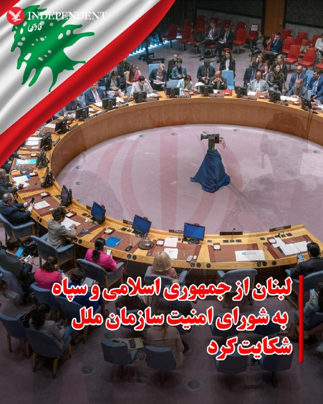

♦️شبکه العربیه چهارشنبه ۲۳ اردیبهشت‌ماه گزارش داد دولت لبنان با طرح شکایتی در شورای امنیت سازمان ملل، جمهوری اسلامی و سپاه پاسداران را به مداخله در امور داخلی این کشور و کشاندن لبنان به درگیری با اسرائیل متهم کرده است.

احمد عرفه، نماینده دائم لبنان در سازمان ملل، اعلام کرد بیروت در این شکایت از شورای امنیت خواسته است جمهوری اسلامی را به‌دلیل اقداماتی که «خلاف منافع لبنان» بوده و این کشور را وارد «جنگی ویرانگر با پیامدهای فاجعه‌بار» با اسرائیل کرده، پاسخگو کند.

او گفت در جریان این درگیری‌ها هزاران نفر کشته و زخمی شده‌اند و بیش از یک میلیون شهروند لبنانی آواره شده‌اند. به گفته عرفه، در این شکوائیه نهادهای وابسته به جمهوری اسلامی، به‌ویژه سپاه پاسداران، به اقدامات غیرقانونی و نادیده گرفتن تصمیمات دولت لبنان متهم شده‌اند.

یوسف رجی، وزیر خارجه لبنان، چهارم فروردین‌ماه اعلام کرده بود سفیر تازه منصوب جمهوری اسلامی را به‌عنوان «عنصر نامطلوب» شناخته و از او خواسته است تا نهم فروردین خاک لبنان را ترک کند. سخنگوی وزارت خارجه جمهوری اسلامی در واکنش گفته بود سفیر جمهوری اسلامی لبنان را ترک نخواهد کرد و به ماموریت خود ادامه می‌دهد.
‌🇸🇦 Indypersian

🤖 @VahidOOnLine

## VahidOOnLine — post 239980

  <a href="telegram/content/VahidOOnLine_239980_1778715617.mp4" target="_blank">🎬 Download video</a>

‌
سنای آمریکا طرح پیشنهادی برای پایان دادن به مشارکت نظامی این کشور در جنگ با جمهوری اسلامی را رد کرد.

این طرح که با هدف الزام دولت آمریکا به خروج نیروهای درگیر در جنگ ارائه شده بود، با ۵۰ رای مخالف در برابر ۴۹ رای موافق تصویب نشد؛ جمهوری‌خواهان سنای آمریکا عمدتاً با محدود شدن اختیارات نظامی دونالد ترامپ مخالفت کردند.

سه سناتور جمهوری‌خواه به این طرح رای مثبت دادند و لیزا مورکوفسکی، سناتور جمهوری‌خواه، برای نخستین بار از زمان آغاز جنگ، به درخواست خروج نیروهای آمریکایی از درگیری با جمهوری اسلامی رای داد.

دموکرات‌ها در هفته‌های اخیر چندین طرح مشابه ارائه کرده‌اند و می‌گویند طبق قانون اساسی آمریکا، اختیار اعلام جنگ در دست کنگره است و باید اختیارات قوه مقننه در برابر دولت حفظ شود.

بر اساس قوانین آمریکا، رئیس‌جمهوری می‌تواند در صورت وجود تهدید فوری، اقدام نظامی را آغاز کند، اما برای ادامه درگیری بیش از ۶۰ روز، نیاز به مجوز کنگره دارد.
‌🏁 🇬🇧 ManotoTV

🤖 @VahidOOnLine

## VahidOOnLine — post 239979

  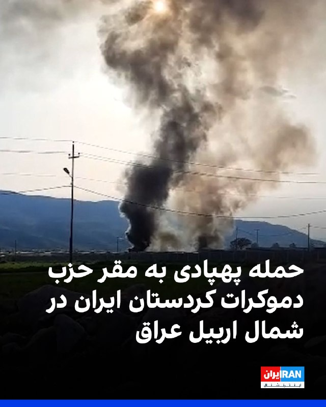

به گزارش الحدث، دو پهپاد انتحاری مقر حزب دموکرات کردستان ایران در شمال اربیل عراق را هدف قرار دادند.

همزمان رویترز به نقل از منابع امنیتی گزارش داد در این حمله پهپادی یک انبار سلاح و مهمات در داخل این اردوگاه هدف قرار گرفته است.
‌🏁 🇬🇧 IranintlTV

🤖 @VahidOOnLine

## VahidOOnLine — post 239978

  

♦️جی‌دی ونس، معاون رئیس‌جمهوری آمریکا، روز چهارشنبه ۲۳ اردیبهشت، اعلام کرد که مذاکره‌کنندگان ارشد ایالات متحده همچنان در حال «پیشرفت» در گفتگوهای صلح با جمهوری اسلامی هستند. این اظهارات در حالی مطرح می‌شود که تهران در هفته‌های اخیر مجموعه‌ای از پاسخ‌ها را ارائه کرده که مورد قبول ترامپ نبوده‌اند.

ونس در گفتگو با خبرنگاران با اشاره به رایزنی‌های صبح امروز خود با جرد کوشنر و استیو ویتکاف و همچنین تعدادی از متحدان عرب، گفت: «فکر می‌کنم در حال پیشرفت هستیم؛ اما پرسش اساسی این است که آیا این پیشرفت برای عبور از خط قرمز رئیس‌جمهور کافی خواهد بود یا خیر».

معاون رئیس‌جمهوری آمریکا تاکید کرد که دولت همچنان بر جلوگیری همیشگی از دستیابی جمهوری اسلامی به سلاح هسته‌ای متمرکز است و این موضوع را معیار اصلی هرگونه توافقی دانست. او افزود: «خط قرمز بسیار ساده است؛ رئیس‌جمهور باید اطمینان حاصل کند که مجموعه‌ای از حفاظ‌های امنیتی ایجاد شده است تا ایران هرگز نتواند به سلاح هسته‌ای دست یابد».
‌🇸🇦 Indypersian

🤖 @VahidOOnLine

## WithYashar — post 11178

مارکو روبیو تایید کرد چین و آمریکا به توافق رسیدن که ایران نباید تو تنگه عوارض بگیره از کشوری

این «توافق» فعلاً در حد موضع مشترک سیاسی و دیپلماتیک گزارش شده، نه یک پیمان رسمی یا قطعنامه بین‌المللی.
چین هنوز در بسیاری از موضوعات از ایران فاصله نگرفته و حتی در شورای امنیت بعضی قطعنامه‌های ضد ایران را وتو کرده است.
دلیل حساسیت موضوع این است که حدود یک‌پنجم نفت جهان از تنگه هرمز عبور می‌کند و هرگونه عوارض یا محدودیت می‌تواند قیمت جهانی انرژی را به شدت تحت تأثیر قرار دهد
@withyashar

## WithYashar — post 11177

@withyashar سفر قاهره

## WithYashar — post 11176

قصه بگم ؟ شایدم بهترین شرحی ‌باشه که لازم دارید بشنوید …

## WithYashar — post 11175

## WithYashar — post 11174

  <a href="telegram/content/WithYashar_11174_1778715619.mp4" target="_blank">🎬 Download video</a>

🎬 Video

## WithYashar — post 11173

درودی دوباره یاشار جان
میشه سوال منو ج بدین چرا ترامپ وقتی وارد چین شد نیومد ریس جمهور استقبالش در صورتی که باید بیاد ؟

## WithYashar — post 11172

کانال N12: ترامپ داره به صدور دستور برای از سرگیری درگیری با ایران فکر می‌کنه
@withyashar

## WithYashar — post 11171

ائتلاف حاکم در اسرائیل پیشنهاد انحلال کنست در تدارک برای برگزاری انتخابات زودهنگام را ارائه کرد.
@withyashar

## WithYashar — post 11170

  

دارن تحلیل میکنن چیکار کنن 😂😅
@withyashar

## WithYashar — post 11169

خوش‌چشم: ترامپ رفته چین التماس کنه تا میانجی بشه که ایران جنگ رو تموم کنه
@withyashar

## WithYashar — post 11168

کامنتم زیر پست ترامپ

https://www.instagram.com/reel/DYSl8QEMZja/?igsh=MTNieGh0eTQyOWtnYQ==
بترکونینننن 💥🙌🏾حملههههه

## WithYashar — post 11167

  <a href="telegram/content/WithYashar_11167_1778715620.mp4" target="_blank">🎬 Download video</a>

لحظه استقبال از دونالد ترامپ در پکن، چین
@withyashar

## mwarmonitor — post 9059

  

🔴 فوری: بنیامین نتانیاهو به‌طور محرمانه به امارات متحده عربی سفر کرده و در جریان عملیات «شیر غران» علیه ایران با محمد بن زاید دیدار کرده است. i24 news @mwarmonitor

## mwarmonitor — post 9058

✈️بمب‌افکن B-2 با شناسه «WENCH11» در یک پرواز رفت‌وبرگشت از پایگاه هوایی وایتمن (Whiteman AFB) به‌عنوان بخشی از یک تمرین فرماندهی راهبردی آمریکا (STRATCOM) در حال انجام عملیات است و از فرکانس HF سانتا ماریا 11309 استفاده می‌کند. @mwarmonitor

## mwarmonitor — post 9057

  <a href="telegram/content/mwarmonitor_9057_1778715623.mp4" target="_blank">🎬 Download video</a>

🔸خبرنگار: سناتور، آیا بازه ۹۰ روزه در ۳۱ می (۱۰ خرداد) در مورد ایران، در این مقطع اهمیتی دارد؟
🔹لیندسی گراهام: نه.
🔸خبرنگار: چرا نه؟
🔹لیندسی گراهام: چرا باید اهمیت داشته باشه؟ طبق «قانون اختیارات جنگی»؟ به نظرم این قانون کاملاً غیرقانونی و برخلاف قانون اساسی است. هر رئیس‌جمهوری این رو گفته و من هم باهاشون موافقم.
فکر نمی‌کنم قانون اساسی اجازه بده که فرمانده کل قوا، فقط برای ۹۰ روز فرمانده کل باشه. اگه شما به عنوان عضو کنگره از عملکرد فرمانده کل قوا راضی نیستید، بودجه عملیات نظامی رو قطع کنید.
هر راه دیگه‌ای غیر از این، باعث می‌شه ۵۳۵ نفر فرمانده کل قوا داشته باشیم! کل مفهوم «قانون اختیارات جنگی» خطرناک، پوچ و مضحکه و فقط منجر به هرج‌ومرج می‌شه.
کنگره نمی‌تونه جنگ‌ها رو مدیریت کنه. اگه می‌خواید جنگ رو متوقف کنید، بودجه‌اش رو قطع کنید. این تنها قدرتیه که ما در کنگره داریم؛ نه بیشتر و نه کمتر.

@mwarmonitor

## mwarmonitor — post 9056

  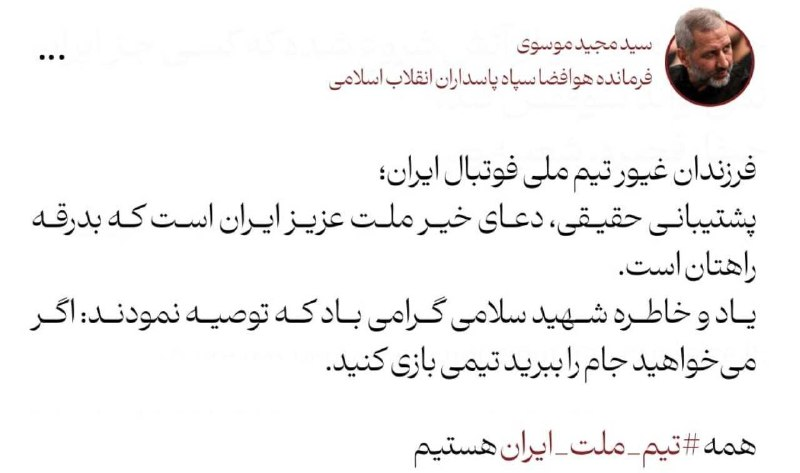

📝 واقعاً باید به حال این مملکت خون گریه کرد که فرماندهانش یک مشت جلبک‌مغزِ فاقد شعورند که بدیهی‌ترین مسائل عالم را به عنوان وحی مُنزل و استراتژی جنگی به خورد ملت می‌دهند. آخه مرتیکه‌ی مغزفندقی، فوتبال اگر تیمی نبود که یازده نفر آدم را با شورت ورزشی نمی‌فرستادند توی زمین!
🔸آن سردار گوربه‌گور شده‌تان هم که وقتی زنده بود، هنرِ اول و آخرش گه خوردن اضافی و ورّاجی بود، حالا وصیت‌نامه‌ی فوتبالی‌اش شده مشقِ راهِ شما؟ «تیمی بازی کنید تا جام ببرید»؟ این سطح از بلاهت و نفهمی حتی برای گوسفند هم قفل است! ولی به حال آن جماعتی که استراتژیست‌هایش شمایید؛ الدنگ‌هایی که هنوز فرق ورزش تیمی و انفرادی را نمی‌فهمند اما برای سرنوشت یک کشور نسخه می‌پیچند. شما که کل افتخار تیمی‌تان، تیمی غارت کردن و تیمی ریدن به هیکل نظام است، بهتر است دهان چاک‌خورده‌تان را ببندید و با آن جملاتِ صدمن‌یه غازِ آن مِیِتِ ملعون، بیش از این نبوغِ جلبکی‌تان را به رخ نکشید. حماقت شما مرزهای بیولوژی را جابه‌جا کرده است!

@mwarmonitor

## mwarmonitor — post 9055

  <a href="telegram/content/mwarmonitor_9055_1778715625.mp4" target="_blank">🎬 Download video</a>

✈️مأموریت WENCH11 (بمب‌افکن رادارگریز B-2A Spirit) 🔸پس از سوخت‌گیری هوایی با پرواز DEED41 (تانکر KC-135 Stratotanker) بر فراز نوا اسکوشیا شرق کانادا، روی مسیر سوخت‌رسانی AR20NE، در باند VHF با Gander Radio در ارتباط بوده است. @mwarmonitor

## FoxNewsTwitter — post 341683

  <a href="telegram/content/FoxNewsTwitter_341683_1778715627.mp4" target="_blank">🎬 Download video</a>

Fox News (Twitter/X)

FOX NEWS REPORT: President Trump is in China and expected to talk trade and the Iran war with Chinese President Xi Jinping. @BillMelugin_ has the latest.

## FoxNewsTwitter — post 341682

  <a href="telegram/content/FoxNewsTwitter_341682_1778715629.mp4" target="_blank">🎬 Download video</a>

Fox News (Twitter/X)

EXCLUSIVE: Secretary of State Marco Rubio outlines the high-stakes push for China to confront Iran over its actions in the Persian Gulf in an exclusive sit-down with @seanhannity aboard Air Force One:

“The Chinese have ships stuck in the Persian Gulf... A Chinese cargo got hit over the weekend. I'm sure Iran didn't do it deliberately but they did it, it happened. And so that's why these Chinese ships are stuck in there.”

“It's a huge source of instability. It threatens to destabilize Asia more than any other part of the world because it's heavily reliant on the straits for energy.”

“It’s in [China’s] interest to resolve this. We hope to convince them to play a more active role in getting Iran to walk away from what they're doing now and trying to do now in the Persian Gulf."

## FoxNewsTwitter — post 341681

  <a href="telegram/content/FoxNewsTwitter_341681_1778715631.mp4" target="_blank">🎬 Download video</a>

Fox News (Twitter/X)

BREAKING: Secretary of State Marco Rubio outlines the high-stakes push for China to confront Iran over its actions in the Persian Gulf in an exclusive sit-down with @seanhannity aboard Air Force One:

“The Chinese have ships stuck in the Persian Gulf... A Chinese cargo got hit over the weekend. I'm sure Iran didn't do it deliberately but they did it, it happened. And so that's why these Chinese ships are stuck in there.”

“It's a huge source of instability. It threatens to destabilize Asia more than any other part of the world because it's heavily reliant on the straits for energy.”

“It’s in [China’s] interest to resolve this. We hope to convince them to play a more active role in getting Iran to walk away from what they're doing now and trying to do now in the Persian Gulf."

## FoxNewsTwitter — post 341680

  <a href="telegram/content/FoxNewsTwitter_341680_1778715633.mp4" target="_blank">🎬 Download video</a>

Fox News (Twitter/X)

BREAKING: Secretary of State Marco Rubio stresses the critical need for America to strategically navigate its complex relationship with China:

@seanhannity : “You view China as our top geopolitical foe.”

RUBIO: “Yeah, it’s both our top political challenge geopolitically and it’s also the most important relationship for us to manage.”

“We're going to have interests of ours that are going to be in conflict with interests of theirs; to avoid wars and maintain peace and stability in the world, we're gonna have to manage those.”

## FoxNewsTwitter — post 341676

Fox News (Twitter/X)

NEW: The White House shares brand new photos of President Trump's arrival in China for his landmark state visit, where he will meet with President Xi to discuss major foreign policy and trade issues.

## FoxNewsTwitter — post 341675

  <a href="telegram/content/FoxNewsTwitter_341675_1778715635.mp4" target="_blank">🎬 Download video</a>

Fox News (Twitter/X)

RT @TheStoryFNC: “We have time to try him again...”

EXCLUSIVE: South Carolina Attorney General @AGAlanWilson says state will seek speedy trial after Alex Murdaugh’s murder convictions are overturned

## FoxNewsTwitter — post 341674

  <a href="telegram/content/FoxNewsTwitter_341674_1778715636.mp4" target="_blank">🎬 Download video</a>

Fox News (Twitter/X)

JUST IN: Vice President JD Vance defends the fraud task force for its efforts to prioritize American citizens:

"We're a generous country. We're a generous people. I love that about this country.”

“But part of that generosity is that it extends to our fellow Americans. We cannot give Medicare and Medicaid benefits to everybody all over the world.”

“It's going to bankrupt those programs. They ought to belong to Americans first."

## FoxNewsTwitter — post 341673

  <a href="telegram/content/FoxNewsTwitter_341673_1778715638.mp4" target="_blank">🎬 Download video</a>

Fox News (Twitter/X)

"I can do all things through Christ who strengthens me.”

DHS Secretary Markwayne Mullin leans on his Christian faith as he sends a message of support to his ICE agents, defending them against media scrutiny:

“If any agency needs to hear that, it's ICE. No matter what the media wants to say, I know you're doing your job every day, and I want you to know I am proud to be part of it.”

“I take it with tremendous pride, and I'm willing to stand beside you and stand in front of you and defend you every single day."

## pm_afshaa — post 90709

  <a href="telegram/content/pm_afshaa_90709_1778715640.webm" target="_blank">🎬 Download video</a>

🔴عباس عراقچی:
نتانیاهو اکنون به‌صورت علنی آنچه را که نهادهای امنیتی ایران مدت‌ها قبل به رهبری ما منتقل کرده بودند، افشا کرده. دشمنی با ملت بزرگ ایران، قماری احمقانه‌ است؛ و همکاری و همدستی با اسرائیل در این مسیر، غیرقابل بخشش است. کسانی که در همدستی با اسرائیل برای ایجاد تفرقه نقش دارند، باید پاسخگو باشند.

💧 Rainbet.com the #1 Non-KYC Crypto Casino & Sportsbook @rainbetcom

😁 @Pm_Afshaa

## VahidOnline — post 75454

  

وزارت خارجه امارات متحده عربی اعلام کرد گزارش‌های منتشرشده درباره سفر بنیامین نتانیاهو، نخست‌وزیر اسرائیل، به این کشور صحت ندارد.
پیش‌تر دفتر نخست‌وزیری اسرائیل اعلام کرد بنیامین نتانیاهو در جریان جنگ آمریکا و اسرائیل با جمهوری اسلامی، به‌طور مخفیانه به امارات متحده عربی سفر کرده و در این سفر با محمد بن زاید آل نهیان، رییس امارات متحده عربی، دیدار کرد.
وزارت خارجه امارات متحده عربی اعلام کرد روابط این کشور با اسرائیل علنی است و در چارچوب توافق‌نامه‌های ابراهیم که به‌طور عمومی اعلام شده‌اند، برقرار شده است.
وزارت خارجه امارات متحده عربی افزود این روابط مبتنی بر محرمانگی نیست و هرگونه ادعا درباره سفرها یا ترتیبات اعلام‌نشده «بی‌اساس» است، مگر آن‌که به‌صورت رسمی از سوی امارات متحده عربی اعلام شود.
عباس عراقچی در واکنش به سفر نتانیاهو به امارات متحده عربی در زمان جنگ، نوشت: همکاری با اسرائیل در این مسیر غیرقابل بخشش است. افرادی که برای ایجاد اختلاف با اسرائیل همکاری می‌کنند، پاسخگو خواهند شد.
@VahidOOnLine

📡 @VahidOnline

## VahidOnline — post 75453

  

جی‌دی ونس، معاون رئیس‌جمهور آمریکا، اعلام کرد که واشینگتن معتقد است در مذاکرات با ایران «پیشرفت» حاصل شده، اما هنوز مشخص نیست این پیشرفت برای عبور از خط قرمز دونالد ترامپ کافی باشد یا نه.

آقای ونس روز چهارشنبه در کاخ سفید به خبرنگاران گفت صبح همان روز با جرد کوشنر و استیو ویتکاف درباره ایران گفت‌وگو کرده و همچنین با مقام‌های عرب در تماس بوده است. او افزود: «سوال اصلی این است که آیا این پیشرفت به اندازه‌ای هست که خط قرمز رئیس‌جمهور را تأمین کند یا نه.»

به گفته معاون رئیس‌جمهور آمریکا، خط قرمز ترامپ این است که ایالات متحده مطمئن شود «سازوکارهای کافی» ایجاد شده تا ایران هرگز به سلاح هسته‌ای دست پیدا نکند.
اظهارات ونس در حالی مطرح می‌شود که ترامپ پیش‌تر پیشنهاد تازه ایران در مذاکرات را «غیرقابل قبول» توصیف کرده بود.
@VahidHeadline

📡 @VahidOnline

## kianmeli1 — post 87392

  <a href="telegram/content/kianmeli1_87392_1778715641.mp4" target="_blank">🎬 Download video</a>

🔴ویدئویی پربازخورد در فضای مجازی از تشبیه فروشندگان vpn به خوک

سپاه و ستاد اجرايي فروشندگان اصلي اينترنت پرو و وي پي ان هستند
https://t.me/kianmeli1

## kianmeli1 — post 87391

🔴اینترنشنال: احسان افرشته «امان نامه» داشت اما اعدام شد قوه قضاییه جمهوری اسلامی خبر داد احسان افرشته، جوان ۳۳ ساله‌، را به اتهام همکاری با اسرائیل، اعدام کرده اما دو منبع گفتند او، پیش از بازگشت به ایران از ترکیه، به‌طور داوطلبانه خود را به وزارت اطلاعات…

## kianmeli1 — post 87390

🔴اینترنشنال: احسان افرشته «امان نامه» داشت اما اعدام شد

قوه قضاییه جمهوری اسلامی خبر داد احسان افرشته، جوان ۳۳ ساله‌، را به اتهام همکاری با اسرائیل، اعدام کرده اما دو منبع گفتند او، پیش از بازگشت به ایران از ترکیه، به‌طور داوطلبانه خود را به وزارت اطلاعات معرفی کرده بود اما بلافاصله در فرودگاه بازداشت شد.
https://t.me/kianmeli1

## kianmeli1 — post 87389

  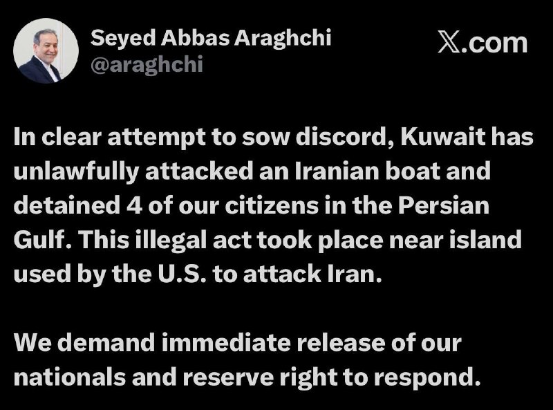

🔴عراقچی

کویت در تلاشی آشکار برای ایجاد اختلاف، به طور غیرقانونی به یک قایق ایرانی حمله کرده و ۴ نفر از شهروندان ما را در خلیج فارس بازداشت کرده است. این اقدام غیرقانونی در نزدیکی جزیره‌ای که ایالات متحده از آن برای حمله به ایران استفاده کرده است، رخ داده است.

ما خواستار آزادی فوری اتباع خود هستیم و حق پاسخگویی را برای خود محفوظ می‌داریم.
https://t.me/kianmeli1

## IranIntlTV — post 337081

  <a href="telegram/content/IranIntlTV_337081_1778715643.mp4" target="_blank">🎬 Download video</a>

رسانه‌های جمهوری اسلامی از برگزاری رزمایش پنج‌روزه سپاه تهران بزرگ با محوریت مقابله با عملیات «هلی‌برن» نیروهای متخاصم خبر دادند.
در تصاویر منتشرشده، نیروهای پیاده با سلاح‌های سبک، نیمه‌سنگین و پهپاد به اهداف فرضی، همچون تصویر پارچه‌ای یک بالگرد، شلیک می‌کنند.
این رزمایش پس از ورود بالگردهای بلک‌هاوک و هواپیمای سوخت‌رسان آمریکا به خاک ایران، در جریان عملیات جست‌وجوی خلبان اف-۱۵، برگزار شده است.
@iranintltv

## IranIntlTV — post 337080

  <a href="telegram/content/IranIntlTV_337080_1778715644.mp4" target="_blank">🎬 Download video</a>

موج تازهٔ اعدام جوانان نخبه؛
احسان افرشته با اتهام «جاسوسی» اعدام شد

جمهوری اسلامی بامداد چهارشنبه حکم اعدام احسان افرشته، زندانی سیاسی متهم به «جاسوسی برای اسرائیل»، را اجرا کرد؛ پرونده‌ای که مانند بسیاری از پرونده‌های امنیتی مشابه، بدون انتشار سند و مدرک مستقل به پایان رسید.

نهادهای حقوق بشری پیش‌تر هشدار داده بودند که اتهامات مطرح‌شده علیه او بر پایهٔ اعترافات اجباری و تحت فشار مطرح شده است.

کامبیز حسینی در «برنامه» به این موضوع می‌پردازد.

«یک ایران صدای شما را می‌شنود»
دوشنبه تا پنجشنبه ۱۱ شب تهران
از تلویزیون ایران اینترنشنال

تماشای نسخه کامل این قسمت از «برنامه» در یوتیوب:
https://youtu.be/HsShW7razys
@iranintltv

## IranIntlTV — post 337079

  <a href="telegram/content/IranIntlTV_337079_1778715646.mp4" target="_blank">🎬 Download video</a>

محمد از آلمان: کسی که پول دارو ندارد، آب ندارد، برق ندارد، او هم اعدامی جمهوری اسلامی است

«یک ایران صدای شما را می‌شنود»
دوشنبه تا پنجشنبه ۱۱ شب تهران
از تلویزیون ایران اینترنشنال

تماشای نسخه کامل این قسمت از «برنامه» در یوتیوب:
https://youtu.be/HsShW7razys
@iranintltv

## IranIntlTV — post 337078

  <a href="telegram/content/IranIntlTV_337078_1778715648.mp4" target="_blank">🎬 Download video</a>

حمید از بندرعباس: می‌روم خرید، ولی فقط می‌توانم به اندازهٔ جیبم خرید کنم، نه نیازم

«یک ایران صدای شما را می‌شنود»
دوشنبه تا پنجشنبه ۱۱ شب تهران
از تلویزیون ایران اینترنشنال

تماشای نسخه کامل این قسمت از «برنامه» در یوتیوب:
https://youtu.be/HsShW7razys
@iranintltv

## IranIntlTV — post 337077

  <a href="telegram/content/IranIntlTV_337077_1778715650.mp4" target="_blank">🎬 Download video</a>

فریبرز از خوزستان: مردمی که اینترنت ندارند، چه کار کنند؟ ایرانی‌های خارج از کشور کمک کنند

«یک ایران صدای شما را می‌شنود»
دوشنبه تا پنجشنبه ۱۱ شب تهران
از تلویزیون ایران اینترنشنال

تماشای نسخه کامل این قسمت از «برنامه» در یوتیوب:
https://youtu.be/HsShW7razys
@iranintltv

## IranIntlTV — post 337076

  <a href="https://t.me/IranintlTV/337076" target="_blank">📎 Download file</a>

🎧نسخه صوتی سیاست با مراد ویسی: ایران کارت بازی دیگران
@iranintlTV

## IranIntlTV — post 337075

  <a href="telegram/content/IranIntlTV_337075_1778715653.mp4" target="_blank">🎬 Download video</a>

فرامرز از استکهلم: به ترامپ توجه نکنید؛ او در حال جنگ سرد است؛ما باید مسیر خودمان را برویم

«یک ایران صدای شما را می‌شنود»
دوشنبه تا پنجشنبه ۱۱ شب تهران
از تلویزیون ایران اینترنشنال

تماشای نسخه کامل این قسمت از «برنامه» در یوتیوب:
https://youtu.be/HsShW7razys
@iranintltv

## IranIntlTV — post 337074

  <a href="telegram/content/IranIntlTV_337074_1778715655.mp4" target="_blank">🎬 Download video</a>

احمد از انگلستان: مردم ایران صبرشان استراتژیک و تاریخی است و می‌دانند کی باید به آب بزنند

«یک ایران صدای شما را می‌شنود»
دوشنبه تا پنجشنبه ۱۱ شب تهران
از تلویزیون ایران اینترنشنال

تماشای نسخه کامل این قسمت از «برنامه» در یوتیوب:
https://youtu.be/HsShW7razys
@iranintltv

## IranIntlTV — post 337073

  

نیویورک‌تایمز به نقل از مقام‌های آمریکایی گزارش داد شرکت‌های چینی با جمهوری اسلامی درباره فروش سلاح در حال گفت‌وگو بوده‌اند و قصد داشته‌اند این تسلیحات را از طریق کشورهای دیگر ارسال کنند تا منشا کمک نظامی پنهان بماند.
مقام‌های آمریکایی گفتند دست‌کم یکی از کشورهای ثالث در آفریقا قرار دارد، اما مشخص نیست آیا محموله‌ای به آن کشور رسیده است یا نه.
مقام‌هایی که در جریان این اطلاعات قرار گرفته‌اند، درباره اینکه آیا سلاح‌ها پیش‌تر به کشورهای ثالث ارسال شده‌اند یا نه، به جمع‌بندی‌های متفاوتی رسیده‌اند. با این حال، از زمان آغاز جنگ کنونی علیه جمهوری اسلامی، به نظر نمی‌رسد هیچ سلاح چینی در میدان نبرد علیه نیروهای آمریکایی یا اسرائیلی استفاده شده باشد.
هنوز مشخص نیست چه تعداد سلاح منتقل شده یا مقام‌های چینی تا چه اندازه این فروش‌ها را تایید کرده‌اند.

https://iranintl.com/202605134264

## IranIntlTV — post 337072

  <a href="telegram/content/IranIntlTV_337072_1778715657.mp4" target="_blank">🎬 Download video</a>

دفتر نخست‌وزیری اسرائیل اعلام کرد بنیامین نتانیاهو در جریان جنگ علیه جمهوری اسلامی به‌صورت محرمانه به امارات سفر و با محمد بن زاید دیدار کرده است. رادیو ملی اسرائیل نیز گزارش داد این نخستین بار نیست که نتانیاهو به امارات رفته، اما برای نخستین‌بار است که این موضوع به‌صورت رسمی تایید می‌شود.

گفت‌وگو با بن سبطی، پژوهشگر ایران و اسرائیل
@iranintltv

## IranIntlTV — post 337071

  <a href="telegram/content/IranIntlTV_337071_1778715659.mp4" target="_blank">🎬 Download video</a>

در پی موج جدید بیکاری در ایران در سایه جنگ، سرکوب و قطعی اینترنت، آمار رسمی از بیش از ۲۰۰ هزار متقاضی دریافت بیمه بیکاری خبر می‌دهد. مسعود پزشکیان پیش‌تر در واکنش به تورم و گرانی گفته بود کشور به‌شدت به صرفه‌جویی نیاز دارد.

گفت‌وگو با جمشید اسدی، اقتصاددان
@iranintltv

## IranIntlTV — post 337070

  <a href="telegram/content/IranIntlTV_337070_1778715661.mp4" target="_blank">🎬 Download video</a>

گزارش‌ها حاکی است در کمتر از یک ماه، دست‌کم ۱۲ هسته مرتبط با تهران در کویت، بحرین، امارات و قطر شناسایی و متلاشی شده‌اند.
مقام‌های امنیتی این کشورها می‌گویند ده‌ها نفر به اتهام جاسوسی، پول‌شویی، طراحی ترور و همکاری با سپاه و حزب‌الله بازداشت شده‌اند.

گزارش نیلوفر منصوری، خبرنگار ایران‌اینترنشنال
@iranintltv

## IranIntlTV — post 337069

  

مارکو روبیو، وزیر خارجه آمریکا، در گفت‌وگو با فاکس‌نیوز با تاکید بر اینکه حل بحران خاورمیانه به نفع چین است، ابراز امیدواری کرد واشینگتن بتواند پکن را متقاعد کند نقش فعال‌تری در ترغیب جمهوری اسلامی برای کنار گذاشتن اقداماتش در خلیج فارس ایفا کند.
او گفت: «چینی‌ها کشتی‌هایی دارند که در خلیج فارس گیر افتاده‌اند. یک محموله باری چینی آخر هفته هدف قرار گرفت. مطمئنم جمهوری اسلامی عمدا این کار را نکرد، اما این اتفاق افتاد. به همین دلیل این کشتی‌های چینی آنجا گیر افتاده‌اند.»
روبیو افزود: «این وضعیت منبع بزرگی از بی‌ثباتی است. بیش از هر نقطه دیگر جهان، آسیا را تهدید به بی‌ثباتی می‌کند، زیرا به شدت به این تنگه‌ها برای انرژی وابسته است.»

https://iranintl.com/202605139871

## IranIntlTV — post 337068

  <a href="telegram/content/IranIntlTV_337068_1778715663.mp4" target="_blank">🎬 Download video</a>

مراد ویسی، تحلیل‌گر ارشد ایران‌اینترنشنال، گفت: «تشکیل ستاد ساماندهی فضای مجازی در عمل یعنی برنامه‌ریزی برای قطع سازمان یافته اینترنت و محدود کردن دسترسی ۹۰ میلیون ایرانی، در حالی که اینترنت ویژه فقط در اختیار حامیان حکومت قرار می‌گیرد. اصطلاحاتی مثل اینترنت پرو، اینترنت طبقاتی، سیم‌کارت سفید یا ناپایداری ارتباط، همگی نام‌های متفاوتی برای همان قطع و کنترل اینترنت هستند.»
@iranintltv

## IranIntlTV — post 337067

  <a href="telegram/content/IranIntlTV_337067_1778715665.mp4" target="_blank">🎬 Download video</a>

مراد ویسی، تحلیل‌گر ارشد ایران‌اینترنشنال، گفت: «مجموع تحولات اخیر نشان می‌دهد جمهوری اسلامی به رغم برخی تحرکات تاکتیکی در خلیج فارس با یک شکست راهبردی و امنیتی روبه‌رو شده؛ چون حملاتش باعث شده بسیاری از همسایگان جنوبی به دشمنان فعالش تبدیل شوند. نتیجه این سیاست‌ها، نزدیک‌تر شدن کشورهایی مثل امارات به اسرائیل و باز شدن پای اسرائیل و ناتو به معادلات امنیتی منطقه بوده است.»
@iranintltv

## IranIntlTV — post 337066

  <a href="https://t.me/IranintlTV/337066" target="_blank">📎 Download file</a>

🎧نسخه صوتی برنامه با کامبیز حسینی؛ خشم انباشتهٔ مردم کی فوران خواهد کرد؟
@iranintlTV

## IranIntlTV — post 337065

  <a href="telegram/content/IranIntlTV_337065_1778715667.mp4" target="_blank">🎬 Download video</a>

گمان می‌رود پرونده جنگ با ایران، یکی از محوری‌ترین موضوعات گفتگو میان دونالد ترامپ و شی جین‌پینگ باشد. بنا بر بعضی گزارش‌ها، احتمال می‌رود واشینگتن و پکن، تلاش تازه و مشترکی برای وادار کردن تهران به عقب‌نشینی و پذیرش شروط جدید کنند.
@iranintltv

## IranIntlTV — post 337064

  <a href="telegram/content/IranIntlTV_337064_1778715669.mp4" target="_blank">🎬 Download video</a>

مراد ویسی، تحلیل‌گر ارشد ایران‌اینترنشنال، گفت: « جمهوری اسلامی، ایران را به کارت بازی دیگران تبدیل کرده است. خیلی از تحلیل‌گران در انتظار تعیین سرنوشت ایران در دیدار ترامپ و رهبر چین هستند. سرنوشت ایران به غزه و لبنان و به جنگ اوکراین و به روابط روسیه و آمریکا و حالا روابط آمریکا و چین گره خورده است. این بلایی است که جمهوری اسلامی بر سر ایران آورده است.»
@iranintltv

## IranIntlTV — post 337063

  <a href="telegram/content/IranIntlTV_337063_1778715670.mp4" target="_blank">🎬 Download video</a>

کی‌یر استارمر، نخست‌وزیر بریتانیا، در مراسم بازگشایی رسمی پارلمان گفت سخنرانی پادشاه رویکردی امیدوارکننده‌تر به تحولات ایران و جنگ در دو جبهه ارائه می‌دهد و آن را فرصتی برای تغییر وضع موجود و ساختن بریتانیایی قوی‌تر و عادلانه‌تر دانست؛ مسیری که به گفته او باید مبنای آینده کشور قرار گیرد.

چارلز سوم، پادشاه بریتانیا، روز چهارشنبه ۲۳ اردیبهشت در این مراسم سخنرانی کرد. این مراسم به‌منزله آغاز رسمی فعالیت‌های دوره جدید پارلمان بریتانیا است.
@iranintltv

## IranIntlTV — post 337062

  <a href="telegram/content/IranIntlTV_337062_1778715671.mp4" target="_blank">🎬 Download video</a>

بلومبرگ گزارش داد بارگیری نفت از پایانه اصلی صادرات نفت ایران در جزیره خارک متوقف شده است.

بر اساس این گزارش، ظرفیت مخازن ذخیره نفت نیز در حال پر شدن است و در صورت تکمیل ظرفیت، ایران ممکن است ناچار به کاهش تولید نفت شود.

گفت‌وگو با ایمان ناصری، مشاور بازار نفت
@iranintltv

## Shin_Persian — post 5995

  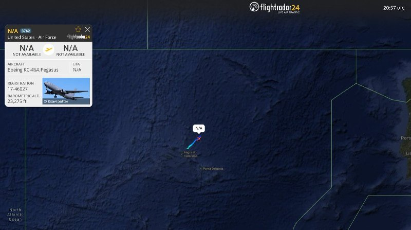

↩️ Quoted tweet: DefenceGeek 🇬🇧 ✓ @DefenceGeek Wed, 13 May 2026 19:49:28 UTC B-2 Spirit on a training flight from CONUS as part of a suspected STRATCOM exercise involving the E-6B flying out of Stuttgart ↩️ توییت نقل‌قول شده — برای پاسخ، پست زیر را ببینید.…

## Shin_Persian — post 5994

↩️ Quoted tweet:
DefenceGeek 🇬🇧 ✓ @DefenceGeek
Wed, 13 May 2026 19:49:28 UTC

B-2 Spirit on a training flight from CONUS as part of a suspected STRATCOM exercise involving the E-6B flying out of Stuttgart

↩️ توییت نقل‌قول شده — برای پاسخ، پست زیر را ببینید.

فارسی

بمب‌افکن بی‌-۲ اسپیریت (B-2 Spirit) در یک پرواز آموزشی از خاک اصلی ایالات متحده (CONUS) به عنوان بخشی از یک رزمایش احتمالی فرماندهی راهبردی ایالات متحده (STRATCOM) که شامل هواپیمای ای-۶بی (E-6B) در حال پرواز از اشتوتگارت است.

𝕏 · @shin_persian

## Shin_Persian — post 5993

📦 mhrv-rs v1.9.25 released

• Install MITM CA into LibreWolf NSS stores (#1145, PR #1159)
• **Fix Full mode "Google + most websites broken while Telegram works"

Files (Android APKs, Windows, macOS, Linux, OpenWRT) on the files channel:

👉 v1.9.25 — all files with SHA-256

Channel:
https://t.me/mhrv_rs
or: https://t.me/+R1OyoHX2boA1ZDgx

#v1925

## Shin_Persian — post 5992

Shin ✓ @hey_itsmyturn
Wed, 13 May 2026 19:31:31 UTC

"Saudi warplanes struck militias in Iraq during war"
- Reuters

https://www.reuters.com/world/middle-east/saudi-warplanes-struck-militias-iraq-during-war-sources-say-2026-05-13/

فارسی

"جنگنده‌های سعودی طی جنگ شبه‌نظامیان را در عراق هدف قرار دادند"
- رویترز

https://www.reuters.com/world/middle-east/saudi-warplanes-struck-militias-iraq-during-war-sources-say-2026-05-13/

𝕏 · @shin_persian

## ManotoTV — post 105424

  <a href="telegram/content/ManotoTV_105424_1778715673.mp4" target="_blank">🎬 Download video</a>

‌
مهدی تاج، رئیس فدراسیون فوتبال ایران، درباره انتشار آهنگی از سوی معین، برای تیم فوتبال در جام‌جهانی گفت فدراسیون فوتبال در تولید این کار دخیل نبوده، اما «در جریان» این موضوع است.
تاج افزود: «هر کسی از ایران حمایت کند، مورد تایید ماست.»

## ManotoTV — post 105423

  <a href="telegram/content/ManotoTV_105423_1778715675.mp4" target="_blank">🎬 Download video</a>

تماسی از ایران:
«می‌گفت تفاوت سیستم آموزش مدارس ایران با خارج از کشور زمین تا آسمونه…
می‌گفت به‌جای رشد و یادگیری،
بچه‌ها درگیر ظواهر و حاشیه‌ها شدن
و انگیزه برای پیشرفت کم‌رنگ شده.»

## ManotoTV — post 105422

  <a href="telegram/content/ManotoTV_105422_1778715676.mp4" target="_blank">🎬 Download video</a>

مارکو روبیو، وزیر خارجه آمریکا، در گفت‌وگویی اختصاصی با شان هنیتی، خبرنگار و مجری فاکس‌نیوز در هواپیمای ریاست جمهوری آمریکا، از تلاش‌های فشرده واشینگتن برای وادار کردن چین به مقابله با اقدامات جمهوری اسلامی در خلیج فارس سخن گفت.

روبیو گفت: «کشتی‌های چینی در خلیج فارس گیر افتاده‌اند... آخر هفته یک محموله باری چین هدف قرار گرفت. مطمئنم ایران عمداً این کار را نکرده، اما این اتفاق افتاده و به همین دلیل کشتی‌های چینی آنجا گرفتار شده‌اند.»

او افزود: «این وضعیت منبع بزرگی از بی‌ثباتی است. بیش از هر نقطه دیگری در جهان، آسیا را تهدید به بی‌ثباتی می‌کند، چون به‌شدت به این تنگه برای تامین انرژی وابسته است.»

وزیر خارجه آمریکا همچنین گفت: «حل این مسئله به نفع چین است. امیدواریم بتوانیم آن‌ها را قانع کنیم نقش فعال‌تری برای وادار کردن ایران به عقب‌نشینی از اقداماتی که اکنون در خلیج فارس انجام می‌دهد و در پی انجام آن است، ایفا کنند.»

## ManotoTV — post 105421

  <a href="telegram/content/ManotoTV_105421_1778715678.mp4" target="_blank">🎬 Download video</a>

‌
خبرگزاری رویترز به نقل از منابع آگاه گزارش داد جنگنده‌های عربستان سعودی در جریان جنگ میان آمریکا، اسرائیل و جمهوری اسلامی، مواضع شبه‌نظامیان شیعه مورد حمایت تهران در عراق را هدف قرار داده‌اند.

بر اساس این گزارش، حملات تلافی‌جویانه‌ای نیز از خاک کویت به داخل عراق انجام شده است. منابع مطلع گفته‌اند این عملیات‌ها بخشی از پاسخ‌های نظامی گسترده‌تر کشورهای خلیج فارس به درگیری‌های منطقه‌ای بوده که تاکنون به‌طور علنی فاش نشده بود.

رویترز به نقل از مقام‌های امنیتی و نظامی عراق، یک مقام غربی و منابع آگاه گزارش داده حملات عربستان توسط جنگنده‌های نیروی هوایی این کشور علیه مواضع گروه‌های نزدیک به جمهوری اسلامی در نزدیکی مرز شمالی عربستان با عراق انجام شده است.

به گفته منابع، این حملات مواضعی را هدف قرار داده که از آن‌ها پهپادها و موشک‌هایی به سمت عربستان و دیگر کشورهای خلیج فارس شلیک می‌شد.

منابع عراقی همچنین گفتند حملاتی نیز از خاک کویت علیه مواضع شبه‌نظامیان در جنوب عراق انجام شده که در جریان آن چندین عضو گروه کتائب حزب‌الله کشته و یک مرکز ارتباطات و عملیات پهپادی این گروه نابود شده است.

## ManotoTV — post 105420

  <a href="telegram/content/ManotoTV_105420_1778715678.mp4" target="_blank">🎬 Download video</a>

وزارت خارجه امارات متحده عربی گزارش‌ها درباره سفر بنیامین نتانیاهو، نخست‌وزیر اسرائیل، یا استقبال از یک هیات نظامی اسرائیلی را رد کرد.

سخنگوی وزارت خارجه امارات گفت روابط این کشور با اسرائیل، روابطی علنی است که در چارچوب توافق ابراهیم و به‌صورت رسمی و عمومی شکل گرفته و مبتنی بر روابط پنهانی یا توافق‌های مخفی نیست.

او تاکید کرد هرگونه ادعا درباره سفرها یا توافق‌های اعلام‌نشده، تا زمانی که از سوی نهادهای رسمی امارات تایید نشود، بی‌اساس است.

سخنگوی وزارت خارجه امارات همچنین از رسانه‌ها خواست در انتشار اخبار دقت کنند و از بازنشر اطلاعات تاییدنشده خودداری کنند.

## ManotoTV — post 105419

  <a href="telegram/content/ManotoTV_105419_1778715679.mp4" target="_blank">🎬 Download video</a>

تماسی از ایران:
«می‌گفت وضعیت آموزش فاجعه شده…
بچه‌هایی که حتی پایه‌ترین چیزها رو بلد نیستن.»

## ManotoTV — post 105418

  <a href="telegram/content/ManotoTV_105418_1778715680.mp4" target="_blank">🎬 Download video</a>

‌
سنای آمریکا طرح پیشنهادی برای پایان دادن به مشارکت نظامی این کشور در جنگ با جمهوری اسلامی را رد کرد.

این طرح که با هدف الزام دولت آمریکا به خروج نیروهای درگیر در جنگ ارائه شده بود، با ۵۰ رای مخالف در برابر ۴۹ رای موافق تصویب نشد؛ جمهوری‌خواهان سنای آمریکا عمدتاً با محدود شدن اختیارات نظامی دونالد ترامپ مخالفت کردند.

سه سناتور جمهوری‌خواه به این طرح رای مثبت دادند و لیزا مورکوفسکی، سناتور جمهوری‌خواه، برای نخستین بار از زمان آغاز جنگ، به درخواست خروج نیروهای آمریکایی از درگیری با جمهوری اسلامی رای داد.

دموکرات‌ها در هفته‌های اخیر چندین طرح مشابه ارائه کرده‌اند و می‌گویند طبق قانون اساسی آمریکا، اختیار اعلام جنگ در دست کنگره است و باید اختیارات قوه مقننه در برابر دولت حفظ شود.

بر اساس قوانین آمریکا، رئیس‌جمهوری می‌تواند در صورت وجود تهدید فوری، اقدام نظامی را آغاز کند، اما برای ادامه درگیری بیش از ۶۰ روز، نیاز به مجوز کنگره دارد.

## ManotoTV — post 105417

  <a href="telegram/content/ManotoTV_105417_1778715681.mp4" target="_blank">🎬 Download video</a>

‌
میزان، خبرگزاری وابسته به قوه قضاییه جمهوری اسلامی از اعدام محمد عباسی، از بازداشت‌شدگان اعتراضات سراسری دی‌ماه ۱۴۰۴ خبر داد.

میزان نوشت محمد عباسی سحرگاه روز چهارشنبه ۲۳ اردیبهشت در زندان قزلحصار اعدام شده است.

بر اساس گزارش‌های منتشر شده مسئولان زندان قزلحصار از خانواده او برای ملاقات دعوت کرده بودند، اما پس از حضور آن‌ها، اجازه ملاقات داده نشد و خانواده پس از ترک زندان، تلفنی از اجرای حکم اعدام مطلع شدند.

محمد عباسی در جریان اعتراضات دی‌ماه ۱۴۰۴ در ملارد بازداشت و سپس از سوی شعبه ۱۵ دادگاه انقلاب تهران به ریاست ابوالقاسم صلواتی، به اتهام «محاربه» به اعدام محکوم شده بود.

شعبه ۳۹ دیوان عالی کشور با رد فرجام‌خواهی، حکم اعدام محمد عباسی را تایید کرد. در همین پرونده، حکم ۲۵ سال زندان فاطمه عباسی، دختر او، نیز عینا تایید شده و او اکنون در بند زنان زندان اوین نگهداری می‌شود.

بر اساس گزارش امتداد، ابهامات و پرسش‌های متعددی درباره روند رسیدگی و محتوای پرونده این دو متهم وجود داشته، اما وکلای مستقل به دلیل محرومیت از دسترسی به پرونده، امکان بررسی و پیگیری موثر آن را نداشته‌اند.

## ManotoTV — post 105416

  <a href="telegram/content/ManotoTV_105416_1778715681.mp4" target="_blank">🎬 Download video</a>

تماسی از ایران:
درد دلی با چاشنی کمی شوخی
از واقعیتی تلخ از زندگی روزمره مردم

## ManotoTV — post 105415

  <a href="telegram/content/ManotoTV_105415_1778715683.mp4" target="_blank">🎬 Download video</a>

‌
جی‌دی ونس، معاون رئیس‌جمهوری آمریکا، در اظهاراتی درباره برنامه هسته‌ای جمهوری اسلامی گفت با موضع دونالد ترامپ موافق است که جمهوری اسلامی نباید به سلاح هسته‌ای دست پیدا کند.

ونس گفت دولت آمریکا در حال حاضر درگیر یک روند «فعال دیپلماتیک» برای اطمینان از عدم دستیابی جمهوری اسلامی به سلاح هسته‌ای است، اما در عین حال تاکید کرد ترامپ گزینه‌های مختلفی، از جمله گزینه‌های دیپلماتیک و نظامی، در اختیار دارد.

معاون رئیس‌جمهوری آمریکا افزود اولویت اصلی ترامپ، حفاظت از مردم آمریکا و همچنین امنیت جهان در برابر تهدید ناشی از دستیابی جمهوری اسلامی به سلاح هسته‌ای است.

## FarsiVOA — post 217675

🔺آمریکا سپرده ضمانت ویزا برای اعضای واجد شرایط تیم‌های شرکت‌کننده در «جام جهانی» و برخی هواداران را لغو کرد

▪️ایالات متحده می‌گوید سپرده ضمانت ویزا برای اعضای واجد شرایط تیم‌ها و برخی هواداران تیم‌ها لغو کرده است.

⬇️ بیشتر بخوانید:
https://ir.voanews.com/a/8149664.html
@FarsiVOA

## FarsiVOA — post 217674

🔺مایک والتز: جمهوری اسلامی در انجام اقدامات غیرقانونی خود منزوی است

▪️مایک والتز، سفیر آمریکا در سازمان ملل متحد، فهرستی از ۱۱۳ کشور را بازنشر کرد که پیش‌نویس قطعنامه شورای امنیت سازمان ملل که جمهوری اسلامی را به دلیل بستن تنگه هرمز محکوم می‌کند،‌ امضا کرده‌اند.

⬇️ بیشتر بخوانید:
https://ir.voanews.com/a/8149663.html
@FarsiVOA

## FarsiVOA — post 217673

🔺امارات «گزارش‌ها درباره سفر نخست‌وزیر اسرائیل» را تکذیب کرد

▪️وزارت امور خارجه امارات در بیانیه‌ای «گزارش‌های منتشرشده درباره سفر ادعایی بنیامین نتانیاهو، نخست‌وزیر اسرائیل، به امارات یا پذیرش هرگونه هیئت نظامی اسرائیلی در این کشور را» تکذیب کرد.

⬇️ بیشتر بخوانید:
https://ir.voanews.com/a/8149657.html
@FarsiVOA

## FarsiVOA — post 217672

🔺وزارت خارجه آمریکا: واشنگتن آماده «کمک مستقیم» ۱۰۰میلیون دلاری به مردم کوبا است

▪️وزارت خارجه آمریکا روز چهارشنبه در بیانیه‌ای گفت که واشنگتن آماده است ۱۰۰ میلیون دلار به‌طور مستقیم به مردم کوبا کمک کند.

⬇️ بیشتر بخوانید:
https://ir.voanews.com/a/8149655.html
@FarsiVOA

## FarsiVOA — post 217671

🔺نگاهی به دیدار‌های گذشته دونالد ترامپ با شی جین‌پینگ

▪️سفر دونالد ترامپ، رئیس‌جمهوری آمریکا، به پکن و دیدارهای پیش‌روی او با شی جین‌پینگ، رئیس‌جمهوری چین، یکی از تیترهای مهم خبری روزهای اخیر در رسانه‌ها و جراید معتبر جهان در چند روز اخیر بوده است.

⬇️ بیشتر بخوانید:
https://ir.voanews.com/a/8149652.html
@FarsiVOA

## FarsiVOA — post 217670

⚡️بررسی پوشش اخبار درگیری نظامی با جمهوری اسلامی در رسانه‌های غربی
@FarsiVOA

## FarsiVOA — post 217669

⚡️حملە امارات و عربستان بە جمهوری اسلامی و سفر مخفیانە نخست وزیر اسرائیل بە امارات
@FarsiVOA

## FarsiVOA — post 217668

🔺رویترز: عربستان و کویت در جریان عملیات «خشم حماسی» نیابتی‌های جمهوری اسلامی در عراق را هدف قرار دادند

▪️خبرگزاری رویترز به نقل از منابع امنیتی و نظامی گزارش داده است که عربستان سعودی در جریان عملیات «خشم حماسی» مواضع شبه‌نظامیان شیعه مورد حمایت رژیم ایران در عراق را هدف حملات هوایی قرار داد. علاوه بر این، حملات تلافی‌جویانه‌ای نیز از خاک کویت علیه اهدافی در عراق انجام شده است.

⬇️ بیشتر بخوانید:
https://ir.voanews.com/a/reuters-saudi-arabia-kuwait-attacked-iraq-iranian-militias/8149641.html
@FarsiVOA

## FarsiVOA — post 217667

⚡️وام «ارزان» و کلان شرکت خودروسازی سایپا از مردم
@FarsiVOA

## FarsiVOA — post 217666

🔺جی‌دی‌ ونس در مورد در مذاکرات با جمهوری اسلامی: فکر می‌کنم پیشرفت‌هایی حاصل شده است

▪️جی‌دی ونس، معاون رئیس‌جمهوری آمریکا، روز چهارشنبه در گفت‌وگو با خبرنگاران گفت که در مذاکرات با جمهوری اسلامی پیشرفت‌هایی حاصل شده است.

⬇️ بیشتر بخوانید:
https://ir.voanews.com/a/8149643.html
@FarsiVOA

## FarsiVOA — post 217665

⚡️در برنامه تفسیر خبر امروز، مهدی آقازمانی با کارشناسان مهمان، درباره سفر تاریخی پرزیدنت ترامپ به چین و موضوع ایران به عنوان یکی از محورهای گفتگوی رهبران دو کشور ، گفتگو می‌کند
@FarsiVOA

## FarsiVOA — post 217664

⚡️ویدئوی گفت‌وگو با دو ملی‌پوش فوتبال ایران در تلویزیون حکومتی جمهوری اسلامی درباره وضعیت تحصیل و دانشگاه محل تحصیل‌شان، در شبکه‌های اجتماعی خبرساز شده و بار دیگر حاشیه‌های مربوط به ادعاهای تحصیلی برخی بازیکنان تیم ملی را به یاد کاربران آورده است.
@FarsiVOA

## FarsiVOA — post 217663

⚡️علی جوانمردی: جایگاە چین در بحران ایران و احتمال توافق
@FarsiVOA

## FarsiVOA — post 217662

  <a href="telegram/content/FarsiVOA_217662_1778715684.mp4" target="_blank">🎬 Download video</a>

⚡️دونالد ترامپ، رئیس جمهوری آمریکا، روز چهارشنبه ۲۳ اردیبهشت وارد پکن شد. او در بدو ورود، از سوی معاون رئیس‌جمهوری چین، همراه با گارد احترام نظامی و شعار «خوش آمدید» حدود ۳۰۰ نوجوان و جوان چینی که پرچم‌های آمریکا و چین را در دست داشتند مورد استقبال قرار گرفت.
@FarsiVOA

## FarsiVOA — post 217661

  <a href="telegram/content/FarsiVOA_217661_1778715685.mp4" target="_blank">🎬 Download video</a>

⚡️گزارش فرهاد فلاحی، خبرنگار صدای آمریکا، از پکن؛ پوشش ویژه سفر پرزیدنت ترامپ به چین
@FarsiVOA

## FarsiVOA — post 217660

⚡️وقوع زلزله‌های متعدد در استان تهران نشانه چیست و شهروندان باید چه کنند؟ گفت‌وگو با عطارد عزیزی نمینی
@FarsiVOA

## DW_Farsi — post 124671

  

🔸 نتانیاهو در جریان جنگ ایران به‌طور محرمانه به امارات سفر کرده بود

دفتر نخست‌وزیر اسرائیل اعلام کرد بنیامین نتانیاهو در جریان جنگ ایران به‌طور محرمانه به امارات سفر کرده و با محمد بن زاید، رئیس امارات، دیدار داشته است.

دفتر نتانیاهو گفت این سفر به "یک دستاورد تاریخی" در روابط دو طرف منجر شده است. این نخستین تأیید رسمی از سفر محرمانه نتانیاهو به امارات در طول جنگ اخیر است.

این اعلام پس از گزارش‌هایی منتشر شد که می‌گفتند دیوید بارنیا، رئیس موساد، نیز دست‌کم دو بار در ماه‌های مارس و آوریل به امارات سفر کرده تا درباره جنگ با ایران هماهنگی کند. این رفت‌وآمدها به‌عنوان نشانه‌ای از تعمیق همکاری اطلاعاتی و امنیتی میان ابوظبی و تل‌آویو ارزیابی شده است.

هم‌زمان، مایک هاکبی، سفیر آمریکا در اسرائیل، تأیید کرد اسرائیل در جریان جنگ، سامانه "گنبد آهنین" و نیروهایی برای راه‌اندازی آن به امارات فرستاده است. او این اقدام را یکی از نمونه‌های ملموس سود امارات از توافق ابراهیم توصیف کرد. گزارش‌های جداگانه نیز می‌گویند این همکاری بخشی از پاسخ مشترک به حملات موشکی و پهپادی ایران بوده است.
@dw_farsi

## DW_Farsi — post 124670

  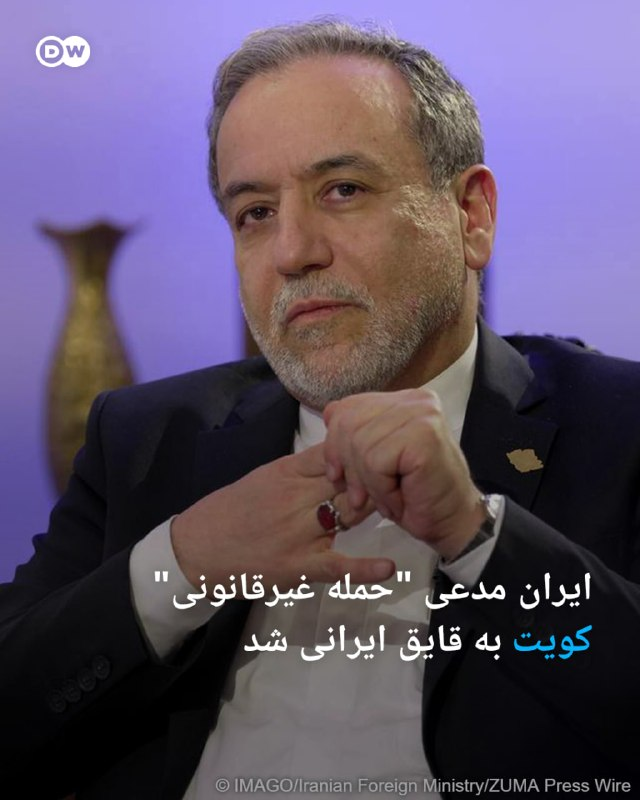

🔸 ایران مدعی "حمله غیرقانونی" کویت به قایق ایرانی شد

وزیر خارجه جمهوری اسلامی اعلام کرد کویت به‌طور "غیرقانونی" یک قایق ایرانی را در خلیج فارس هدف قرار داده و چهار ایرانی را بازداشت کرده است. عباس عراقچی گفت که جمهوری اسلامی خواهان آزادی فوری این افراد است و "حق پاسخ" را برای خود محفوظ می‌داند.

در مقابل، مقام‌های کویتی گفته‌اند چهار فرد بازداشت‌شده به سپاه پاسداران وابسته بوده‌اند و تلاش داشته‌اند از راه دریا وارد کویت شوند.

روایت حکومت ایران این است که این افراد "در یک گشت دریایی عادی حضور داشتند و به‌دلیل اختلال در سامانه ناوبری، ناخواسته وارد آب‌های کویت شده‌اند". مقام‌های جمهوری اسلامی اتهام طراحی اقدام خصمانه را رد کرده‌اند و می‌گویند کویت در حال سیاسی کردن ماجراست.

در مقابل، خبرگزاری رسمی کویت و وزارت کشور این کشور گفته‌اند این چهار نفر در بازجویی، وابستگی خود به سپاه پاسداران را پذیرفته‌اند و مأموریت داشته‌اند به جزیره بوبیان نفوذ کنند. مقام‌های کویتی می‌گویند در درگیری با این افراد، یک نیروی امنیتی کویت زخمی شده است.
@dw_farsi

## Persian_Trend_Official — post 14081

  <a href="telegram/content/Persian_Trend_Official_14081_1778715687.mp4" target="_blank">🎬 Download video</a>

شبتون بخیر ❤️🔥

📝 Nick
📌 @persian_trend_official
پرشین ترند | متفاوت‌ترین کانال نظامی

## Persian_Trend_Official — post 14080

  

به این وضعیت اقتصادی می‌گویید امنیت؟ امنیت کجاست وقتی یک پدر شرمنده زن و بچه‌اش است چون سفره‌اش خالی مانده و حقوقش حتی کفاف اجاره خانه را نمی‌دهد؟

امنیت کجاست وقتی جوانی نمی‌تواند یک متر زمین بخرد و رؤیاهایش زیر بار تورم و فساد دفن شده است؟ امنیت کجاست وقتی جوانی عمر و آرزوهایش را در صف مهاجرت یا بیکاری از دست می‌دهد؟

امنیت اجتماعی بدون رفاه پایدار وجود ندارد. جامعه‌ای که نرخ بیکاری جوانانش بالاست تورم افسارگسیخته دارد و سرمایه انسانی‌اش مهاجرت می‌کند در واقع در وضعیت ناامنی ساختاری است. شما نام این فروپاشی را امنیت گذاشته‌اید. این تحریف واژه‌هاست واژه‌ها را از معنا تهی کرده‌اید تا واقعیت تلخ را بپوشانید.

امنیت واقعی همان چیزی است که مردم در همه‌پرسی انتخاب خواهند کرد آزادی، اینترنت، اقتصاد سالم، و زندگی انسانی. امنیت یعنی امید به آینده نه ترس از فردا.

امنیتی که شما از آن دم می‌زنید، در واقع پوششی است برای فقر، سرکوب، و بی‌عدالتی. امنیت یعنی آرامش روانی، یعنی آینده‌ای قابل پیش‌بینی یعنی فرصت رشد و شکوفایی. اما آنچه امروز مردم ایران تجربه می‌کنند چیزی جز اضطراب فروپاشی اقتصادی و نابودی امید نیست.

📝 Nick

📌 @persian_trend_official
پرشین ترند | متفاوت‌ترین کانال نظامی

## Persian_Trend_Official — post 14079

⭕️ بنیامین نتانیاهو: من می‌خواهم دانش‌آموزان اسرائیلی در استفاده از ChatGPT، Claude و پیشرفته‌ترین ابزارهای هوش مصنوعی جهان - و حتی قبل از فارغ‌التحصیلی از دبیرستان - بهترین باشند. 📝 Nick 📌 @persian_trend_official پرشین ترند | متفاوت‌ترین کانال نظامی

## Persian_Trend_Official — post 14078

  <a href="telegram/content/Persian_Trend_Official_14078_1778715689.mp4" target="_blank">🎬 Download video</a>

⭕️ بنیامین نتانیاهو:

من می‌خواهم دانش‌آموزان اسرائیلی در استفاده از ChatGPT، Claude و پیشرفته‌ترین ابزارهای هوش مصنوعی جهان - و حتی قبل از فارغ‌التحصیلی از دبیرستان - بهترین باشند.

📝 Nick

📌 @persian_trend_official
پرشین ترند | متفاوت‌ترین کانال نظامی

## Persian_Trend_Official — post 14077

  <a href="telegram/content/Persian_Trend_Official_14077_1778715691.webm" target="_blank">🎬 Download video</a>

💢امارات متحده عربی دیدار مخفیانه نتانیاهو از ابوظبی در طول جنگ با ایران را تکذیب کرد

🫆:Tony

📌 @persian_trend_official
پرشین ترند | متفاوت‌ترین کانال نظامی

## Persian_Trend_Official — post 14076

  <a href="telegram/content/Persian_Trend_Official_14076_1778715692.mp4" target="_blank">🎬 Download video</a>

🔴 انهدام پهپاد انتحاری روسی توسط سرباز اوکراینی در لحظات آخر

ویدئویی منتشر شده که نشان می‌دهد یک سرباز اوکراینی با استفاده از سلاح «آکا-۷۴» موفق می‌شود یک پهپاد انتحاری کواد را تنها لحظاتی پیش از برخورد منهدم کند.

🫆:Tony

📌 @persian_trend_official
پرشین ترند | متفاوت‌ترین کانال نظامی

## Persian_Trend_Official — post 14075

  <a href="https://t.me/persian_trend_official/14075" target="_blank">📎 Download file</a>

فایل صوتی لایو اول
نسخه کم حجم - 6.71 مگابایت

اتاق جنگ چهارشنبه 23 اردیبهشت | جمهوری اسلامی ناو امریکایی را تهدید به حمله کرد.

فورمت mp3 همیشگی

📝 Nick

📌 @persian_trend_official
پرشین ترند | متفاوت‌ترین کانال نظامی

## Persian_Trend_Official — post 14074

https://youtube.com/live/xKXwDy6wYig?feature=share

## Persian_Trend_Official — post 14073

  <a href="https://t.me/persian_trend_official/14073" target="_blank">📎 Download file</a>

فایل صوتی لایو اول
نسخه کم حجم - 5.1 مگابایت

اتاق جنگ چهارشنبه ۲۳ اردیبهشت | جمهوری اسلامی ناو آمریکایی را تهدید به حمله کرد

🫆:Tony

📌 @persian_trend_official
پرشین ترند | متفاوت‌ترین کانال نظامی

## RadioFarda — post 157154

  

🔸منابع امنیتی از دو حملۀ پهپادی به کمپ شبه‌نظامیان کرد مخالف جمهوری اسلامی، در شمال شهر اربیل واقع در اقلیم کردستان عراق خبر می‌دهند.

🔸به گفتۀ این منابع، یک زاغه تجهیزات و مهمات در داخل این اردوگاه هدف قرار گرفته است. گزارشی از تلفات احتمالی این حملات منتشر نشده است.

🔸سه روز پیش هم حمله مشابهی به اردوگاهی دیگر در شرق اربیل رخ داده بود.

🔸طی ماه‌های اخیر سپاه پاسداران بارها مواضع شبه‌نظامیان کرد مخالف جمهوری اسلامی در اقلیم کردستان را با پهپاد و موشک هدف قرار داده است.

@RadioFarda

## RadioFarda — post 157153

  

🔸جی‌دی ونس، معاون رئیس‌جمهور آمریکا، اعلام کرد که واشینگتن معتقد است در مذاکرات با ایران «پیشرفت» حاصل شده، اما هنوز مشخص نیست این پیشرفت برای عبور از خط قرمز دونالد ترامپ کافی باشد یا نه.

🔸آقای ونس روز چهارشنبه در کاخ سفید به خبرنگاران گفت صبح همان روز با جرد کوشنر و استیو ویتکاف درباره ایران گفت‌وگو کرده و همچنین با مقام‌های عرب در تماس بوده است. او افزود: «سوال اصلی این است که آیا این پیشرفت به اندازه‌ای هست که خط قرمز رئیس‌جمهور را تأمین کند یا نه.»

🔸به گفته معاون رئیس‌جمهور آمریکا، خط قرمز ترامپ این است که ایالات متحده مطمئن شود «سازوکارهای کافی» ایجاد شده تا ایران هرگز به سلاح هسته‌ای دست پیدا نکند.

🔸اظهارات ونس در حالی مطرح می‌شود که ترامپ پیش‌تر پیشنهاد تازه ایران در مذاکرات را «غیرقابل قبول» توصیف کرده بود.

@RadioFarda

## RadioFarda — post 157152

🔸قوه قضائیه جمهوری اسلامی شامگاه چهارشنبه ۲۳ اردیبهشت اعلام کرد که محمد عباسی، یکی از بازداشت‌شدگان اعتراضات دی‌ماه سال گذشته به اتهام قتل یک مأمور امنیتی اعدام شده است. 🔸خبرگزاری میزان، وابسته به این قوه، گفته است که او بعد از تأیید حکم توسط دیوان‌عالی کشور…

## RadioFarda — post 157151

  

🔸قوه قضائیه جمهوری اسلامی شامگاه چهارشنبه ۲۳ اردیبهشت اعلام کرد که محمد عباسی، یکی از بازداشت‌شدگان اعتراضات دی‌ماه سال گذشته به اتهام قتل یک مأمور امنیتی اعدام شده است.

🔸خبرگزاری میزان، وابسته به این قوه، گفته است که او بعد از تأیید حکم توسط دیوان‌عالی کشور و با توجه به «تقاضای اولیا‌ء دم»، «قصاص» شد.

🔸ساعتی پیش‌تر، پایگاه خبری هرانا که اخبار حقوق بشر در ایران را از آمریکا پوشش می‌دهد، خبر داد که آقای عباسی بامداد چهارشنبه در زندان قزلحصار اعدام شده است.

🔸هرانا به نقل از یک منبع نزدیک به خانواده این زندانی نوشت که مسئولان زندان قزلحصار از خانواده محمد عباسی خواستند که برای ملاقات با او به زندان مراجعه کنند، «اما پس از حضور خانواده در زندان، این امکان از نزدیکان او سلب شد. پس از خروج خانواده عباسی از زندان، آنها در تماسی تلفنی از اجرای حکم اعدام محمد عباسی مطلع شدند.»

@RadioFarda

## RadioFarda — post 157150

🔸«جنگنده‌های عربستان سعودی در طول جنگ ایران، اهداف مرتبط با شبه‌نظامیان شیعه تحت حمایت تهران در عراق را بمباران کردند». این موضوع را چند منبع آگاه به رویترز گفته‌اند. 🔸به گفتۀ‌ این منابع، این حملات بخشی از «یک الگوی گسترده‌تر واکنش‌های نظامی در گوشه‌وکنار…

## RadioFarda — post 157149

  

🔸«جنگنده‌های عربستان سعودی در طول جنگ ایران، اهداف مرتبط با شبه‌نظامیان شیعه تحت حمایت تهران در عراق را بمباران کردند». این موضوع را چند منبع آگاه به رویترز گفته‌اند.

🔸به گفتۀ‌ این منابع، این حملات بخشی از «یک الگوی گسترده‌تر واکنش‌های نظامی در گوشه‌وکنار حوزۀ خلیج فارس است که در طول جنگ آمریکا و اسرائیل با ایران آغاز شد، اما تا حد زیادی پنهان ماند».

🔸یک مقام غربی که خواسته هویتش محفوظ بماند، به رویترز گفته که حملات عربستان توسط جت‌های جنگنده به اهداف شبه‌نظامی مرتبط با ایران در نزدیکی مرز شمالی این کشور با عراق انجام شد. به گفتۀ این مقام غربی برخی از حملات، تقریباً همزمان با شروع آتش‌بس بین ایالات متحده و ایران انجام شده است.

🔸این مقام غربی و یک منبع عراقی گفته‌اند که جنگنده‌های عربستان مکان‌هایی را هدف قرار داده اند که مبداء حملات پهپادی و موشکی به عربستان سعودی و سایر کشورهای خلیج فارس بوده‌اند.

@RadioFarda

## IranianMinds — post 20095

  

🔴 رویترز :

طبق گزارش وزارت خارجه، آمریکا و چین توافق کردند که هیچ کشوری نباید در تنگه هرمز عوارض حمل و نقل دریایی دریافت کند.

این موضوع پیش از نشست ترامپ و شی در پکن، توسط مارکو روبیو، وزیر خارجه آمریکا، و وانگ یی، وزیر خارجه چین، مورد بحث قرار گرفت!

@IranianMinds

## IranianMinds — post 20094

  <a href="telegram/content/IranianMinds_20094_1778715697.mp4" target="_blank">🎬 Download video</a>

بچه ها اسم این بازی عبور مرغ از خیابون  هست ویدئو نگاه کنید خیلی راحت 8 میلیون ازش سود گرفتیم😍

😤اگ توم دوس داری خیلی راحت از بازی های انلاین پول در بیاری حتما عضو کازینو شبانه شو
✅

توی کازینو شبانه بهت اموزش میدیم از بازی های انلاین پول دربیاری👌

کازینو شبانه راهی برای چند برابر کردن سرمایت 🤷‍♂

کسب درامد انلاین با یه ادم حرفه ای یاد بگیر و‌ پول دربیار 
💵
ae23
🎯همین حالا عضو شو و شروع کن👇
https://t.me/+OS-QBvyDO4M2ZGY0
https://t.me/+OS-QBvyDO4M2ZGY0

## IranianMinds — post 20093

🔴 وزیر خارجه سوریه :

میخوایم روابطمون با داداشیمون اسرائیل رو قوی تر کنیم و به حاکمیت هم احترام بزاریم

@IranianMinds

## IranianMinds — post 20092

🔴 گوگل رسما اعلام کرد در جام جهانی اسپانسری تیم های ملی عراق و مراکش رو گرفته و تمامی هزینه های این تیم هارو‌ میده.

@IranianMinds

## IranianMinds — post 20091

🔴 عراقچی :

هرکسی بخواد با ما دشمنی کنه و با اسرائیل تبانی کنه بد پشیمون میشه

@IranianMinds

## IranianMinds — post 20090

  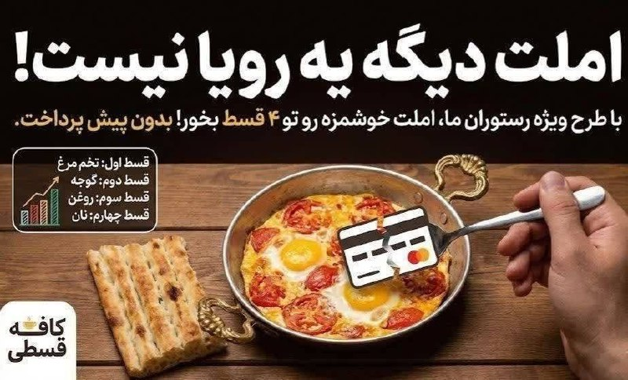

املت هم‌ تو‌ این مملکت قسطی شد

@IranianMinds

## IranianMinds — post 20089

  <a href="telegram/content/IranianMinds_20089_1778715700.mp4" target="_blank">🎬 Download video</a>

🔴 مهدی تاج رئیس فدراسیون فوتبال :

معین قراره برای تیم ملی یه آهنگ بخونه !

@IranianMinds

## IranianMinds — post 20088

  

🔴رئیس جمهور ترامپ آماده است عملیات پتک را علیه رژیم تروریستی ایران آغاز نماید.
دولت او می‌گوید این اقدام، ساعت قانونی اختیارات جنگی را دوباره تنظیم می‌کند و ۶۰ روز فرصت عملیات رزمی پیش از دخالت کنگره می‌دهد.
رژیم ایران دستپاچه در حال آماده‌سازی است، اما عملیات به احتمال زیاد بلا‌فاصله پس از سفر رسمی چین آغاز خواهد شد.

@IranianMinds

## BBCPersian — post 280971

🔻در اوج دور جدید جنگ میان حزب‌الله و ارتش اسرائیل ساختمانی مسکونی در بیروت در مقابل دوربینها و پخش زنده تلویزیونی توسط جنگنده‌ های اسرائیلی بمباران و ویران شد. صحنه‌ای که از زوایای مختلف به تصویر کشیده شد و ذهنها ماند.

اسرائیل گفت یکی از زیرساختهای مالی مربوط به حزب‌الله را هدف گرفته. در این حمله که بعد از هشدار تخلیه بود، کسی کشته نشد اما دهها خانواده بی‌خانمان شدند. ساکنان محله و صاحبخانه‌ها در گفتگو با بی‌بی‌سی ادعای اسرائیل را رد کردند. پیگیریهای بی‌بی‌سی از این ارتش درباره جزییات این منابع مالی ادعایی بی‌جواب ماند.

این درحالیست که گروه‌های حقوق بشری می‌گویند این نوع حملات خلاف قوانین بین‌المللی هستند و می‌توانند جنایت جنگی محسوب شوند.

گزارش تحقیقی نفیسه کوهنورد از بیروت را ببینیم

@BBCPersian

## BBCPersian — post 280970

  

🔻فرماندهی مرکزی ارتش آمریکا، سنتکام، در منطقه در اطلاعیه‌ای گفته است از زمان آغاز محاصره بنادر ایران به ۱۵ کشتی حامل کمک‌های بشردوستانه اجازه عبور داده است.

این نهاد در اطلاعیه‌ای اعلام کرده است: «چهار هفته پیش، سنتکام اجرای محاصره کشتی‌هایی را که به بنادر ایران وارد و از آنها خارج می‌شدند، آغاز کرد. تا امروز، نیروهای آمریکایی ۶۷ کشتی تجاری را مجبور به تغییر مسیر کردند، به ۱۵ کشتی حامل کمک‌های بشردوستانه اجازه عبور دادند و ۴ کشتی را برای اطمینان از رعایت محاصره، غیرفعال کردند.»

در ادامه این اطلاعیه آمده است: «اوایل این هفته، نیروهای سنتکام پس از برقراری ارتباط رادیویی و شلیک گلوله‌های هشدار دهنده با سلاح‌های سبک، از بازگشت دو کشتی تجاری برای رعایت محاصره مطمئن شدند و به وضوح نشان دادند که اجرای قوانین ایالات متحده همچنان به طور کامل ادامه دارد.»

📸U.S. Navy via Getty Images
https://bbc.in/3RDx18x
@BBCPersian

## BBCPersian — post 280969

  <a href="https://t.me/bbcpersian/280969" target="_blank">📎 Download file</a>

🔻پادکست برنامه شصت دقیقه 
چهارشنبه ۲۳ اردیبهشت ۱۴۰۵ 

این نسخه رادیویی برنامه شصت دقیقه تلویزیون فارسی بی‌بی‌سی است که هرشب بعد از پخش، با حجم کم از اپلیکیشن‌های پادگیر و صفحه تلگرام بی‌بی‌سی فارسی در دسترس است. 
با هشتگ BBCPersianRadio# با ما در ارتباط باشید.
@BBCPersian

## BBCPersian — post 280968

  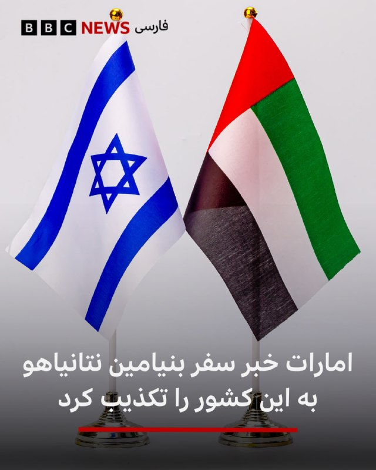

🔻وزارت خارجه امارات متحده عربی با انتشار بیانیه‌ای سفر بنیامین نتانیاهو به این کشور در خلال جنگ آمریکا و اسرائیل با ایران را تکذیب کرده است.

در بیانیه وزارت خارجه امارات آماده است: «امارات متحده عربی گزارش‌های منتشرشده درباره سفر نخست‌وزير اسرائيل يا استقبال از يک هيات نظامی اسرائيلی را تکذيب می‌کند.»

اين تکذيب در حالی مطرح می‌شود که رسانه‌های بين‌المللی از جمله رويترز و سی‌بی‌اس نيوز روز چهارشنبه به نقل از دفتر نخست‌وزير اسرائيل گزارش داده بودند که بنیامین نتانياهو در جريان جنگ ايران، سفری محرمانه به امارات داشته و با محمد بن زايد آل نهيان ديدار کرده است.

📸GettyImages
https://bbc.in/4tEOL0N
@BBCPersian

## BBCPersian — post 280967

  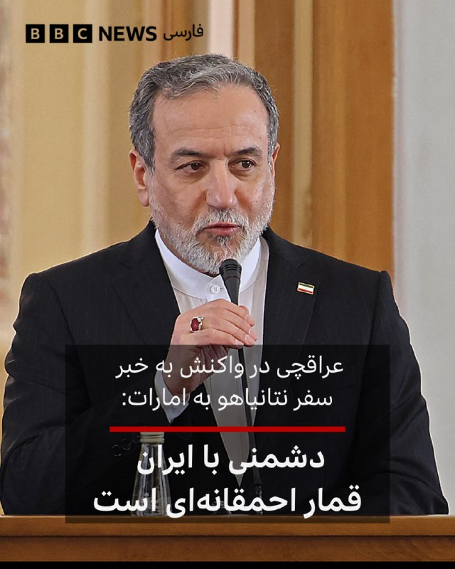

🔻عباس عراقچی، وزیر امورخارجه ایران، به علنی شدن خبر سفر بنیامین نتانیاهو به امارات متحده عربی واکنش نشان داده و گفته است: «نتانیاهو اکنون به‌صورت علنی آنچه را که نهادهای امنیتی ایران مدت‌ها قبل به رهبری ما منتقل کرده بودند، افشا کرده است.»

آقای عراقچی همچنین در اظهاراتی تند که می‌تواند مخاطب آن امارات و کشورهای حاشیه خلیج فارس باشد گفته است: «دشمنی با ملت بزرگ ایران، قماری احمقانه‌ است؛ و همکاری و همدستی با اسرائیل در این مسیر، غیرقابل بخشش است. کسانی که در همدستی با اسرائیل برای ایجاد تفرقه نقش دارند، باید پاسخگو باشند.»

علاوه بر علنی شدن خبر سفر نخست وزیر اسرائیل به امارات در خلال جنگ، در چند روز گذشته اخبار رسانه‌های امریکایی درباره حملات نظامی مخفیانه امارات و عربستان به ایران هم بسیار بازتاب داشته است.

📸AFP via Getty Images
https://bbc.in/3R9GXqf
@BBCPersian

## BBCPersian — post 280965

🔻بعد از خبر حملات امارات به ایران، رویترز می‌گوید عربستان هم در خلال جنگ حملات متعددی علیه ایران انجام داده است

گزیده‌هایی از مصاحبه موسی شریفی، تحلیلگر جهان عرب از ریاض عربستان را با پریزاد نوبخت ببیند که می‌گوید که عربستان برخلاف امارات به‌دنبال شکست ایران نیست و نمی‌‌خواهد توازن قدرت در منطقه دچار خلاء شود.

@BBCPersian

## BBCPersian — post 280958

🖊روناک فرجی، روزنامه‌نگار

جشنواره فیلم کن امسال در حالی کار خود را در ساحل «کروآزت» آغاز کرده که برخلاف برخی دوره‌های اخیر، تمرکز اصلی آن دوباره به سینمای مؤلف و فیلم‌سازان شناخته‌شده اروپایی و آسیایی بازگشته است.

هفتاد و نهمین دوره جشنواره بین‌المللی فیلم کن با حضور ستارگان سینما، فیلمسازان و اعضای هیئت داوران در جنوب فرانسه آغاز شد و فرش قرمز این رویداد میزبان چهره‌های سرشناس صنعت سینما بود.

جشنواره این دوره شمار بی‌سابقه‌ای از شرکت‌کنندگان را جذب کرده است؛ افرادی که برای خرید آثار اغلب مستقل و کم‌هزینه رقابت می‌کنند، در حالی که استودیوهای بزرگ محتاط‌‌تر شده‌اند و کمتر ریسک می‌کنند.

حدود ۱۶ هزار نفر از فعالان صنعت سینما برای حضور در بزرگ‌ترین بازار فیلم جهان ثبت‌نام کرده‌اند که از ۱۲ تا ۲۰ مه همزمان با جشنواره فیلم کن برگزار می‌شود.

در مراسم افتتاحیه جشنواره، نخل طلای افتخاری برای یک عمر فعالیت هنری به پیتر جکسون، کارگردان فیلم‌های «ارباب حلقه‌ها» و «کینگ کونگ»، اهدا شد.

برای خواندن ادامه مطلب به لینک زیر مراجعه کنید:

https://bbc.in/4dhST0w
📷Getty Images
@BBCPersian

## BBCPersian — post 280957

  <a href="telegram/content/BBCPersian_280957_1778715703.mp4" target="_blank">🎬 Download video</a>

🔻آخرین خبرهای مهم روز چهارشنبه۲۳ اردیبهشت ۱۴۰۵

@BBCPersian

## BBCPersian — post 280956

  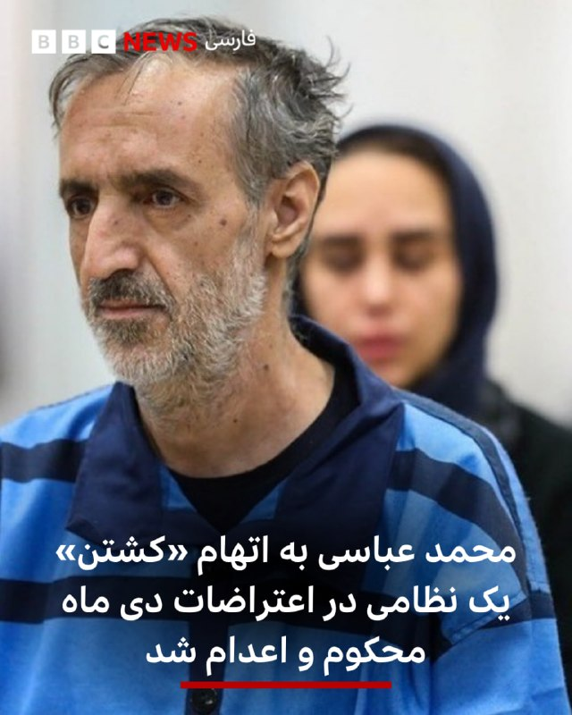

🔻خبرگزاری میزان، وابسته قوه قضائیه می‌گوید محمد عباسی از بازداشت شدگان اعتراضات دی ماه امروز(چهارشنبه ۲۳ اردیبهشت) اعدام شده است.

قوه قضائیه جمهوری اسلامی او را به «کشتن» یک نظامی در جریان اعتراضات زمستان پارسال متهم کرد و می‌گوید خانواده فرد نظامی او را «قصاص کرده‌اند.»

قوه قضائیه همچنین گفته است اجرای حکم اعدام با تایید و ابرام دیوان عالی ایران و به تقاضای اولیا انجام شده است.

دیوان عالی ایران همچنین حکم ۲۵ سال حبس فاطمه عباسی، دختر آقای عباسی که در بند زنان زندان اوین زندانیست را تایید کرده است.

این دومین مورد اعدامی است که قوه قضائیه امروز گزارش کرده است؛ احسان افرشته هم صبح امروز به اتهام «جاسوسی و همکاری اطلاعاتی به نفع اسرائیل» اعدام شد.

با احتساب محمد عباسی، تاکنون ۳۲ زندانی پس از آغاز جنگ آمریکا و اسرائیل با ایران در این کشور اعدام شده‌اند.

غلامحسین محسنی اژه‌ای، رئیس قوه قضائیه، بارها از دادستان‌ها خواسته است بدون اغماض و به‌ سرعت به پرونده کسانی که بعد از شروع جنگ و یا در اعتراضات دی ماه بازداشت شده‌اند رسیدگی کنند و احکامشان صادر و اجرا شود.

📷Mizan
@bbcpersian

## Dirty_Kids — post 389415

  <a href="telegram/content/Dirty_Kids_389415_1778715706.webm" target="_blank">🎬 Download video</a>

☢️خفن ترین و‌ قدیمی ترین  انالیزور  ایران ینی دکتر بت 
👍 
🔴هیچ سایت بتی دوست نداره شما کانال دکتر بت رو پیدا کنین چون خیلی سود میکنید🤷‍♂ رایگان بهترین شرط هارو براتون میذاره حتی هزار تومن هم دریافت نمیکنه روزانه میتونی از پیش بینی فوتبال باهاش پول در بیاری…

## Dirty_Kids — post 389414

  <a href="telegram/content/Dirty_Kids_389414_1778715706.webm" target="_blank">🎬 Download video</a>

☢️خفن ترین و‌ قدیمی ترین  انالیزور  ایران ینی دکتر بت 
👍

🔴هیچ سایت بتی دوست نداره شما کانال دکتر بت رو پیدا کنین چون خیلی سود میکنید🤷‍♂

رایگان بهترین شرط هارو براتون میذاره
حتی هزار تومن هم دریافت نمیکنه
روزانه میتونی از پیش بینی فوتبال باهاش پول در بیاری 👌
A23
اگ اهل پیش بینی فوتبالی این کانال اصلا از دست ندین👇

✅https://t.me/+4_ADqwB9e-QwYjlk

✅https://t.me/+4_ADqwB9e-QwYjlk

## Dirty_Kids — post 389413

  

#بخوابیم

@Dirty_Kids 👻

## Dirty_Kids — post 389412

  <a href="telegram/content/Dirty_Kids_389412_1778715707.mp4" target="_blank">🎬 Download video</a>

زینب موشک دوست🤣🤣🤣

@Dirty_Kids 👻

## Dirty_Kids — post 389411

  <a href="telegram/content/Dirty_Kids_389411_1778715708.mp4" target="_blank">🎬 Download video</a>

جنگ انیمیشن‌های لگویی وارد فاز جدیدی شد!

لگوی شاه عالیه فقط! 👏🤩

@Dirty_Kids 👻

## Dirty_Kids — post 389410

  

درسته مکرون جلوی چشم دنیا چک خورد،
ولی مدال طلای واکنش به لو رفتن چت عاشقانه،
میرسه به زن ایرانی‌ای که وسط پرواز از خوابِ شوهرش استفاده کرد، با انگشتش گوشی رو باز کرد،
با دیدن پیامای عاشقانه،
چنان قشقرقی بپاکرد که هواپیما فرود اضطراری کرد تو هند 😭✈️
بدون چمدون پیاده‌شون کردن🤣

@Dirty_Kids 👻

## Dirty_Kids — post 389409

  

ایرانی بودن یعنی traumatized شدن با هر چیز ساده.

@Dirty_Kids 👻

## Dirty_Kids — post 389407

🔴دوست دختر جدید پوبون (رپر) از روی یه پُل تو مکزیک افتاده پایین و گویا کمر و گردنش شکسته؛

پوبون هم استوریش کرده و از مردم خواسته که پول دونیت کنن تا هزینه عملش دربیاد...

@Dirty_Kids 👻

## Dirty_Kids — post 389406

من دیگه اگه بگن قراره یه ابر بزرگ بیاد رو آسمون ایران ازش کیر بباره تعجب نمیکنم.

@Dirty_Kids 👻

## Dirty_Kids — post 389405

  <a href="telegram/content/Dirty_Kids_389405_1778715711.mp4" target="_blank">🎬 Download video</a>

مهدی تاج:
معین قراره برای تیم ملی آهنگ بخونه

@Dirty_Kids 👻

## Dirty_Kids — post 389404

دموکرات‌های سنای آمریکا برای هفتمین‌بار کیر خوردن،

طرح محدود کردن اختیارات جنگی شیر خدا برای پایان دادن به جنگ با روافض هزار پدر رو برای بار هفتم به رأی گذاشتن و به تعداد هفت روز هفته کیر خوردن،

اما خب جای نگرانی داشت اندکی چون در عین حال خیلی ناپلئونی رأی نیاورد،

رأی ۴۹ موافق در مقابل ۵۰ مخالف.

موافقان محدود کردن اختیارات شیر جنگجوی خدا تقریباً همه‌ی دموکرات‌ها به علاوه‌ی سه سناتور قرمدنگ جمهوری‌خواه به نام‌های: Rand Paul ، Susan Collins ، Lisa Murkowski ،
که این اولین باری بود که سناتور قرمساق جمهوری‌خواه Murkowski به نفع طرح رأی داد.

تنها سناتور شریف دموکرات John Fetterman از پنسیلوانیا بود که دوباره با جمهوری‌خواهان همراه شد.

@Dirty_Kids 👻

## Dirty_Kids — post 389403

کاش به کارکنان شعب لمیز ونک به پایین یاد بدین که وقتی یه آقای مسن میاد تو ازتون میپرسه «هویج بستنی» دارین نگین نه چیچیاتو میچیاتو و فولان داریم، عین آدم به بنده‌ خدای گرما زده توضیح بدید که چه محصول عادی و خنکی میتونه سفارش بده، چون این کار وظیفه منِ مشتری نیست.

@Dirty_Kids 👻

## Dirty_Kids — post 389401

عمه جنده ام، گلشیفته

@Dirty_Kids 👻

## Dirty_Kids — post 389400

وقتی به “بله” می گید سوپر اپلیکیشن، حس بقالی رو دارم که رو تابلوش زده هایپر مارکت!

@Dirty_Kids 👻

## Hranews — post 112937

دو شهروند توسط نیروهای امنیتی در بوکان بازداشت شدند

❗️
❗️
❗️
❗️
❗️– استی محمدی، ۶۷ ساله و امیر یوسفی، شهروندان ساکن بوکان، توسط نیروهای امنیتی #بازداشت شدند.

ادامه مطلب

#استی_محمدی
#امیر_یوسفی

↘️
@hranews_bot تماس ✉️ -  @Hranews  کانال هرانا 🆑

## manototv — post 105424

  <a href="telegram/content/manototv_105424_1778715712.mp4" target="_blank">🎬 Download video</a>

‌
مهدی تاج، رئیس فدراسیون فوتبال ایران، درباره انتشار آهنگی از سوی معین، برای تیم فوتبال در جام‌جهانی گفت فدراسیون فوتبال در تولید این کار دخیل نبوده، اما «در جریان» این موضوع است.
تاج افزود: «هر کسی از ایران حمایت کند، مورد تایید ماست.»

## manototv — post 105423

  <a href="telegram/content/manototv_105423_1778715713.mp4" target="_blank">🎬 Download video</a>

تماسی از ایران:
«می‌گفت تفاوت سیستم آموزش مدارس ایران با خارج از کشور زمین تا آسمونه…
می‌گفت به‌جای رشد و یادگیری،
بچه‌ها درگیر ظواهر و حاشیه‌ها شدن
و انگیزه برای پیشرفت کم‌رنگ شده.»

## manototv — post 105422

  <a href="telegram/content/manototv_105422_1778715715.mp4" target="_blank">🎬 Download video</a>

مارکو روبیو، وزیر خارجه آمریکا، در گفت‌وگویی اختصاصی با شان هنیتی، خبرنگار و مجری فاکس‌نیوز در هواپیمای ریاست جمهوری آمریکا، از تلاش‌های فشرده واشینگتن برای وادار کردن چین به مقابله با اقدامات جمهوری اسلامی در خلیج فارس سخن گفت.

روبیو گفت: «کشتی‌های چینی در خلیج فارس گیر افتاده‌اند... آخر هفته یک محموله باری چین هدف قرار گرفت. مطمئنم ایران عمداً این کار را نکرده، اما این اتفاق افتاده و به همین دلیل کشتی‌های چینی آنجا گرفتار شده‌اند.»

او افزود: «این وضعیت منبع بزرگی از بی‌ثباتی است. بیش از هر نقطه دیگری در جهان، آسیا را تهدید به بی‌ثباتی می‌کند، چون به‌شدت به این تنگه برای تامین انرژی وابسته است.»

وزیر خارجه آمریکا همچنین گفت: «حل این مسئله به نفع چین است. امیدواریم بتوانیم آن‌ها را قانع کنیم نقش فعال‌تری برای وادار کردن ایران به عقب‌نشینی از اقداماتی که اکنون در خلیج فارس انجام می‌دهد و در پی انجام آن است، ایفا کنند.»

## manototv — post 105421

  <a href="telegram/content/manototv_105421_1778715716.mp4" target="_blank">🎬 Download video</a>

‌
خبرگزاری رویترز به نقل از منابع آگاه گزارش داد جنگنده‌های عربستان سعودی در جریان جنگ میان آمریکا، اسرائیل و جمهوری اسلامی، مواضع شبه‌نظامیان شیعه مورد حمایت تهران در عراق را هدف قرار داده‌اند.

بر اساس این گزارش، حملات تلافی‌جویانه‌ای نیز از خاک کویت به داخل عراق انجام شده است. منابع مطلع گفته‌اند این عملیات‌ها بخشی از پاسخ‌های نظامی گسترده‌تر کشورهای خلیج فارس به درگیری‌های منطقه‌ای بوده که تاکنون به‌طور علنی فاش نشده بود.

رویترز به نقل از مقام‌های امنیتی و نظامی عراق، یک مقام غربی و منابع آگاه گزارش داده حملات عربستان توسط جنگنده‌های نیروی هوایی این کشور علیه مواضع گروه‌های نزدیک به جمهوری اسلامی در نزدیکی مرز شمالی عربستان با عراق انجام شده است.

به گفته منابع، این حملات مواضعی را هدف قرار داده که از آن‌ها پهپادها و موشک‌هایی به سمت عربستان و دیگر کشورهای خلیج فارس شلیک می‌شد.

منابع عراقی همچنین گفتند حملاتی نیز از خاک کویت علیه مواضع شبه‌نظامیان در جنوب عراق انجام شده که در جریان آن چندین عضو گروه کتائب حزب‌الله کشته و یک مرکز ارتباطات و عملیات پهپادی این گروه نابود شده است.

## manototv — post 105420

  <a href="telegram/content/manototv_105420_1778715717.mp4" target="_blank">🎬 Download video</a>

وزارت خارجه امارات متحده عربی گزارش‌ها درباره سفر بنیامین نتانیاهو، نخست‌وزیر اسرائیل، یا استقبال از یک هیات نظامی اسرائیلی را رد کرد.

سخنگوی وزارت خارجه امارات گفت روابط این کشور با اسرائیل، روابطی علنی است که در چارچوب توافق ابراهیم و به‌صورت رسمی و عمومی شکل گرفته و مبتنی بر روابط پنهانی یا توافق‌های مخفی نیست.

او تاکید کرد هرگونه ادعا درباره سفرها یا توافق‌های اعلام‌نشده، تا زمانی که از سوی نهادهای رسمی امارات تایید نشود، بی‌اساس است.

سخنگوی وزارت خارجه امارات همچنین از رسانه‌ها خواست در انتشار اخبار دقت کنند و از بازنشر اطلاعات تاییدنشده خودداری کنند.

## manototv — post 105419

  <a href="telegram/content/manototv_105419_1778715717.mp4" target="_blank">🎬 Download video</a>

تماسی از ایران:
«می‌گفت وضعیت آموزش فاجعه شده…
بچه‌هایی که حتی پایه‌ترین چیزها رو بلد نیستن.»

## manototv — post 105418

  <a href="telegram/content/manototv_105418_1778715719.mp4" target="_blank">🎬 Download video</a>

‌
سنای آمریکا طرح پیشنهادی برای پایان دادن به مشارکت نظامی این کشور در جنگ با جمهوری اسلامی را رد کرد.

این طرح که با هدف الزام دولت آمریکا به خروج نیروهای درگیر در جنگ ارائه شده بود، با ۵۰ رای مخالف در برابر ۴۹ رای موافق تصویب نشد؛ جمهوری‌خواهان سنای آمریکا عمدتاً با محدود شدن اختیارات نظامی دونالد ترامپ مخالفت کردند.

سه سناتور جمهوری‌خواه به این طرح رای مثبت دادند و لیزا مورکوفسکی، سناتور جمهوری‌خواه، برای نخستین بار از زمان آغاز جنگ، به درخواست خروج نیروهای آمریکایی از درگیری با جمهوری اسلامی رای داد.

دموکرات‌ها در هفته‌های اخیر چندین طرح مشابه ارائه کرده‌اند و می‌گویند طبق قانون اساسی آمریکا، اختیار اعلام جنگ در دست کنگره است و باید اختیارات قوه مقننه در برابر دولت حفظ شود.

بر اساس قوانین آمریکا، رئیس‌جمهوری می‌تواند در صورت وجود تهدید فوری، اقدام نظامی را آغاز کند، اما برای ادامه درگیری بیش از ۶۰ روز، نیاز به مجوز کنگره دارد.

## manototv — post 105417

  <a href="telegram/content/manototv_105417_1778715720.mp4" target="_blank">🎬 Download video</a>

‌
میزان، خبرگزاری وابسته به قوه قضاییه جمهوری اسلامی از اعدام محمد عباسی، از بازداشت‌شدگان اعتراضات سراسری دی‌ماه ۱۴۰۴ خبر داد.

میزان نوشت محمد عباسی سحرگاه روز چهارشنبه ۲۳ اردیبهشت در زندان قزلحصار اعدام شده است.

بر اساس گزارش‌های منتشر شده مسئولان زندان قزلحصار از خانواده او برای ملاقات دعوت کرده بودند، اما پس از حضور آن‌ها، اجازه ملاقات داده نشد و خانواده پس از ترک زندان، تلفنی از اجرای حکم اعدام مطلع شدند.

محمد عباسی در جریان اعتراضات دی‌ماه ۱۴۰۴ در ملارد بازداشت و سپس از سوی شعبه ۱۵ دادگاه انقلاب تهران به ریاست ابوالقاسم صلواتی، به اتهام «محاربه» به اعدام محکوم شده بود.

شعبه ۳۹ دیوان عالی کشور با رد فرجام‌خواهی، حکم اعدام محمد عباسی را تایید کرد. در همین پرونده، حکم ۲۵ سال زندان فاطمه عباسی، دختر او، نیز عینا تایید شده و او اکنون در بند زنان زندان اوین نگهداری می‌شود.

بر اساس گزارش امتداد، ابهامات و پرسش‌های متعددی درباره روند رسیدگی و محتوای پرونده این دو متهم وجود داشته، اما وکلای مستقل به دلیل محرومیت از دسترسی به پرونده، امکان بررسی و پیگیری موثر آن را نداشته‌اند.

## manototv — post 105416

  <a href="telegram/content/manototv_105416_1778715720.mp4" target="_blank">🎬 Download video</a>

تماسی از ایران:
درد دلی با چاشنی کمی شوخی
از واقعیتی تلخ از زندگی روزمره مردم

## manototv — post 105415

  <a href="telegram/content/manototv_105415_1778715722.mp4" target="_blank">🎬 Download video</a>

‌
جی‌دی ونس، معاون رئیس‌جمهوری آمریکا، در اظهاراتی درباره برنامه هسته‌ای جمهوری اسلامی گفت با موضع دونالد ترامپ موافق است که جمهوری اسلامی نباید به سلاح هسته‌ای دست پیدا کند.

ونس گفت دولت آمریکا در حال حاضر درگیر یک روند «فعال دیپلماتیک» برای اطمینان از عدم دستیابی جمهوری اسلامی به سلاح هسته‌ای است، اما در عین حال تاکید کرد ترامپ گزینه‌های مختلفی، از جمله گزینه‌های دیپلماتیک و نظامی، در اختیار دارد.

معاون رئیس‌جمهوری آمریکا افزود اولویت اصلی ترامپ، حفاظت از مردم آمریکا و همچنین امنیت جهان در برابر تهدید ناشی از دستیابی جمهوری اسلامی به سلاح هسته‌ای است.

## alonews — post 119836

  <a href="telegram/content/alonews_119836_1778715723.webm" target="_blank">🎬 Download video</a>

👈معین: مهدی تاج الکی میگه، من قرار نیست هیچ آهنگی واسه تیم فوتبال تو جام جهانی بخونم.

✅ @AloNews خبر جنگ

## alonews — post 119835

  <a href="telegram/content/alonews_119835_1778715723.webm" target="_blank">🎬 Download video</a>

👈طبق گزارش رویترز، ایالات متحده و چین توافق کردند که هیچ کشوری نباید اجازه داشته باشد عوارض حمل و نقل در تنگه هرمز را دریافت کند.

🔴وزیر امور خارجه چین، وانگ یی، و وزیر امور خارجه ایالات متحده، مارکو روبیو، این موضوع را در تماس تلفنی آوریل مورد بحث قرار دادند.

✅ @AloNews خبر جنگ

## alonews — post 119834

  <a href="telegram/content/alonews_119834_1778715724.webm" target="_blank">🎬 Download video</a>

👈ارتش اسرائیل: مدتی پیش حزب‌الله لبنان از جنوب این کشور با پهپاد و چندین موشک ضدتانک بهمون حمله کرد که هیچکس آسیبی ندید.

✅ @AloNews خبر جنگ

## alonews — post 119833

  <a href="telegram/content/alonews_119833_1778715724.mp4" target="_blank">🎬 Download video</a>

تاج: احتمالا معین موزیک رسمی تیم‌ملی رو بخونه!

@AloSport

## alonews — post 119832

  <a href="telegram/content/alonews_119832_1778715726.webm" target="_blank">🎬 Download video</a>

👈گویا "نصرالله معین" قراره واسه تیم ملی فوتبال به مناسبت حضور تو جام جهانی 2026، آهنگ بخونه!

✅ @AloNews خبر جنگ

## alonews — post 119831

  <a href="telegram/content/alonews_119831_1778715726.mp4" target="_blank">🎬 Download video</a>

👈مارکو روبیو : کشتی‌های چین توی خلیج فارس گیر افتادن یه کشتی باری چینی هم آخر هفته آسیب دیده
- مطمئنم ایران عمداً این کار رو نکرده، ولی به هر حال اتفاق افتاده،واسه همین این کشتی‌های چینی اونجا گیر کردن
- این وضعیت خیلی بی‌ثبات‌کننده‌ست،حتی بیشتر از هر جای دیگه دنیا می‌تونه آسیا رو به هم بریزه، چون انرژی‌شون خیلی به این تنگه‌ها وابسته‌ست
- این به نفع خود چینه که این مسئله رو حل کنه
- ما امیدواریم بتونیم قانع‌شون کنیم نقش فعال‌تری بازی کنن تا ایران رو وادار کنن از کاری که الان تو خلیج فارس داره انجام می‌ده عقب‌نشینی کنه

✅ @AloNews خبر جنگ

## alonews — post 119830

  <a href="telegram/content/alonews_119830_1778715728.webm" target="_blank">🎬 Download video</a>

👈کانال N12: ترامپ داره به صدور دستور برای از سرگیری درگیری با ایران فکر می‌کنه

✅ @AloNews خبر جنگ

## alonews — post 119829

  <a href="telegram/content/alonews_119829_1778715728.webm" target="_blank">🎬 Download video</a>

👈خیلی شیک و‌ مجلسی روی شیشه دفاتر پیشخوان آگهی فروش اینترنت پرو میزنن که تلگرام هم روش بدون فیلتره.

✅ @AloNews خبر جنگ

## alonews — post 119828

  <a href="telegram/content/alonews_119828_1778715728.webm" target="_blank">🎬 Download video</a>

👈مدیرعامل شهر فرودگاهی امام : روزانه بین ۳۵ تا ۴۰ پرواز از فرودگاه انجام می‌شود.

✅ @AloNews خبر جنگ

## alonews — post 119827

  <a href="telegram/content/alonews_119827_1778715728.webm" target="_blank">🎬 Download video</a>

👈خوش‌چشم: ترامپ رفته چین التماس کنه تا میانجی بشه که ایران جنگ رو تموم کنه

✅ @AloNews خبر جنگ

## alonews — post 119826

  <a href="telegram/content/alonews_119826_1778715728.mp4" target="_blank">🎬 Download video</a>

👈تمرینه بمب‌افکنِ " B-52 " و فرود به پایگاه فِرفورد بریتانیا

✅ @AloNews خبر جنگ

## alonews — post 119825

  <a href="telegram/content/alonews_119825_1778715730.webm" target="_blank">🎬 Download video</a>

👈بابک زنجانی: در تاریخ ۲۸ خرداد، شبکه اجتماعی مای دات به‌صورت فراگیر برای عموم بازگشایی و طی مراسمی در برج میلاد رونمایی خواهد شد.

✅ @AloNews خبر جنگ

## alonews — post 119824

  <a href="telegram/content/alonews_119824_1778715730.webm" target="_blank">🎬 Download video</a>

👈روزنامه South China Morning Post: شرکت تصاویر ماهواره‌ای چینی MizarVision که با تحلیل‌های خود از استقرارهای نظامی آمریکا در جنگ آمریکا و اسرائیل علیه ایران به شهرت رسید، افزوده شدن خود به فهرست تحریم‌های آمریکا را به عنوان نشان افتخاری در کمپین استخدامی خود به کار می‌برد.

🔴این استارت‌آپ اطلاعاتی با منابع باز (OSINT) که با نام رسمی Meentropy Technology Hangzhou Co Ltd شناخته می‌شود، در تحلیل داده‌های ماهواره‌های تجاری تخصص دارد و در ماه‌های اخیر چندین بار تحرکات نظامی آمریکا را رصد کرده است.

🔴این شرکت روز جمعه به فهرست تحریم وزارت خزانه‌داری آمریکا اضافه شد که در  پی انتشار «تصاویر با منبع باز که جزئیات فعالیت نظامی آمریکا را در جریان عملیات خشم حماسی (Epic Fury) نشان می‌داد»، صورت گرفته است



✅ @AloNews خبر جنگ

## alonews — post 119822

  <a href="telegram/content/alonews_119822_1778715730.webm" target="_blank">🎬 Download video</a>

👈هزینه نجومی رجیستری گوشی آیفون ۱۷ و گلکسی سامسونگ!

🔴رجیستری پایین ترین گیگ آیفون ۱۷ پرومکس: ۶۰۰ دلار!

✅ @AloNews خبر جنگ

## alonews — post 119821

  <a href="telegram/content/alonews_119821_1778715730.webm" target="_blank">🎬 Download video</a>

👈امارات : خبرهایی که درباره سفر نتانیاهو به امارات پخش شده، صحت نداره

✅ @AloNews خبر جنگ

## alonews — post 119820

  <a href="telegram/content/alonews_119820_1778715731.webm" target="_blank">🎬 Download video</a>

👈عراقچی: نتانیاهو اکنون به‌صورت علنی آنچه را که نهادهای امنیتی ایران مدت‌ها قبل به رهبری ما منتقل کرده بودند، افشا کرده است.

🔴دشمنی با ملت بزرگ ایران، قماری احمقانه‌ است؛ و همکاری و همدستی با اسرائیل در این مسیر، غیرقابل بخشش است.

🔴کسانی که در همدستی با اسرائیل برای ایجاد تفرقه نقش دارند، باید پاسخگو باشند

✅ @AloNews خبر جنگ

## alonews — post 119819

  <a href="telegram/content/alonews_119819_1778715731.webm" target="_blank">🎬 Download video</a>

👈وال‌استریت ژورنال: در حالی‌که نگرانی‌هایی درباره کاهش ذخیره مهمات ایالات متحده وجود دارد، پنتاگون در حال تلاش برای خرید ۱۰٬۰۰۰ موشک کروز کم‌هزینه در طول سه سال است.

✅ @AloNews خبر جنگ

## alonews — post 119818

  <a href="telegram/content/alonews_119818_1778715731.webm" target="_blank">🎬 Download video</a>

👈وزارت خارجه ایالات متحده: امروز، وزارت خارجه به‌طور عمومی پیشنهاد سخاوتمندانه ایالات متحده برای ارائه ۱۰۰ میلیون دلار کمک بشردوستانه مستقیم اضافی به مردم کوبا را که با هماهنگی کلیسای کاتولیک و سایر سازمان‌های بشردوستانه مستقل و قابل اعتماد توزیع خواهد شد، مجدداً اعلام می‌کند.

🔴تصمیم با رژیم کوبا است که پیشنهاد کمک ما را بپذیرد یا از کمک‌های حیاتی نجات‌بخش زندگی خودداری کند و در نهایت در برابر مردم کوبا به دلیل ایستادگی در برابر کمک‌های حیاتی پاسخگو باشد.

✅ @AloNews خبر جنگ

## alonews — post 119817

  <a href="telegram/content/alonews_119817_1778715731.mp4" target="_blank">🎬 Download video</a>

👈کوین وارش با رأی ۵۴ به ۴۵ سنا ایالات متحده به عنوان رئیس فدرال رزرو تأیید شد.

🔴 جان فترمن تنها دموکراتی بود که از این تأیید حمایت کرد

✅ @AloNews خبر جنگ

<!-- MSG END -->

<!-- NAV START -->

<a href="https://github.com/k909b/aio-downloader/blob/main/telegram/content/archive_1.md" style="display:inline-block; padding:6px 12px; margin:0 4px; background-color:#2ea44f; color:white; text-decoration:none; border-radius:4px; font-weight:bold;">صفحه بعد</a>

<!-- NAV END -->
